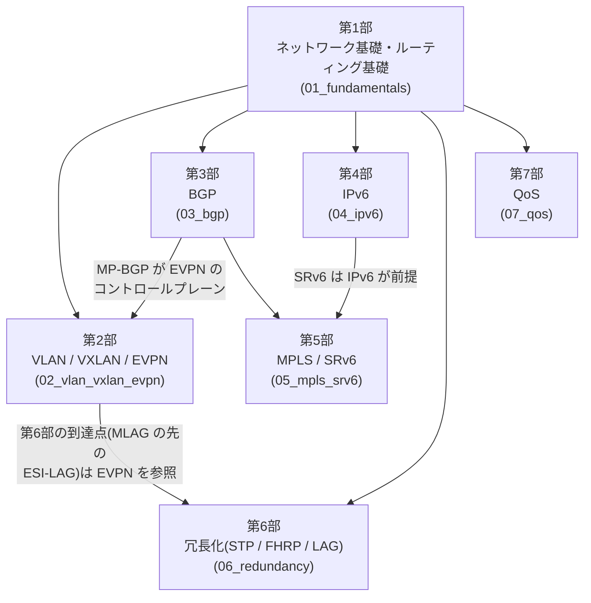

# 教科書全体のロードマップ

## 概要

この章では、本教科書の全体像 — 何を、どの順番で、どこまで深く学ぶのか — を示す。
前提知識のマップと各分野の依存関係を確認し、自分に合った読み進め方を決められる
ようにすることがゴールである。

## この教科書が目指すもの

本書は「入門書は卒業したが、次の体系的な一冊が欲しい」という読者のための
ネットワーク技術教科書である。VLAN やルーティングという言葉の意味は分かるが、

- なぜ iBGP はフルメッシュが必要なのか、それを崩すと何が壊れるのか
- VXLAN のフラッディングはなぜ問題になり、EVPN はそれをどう解決するのか
- SLAAC でアドレスが付くとき、ワイヤ上では実際に何が流れているのか

といった「**なぜそう動くのか**」を RFC・仕様書レベルで説明できるようになること、
それが本書の目標である。資格試験の暗記事項でも、特定ベンダーの設定コピペ集でもなく、
エンタープライズ〜ISP/データセンター規模の設計・運用に通用する
**プロトコルの動作原理の理解**を積み上げていく。

### 本書で扱わないこと

- 「ネットワークとは何か」レベルのゼロからの入門(前提知識の節を参照)
- 特定ベンダー機器の設定手順の網羅・比較(設定例は理解を助ける最小限のみ)
- 資格試験(CCNA/CCNP 等)の出題範囲への準拠

## 前提知識マップ

本書を読み始める前に、以下の項目について「言葉の意味が分かり、
おおまかなイメージが描ける」状態であることを想定している。
完璧な理解は不要である — 曖昧な部分は第1部(ネットワーク基礎)で総復習する。

| 分野 | 想定する前提レベル |
|---|---|
| OSI参照モデル / TCP/IP モデル | レイヤという考え方と、L2/L3/L4 の大まかな役割が言える |
| Ethernet / MACアドレス | スイッチが MAC アドレスで転送することを知っている |
| IPアドレス / サブネット | CIDR 表記(/24 など)を読める、サブネット分割の計算ができる |
| ルーティング | 「ルータはルーティングテーブルを見て転送する」ことを知っている |
| VLAN | 「スイッチを論理的に分割する技術」という理解がある |
| TCP/UDP | コネクションの有無、ポート番号の役割が分かる |
| DNS / DHCP / ARP | それぞれ何をするものか一言で説明できる |
| CLI 操作 | 何らかのネットワーク機器または Linux の CLI に触れたことがある |

上記に不安がある項目が多い場合は、一般的な入門書(TCP/IP の基礎を扱うもの)を
先に読むことを推奨する。逆に、上記がすべて即答できるなら第1部は流し読みでもよい。

## 全体構成と依存関係

本書は7つの部で構成される。依存関係は次のとおりである。

矢印は「学習上の依存」を表す。特に重要なクロス依存に注意してほしい:

- **第2部の後半(EVPN)は第3部(BGP、特に MP-BGP)の理解に依存する**。
  EVPN は MP-BGP のアドレスファミリとして実装されているためである。
  第2部は VXLAN までを先に読み、EVPN の章で必要になったら第3部へ往復する読み方でもよい
- **第5部の SRv6 は第4部(IPv6)の理解が前提**となる。SRv6 は IPv6 拡張ヘッダの
  仕組みの上に構築されているためである
- **第6部は第1部の直後から読める**が、最終章(LAG/MLAG)の到達点である
  EVPN マルチホーミング(ESI-LAG)の部分だけは第2部05章の知識を使う
- **第7部(QoS)も第1部の直後から読める**。他の部への強い依存はないが、
  随所で他分野との対比(FEC、BGP フリーコア、冗長構成の片系輻輳など)を
  使うため、通読の最後に置くと接続がすべて生きる

## 各部の内容

### 第1部: ネットワーク基礎・ルーティング基礎(`01_fundamentals/`)

スイッチング/ルーティングの原理を体系的に総復習する。「知っているつもり」の
基礎を、以後のすべての部を支えられる強度まで固め直すことが目的である。

| 章 | 内容 |
|---|---|
| 01 L2/L3 総復習 | L2/L3 の役割分担、カプセル化の仕組み |
| 02 ルーティングテーブルの基礎 | 経路選択の原理、ロンゲストマッチ |
| 03 静的 vs 動的ルーティング | それぞれの位置づけと使い分け |
| 04 ディスタンスベクタとリンクステート | 2大アルゴリズムの動作原理と設計思想の違い |
| 05 IGP の概観 | OSPF 等 IGP の位置づけ、BGP への橋渡し |

### 第2部: VLAN / VXLAN / EVPN(`02_vlan_vxlan_evpn/`)

L2 セグメンテーションの基礎から、データセンターのオーバーレイネットワークまで。
「VLAN の 4094 の壁」→「VXLAN によるトンネリング」→「EVPN による
コントロールプレーンの近代化」という技術の発展史をそのまま学習の流れにする。

| 章 | 内容 |
|---|---|
| 01 VLAN の基礎 | VLAN とは何か、IEEE 802.1Q |
| 02 トランキングとネイティブ VLAN | タグ付き/タグなしフレームの扱い |
| 03 VXLAN の基礎 | なぜオーバーレイが必要か、VNI と VTEP |
| 04 VXLAN のコントロールプレーン | フラッディング&ラーニング vs EVPN |
| 05 EVPN/VXLAN | EVPN ルートタイプと統合的理解(※第3部 MP-BGP に依存) |

### 第3部: BGP(`03_bgp/`)

インターネットを支える唯一の EGP である BGP を、基礎からポリシー制御、
MP-BGP、大規模設計まで扱う。本書の中核となる部である。

| 章 | 内容 |
|---|---|
| 01 BGP の基礎 | BGP とは何か、IGP との根本的な違い |
| 02 iBGP と eBGP | 2つのモードの違いとフルメッシュ問題 |
| 03 パスアトリビュート | ベストパス選択のアルゴリズム |
| 04 ポリシー制御 | route-map、prefix-list、community |
| 05 MP-BGP | AFI/SAFI による多アドレスファミリ対応(EVPN・L3VPN の土台) |
| 06 大規模設計 | ルートリフレクタ、コンフェデレーション |

### 第4部: IPv6(`04_ipv6/`)

IPv4 の枯渇という動機から説き起こし、アドレッシング、NDP/SLAAC、
ルーティング、そして MAP-E や DS-Lite といった移行技術まで。
「IPv4 の知識の置き換え」ではなく IPv6 固有の設計思想を理解する。

| 章 | 内容 |
|---|---|
| 01 なぜ IPv6 か | IPv4 枯渇問題と NAT の限界 |
| 02 アドレッシング | アドレス体系、スコープ、割り当て設計 |
| 03 NDP と SLAAC | ARP との違い、アドレス自動設定の仕組み |
| 04 IPv6 ルーティング | IPv6 での経路制御の実際 |
| 05 移行技術 | MAP-E、DS-Lite、NAT64 |

### 第5部: MPLS / SRv6(`05_mpls_srv6/`)

ラベルスイッチングの原理から、L3VPN/L2VPN、そしてセグメントルーティング(SRv6)
まで。ISP・キャリアネットワークの中核技術を扱う、本書の最終到達点である。

| 章 | 内容 |
|---|---|
| 01 MPLS の基礎 | なぜラベルスイッチングが必要か |
| 02 LDP と RSVP-TE | ラベル配布プロトコルとトラフィックエンジニアリング |
| 03 L3VPN / L2VPN | MPLS VPN の仕組み(※第3部 MP-BGP に依存) |
| 04 SRv6 | セグメントルーティング(※第4部 IPv6 に依存) |

### 第6部: 冗長化(STP / FHRP / LAG)(`06_redundancy/`)

L2/L3 冗長化の基礎。第1〜5部の完成後に追加した拡張分野であり、
「塞ぐ(STP)→ 速く直す(RSTP)→ 役を引き継ぐ(FHRP)→ 束ねて選出をなくす
(LAG/MLAG)」という冗長化の設計思想の進化を1本の流れで扱う。

| 章 | 内容 |
|---|---|
| 01 STP の基礎 | L2 ループ問題と STP(802.1D) |
| 02 RSTP / MSTP | 収束の高速化と VLAN 単位の負荷分散 |
| 03 FHRP(VRRP / HSRP) | デフォルトゲートウェイの冗長化 |
| 04 LAG / MLAG | リンクアグリゲーション(802.1AX/LACP)、MLAG(※終盤は第2部 EVPN を参照) |

### 第7部: QoS(`07_qos/`)

輻輳の瞬間の「先送・待機・廃棄」を偶然から意図に変える技術体系。
第6部に続く拡張分野であり、「なぜ QoS か(輻輳と品質指標)→ 荷札
(分類・マーキング)→ 輻輳点の執行(キューイング・スケジューリング)→
契約とその執行(シェーピング/ポリシング、ECN)」を1本の流れで扱う。

| 章 | 内容 |
|---|---|
| 01 QoS の基礎 | 輻輳、遅延/ジッタ/損失、IntServ vs DiffServ、QoS パイプライン |
| 02 分類とマーキング | DSCP/PHB、802.1p CoS、信頼境界 |
| 03 キューイングとスケジューリング | PQ/WFQ/DRR、テールドロップと AQM、バッファブロート |
| 04 シェーピングとポリシング | トークンバケット、三色マーカー、ECN |

## 読み進め方のモデル

### 標準ルート(推奨)

第1部 → 第2部(01〜04章)→ 第3部 → 第2部(05章 EVPN)→ 第4部 → 第5部 → 第6部 → 第7部

依存関係を一度も先回りせずに読める順序である。EVPN を BGP の後に回すのがポイント。
第6部(冗長化)・第7部(QoS)は第1部の直後に前倒しして読んでもよい
(第6部は最終章の ESI-LAG の部分だけ、第2部05章を読んでから戻ってくればよい)。

### 分野別ルート

各部は独立して読めるようにも書かれている。特定分野を急ぐ場合は、
上の依存関係グラフで矢印の元にあたる部(少なくとも第1部)を確認したうえで、
目的の部へ直行してよい。

### 辞書的な使い方

各章は「概要 → 導入 → 理論 → プロトコル動作の詳細 → トラブルシューティング →
演習 → まとめ」の統一構成である。既知の分野なら「プロトコル動作の詳細」と
「トラブルシューティング」だけを拾い読みする使い方もできる。
用語の定義に迷ったら [用語集](../shared/glossary.md) を参照すること。

## 本書の約束事

- 仕様の出典として RFC 番号を明記する(例: 「BGP-4 は RFC 4271 で定義される」)。
  RFC は一次情報源であり、本書を読み終えたあと読者自身が RFC を直接読めるように
  なることも隠れた目標の一つである
- 用語は初出時に [用語集](../shared/glossary.md) に登録し、全章で表記を統一する
- 図はASCIIアートまたは Mermaid 記法で示す(表記ルールの詳細は
  [スタイルガイド](../shared/style_guide.md) を参照)
- 設定例は動作原理の理解を助ける場合にのみ最小限で載せる

## まとめ

- 本書は「なぜそう動くのか」を RFC レベルで説明できることを目指す、
  入門書卒業者向けの体系的教科書である
- 全7部構成。第1部(基礎)がすべての土台で、EVPN は BGP に、SRv6 は IPv6 に、
  第6部(冗長化)の到達点は EVPN に接続する。第7部(QoS)は第1部だけに依存する
- 推奨ルートは「第1部 → 第2部前半 → 第3部 → EVPN → 第4部 → 第5部 → 第6部 → 第7部」
- 各部は独立しても読めるため、目的に応じたショートカットも可能である
