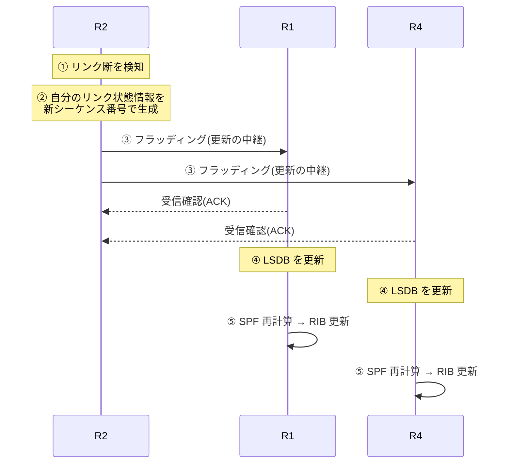

# ディスタンスベクタ vs リンクステート

## 概要

この章では、動的ルーティングプロトコルの2大方式 — 「宛先までの距離」を教え合う
**ディスタンスベクタ型**と、「ネットワークの地図」を共有して各自で計算する
**リンクステート型** — のアルゴリズムを比較する。前提知識は
[前章](./03_static_vs_dynamic.md) の動的ルーティングの共通ライフサイクルと
収束、[ルーティングテーブルの章](./02_routing_table_basics.md) のメトリックである。

## 導入 — 「何を教え合うか」がプロトコルの性格を決める

前章で、あらゆる動的ルーティングプロトコルが共通の5段階
(発見→隣接確立→**交換**→計算→維持)で動くことを見た。
このうち③「経路情報の交換」で**何を**交換するかが、
プロトコル設計の最大の分岐点である。答えは歴史的に2つある:

1. **距離を教え合う**: 各ルータが隣人に「宛先 X には距離 d で行ける」とだけ伝える。
   隣人はそれを信じ、自分のリンク分を足して、さらにその隣人へ伝える。
   これが**ディスタンスベクタ型**である
2. **地図を配り合う**: 各ルータが「自分にはこういうリンクが繋がっている」という
   一次情報を全ルータへ配り、全員が同じ地図を組み立てて、
   各自がその上で最短経路を計算する。これが**リンクステート型**である

日常の比喩でいえば、前者は**道を尋ねながら進む**方式である。
交差点ごとに「駅はどっち?」と聞き、「あっちへ 3 km」という答えだけを頼りに進む。
教えてくれた人がどんな道筋を想定しているかは分からない。
後者は**全員が同じ地図を持つ**方式である。地図さえ正しければ、
経路は各自が手元で好きなだけ正確に計算できる。

この選択は単なる実装の違いではない。**収束の速さ・ループへの耐性・
資源消費・スケールの限界**という、前章で挙げた動的ルーティングの
評価軸すべてがここから導かれる。本章ではプロトコルの個別仕様
(OSPF の詳細は [次章](./05_igp_overview.md)、BGP は第3部)に入る前に、
この2つのアルゴリズムの本質を押さえる。

## 理論

### ディスタンスベクタ — 距離と方向だけを教え合う

ディスタンスベクタ(distance vector)の名は、各ルータが広告する情報が
「距離(distance)と方向(vector)」の組だけであることに由来する。
代表実装は RIP であり、RIPv1 が **RFC 1058**、現行の RIPv2 が
**RFC 2453** で定義されている。

動作の骨格は分散版の**ベルマンフォード(Bellman-Ford)アルゴリズム**である:

- 各ルータは、自分のルーティングテーブル(宛先と距離の一覧)を
  **隣接ルータにだけ**周期的に広告する
- 受け取った側は、広告された距離に「広告元までのリンクのコスト」を足し、
  既知の距離より小さければテーブルを更新する(最小値の選択)
- 更新されたテーブルは次の周期でまたその先の隣人へ広告される

つまり経路情報は**バケツリレーで1ホップずつ**伝わり、
各ルータで「足して・比べて・選ぶ」という計算を受けながら広がっていく。
ネットワークの端の情報が反対の端に届くまでには、
中継するルータの数だけ広告の往復を要する。

この方式の設計上の美点は**単純さ**である。各ルータが保持するのは
自分のテーブルだけで、ネットワーク全体の構造を知る必要がない。
計算は足し算と比較のみで、1980年代の非力なルータでも動いた。

しかし根本的な弱点が同じ場所にある。各ルータは「距離 d で行ける」という
**結論だけ**を受け取り、**その経路がどこを通るのかを知らない**。
とりわけ、隣人が広告してきた経路が**実は自分自身を経由している**ことを
検出できない。この盲点が、後述する**無限カウント**という
ディスタンスベクタ型固有の病理を生む。
前章の言葉でいえば、ディスタンスベクタは「伝聞の伝聞」を無検証で
信じる構造そのものであり、対策(スプリットホライズン等)はすべて
この構造への対症療法である。

### リンクステート — 一次情報だけで地図を作る

リンクステート(link state)型は、この「伝聞」問題を情報の性質から断つ。
代表実装は OSPFv2(**RFC 2328**)と IS-IS(ISO/IEC 10589、
IP 対応は **RFC 1195**)である。

発想の転換は次の点にある:

- 各ルータが配るのは経路(計算結果)ではなく、
  **「自分にどのリンクが繋がっていて、コストはいくつか」という一次情報だけ**である。
  自分の直結リンクのことは自分が一番よく知っており、伝聞ではない
- この一次情報を、**改変せずそのまま全ルータへ中継**(フラッディング)する。
  中継するルータは内容に手を加えない — ディスタンスベクタが各ホップで
  「足して選ぶ」のと対照的である
- 全ルータが同じ一次情報の集合 = **リンクステートデータベース(LSDB)**を持てば、
  全員がネットワークの完全な地図を共有したことになる
- 各ルータは地図上で、自分を起点とする最短経路木を
  **ダイクストラ(Dijkstra)法**で計算する。この計算を
  **SPF(Shortest Path First)計算**と呼ぶ

情報の伝搬(フラッディング)と経路の計算(SPF)が**分離されている**ことが
決定的に重要である。トポロジ変化は計算を待たずに地図の差分として
一気に全ルータへ広がり、各ルータは正しい地図の上で独立に計算する。
「隣人の計算結果を待ってから自分が計算する」というバケツリレーの遅さと、
伝聞に混入する誤りの両方が、原理のレベルで取り除かれている。

代償は資源である。全ルータがネットワーク全体の地図を持つため
メモリを消費し、変化のたびに SPF 計算が走るため CPU を消費する。
また「全員の地図が一致している」ことがすべての前提になるため、
フラッディングには到達保証・新旧判定・古い情報の破棄といった
規律(後述)が必要で、プロトコルはディスタンスベクタより格段に複雑になる。
規模が大きくなったときは地図を分割する仕組み(OSPF のエリア)で対処するが、
これは [次章](./05_igp_overview.md) で扱う。

### 第3の道 — パスベクタ(予告)

実は現代のインターネットを支える BGP(**RFC 4271**)はこのどちらでもない。
BGP はディスタンスベクタの系譜にありながら、広告に「距離」ではなく
**経路が通ってきた道筋(AS のリスト)を丸ごと**載せる。
受け取った側は、その道筋に自分が含まれていれば広告を捨てる —
つまりループ検出を情報そのものに内蔵しており、これを
**パスベクタ(path vector)型**と呼ぶ。
ディスタンスベクタの弱点をどう克服した設計なのか、という視点で
第3部で本格的に扱う。

### 両方式の比較

| 観点 | ディスタンスベクタ | リンクステート |
|---|---|---|
| 交換する情報 | 宛先までの距離と方向(計算結果) | 自分の直結リンクの状態(一次情報) |
| 情報の届き方 | 隣人へだけ、各ホップで再計算されつつ伝搬 | 全ルータへ、改変されずフラッディング |
| 各ルータが知るもの | テーブル(距離と方向)のみ | ネットワーク全体の地図(LSDB) |
| 経路計算 | 分散ベルマンフォード(足して比べる) | 各自でダイクストラ法(SPF) |
| ループ耐性 | 弱い(無限カウント)。対症療法で緩和 | 地図が一致していれば原理的に生じにくい |
| 収束 | 遅い(伝搬=計算のバケツリレー) | 速い(伝搬と計算が分離) |
| 資源消費 | 小さい(テーブルのみ、単純計算) | 大きい(LSDB のメモリ、SPF の CPU) |
| 複雑さ | 単純 | 複雑(フラッディングの規律が必要) |
| 代表プロトコル | RIP(RFC 2453) | OSPF(RFC 2328)、IS-IS(RFC 1195) |

## プロトコル動作の詳細

### ディスタンスベクタの動作 — 周期広告と分散計算

3台のルータの直列トポロジで、経路情報が伝わる様子を追う
(リンクコストはすべて 1、距離はホップ数とする):

```text
[R1] ───── [R2] ───── [R3] ── 10.0.3.0/24
```

| 時点 | R1 のテーブル | R2 のテーブル | R3 のテーブル |
|---|---|---|---|
| 初期 | — | — | 10.0.3.0/24: 直結(0) |
| R3 が広告 | — | 10.0.3.0/24: R3 経由, 距離 1 | 直結(0) |
| R2 が広告 | 10.0.3.0/24: R2 経由, 距離 2 | R3 経由, 距離 1 | 直結(0) |

R1 に情報が届くまで広告2周期を要すること、R1 が知るのは
「R2 の方向へ距離 2」だけで R3 の存在すら知らないことに注目してほしい。

RIP(RFC 2453)の場合、この広告は**30秒周期**で全テーブルを送る形で行われ、
180秒(timeout)広告が途絶えた経路は無効(距離16)とされ、
さらに120秒(garbage collection)後にテーブルから消える。
周期とタイマーで動くこの仕組みは、障害時の収束が
**分単位**になりうることを意味する。

### 無限カウント — ディスタンスベクタの病理

先ほどのトポロジで、R3 の先のネットワークが失われた直後を考える:

```text
[R1] ───── [R2] ──✕── 10.0.3.0/24 (喪失)

R1: 10.0.3.0/24 → R2 経由, 距離 2
R2: 10.0.3.0/24 → 到達不能を検知
```

R2 は経路を失ったが、その直後に **R1 からの周期広告**が届く。
そこには「10.0.3.0/24 へ距離 2 で行ける」と書いてある —
R1 のその経路は R2 自身を経由するものだが、
広告には距離しか載っていないため **R2 にはそれが分からない**。
R2 は「R1 経由なら距離 3 で行ける」と誤って学習してしまう:

```text
R2: 10.0.3.0/24 → R1 経由, 距離 3   ← R1 の伝聞を信じた
R1: 10.0.3.0/24 → R2 経由, 距離 2   ← まだ古い情報

次の広告で R2 の「距離 3」を聞いた R1 が距離 4 に更新し、
それを聞いた R2 が距離 5 に更新し……距離だけが交互に増えていく
```

この間、R1 と R2 は互いを指し合っており、当該宛先へのパケットは
両者間を**ループ**する(TTL が尽きるまで)。距離が無限まで
数え上がっていくこの現象を**無限カウント(counting to infinity)**と呼ぶ。

RIP はこれを次の対症療法の重ね掛けで緩和する:

1. **距離の上限**: 距離 16 を「無限=到達不能」と定義し、
   数え上げを有限時間で打ち切る。副作用として、RIP は
   15ホップを超えるネットワークで使えなくなった
2. **スプリットホライズン(split horizon)**: ある隣人から学んだ経路を
   **その隣人へ広告し返さない**。上の例では R1 が R2 に
   10.0.3.0/24 を広告しなくなり、この2台間のループは発生しなくなる
3. **ポイズンリバース(poison reverse)**: 広告し返さない代わりに
   「距離 16(到達不能)」として明示的に広告し返す。
   沈黙より誤解の余地が少ない
4. **トリガードアップデート(triggered update)**: 変化を検知したら
   30秒周期を待たず即座に広告し、悪い知らせの伝搬を速める

ただしスプリットホライズンが防げるのは**2台間の**ループだけであり、
3台以上が環状に誤情報を回すパターンは防げない。
根本原因 — 経路の中身(どこを通るか)が広告に含まれない — は
どの対策でも解消されておらず、これがリンクステートとパスベクタという
後続の設計を生んだ動機である。

### リンクステートの動作 — フラッディング・LSDB 同期・SPF

リンクステート型で、あるルータがリンク断を検知してから
全体が収束するまでの流れは次のとおりである
(用語は OSPF に寄せるが、IS-IS もほぼ同型である):



1. **生成**: 変化を検知したルータは、自分のリンク状態を記述した情報
   (OSPF では LSA: Link-State Advertisement と呼ぶ。正式な定義は次章)を
   新しい**シーケンス番号**付きで生成する
2. **フラッディング**: この情報を全隣接ルータへ送る。受け取ったルータは
   シーケンス番号で新旧を判定し、手持ちより新しければ LSDB に格納して
   **受信したインタフェース以外へそのまま中継**する。
   受信確認(ACK)により到達が保証され、全ルータに漏れなく行き渡る
3. **エージング**: 各情報には寿命があり、生成元が定期的に再生成
   (リフレッシュ)しなければ期限切れで全ルータの LSDB から消える。
   ルータごと消滅した場合でも、その古い情報が地図に残り続けない
4. **SPF 再計算**: LSDB が変化したルータは、更新された地図の上で
   ダイクストラ法を再実行し、結果得られた最短経路木から
   各宛先への経路を RIB へ差し出す(前章のライフサイクル④)

「フラッディング」という語は
[L2 の章](./01_l2_l3_recap.md) でスイッチの動作として登場したが、
ここでは**制御情報を全ルータへ確実に行き渡らせる中継動作**を指す。
無秩序に溢れさせる L2 のフラッディングと違い、リンクステートの
フラッディングはシーケンス番号・受信確認・寿命による
厳密な規律の下で行われる。この規律こそがリンクステート型の複雑さの
中心であり、「全員の地図が一致する」という大前提を支えている。

### 収束の比較 — なぜリンクステートは速いのか

両方式の収束の違いは、次の一点に集約できる:

- **ディスタンスベクタ**: 伝搬と計算が一体である。各ルータは
  隣人の計算結果を受けてから自分の計算を行い、その結果を次へ渡す。
  情報は1ホップごとに処理待ちを挟みながら進み、
  さらに周期タイマーが伝搬を律速する。悪い知らせ(到達不能)は
  無限カウント対策のタイマーにも阻まれ、伝わるのが特に遅い
- **リンクステート**: 伝搬(フラッディング)と計算(SPF)が分離している。
  トポロジ変化の事実は計算を待たずミリ秒〜秒オーダーで全体に広がり、
  各ルータの再計算も自分の LSDB だけで完結する

ただしリンクステートでも、フラッディングの到達と SPF 完了のタイミングは
ルータごとに微妙にずれるため、**収束途中の一時的なループ
(マイクロループ)**は起こりうる。「地図が一致してさえいればループしない」の
裏返しとして、一致するまでの過渡期は無防備なのである。
また、リンクが短時間に up/down を繰り返す(フラッピング)と
フラッディングと SPF 再計算が連鎖して CPU を圧迫するため、
実装は SPF の実行間隔を動的に間引く(スロットリング)。
収束の速さと安定性のトレードオフはここでも現れる。

## 設定例(補助)

両方式の「見えているものの違い」は、ルータが持つ情報を表示させると
はっきり分かる。以下は FRRouting での例(出力は要点のみ抜粋)。

ディスタンスベクタ(RIP)のルータが持つのは距離と方向の一覧だけである:

```text
router# show ip rip
     Network         Next Hop      Metric  From
  R> 10.0.3.0/24     192.0.2.2       2     192.0.2.2
```

リンクステート(OSPF)のルータは、経路とは別に**地図そのもの**を持っている:

```text
router# show ip ospf database
       Router Link States (Area 0.0.0.0)
  Link ID       ADV Router     Age   Seq#
  1.1.1.1       1.1.1.1        213   0x8000001a
  2.2.2.2       2.2.2.2        108   0x80000017
  3.3.3.3       3.3.3.3        108   0x80000021
```

RIP ルータに「10.0.3.0/24 の先のトポロジ」を尋ねる手段はないが、
OSPF ルータの LSDB からはネットワーク全体の接続関係を復元できる。
トラブルシューティングの手がかりの量がまったく違うことも、
この表示の違いから実感できるだろう。

## トラブルシューティング

### 症状: 障害後、数分たっても古い経路が消えない(DV)

- ディスタンスベクタのタイマー駆動型の収束では、これは異常ではなく**仕様**である。
  RIP なら timeout 180秒+garbage collection 120秒が既定であり、
  広告元が黙って消えた場合、経路が完全に消えるまで最大5分かかる
- 切り分け: 経路の Age/タイマー値を確認する。タイマー経過を待って消えるなら
  正常動作であり、問題にするなら方式(またはタイマー設計)の見直しになる

### 症状: traceroute で同じ2台のルータが交互に現れ、TTL 超過で終わる

- 転送ループの典型症状である。ディスタンスベクタの収束途中であれば
  無限カウントを疑う。距離(メトリック)が広告のたびに増えていく経路が
  観測できれば確定である
- 切り分け: ループを構成する2台で当該宛先の経路とメトリックを数十秒おきに
  確認する。メトリックが単調増加していれば無限カウント進行中。
  スプリットホライズン/ポイズンリバースの設定(無効化されていないか、
  特に NBMA・ハブ&スポーク構成)を確認する

### 症状: LSDB には正しい情報があるのに、選ばれる経路がおかしい(LS)

- リンクステートでは「地図」と「計算」が分離しているため、
  問題の切り分けもこの2段で行う。LSDB が正しいなら、フラッディングは
  健全であり、問題はコスト設定(SPF の入力)にある可能性が高い
- 切り分け: LSDB 上で各リンクのコストを追い、期待する経路と
  実際の最短経路のコスト合計を手で比較する。「正しい地図の上で、
  設定されたコストに従って正しく計算した結果、意図しない経路が最短になっている」
  というオチが大半である

### 症状: ルータ間で LSDB の内容が食い違っている(LS)

- 「全員の地図が一致する」というリンクステートの大前提が崩れた状態であり、
  ループや到達不能の温床になる。フラッディングの不達(隣接関係の不全、
  MTU 不一致によるデータベース交換の失敗など)が典型原因である
- 切り分け: 隣接関係が完全な状態(OSPF なら Full。次章)まで
  進んでいるかをまず確認する。隣接が健全なのに食い違う場合は
  実装のバグ級の事象であり、当該ルータの再隣接(プロセス再起動)で
  再同期させつつ原因を追う

### 症状: CPU 使用率が周期的に跳ね、経路が安定しない(LS)

- どこかのリンクがフラッピングし、フラッディングと SPF 再計算が
  繰り返されている疑いが強い。1本のリンクの不安定が
  **エリア内の全ルータの CPU** に波及するのはリンクステートの構造的性質である
- 切り分け: LSDB 内で Age が若く Seq# の進みが速い情報を探すと、
  再生成を繰り返している発生源(フラッピングしているルータ/リンク)を
  特定できる。対処は当該リンクの修理または隔離が先で、
  SPF スロットリングの調整は対症療法と心得る

## 演習・確認問題

1. ディスタンスベクタ型とリンクステート型が交換する情報の違いを、
   「一次情報」「計算結果」という言葉を使って説明せよ。
2. 無限カウントが発生する仕組みを、2台のルータの例で順を追って説明せよ。
   また、根本原因は広告にどんな情報が欠けていることか。
3. スプリットホライズンとポイズンリバースの違いを述べよ。また、
   スプリットホライズンでも防げないループのパターンを挙げよ。
4. リンクステート型で「伝搬と計算が分離している」とはどういうことか。
   これが収束の速さにどう効くかを、ディスタンスベクタとの対比で説明せよ。
5. リンクステートのフラッディングが L2 スイッチのフラッディングと
   異なる点を、「規律」の観点から2つ挙げよ(ヒント: 新旧判定、到達保証)。
6. リンクステート型でも一時的なループ(マイクロループ)が起こりうるのは
   なぜか。「地図の一致」という言葉を使って説明せよ。
7. BGP が採用するパスベクタ方式は、ディスタンスベクタの
   どの弱点をどのような発想で解決しているか、本章の範囲で説明せよ。

## まとめ

- 動的ルーティングの2大方式の違いは「何を教え合うか」に尽きる:
  ディスタンスベクタは距離と方向(計算結果)を隣人へ、
  リンクステートは自分のリンク状態(一次情報)を全ルータへ配る
- ディスタンスベクタは単純で軽いが、経路の中身が見えない伝聞ゆえに
  無限カウントというループの病理を抱え、対策(距離上限・
  スプリットホライズン・ポイズンリバース)はすべて対症療法である
- リンクステートは全ルータが同一の地図(LSDB)を規律あるフラッディングで
  共有し、各自がダイクストラ法(SPF)で計算する。伝搬と計算の分離が
  速い収束をもたらすが、メモリ・CPU と複雑さが代償となる
- リンクステートの健全性は「全員の地図の一致」に懸かっており、
  トラブルシューティングも「地図(LSDB)は正しいか」「計算(コスト)は
  意図どおりか」の2段で切り分ける
- BGP は道筋そのものを広告に載せるパスベクタ型で、ディスタンスベクタの
  ループ問題を情報の中身で解決した第3の設計である(第3部で詳述)
