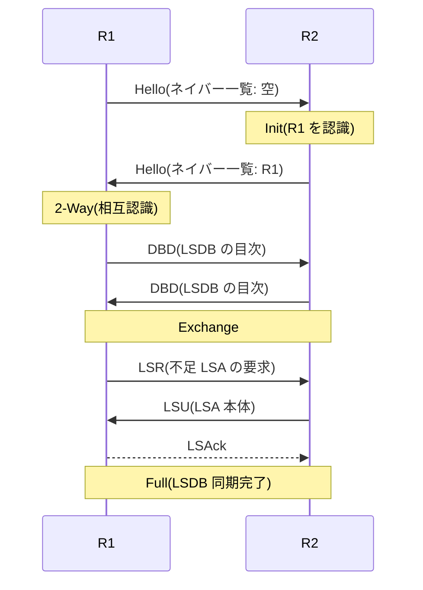

# IGP の位置づけ — OSPF を例に、BGP への橋渡しまで

## 概要

この章では、これまで暗黙に扱ってきた「ネットワークの内側」という前提を明示化し、
**AS(自律システム)** と **IGP / EGP** という分類を導入する。そのうえで、
リンクステート型 IGP の代表である **OSPF** の設計と動作を概観し、
「なぜ内側だけでは完結せず BGP が必要なのか」という第3部への橋渡しを行う。
前提知識は [前章](./04_distance_vector_link_state.md) のリンクステートの原理
(フラッディング・LSDB・SPF)である。

## 導入 — ネットワークには「内側」と「外側」がある

第1部でここまで扱ってきたルーティングの話には、実は暗黙の前提があった。
それは「登場するルータはすべて**同じ管理者**のものであり、
互いのコスト設定や広告を**無条件に信頼してよい**」という前提である。
自社ネットワークの中であれば、これは自然な前提である。

しかしインターネットは、この前提が成り立たない世界である。
インターネットは単一の巨大ネットワークではなく、
**それぞれ別の組織が別の方針で運用する無数のネットワークの相互接続**である。
ISP、データセンター事業者、企業、大学 — それぞれが自分の領域内では
好きなプロトコル・好きなコスト設計を使い、他者にそれを強制されない。

この「一つの管理主体が一貫した方針で運用するネットワークのまとまり」を
**AS(Autonomous System、自律システム)**と呼ぶ。そしてルーティングプロトコルは、
AS の内側で使うものと AS の間で使うものに大別される:

- **IGP(Interior Gateway Protocol)**: AS の**内側**の経路制御。
  目的は「自分の家の中の地図を正確に持ち、最短経路で速く運ぶ」こと。
  RIP、OSPF、IS-IS、EIGRP がこれに属する
- **EGP(Exterior Gateway Protocol)**: AS の**間**の経路制御。
  目的は「他組織との合意(ポリシー)に従って経路を交換する」こと。
  現在のインターネットで使われる EGP は事実上 BGP ただ一つである

```text
        AS 64500(ISP A)                AS 64501(ISP B)
   ┌───────────────────────┐      ┌───────────────────────┐
   │  [R1]──[R2]           │      │          [R6]──[R7]   │
   │    │     │   内側:IGP │ 境界 │ 内側:IGP   │     │    │
   │  [R3]──[R4]────────[R5]══════[R8]────────[R9]──[R10] │
   │        (OSPF など)    │ BGP  │    (OSPF など)        │
   └───────────────────────┘      └───────────────────────┘
```

この2階建て構造は、単なる歴史的経緯ではなく**要求の違い**の帰結である。
内側で求められるのは正確な地図と速い収束であり、
外側で求められるのは方針(どの経路を使うか・誰に何を広告するか)の制御と
桁違いのスケールである。この章の最後で見るように、
両者は要求が違いすぎて一つのプロトコルでは満たせない。

## 理論

### AS — 管理とポリシーの単位

AS の定義は **RFC 1930**(BCP 6)にある。要点を訳せば
「**単一かつ明確に定義されたルーティングポリシーを持つ、
1つ以上のプレフィックスのまとまり**」である。
鍵は「単一のポリシー」という部分で、AS の境界は物理的な境界ではなく
**意思決定の境界**である。外から見たとき、その AS 全体が
一貫した方針で経路を選び・広告するならば、内部に何台ルータがあっても
一つの AS である。

各 AS には **AS 番号(ASN)**が割り当てられる。当初は 16 ビット
(0〜65535)だったが枯渇し、**RFC 6793** で 32 ビットに拡張された。
ドキュメント・私設用に予約された番号帯(64512〜65534 など、RFC 6996)もある。
AS 番号が実際にどう使われるかは第3部(BGP)の主題であり、
ここでは「IGP は AS 番号を知らないままでも動く。AS 番号は
外側(BGP)の世界の識別子である」ことだけ押さえればよい。

### なぜ 2 階建てなのか — IGP と EGP の要求の違い

| 観点 | IGP(内側) | EGP = BGP(外側) |
|---|---|---|
| 最適化の目的 | 最短経路(メトリック最小) | ポリシー適合(契約・経済関係) |
| 信頼モデル | 全ルータを信頼する | 隣接 AS を無条件には信頼しない |
| 規模 | 数十〜数千ルータ、数千経路 | 全世界、100万経路規模 |
| 収束への要求 | ミリ秒〜秒 | 数十秒でも許容(安定性優先) |
| トポロジ情報 | 詳細(リンク単位) | 抽象(AS の並びだけ) |

この表の各行は互いにトレードオフの関係にある。
リンクステート型 IGP の「全員が詳細な地図を共有する」方式は、
正確で速いが、**全ルータを信頼できる範囲**でしか成立しない
(誰かが偽のリンク情報をフラッディングすれば全員の計算が狂う)。
また地図の詳細さは規模に対して高くつく。全インターネットのリンク状態を
1つの LSDB に収めて SPF を回すことは、量的にも、
他組織にトポロジの詳細を晒すという意味でも成立しない。

逆に BGP は、トポロジを AS の並び(パスベクタ)まで抽象化して
スケールとポリシー制御を獲得したが、その代償として
リンク単位の速い収束は原理的に持たない。
**内は地図で速く、外は方針で堅く** — この分業が2階建ての本質である。

### IGP の系譜 — 前章の分類に当てはめる

[前章](./04_distance_vector_link_state.md) の方式分類に、実在の IGP を対応づけておく:

- **RIP**(RFC 2453): ディスタンスベクタ。仕組みの教材としては最良だが、
  ホップ数上限 15 と分単位の収束のため、現在の実務で新規採用されることはまれである
- **EIGRP**(RFC 7868): 拡張ディスタンスベクタ。DUAL アルゴリズムにより
  DV でありながら高速収束を実現した Cisco 独自技術(2016 年に Informational RFC 化)。
  単一ベンダー環境以外では選ばれにくい
- **OSPF**(OSPFv2: **RFC 2328**、IPv6 対応の OSPFv3: **RFC 5340**):
  リンクステート。エンタープライズで最も広く使われる IGP
- **IS-IS**(ISO/IEC 10589、IP 対応は **RFC 1195**): リンクステート。
  OSPF とアルゴリズムはほぼ同型だが、IP ではなく L2 上で直接動き、
  情報を TLV 形式で運ぶため拡張が容易。大規模 ISP・データセンターで根強い

本章では以後、リンクステート IGP の代表として OSPF(v2)を掘り下げる。
IS-IS との差分は設計思想の比較として要所で触れるにとどめ、
どちらを選ぶかという議論には深入りしない
(LSDB・SPF・フラッディングという骨格は共通であり、
片方を仕組みから理解すればもう片方は「方言」として読める)。

### OSPF の設計 — 素朴なリンクステートを実務規模で動かす工夫

前章のリンクステートの原理は「全ルータが全リンク情報をフラッディングし、
全員が全体の地図で SPF を回す」という素朴なものだった。
OSPF の仕様の大部分は、この素朴な原理を実務の規模・多様なリンク種別で
成立させるための3つの工夫である。

**工夫① ネイバーと隣接の分離。**
OSPF では、Hello パケットで互いを認識した相手を**ネイバー(neighbor)**と呼び、
そのうち **LSDB の同期まで行う関係**を**隣接(adjacency、アジャセンシー)**と呼んで
区別する。ネイバー全員と隣接を結ぶとは限らない — これが次の DR の話につながる。
なお BGP では相手を**ピア(peer)**と呼ぶが、こちらは自動発見せず
管理者が明示的に設定する点が本質的に異なる(第3部)。

**工夫② DR/BDR — 多対多の同期を星型に潰す。**
Ethernet のような多対多で通信できるリンク(ブロードキャスト型ネットワーク)に
n 台のルータが繋がると、素朴には n(n−1)/2 本の隣接が必要になり、
LSDB 同期のトラフィックとフラッディングの重複が爆発する。
OSPF はリンクごとに**代表者 = DR(Designated Router、指定ルータ)**と
その控え(BDR)を選出し、**各ルータは DR/BDR とだけ隣接を結ぶ**。
DR はそのネットワークセグメントを代表して「このセグメントに誰が繋がっているか」を
1つの情報(後述の Network-LSA)として広告する。
これにより隣接の数は O(n²) から O(n) に落ちる。

**工夫③ エリア — 地図の分割と要約。**
LSDB とSPF のコストはルータ数・リンク数に比例して増える。
OSPF はネットワークを**エリア(area)**に分割し、
**詳細な地図(リンク単位の情報)のフラッディング範囲をエリア内に限定**する。
エリアの境界に立つルータ(**ABR**: Area Border Router)は、
隣のエリアへは「プレフィックス X へコスト d で行ける」という
**要約された経路情報**だけを渡す。

ここで前章の言葉を思い出してほしい。「宛先への距離だけを伝える」 —
そう、**エリア間の OSPF は実質的にディスタンスベクタ的に動く**のである。
一次情報(地図)はエリア内で閉じ、エリアを跨ぐのは計算結果(距離)である。
では無限カウントのようなループはどう防ぐのか。OSPF は
**すべてのエリアがバックボーンエリア(エリア 0)に直結しなければならない**という
星型のトポロジ制約を課し、エリア間経路が「エリア 0 を経由する」ことを
強制することでループの余地を断っている。
アルゴリズムの弱点を、トポロジの制約で封じた設計である。

## プロトコル動作の詳細

### OSPF のパケット — 5種類と共通ヘッダ

OSPF は TCP/UDP を使わず、**IP プロトコル番号 89** で IP に直接載る。
到達保証は OSPF 自身が ACK と再送で行う。ブロードキャスト型ネットワークでは
マルチキャスト(AllSPFRouters = 224.0.0.5、DR/BDR 宛ての
AllDRouters = 224.0.0.6)を使い、ネイバーを自動発見する。

パケットは5種類で、すべて共通ヘッダ(RFC 2328 Appendix A.3.1)を持つ:

```text
 0                   1                   2                   3
 0 1 2 3 4 5 6 7 8 9 0 1 2 3 4 5 6 7 8 9 0 1 2 3 4 5 6 7 8 9 0 1
+-+-+-+-+-+-+-+-+-+-+-+-+-+-+-+-+-+-+-+-+-+-+-+-+-+-+-+-+-+-+-+-+
|   Version #   |     Type      |         Packet length         |
+-+-+-+-+-+-+-+-+-+-+-+-+-+-+-+-+-+-+-+-+-+-+-+-+-+-+-+-+-+-+-+-+
|                          Router ID                            |
+-+-+-+-+-+-+-+-+-+-+-+-+-+-+-+-+-+-+-+-+-+-+-+-+-+-+-+-+-+-+-+-+
|                           Area ID                             |
+-+-+-+-+-+-+-+-+-+-+-+-+-+-+-+-+-+-+-+-+-+-+-+-+-+-+-+-+-+-+-+-+
|           Checksum            |             AuType            |
+-+-+-+-+-+-+-+-+-+-+-+-+-+-+-+-+-+-+-+-+-+-+-+-+-+-+-+-+-+-+-+-+
|                       Authentication                          |
+-+-+-+-+-+-+-+-+-+-+-+-+-+-+-+-+-+-+-+-+-+-+-+-+-+-+-+-+-+-+-+-+
|                       Authentication                          |
+-+-+-+-+-+-+-+-+-+-+-+-+-+-+-+-+-+-+-+-+-+-+-+-+-+-+-+-+-+-+-+-+
```

| Type | 名称 | 役割 |
|---|---|---|
| 1 | Hello | ネイバーの発見と生存確認、DR/BDR 選出 |
| 2 | Database Description(DBD) | LSDB の目次(LSA ヘッダの一覧)の交換 |
| 3 | Link State Request(LSR) | 不足している LSA の要求 |
| 4 | Link State Update(LSU) | LSA 本体の送付(フラッディングの実体) |
| 5 | Link State Acknowledgment(LSAck) | LSA 受信の確認 |

**Router ID** は OSPF ルータの 32 ビットの識別子で、IPv4 アドレスと同じ表記を
するがアドレスではない(到達可能である必要はない)。実務では安定性のため
ループバックインタフェースのアドレスを流用する慣例がある。

### ネイバー発見から Full まで — 隣接確立のステートマシン

前章のトラブルシューティングで先出しした「Full」とは、
ネイバー関係の状態機械(RFC 2328 Section 10.1)の最終状態である。
2台のルータが隣接を確立するまでの状態遷移を追う:

| 状態 | 意味 |
|---|---|
| Down | ネイバーからの Hello を聞いていない初期状態 |
| Init | 相手の Hello を受信した。ただし相手がこちらを認識しているかは不明 |
| 2-Way | 相手の Hello の「見えているネイバー一覧」に自分がいた。相互認識の成立 |
| ExStart | LSDB 交換の準備。マスター/スレーブと DBD シーケンス番号の初期値を決める |
| Exchange | DBD で LSDB の**目次**を交換し合う |
| Loading | 目次と手持ちを比べ、足りない LSA を LSR で要求し LSU で受け取る |
| Full | LSDB の同期が完了した。完全な隣接の成立 |



重要な点が2つある。第一に、**Hello の中身が一致しなければ 2-Way にすら進めない**。
Hello にはエリア ID・Hello/Dead 間隔・(ブロードキャスト型では)サブネットマスク・
認証情報などが含まれ、これらの不一致は「設定ミスのまま地図を混ぜてしまう」ことを
防ぐための入口検査として機能する。
第二に、**ブロードキャスト型ネットワークでは全ペアが Full になるわけではない**。
DR/BDR 以外のルータ(DROther)どうしは 2-Way で意図的に止まる。
これは工夫②(隣接の星型化)の帰結であり、正常動作である。

Hello はブロードキャスト型・ポイントツーポイント型リンクでは既定 **10 秒間隔**、
**Dead 間隔(既定はその4倍 = 40 秒)**の間 Hello が途絶えるとネイバーは死んだと
みなされる。より速い検知が必要なら、
[静的 vs 動的の章](./03_static_vs_dynamic.md) で述べたとおり
タイマー短縮ではなく BFD(RFC 5880)を併用するのが現代の定石である。

### LSA — 地図を構成する語彙

LSDB に格納される情報の1単位が **LSA(Link-State Advertisement)**である
(前章まで「リンク状態情報」と呼んできたものの OSPF での正式名)。
各 LSA は「生成したルータ・シーケンス番号・寿命(Age)」を持ち、
前章で述べたフラッディングの規律(新旧判定・ACK・エージング)は
LSA 単位で適用される。寿命は最大 3600 秒(MaxAge)で、
生成元は 1800 秒ごとに再生成(リフレッシュ)する。

主要な LSA タイプと役割:

| Type | 名称 | 生成者 | 流通範囲 | 内容 |
|---|---|---|---|---|
| 1 | Router-LSA | 各ルータ | エリア内 | 自分の直結リンクとコスト(地図の本体) |
| 2 | Network-LSA | DR | エリア内 | ブロードキャスト型セグメントの接続ルータ一覧 |
| 3 | Summary-LSA | ABR | 他エリアへ | エリア間経路「X へコスト d」(距離情報) |
| 4 | ASBR-Summary-LSA | ABR | 他エリアへ | ASBR(外部経路の注入点)への距離 |
| 5 | AS-External-LSA | ASBR | AS 全体 | 再配送された外部経路 |

Type 1/2 が「一次情報(地図)」であり、エリア内に閉じる。
Type 3 が理論の節で述べた「エリア間はディスタンスベクタ的」の実体である。
Type 5 は [静的 vs 動的の章](./03_static_vs_dynamic.md) で述べた**再配送**の
OSPF 側の受け皿で、静的経路や BGP 経路を OSPF に注入すると
ASBR(AS Boundary Router)が生成する。誤設定の外部経路が
AS 全体へ広がる入口でもある、という同章の警告をここで思い出してほしい。

### BGP への橋渡し — IGP が土台、BGP が積み荷

第1部の締めくくりとして、実際のネットワークで IGP と BGP が
どう**分業**するかを見ておく。これは第3部以降のすべての前提になる。

ISP やデータセンターの内部では、意外に思えるかもしれないが、
**IGP には顧客やインターネットの経路をほとんど載せない**。
IGP が運ぶのは典型的には次の2種類だけである:

1. **ルータ間リンクのプレフィックス**(インフラの配線)
2. **各ルータのループバックアドレス**(/32 のホスト経路)

顧客の経路・インターネットの 100 万経路はすべて BGP が運ぶ。
では BGP の経路はどうやって転送に使えるのか。
BGP が広告する経路のネクストホップは、多くの場合**遠くのルータの
ループバックアドレス**であり、直結ではない。ここで
[ルーティングテーブルの章](./02_routing_table_basics.md) の
**再帰的ルックアップ**が効いてくる:

```text
BGP の経路:   203.0.113.0/24 → ネクストホップ 10.255.0.9(遠くのルータ)
IGP の経路:   10.255.0.9/32  → ネクストホップ 192.0.2.6(直結の隣)← OSPF が維持
                                      │
最終的な転送: 203.0.113.0/24 のパケットは 192.0.2.6 へ
```

つまり **BGP は「どの出口へ運ぶか」を決め、IGP は「その出口まで
どう辿り着くか」を支える**。BGP の経路が有効であるためには
ネクストホップが IGP で解決できなければならず、
IGP の収束が遅ければ BGP の経路も巻き添えで使えなくなる。
IGP を小さく(インフラだけに)保つのは、この土台の収束を
速く・安定に保つためである。

この分業を踏まえると、第3部で扱う BGP の問い —
なぜ距離ではなくパス(AS の並び)を運ぶのか、
なぜ最短ではなくポリシーで選ぶのか、
なぜネイバー(ピア)を自動発見せず明示設定するのか — は、
すべて「IGP とは要求が違う」ことの帰結として理解できるはずである。

## 設定例(補助)

隣接の状態と「DR/BDR 以外とは 2-Way で止まる」動作は、
ネイバー表示で直接観察できる。以下は FRRouting での例
(ブロードキャスト型セグメントに4台が接続、本ルータは DROther):

```text
router# show ip ospf neighbor

Neighbor ID     Pri State           Dead Time Address         Interface
10.255.0.1        1 Full/DR         36.6s     192.0.2.1       eth0
10.255.0.2        1 Full/Backup     32.1s     192.0.2.2       eth0
10.255.0.3        1 2-Way/DROther   38.9s     192.0.2.3       eth0
```

DR と BDR に対しては Full、もう1台の DROther とは 2-Way —
これが正常状態である。また、ルーティングテーブルでは
エリア内経路(O)とエリア間経路(O IA)が区別して表示され、
Type 1/2 由来か Type 3 由来かが読み取れる:

```text
router# show ip route ospf
O   10.0.1.0/24 [110/20] via 192.0.2.1, eth0    ← エリア内(地図から計算)
O IA 10.0.9.0/24 [110/30] via 192.0.2.1, eth0   ← エリア間(ABR の要約から)
```

## トラブルシューティング

### 症状: ネイバーがまったく見えない(Down のまま)

- Hello が届いていないか、届いても捨てられている。物理・VLAN の疎通を
  確認したうえで、**Hello の一致検査**(エリア ID、Hello/Dead 間隔、
  サブネットマスク、認証、エリアタイプ)を両側で突き合わせる
- tcpdump では `proto 89` かつ宛先 224.0.0.5 のパケットとして見える。
  自分が送っているのに相手から来ない場合は相手側の設定
  (当該インタフェースで OSPF が有効か、passive 設定になっていないか)を疑う

### 症状: Init で止まる

- 「こちらは相手の Hello を聞けているが、相手の Hello の
  ネイバー一覧にこちらが載っていない」状態、つまり**片方向**である。
  相手がこちらの Hello を受信できていない(片方向のフィルタ、
  ユニキャスト/マルチキャストの非対称な到達性)ことを示す症状であり、
  自側ではなく**相手側の受信経路**を調べるのが近道である

### 症状: 2-Way で止まる

- 相手と自分がともに DROther なら**正常動作**である(本文参照)。
  対処が必要なのは、ポイントツーポイントリンクや DR/BDR との間で
  2-Way 止まりになっている場合に限る
- 全員のプライオリティが 0 になっていて DR が誰も選出されていない、
  というケースもここに含まれる(`show ip ospf neighbor` で
  DR/BDR の不在を確認する)

### 症状: ExStart / Exchange を行き来して Full にならない

- DBD 交換の失敗であり、典型原因は **MTU 不一致**である。
  Hello は小さいので通るが、LSDB の目次を詰め込んだ DBD は
  大きくなりやすく、MTU を超えた側だけ届かない、という非対称が起こる
  (OSPF は DBD で MTU 値を照合し、不一致なら隣接を進めない)
- 両側インタフェースの MTU を確認・一致させる。トンネルや
  VLAN タグでヘッダ分だけ実効 MTU が縮んでいる構成で頻出する

### 症状: 隣接は Full なのに、期待した経路がテーブルにない・遠回りする

- 隣接とフラッディングが健全なら、問題は地図の中身(LSDB)か計算(コスト)にある。
  [前章](./04_distance_vector_link_state.md) の「地図と計算の2段切り分け」を適用する
- 遠回りの大半はコスト設定である。OSPF のコストは既定で帯域から自動計算されるが、
  基準帯域(reference bandwidth)が古い既定値のままだと、
  高速リンクどうしのコスト差が出ず(すべてコスト1に飽和)、
  意図しない等コスト分散や遠回りが起こる。リンクごとのコストを
  LSDB 上で追い、手計算の合計と実際の選択を突き合わせる
- エリア間経路がない場合は、ABR が正しくエリア 0 に接続しているか
  (バックボーンの分断が起きていないか)を確認する。
  「すべてのエリアはエリア 0 に接続」の制約が破れると、
  エリア間経路は計算されない

## 演習・確認問題

1. AS(自律システム)の定義を「ポリシー」という言葉を使って述べよ。
   AS の境界が物理的な境界ではなく意思決定の境界である、とはどういうことか。
2. IGP と EGP で最適化の目的がどう違うかを述べ、
   「リンクステート型プロトコルを全インターネットで使う」ことが
   成立しない理由を信頼モデルと規模の両面から説明せよ。
3. OSPF における「ネイバー」と「隣接(アジャセンシー)」の違いを説明せよ。
   ブロードキャスト型ネットワークで全ペアが隣接を結ばないのはなぜか。
4. DR の役割を、隣接の数と Network-LSA の観点から説明せよ。
5. エリア間の OSPF が「ディスタンスベクタ的」と言えるのはなぜか。
   また OSPF はエリア間のループをどのような制約で防いでいるか。
6. 2台のルータが Down から Full に至るまでの状態遷移を順に挙げ、
   ExStart/Exchange で止まる場合の典型原因を述べよ。
7. 「IGP にはループバックとインフラのリンクだけを載せ、
   大量の経路は BGP に載せる」という分業において、BGP の経路が
   IGP に依存するのはどの処理か。再帰的ルックアップという言葉を使って説明せよ。

## まとめ

- インターネットは単一のネットワークではなく AS(単一ポリシーの管理単位、
  RFC 1930)の相互接続であり、経路制御は AS 内の IGP と AS 間の EGP(BGP)に
  2階建てで分業される。内は地図で速く、外は方針で堅く、である
- OSPF(RFC 2328)は素朴なリンクステートを実務規模で動かすため、
  ネイバー/隣接の分離、DR/BDR による同期の星型化、
  エリアによる地図の分割と要約という3つの工夫を重ねている
- 隣接は Down→Init→2-Way→ExStart→Exchange→Loading→Full と進み、
  Full = LSDB 同期完了である。DROther どうしの 2-Way 止まりは正常
- 地図の実体は LSA であり、Type 1/2(一次情報)はエリア内に閉じ、
  Type 3(距離情報)がエリアを跨ぐ。エリア間は実質ディスタンスベクタであり、
  ループはエリア 0 経由の強制というトポロジ制約で防ぐ
- 実務の分業では IGP はループバックとインフラだけを運ぶ土台であり、
  BGP の経路はネクストホップの再帰的ルックアップを通じて IGP に支えられる。
  この分業の理解が第3部(BGP)の出発点になる
