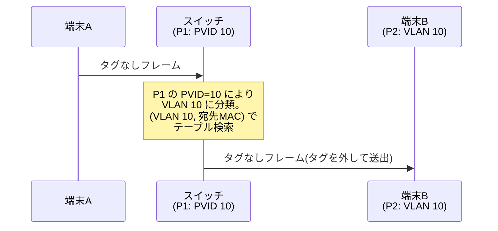

# VLAN の基礎 — ブロードキャストドメインを論理的に分割する

## 概要

この章では、VLAN(Virtual LAN)が「何のために存在し、どういう仕組みで動くのか」を、
IEEE 802.1Q の仕様に基づいて学ぶ。前提知識は
[L2/L3 の役割分担の章](../01_fundamentals/01_l2_l3_recap.md) で扱った
透過的ブリッジング(学習・転送・フラッディング)とブロードキャストドメインの概念である。
第2部はこの章から VXLAN・EVPN へと積み上がっていくため、
「VLAN = ブロードキャストドメインの論理分割」という土台をここで固める。

## 導入 — そもそも何のための技術か

### 復習: スイッチ1台 = ブロードキャストドメイン1つ

[L2/L3 の役割分担の章](../01_fundamentals/01_l2_l3_recap.md) で見たとおり、
L2 スイッチは透過的ブリッジングで動く。宛先 MAC アドレスが未学習のフレーム
(unknown unicast)とブロードキャストは、受信ポート以外の**全ポート**へ
フラッディングされる。つまり、スイッチを何台カスケード接続しても、
その全体が1つのブロードキャストドメインである。

このままネットワークを成長させると、次の3つの問題に突き当たる。

**問題1: ブロードキャストの氾濫が規模に比例して悪化する。**
ARP 要求、DHCP Discover、各種ディスカバリプロトコル——ブロードキャストドメイン内の
端末はすべて、他の全端末のブロードキャストを受信して処理(少なくとも破棄の判断)を
しなければならない。端末が数百台を超えると、誰も宛先でないトラフィックの処理が
無視できない負荷になり、ループや故障 NIC によるブロードキャストストームの影響範囲も
ドメイン全体に及ぶ。

**問題2: ポリシー境界を物理配線でしか引けない。**
経理部門のサーバと来客用端末が同じ L2 セグメントにいる場合、両者は
ルータを介さず直接通信できてしまう。L3 以上のアクセス制御(フィルタリング)を
かけたくても、同一セグメント内の通信はルータを通らないため制御点がない。
「通信を分けたい単位」と「物理的にどのスイッチに挿さっているか」は本来無関係なのに、
分割の手段が物理しかないと両者が癒着する。

**問題3: 分割のコストが物理機材のコストになる。**
スイッチを部門ごとに買い分ければ分割はできる。しかし 48 ポートのスイッチに
経理3台・開発5台をつなぐために2台のスイッチを置くのは明らかに無駄であり、
組織変更のたびに配線をやり直すことになる。

### VLAN: スイッチの「内側」に仮想的なスイッチを複数作る

VLAN はこの3つの問題を、**1台の物理スイッチを複数の論理スイッチに分割する**ことで
解決する。ポートごとに「このポートは VLAN 10」「このポートは VLAN 20」と所属を与えると、
スイッチは VLAN が異なるポート間ではフレームを一切転送しない。
学習もフラッディングも VLAN ごとに独立して行われる。

```text
        物理的には1台のスイッチ
+---------------------------------------------+
|                                             |
|   VLAN 10(経理)        VLAN 20(開発)    |
|  +---------------+     +---------------+    |
|  | P1  P2  P3    |     | P4  P5  P6    |    |
|  +--|---|---|----+     +--|---|---|----+    |
+-----|---|---|-------------|---|---|---------+
      |   |   |             |   |   |
     経理端末群            開発端末群

  VLAN 10 のブロードキャストは P1〜P3 にしか届かない。
  P1 の端末から P4 の端末へは、L2 では絶対に到達できない。
```

重要なのは、**VLAN の分割は「性能の分割」である以前に「到達可能性の分割」である**
という点だ。VLAN 10 と VLAN 20 の間には、ケーブルが物理的につながっていないのと
同じ断絶がある。両者を通信させたければ、物理的に別のスイッチをつなぐときと同様に
ルータ(L3)を経由させるしかない。この「L2 の断絶を L3 で意図的に橋渡しする」構図が、
アクセス制御の挿入点を生む。VLAN が単なる省コスト技術ではなく
**セグメンテーション(ポリシー境界の設計)の基本単位**とされるのはこのためである。

なお、この章では1台のスイッチ内での VLAN を扱う。VLAN を複数スイッチに
またがらせるための仕組み(トランキング)は
[次章](02_trunking_native_vlan.md) で扱う。

## 理論

### IEEE 802.1Q — VLAN の標準仕様

VLAN の標準は IETF の RFC ではなく、IEEE 802 委員会の **IEEE 802.1Q** で定義されている
(初版は IEEE 802.1Q-1998。ブリッジング全般を定めていた IEEE 802.1D は
2014 年の改訂で 802.1Q に統合され、現行版は IEEE 802.1Q-2022)。
つまり現在の 802.1Q は「VLAN タグの仕様書」ではなく、
MAC 学習やフラッディングを含む **L2 ブリッジング全体の仕様書**であり、
VLAN はその中核機能として定義されている。

802.1Q が定める VLAN の本質は、次の2点に要約できる。

1. **フレームの所属 VLAN を識別する 12 ビットの値 = VID(VLAN Identifier)を定義する**
2. **ブリッジの全動作(学習・転送・フラッディング)を VID ごとに分離する**

### なぜ「ポートの設定」だけでなく「フレームへのタグ」が必要か

ポートごとに所属 VLAN を決めるだけなら、スイッチ内部の設定情報で完結する。
フレーム自体は通常の Ethernet フレームのままでよい。実際、端末を収容するポートでは
そのように動く(後述するアクセスポート)。

しかし 802.1Q は、フレーム自体に VID を書き込む**タグ**という仕組みも定義している。
なぜフレームに所属を持たせる必要があるのか。

答えは「**1本のリンクに複数の VLAN のフレームを混在させる**」ためである。
スイッチ間を接続するリンクを考えると、VLAN ごとに物理ケーブルを1本ずつ
張っていては、VLAN の数だけポートを消費してしまい、
「物理から論理を独立させる」という VLAN の目的自体が損なわれる。
1本のリンクで全 VLAN を運び、受信側が各フレームの所属を判別できるようにするには、
フレーム自身が「私は VLAN 10 のフレームです」と名乗る必要がある。
これがタグの役割である(タグ付きリンクの運用の詳細は
[次章](02_trunking_native_vlan.md) で扱う)。

ここには第1部から繰り返し見てきた設計原理が現れている。
[カプセル化](../01_fundamentals/01_l2_l3_recap.md) と同じく、
**転送に必要なメタ情報は装置の設定ではなくデータ自身に載せる**ことで、
経路上の各装置が自律的に(互いの設定を知らずに)正しく処理できるようになる。

### MAC 学習の分離 — MAC アドレステーブルのキーは (VLAN, MAC) になる

VLAN を導入したスイッチでは、MAC アドレステーブルの検索キーが
MAC アドレス単体から **(VLAN, MAC アドレス)の組**に変わる。
これは単なる実装詳細ではなく、VLAN の分離を成立させる核心である。

もし学習が VLAN をまたいで共有されていたら、VLAN 10 で学習した
MAC アドレス A への経路情報が VLAN 20 のフレーム転送に流用され、
分離が破れてしまう。802.1Q はこれを FID(Filtering Identifier)という概念で定式化し、
VLAN ごとに独立の学習空間を割り当てる方式を
**IVL(Independent VLAN Learning、独立 VLAN 学習)**、
複数 VLAN で学習空間を共有する方式を
**SVL(Shared VLAN Learning、共有 VLAN 学習)**と呼ぶ。
現在のスイッチは原則 IVL で動作する。

IVL の帰結として、**同一の MAC アドレスが VLAN ごとに別のポートで学習されていても
矛盾しない**。トラブルシューティングで MAC アドレステーブルを調べるときは、
必ず VLAN を指定して引く癖をつけること(単に「MAC A はどのポートか」ではなく
「VLAN 10 において MAC A はどのポートか」が正しい問いである)。

### ブロードキャストドメイン単位としての VLAN と、L3 との対応

VLAN ごとに学習・転送・フラッディングが分離される結果、
**1 VLAN = 1 ブロードキャストドメイン**が成立する。
[第1部](../01_fundamentals/01_l2_l3_recap.md) で「ブロードキャストドメインは
ルータまたは VLAN で分割される」と述べたのは、正確にはこのことである。

実務上、この対応は設計の基本文法になる:

- **1 VLAN = 1 ブロードキャストドメイン = 1 IPサブネット**

VLAN 10 に 192.0.2.0/24、VLAN 20 に 198.51.100.0/24 のように、
VLAN と IP サブネットを 1:1 に対応させる。異なる VLAN 間の通信は
必ずルータを経由するため、ARP の到達範囲([第1部01章](../01_fundamentals/01_l2_l3_recap.md)
参照)とサブネットの範囲と VLAN の範囲が一致し、L2 と L3 の境界が揃う。
この対応が崩れている(1つの VLAN に複数サブネットが同居する、
同一サブネットが複数 VLAN に分断されている)ネットワークは、
動くことは動くが、障害解析が著しく難しくなる。

### VLAN 間ルーティング — 分離した上で、制御された橋を架ける

VLAN 間の通信はルータを経由する。ルータの置き方には歴史的に2形態ある。

1. **外付けルータ方式(router-on-a-stick)**: スイッチとルータをタグ付きリンク1本で
   接続し、ルータ側に VLAN ごとの論理サブインタフェースを作る。VLAN 10 の端末から
   VLAN 20 の端末への通信は、スイッチ → ルータ → スイッチと同じリンクを2回通る。
2. **L3 スイッチの SVI(Switched Virtual Interface)方式**: スイッチ自身が
   ルーティング機能を持ち、VLAN ごとに仮想的な L3 インタフェース(SVI)を持つ。
   SVI はその VLAN に「内側から挿さったルータのポート」として振る舞い、
   端末はその IP アドレスをデフォルトゲートウェイに指定する。現在の主流はこちらである。

どちらの形態でも本質は同じで、**VLAN 間の通信は必ず L3 の転送処理
(ロンゲストマッチ、TTL 減算、L2 ヘッダ書き換え)を通る**。
[第1部01章のパケットウォークスルー](../01_fundamentals/01_l2_l3_recap.md) で見た
「異なるサブネット間の通信」とまったく同じ処理が、1台の筐体の中で起こる。
ここがアクセス制御(パケットフィルタ)の自然な挿入点になる。

## プロトコル動作の詳細

### 802.1Q タグのフォーマット

802.1Q タグは 4 オクテットで、Ethernet ヘッダの**送信元 MAC アドレスの直後**に挿入される。

```text
タグなしフレーム:
+----------------+----------------+-----------+---------------------+-----+
| 宛先MAC (6)    | 送信元MAC (6)  | Type (2)  | ペイロード          | FCS |
+----------------+----------------+-----------+---------------------+-----+

タグ付きフレーム:
+----------------+----------------+===========+===========+-----------+---------------------+-----+
| 宛先MAC (6)    | 送信元MAC (6)  | TPID (2)  | TCI (2)   | Type (2)  | ペイロード          | FCS |
+----------------+----------------+===========+===========+-----------+---------------------+-----+
                                   \____ 802.1Q タグ ____/
```

タグの内部構造は次のとおり。

```text
 0                   1
 0 1 2 3 4 5 6 7 8 9 0 1 2 3 4 5
+-+-+-+-+-+-+-+-+-+-+-+-+-+-+-+-+
|      TPID = 0x8100            |  Tag Protocol Identifier(2オクテット)
+-+-+-+-+-+-+-+-+-+-+-+-+-+-+-+-+
| PCP |D|                       |
|(3b) |E|   VID(12ビット)      |  TCI: Tag Control Information(2オクテット)
|     |I|                       |
+-+-+-+-+-+-+-+-+-+-+-+-+-+-+-+-+
```

- **TPID(Tag Protocol Identifier、2オクテット)**: 値は **0x8100**。
  この位置は本来 EtherType が入る場所であり、受信側は
  [第1部01章](../01_fundamentals/01_l2_l3_recap.md) で見た EtherType の
  次ヘッダ連鎖の仕組みそのままに、「0x8100 = この後に TCI が続き、
  その後に本来の EtherType が続く」と解釈する。
  タグは既存のフレーム構造に対する後方互換な拡張として設計されている。
- **PCP(Priority Code Point、3ビット)**: 優先度 0〜7。L2 レベルの QoS
  (かつて IEEE 802.1p と呼ばれた仕組み)に使われる。VLAN 分離とは独立の機能である。
- **DEI(Drop Eligible Indicator、1ビット)**: 輻輳時に優先的に廃棄してよい
  フレームであることを示す。初版の 802.1Q では CFI(Canonical Format Indicator、
  トークンリングとの互換用)と定義されていたが、トークンリングの退場に伴い
  現行仕様で DEI に再定義された。
- **VID(VLAN Identifier、12ビット)**: 所属 VLAN の識別子。0〜4095 の 4096 値のうち、
  **0 と 4095(0xFFF)は予約**されており、VLAN の識別に使えるのは **1〜4094** である。
  - **VID 0**: 「優先度タグ付きフレーム(priority-tagged frame)」を意味する。
    タグは PCP を運ぶためだけに付いており、所属 VLAN はタグなしフレームと
    同じ規則で決める、という指示になる。
  - **VID 4095**: 予約値。実装内部のワイルドカード等に使われ、フレームには載らない。

この **12 ビット = 最大 4094 VLAN** という上限は、この後の章で繰り返し登場する
重要な制約である。1つのデータセンターに数万テナントを収容したい、という要求の前では
4094 はまったく足りない。この制約こそが
[VXLAN](03_vxlan_fundamentals.md) が
24 ビットの識別子(約 1677 万)を導入する直接の動機になる。

### フレーム長への影響

タグの挿入によりフレームは 4 オクテット伸びる。Ethernet の最大フレーム長は
タグなしの 1518 オクテットに対し、タグ付きでは **1522 オクテット**となる
(この拡張は IEEE 802.3ac として標準化され、現在は IEEE 802.3 本体に統合済み)。
ペイロードの最大長([MTU](../01_fundamentals/01_l2_l3_recap.md))は 1500 のまま変わらない。

古い機器がタグ付きフレームを「1518 を超える不正フレーム」として廃棄する問題は
現在ではまず遭遇しないが、「カプセル化・タグ付けはフレームを太らせ、
経路上の全リンクがそれを許容する必要がある」という構図は、
VXLAN(50 オクテット増)や MPLS(ラベルごとに 4 オクテット増)で
より深刻な形で再登場する。ここで覚えておいてほしい。

### アクセスポートと PVID — タグの付け外しの境界

端末を収容するポートでは、端末に 802.1Q を意識させない。
端末はタグなしの通常フレームを送受信し、タグの付け外しはスイッチが行う。
このように**タグなしフレームだけを扱い、単一の VLAN に属するポート**を
**アクセスポート**(802.1Q の用語では untagged なメンバーポート)と呼ぶ。

動作は入方向と出方向で対になっている。

- **入方向(端末 → スイッチ)**: 受信したタグなしフレームを、そのポートに設定された
  **PVID(Port VLAN Identifier)**の VLAN に所属するものとして分類する。
  以後スイッチ内部では「VLAN 10 のフレーム」として扱われる。
- **出方向(スイッチ → 端末)**: その VLAN のフレームをこのポートから送出するとき、
  タグを外して(untagged で)送る。



つまりタグは**スイッチ(群)の内部だけで意味を持つ管理情報**であり、
端末から見えるネットワークは第1部で学んだ普通の Ethernet のままである。
透過的ブリッジングの「透過」の性質は VLAN 導入後も保たれている。

### フレームウォークスルー — 学習・転送・フラッディングの VLAN 分離

次のトポロジで、VLAN による分離が透過的ブリッジングの3動作
それぞれにどう作用するかを追う。

```text
            +---------------------------+
            |         スイッチ          |
            |  P1     P2     P3     P4  |
            | (10)   (10)   (20)   (20) |   ← 括弧内は PVID
            +--|------|------|------|---+
               |      |      |      |
               A      B      C      D
          全端末が同じサブネット 192.0.2.0/24 を名乗っているとする
```

**ケース1: A → B(同一 VLAN 内のユニキャスト)**

1. A がタグなしフレームを送信。P1 で受信され、PVID により VLAN 10 に分類される。
2. スイッチは送信元を学習する: (VLAN 10, MAC A) → P1。
3. 宛先 MAC B を (VLAN 10, MAC B) で検索。学習済みなら P2 へ転送、
   未学習なら **VLAN 10 のメンバーポートだけ**(この場合 P2 のみ)へフラッディング。
   P3・P4 には unknown unicast すら届かない。

**ケース2: A がブロードキャストを送る(例: ARP 要求)**

1. VLAN 10 に分類されたブロードキャストは、VLAN 10 のメンバーポートである
   P2 だけに複製される。C・D は同じサブネットの IP アドレスを持っていても
   ARP 要求を受信しない。

**ケース3: A → C(VLAN をまたぐ試み)**

1. A と C は同一サブネットのアドレスを持つため、A は C を「同一セグメント」と
   判断し、C の MAC アドレスを ARP で解決しようとする。
2. しかし ARP 要求(ブロードキャスト)は VLAN 10 内にしか流れず、C には届かない。
   **ARP 解決の段階で失敗し、通信は一切成立しない。**
3. これは故障ではなく、VLAN の設計どおりの動作である。A と C を通信させたければ、
   両者を別サブネットにした上でルータ(SVI)を経由させるのが正しい構成となる。

ケース3は、トラブルシューティングの章で述べる「同じサブネットなのに通信できない」
症状の最も典型的な原因であると同時に、「L2 の到達可能性(VLAN)と
L3 のアドレス設計(サブネット)は独立のレイヤであり、両者を揃えるのは
設計者の責任である」ことを示している。

## 設定例 — Linux bridge で VLAN の内部動作を観察する

原理の確認には、VLAN の各概念がコマンドに1対1で現れる Linux の bridge が適している
(以下は Linux の iproute2 での例)。

```bash
# VLAN フィルタリングを有効にしたブリッジを作成
ip link add br0 type bridge vlan_filtering 1
ip link set br0 up

# 物理ポートをブリッジに参加させる
ip link set eth1 master br0    # 端末A を収容するポート
ip link set eth2 master br0    # 端末C を収容するポート

# eth1 をアクセスポートとして VLAN 10 に、eth2 を VLAN 20 に割り当てる
#   pvid     … 受信したタグなしフレームを VLAN 10 に分類(入方向)
#   untagged … VLAN 10 のフレームをタグを外して送出(出方向)
bridge vlan add dev eth1 vid 10 pvid untagged
bridge vlan add dev eth2 vid 20 pvid untagged
```

設定の確認と、MAC 学習が VLAN 単位であることの観察:

```bash
$ bridge vlan show
port    vlan-id
eth1    10 PVID Egress Untagged
eth2    20 PVID Egress Untagged

$ bridge fdb show br br0 | grep -v permanent
aa:bb:cc:00:00:01 dev eth1 vlan 10 master br0    ← 学習エントリに vlan が付く
aa:bb:cc:00:00:03 dev eth2 vlan 20 master br0
```

`bridge vlan add` の `pvid` と `untagged` が**別々のフラグ**である点に注目してほしい。
本文で述べた「入方向の分類(PVID)」と「出方向のタグ除去(untagged)」が
独立した動作であることが、コマンド体系にそのまま反映されている。
アクセスポートとは「この2つを同じ VLAN に設定したポート」の慣用名にすぎない。

## トラブルシューティング

### 症状1: 同じサブネットなのに特定の端末とだけ通信できない

最頻出のパターン。まず疑うべきは **VLAN 割り当ての不一致**である
(片方のポートだけ違う VLAN に設定されている、配線変更でポートがずれた、など)。

切り分けの手順:

1. 通信できない2端末それぞれについて、収容ポートの PVID / VLAN メンバーシップを確認する。
2. 送信側で ARP テーブルを見る(`ip neigh`)。ARP が未解決(incomplete)なら、
   そもそもブロードキャストが相手に届いていない=L2 で分断されている可能性が高い。
3. スイッチの MAC アドレステーブルを **VLAN を指定して**確認する。
   期待した VLAN に相手の MAC が学習されているか。
   別 VLAN に学習されていれば、それが答えである。

### 症状2: tcpdump でタグが見えない/見え方が期待と違う

タグ付きフレームを観察するとき、tcpdump では `vlan` フィルタを使う:

```bash
tcpdump -e -i eth0 vlan 10        # VLAN 10 のタグ付きフレームのみ
tcpdump -e -i eth0                # -e で L2 ヘッダ(タグ含む)を表示
```

ここで注意すべき罠が2つある。

- **アクセスポート側ではタグは絶対に見えない**。タグはスイッチが外してから
  送出するので、端末側でキャプチャしてタグが見えないのは正常である。
  タグを観察したければタグ付きリンク(次章)側でキャプチャする必要がある。
- **NIC のオフロード機能がタグを剥がすことがある**。多くの NIC は VLAN タグの
  処理をハードウェアで行い(RX VLAN offload)、OS に渡る前にタグを取り除いて
  別のメタデータとして通知する。この場合、タグ付きフレームが流れているのに
  tcpdump 上はタグなしに見える。`ethtool -k eth0 | grep vlan` でオフロードの
  状態を確認でき、`ethtool -K eth0 rxvlan off` で無効化して生のタグを観察できる。
  「キャプチャで見えない」ことと「ワイヤ上に存在しない」ことは別である。

### 症状3: ブロードキャスト起因の負荷が減らない

VLAN を導入したのにブロードキャストの氾濫が改善しない場合、
「VLAN は作ったが端末が実際にはその VLAN に分類されていない」ことを疑う。
全ポートがデフォルト VLAN(多くの実装で VID 1)のままになっていないか、
`bridge vlan show`(または各機器の同等コマンド)で全ポートの所属を棚卸しする。
なお、多くの機器でデフォルト VLAN(VID 1)は管理プロトコルにも使われるため、
**ユーザートラフィックには VID 1 を使わず、明示的に作成した VLAN を使う**のが定石である。

## 演習・確認問題

**問1.** VLAN が分割するのは「コリジョンドメイン」と「ブロードキャストドメイン」の
どちらか。また、その分割は L3 の何の単位と 1:1 に対応させるのが定石か。

**問2.** 802.1Q タグはフレームのどの位置に挿入されるか。また、タグの先頭 2 オクテット
(TPID)の値 0x8100 は、受信側にとってどのフィールドとして解釈されるか。

**問3.** VID は 12 ビットで 4096 値を表現できるが、実際に VLAN として使えるのは
4094 個である。使えない2つの値と、それぞれの意味を述べよ。

**問4.** IVL(独立 VLAN 学習)のスイッチにおいて、同一の MAC アドレスが
VLAN 10 ではポート P1、VLAN 20 ではポート P5 に学習されていた。
これは異常か。理由とともに述べよ。

**問5.** 端末 A(VLAN 10)と端末 C(VLAN 20)に同一サブネットの IP アドレスを
設定した。A から C への ping はどの段階で、どのように失敗するか。
パケットの流れに沿って説明せよ。

---

**解答**

**問1.** ブロードキャストドメイン。1 VLAN = 1 ブロードキャストドメイン = 1 IP サブネット
に対応させるのが定石である(コリジョンドメインは全二重スイッチ環境では
ポートごとに分割済みであり、VLAN とは無関係)。

**問2.** 送信元 MAC アドレスの直後(本来 EtherType が置かれる位置)。
受信側は 0x8100 を EtherType として読み、「802.1Q タグが続く」ことを知る。
EtherType による次ヘッダ連鎖の仕組みを流用した後方互換な拡張である。

**問3.** VID 0 は優先度タグ付きフレーム(タグは PCP のみ有効で、所属 VLAN は
タグなしフレームと同じ規則で決める)。VID 4095(0xFFF)は予約値で、
フレーム上には現れない。

**問4.** 正常である。IVL では MAC アドレステーブルのキーは (VLAN, MAC) の組であり、
学習は VLAN ごとに独立している。同一 MAC が VLAN ごとに異なるポートで
学習されることは仕様上想定された状態である。

**問5.** A は宛先 C を同一サブネットと判断し、C の MAC アドレスを解決するため
ARP 要求(ブロードキャスト)を送る。しかしこのブロードキャストは VLAN 10 の
メンバーポートにしかフラッディングされず、VLAN 20 の C には届かない。
よって ARP 解決の段階で失敗し(ARP テーブルに incomplete が残る)、
ICMP Echo はそもそも送信されない。

## まとめ

- VLAN は1台のスイッチを複数の論理スイッチに分割し、
  **1 VLAN = 1 ブロードキャストドメイン = 1 IP サブネット**という設計単位を作る。
  分割の本質は性能ではなく**到達可能性の分離**であり、VLAN 間の通信は必ず L3 を経由する。
- 仕様は **IEEE 802.1Q**。フレームの所属は 12 ビットの VID で識別され、
  使用可能な VLAN は 1〜4094。この上限が後の VXLAN の直接の動機になる。
- タグ(TPID 0x8100 + TCI)は EtherType の連鎖を流用した後方互換な拡張で、
  スイッチ群の内部だけで使われる。アクセスポートでは PVID による入方向の分類と
  出方向のタグ除去が行われ、端末はタグを見ない。
- MAC 学習は (VLAN, MAC) をキーに VLAN ごと独立(IVL)。
  調査の際は必ず VLAN を指定してテーブルを引く。
