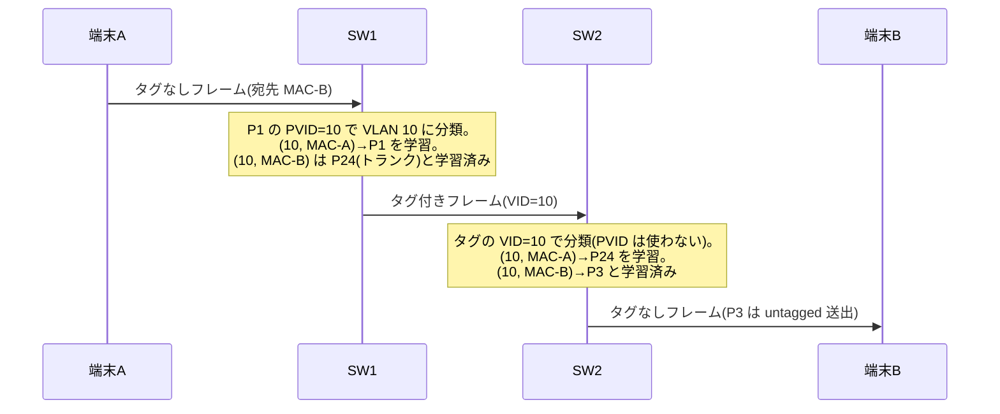

# トランキングとネイティブ VLAN — VLAN を複数スイッチにまたがらせる

## 概要

この章では、1本のリンクに複数の VLAN のフレームを混在させる**トランキング**と、
トランク上でタグなしフレームを扱う**ネイティブ VLAN** の仕組みを学ぶ。
前提知識は [前章](01_vlan_basics.md) で扱った 802.1Q タグのフォーマットと、
PVID(入方向の分類)/ untagged(出方向のタグ除去)が独立した属性であるという理解である。
章の後半では、タグを二重に積む 802.1ad(QinQ)まで進み、
[VXLAN(後述: `03_vxlan_fundamentals.md`)](03_vxlan_fundamentals.md) への橋を架ける。

## 導入 — そもそも何のための仕組みか

### VLAN 10 が2台のスイッチに散らばったら

[前章](01_vlan_basics.md) では1台のスイッチ内での VLAN を扱った。
しかし現実のネットワークでは、同じ VLAN に所属させたい端末が
複数のスイッチに分かれて収容される(経理部門がフロアをまたぐ、など)。
VLAN 10 というブロードキャストドメインを、スイッチ2台にまたがる
1つのドメインとして機能させるにはどうすればよいか。

素朴な解は「VLAN ごとにスイッチ間ケーブルを1本張る」である。

```text
   素朴な解: VLAN ごとに物理リンクを張る          トランク: 1本に多重する

  +--------+  VLAN10 用  +--------+           +--------+   タグ付き   +--------+
  |  SW1   |=============|  SW2   |           |  SW1   |==============|  SW2   |
  |        |  VLAN20 用  |        |           |        | VLAN10,20,30 |        |
  |        |=============|        |           +--------+  が1本に混在 +--------+
  |        |  VLAN30 用  |        |
  |        |=============|        |
  +--------+             +--------+
   VLAN の数だけポートを消費する
```

これは動作はするが、VLAN の数だけ両側のポートとケーブルを消費する。
VLAN が「物理から論理を独立させる」ための技術だったのに、
VLAN を増やすたびに物理配線が増えるのでは本末転倒である。

そこで、[前章](01_vlan_basics.md) で学んだ **802.1Q タグ**の出番になる。
フレーム自身が「私は VLAN 10 のフレームです」と名乗れるのだから、
1本のリンクに複数 VLAN のフレームを混在させ、受信側がタグを見て
仕分ければよい。このように**複数 VLAN のタグ付きフレームを運ぶリンク(ポート)の
運用形態**を、慣用的に**トランク(trunk)**と呼ぶ。

トランクにより、スイッチ間リンクは「全 VLAN の共有幹線」になる。
VLAN の追加・変更はスイッチの設定だけで完結し、配線には手を触れない——
VLAN の目的である「物理と論理の分離」が、スイッチをまたいでも維持される。

## 理論

### 802.1Q の形式モデル — すべては「VLAN ごとのメンバーシップ + タグの有無」

トランクとアクセスポートを別々の仕組みとして暗記する前に、
802.1Q が定める形式モデルを押さえておくと見通しがよい。
802.1Q の世界では「アクセスポート」「トランクポート」という区別は実は存在せず、
すべてのポートは次の属性の組み合わせで記述される。

- **VLAN ごとのメンバーシップ**: このポートは VLAN X のメンバーか
  (メンバーでない VLAN のフレームは、このポートから送出されない)
- **VLAN ごとの出方向タグ規則**: VLAN X のフレームをこのポートから送出するとき、
  タグを付ける(tagged)か外す(untagged)か
- **PVID**: 受信したタグなしフレームをどの VLAN に分類するか(ポートごとに1つ)

この語彙で書き直すと、いわゆるアクセスポートとトランクポートは
同じ原始概念の**設定パターンの慣用名**にすぎないことが分かる。

| 慣用名 | メンバーシップ | 出方向 | PVID |
|---|---|---|---|
| アクセスポート(VLAN 10) | VLAN 10 のみ | VLAN 10 を untagged | 10 |
| トランクポート | VLAN 10, 20, 30, … | 各 VLAN を tagged | (ネイティブ VLAN、後述) |

[前章](01_vlan_basics.md) の Linux bridge の設定例で `pvid` と `untagged` が
別フラグだったことを思い出してほしい。あの分解がそのまま、
アクセスとトランクの両方を説明する共通の語彙になっている。

なお「トランク」という語は 802.1Q の仕様には登場しない。
仕様上の正確な言い方は「複数 VLAN の tagged メンバーであるポート」であり、
トランクは Cisco に由来する業界の慣用名である(ベンダーによっては
tagged port と呼ぶ)。本書では通りのよさを優先して**トランクポート**を
標準表記とするが、実体が上の表のとおり属性の組み合わせであることは
常に意識しておいてほしい。実装のトラブルを解くときに効くのは慣用名ではなく
この形式モデルである。

### トランク上の MAC 学習 — テーブルには「向こう側」の MAC が並ぶ

トランクは透過的ブリッジングの例外ではない。スイッチはトランクポートでも
通常どおり (VLAN, 送信元 MAC) を学習する。その結果、SW1 の MAC アドレステーブルには
「SW2 側に収容されている端末の MAC は、すべてトランクポート向け」として学習される。

```text
  SW1 の MAC アドレステーブル(抜粋)
  VLAN   MAC        ポート
  10     MAC-A      P1        ← 自分に直収の端末
  10     MAC-B      P24(トランク) ← SW2 側の端末はすべてトランク向け
  20     MAC-C      P24(トランク)
```

1つのポートに多数の MAC が学習されているのは、その先にスイッチ
(ブロードキャストドメインの続き)がぶら下がっていることの証拠である。
この「多数の MAC が1ポートに集まって見える」という見え方は、
のちに VXLAN のトンネルインタフェースでも同じ形で再登場する。

### ネイティブ VLAN — トランク上のタグなしフレームの居場所

トランクの原則は「すべての VLAN のフレームをタグ付きで運ぶ」である。
しかし 802.1Q の形式モデルには PVID と untagged 設定がすべてのポートにあるため、
トランクポートでも「**1つの VLAN だけはタグなしで運ぶ**」構成が可能である。
この VLAN を**ネイティブ VLAN(native VLAN)**と呼ぶ。
形式モデルの言葉では、ネイティブ VLAN とは
**トランクポートの PVID(かつ untagged 送出に設定された VLAN)**のことである。

- **出方向**: ネイティブ VLAN のフレームは、タグを外してトランクへ送出される
- **入方向**: トランクで受信したタグなしフレームは、ネイティブ VLAN に分類される

なぜこのような例外が用意されているのか。設計上の理由は後方互換である。
802.1Q の導入期には、タグ付きフレームを解釈できない(それどころか
不正フレームとして廃棄する)機器がスイッチ間に挟まることがあった。
タグなしでも流れる VLAN を1つ確保しておけば、タグ非対応の機器と
タグ対応スイッチを同じリンクに共存させて段階的に移行できる。
また、標準のスパニングツリープロトコル(STP)の BPDU のように、
特定の VLAN に属さない L2 制御プロトコルのフレームはタグなしで送受信される
慣例があり、ネイティブ VLAN はそうしたフレームの通り道にもなる
(STP 自体は本書では主題として扱わないが、「トランク上にはタグなしの
制御フレームも流れている」ことは覚えておいてほしい)。

重要なのは、ネイティブ VLAN が**リンクの両端で一致していなければならない**
という点である。タグなしフレームには所属を示す情報が載っていないため、
その解釈は両端の PVID 設定という「装置側の暗黙の合意」だけに依存する。
[前章](01_vlan_basics.md) で見た「転送に必要なメタ情報はデータ自身に載せる」という
設計原理から、ネイティブ VLAN は意図的に外れた例外なのである。
合意が破れたとき(両端で PVID が異なるとき)に何が起こるかは、
トラブルシューティングの節で詳しく見る。

この性質のため、現在の設計の定石は次のいずれかである。

1. **ネイティブ VLAN に未使用の VLAN を割り当てる**: ユーザートラフィックを
   一切載せない専用 VID(かつ VID 1 は避ける)をネイティブにする。
   タグなしフレームが「どこにも届かない」ことを保証する。
2. **ネイティブ VLAN もタグ付きで送る**: 多くの実装にはネイティブ VLAN を
   含む全フレームをタグ付きで送出するオプションがある。例外をなくし、
   トランク上のタグなしフレームを実質的に排除する。

### 許可 VLAN リスト — トランクに「全部載せ」しない

デフォルト設定のトランクは、スイッチに存在するすべての VLAN を運ぶ実装が多い。
しかしトランクが VLAN X のメンバーであるということは、
**VLAN X のブロードキャストドメインがそのリンクの先まで延長される**ということである。

- VLAN X のブロードキャスト・unknown unicast のフラッディングが
  トランクを越えて流れ、不要なスイッチの帯域と処理を消費する
- VLAN X で起きたブロードキャストストームや MAC アドレステーブルあふれの
  影響範囲(障害ドメイン)が、トランクでつながる全スイッチに広がる

そこで、トランクごとに「運ぶ VLAN の集合」を明示的に絞るのが定石である。
これを慣用的に**許可 VLAN リスト(allowed VLAN list)**と呼ぶ。
形式モデルの言葉では、トランクポートのメンバーシップを必要な VLAN だけに
限定することに相当する。「その VLAN の端末が実際にいるスイッチへ向かう
トランクにだけ、その VLAN を載せる」——ブロードキャストドメインの
地理的範囲を設計図どおりに制限する、L2 設計の基本動作である。

なお、許可リストも両端で一致している必要がある。片端だけが VLAN 30 を
許可しているトランクでは、VLAN 30 のフレームは一方向にしか流れない
(実際には受信側の入方向フィルタリングで廃棄される。後述)。

### 802.1ad(QinQ)— タグを二重に積む

802.1Q タグは1段と決まっているわけではない。**IEEE 802.1ad**
(2005 年の追補として標準化され、現在は 802.1Q 本体に統合)は、
タグの外側にもう1段タグを積む**プロバイダブリッジング**を定義する。
通称 **QinQ** である。

想定場面は通信事業者の広域 Ethernet サービスである。事業者は多数の顧客の
L2 トラフィックを自網で運ぶが、顧客はそれぞれ自分の VLAN(1〜4094)を
自由に使っている。顧客 A の VLAN 10 と顧客 B の VLAN 10 を混ぜずに運ぶには、
顧客のタグ(**C-TAG**、Customer VLAN tag)には手を触れず、
事業者網の入口で顧客識別用のタグ(**S-TAG**、Service VLAN tag)を外側に押し込み、
出口で外せばよい。

```text
 顧客網内:
 +--------+--------+----------------+------+----------------+-----+
 | 宛先MAC| 送信元 | C-TAG          | Type | ペイロード     | FCS |
 |        | MAC    | (0x8100, VID10)|      |                |     |
 +--------+--------+----------------+------+----------------+-----+

 事業者網内(入口で S-TAG を押し込む):
 +--------+--------+=================+----------------+------+------------+-----+
 | 宛先MAC| 送信元 | S-TAG           | C-TAG          | Type | ペイロード | FCS |
 |        | MAC    | (0x88A8, 顧客A) | (0x8100, VID10)|      |            |     |
 +--------+--------+=================+----------------+------+------------+-----+
```

- S-TAG の TPID は **0x88A8** であり、C-TAG の 0x8100 と区別される
  (標準化以前の実装には 0x9100 などの独自値もあった)。
- TCI の構造(PCP / DEI / VID)は C-TAG と同じ 2 オクテットである。
  なお [前章](01_vlan_basics.md) で触れた DEI ビットは、
  この 802.1ad(2005 年)の S-TAG で最初に導入され、
  のちに 802.1Q-2011 で C-TAG 側の CFI も DEI に再定義された、という経緯を持つ。
- タグ1段につきフレームは 4 オクテット太る(2段で最大 1526 オクテット)。
  [前章](01_vlan_basics.md) の「カプセル化はフレームを太らせる」の再演である。

QinQ により識別空間は 4094 × 4094 ≒ 約 1670 万に広がる。それでも QinQ は
「多テナント L2 収容」の最終解にはならなかった。S-TAG を積んでも
フレームの転送自体は透過的ブリッジングのままなので、**事業者網の中継スイッチは
全顧客の端末の MAC アドレスを学習しなければならず**、フラッディングも
事業者網全体に及ぶ。識別子の数ではなく、**L2 の学習・フラッディングという
動作原理そのものが規模の壁になる**——この認識が、L3 ネットワークの上に
L2 をトンネルする [VXLAN(後述: `03_vxlan_fundamentals.md`)](03_vxlan_fundamentals.md)
へ進む動機である。

## プロトコル動作の詳細

### フレームウォークスルー — スイッチをまたぐ同一 VLAN 通信

端末 A(SW1 の P1、VLAN 10)から端末 B(SW2 の P3、VLAN 10)への
ユニキャストを追う。SW1-SW2 間はトランク(両端とも VLAN 10, 20 を tagged)である。

```text
        SW1                                SW2
  +---------------+     トランク     +---------------+
  | P1(acc,10)    |==================| P3(acc,10)    |
  | P2(acc,20)    | P24          P24 | P4(acc,20)    |
  +--|---------|--+                  +--|---------|--+
     |         |                        |         |
     A(VLAN10) C(VLAN20)                B(VLAN10) D(VLAN20)
```



1. A はタグなしフレームを送信する。SW1 は P1 の PVID により VLAN 10 に分類し、
   (VLAN 10, MAC-A) → P1 を学習する。
2. 宛先 (VLAN 10, MAC-B) はトランクポート P24 に学習済みなので、P24 へ転送する。
   P24 では VLAN 10 は tagged 送出なので、**ここで初めて VID=10 のタグが付く**。
3. SW2 は P24 でタグ付きフレームを受信する。**タグがあるので PVID は参照せず**、
   タグの VID=10 で分類する。(VLAN 10, MAC-A) → P24 を学習する
   (SW2 から見ると A はトランクの向こう側にいる)。
4. 宛先 (VLAN 10, MAC-B) は P3 に学習済み。P3 は VLAN 10 を untagged 送出する
   アクセスポートなので、**タグを外して**B へ送る。

タグの一生に注目してほしい。タグは SW1 のトランク送出時に生まれ、
SW2 のアクセスポート送出時に消える。**タグが存在するのはトランク上だけ**であり、
端末 A・B はタグの存在をまったく知らない。前章で述べた
「タグはスイッチ群の内部だけで意味を持つ管理情報」の具体的な姿である。

もし宛先 MAC-B が未学習なら、SW1 は VLAN 10 のメンバーポート
(P1 を除く: つまり P24)へフラッディングし、SW2 も VLAN 10 の
メンバーポートへフラッディングする。**フラッディングの範囲 =
「その VLAN のメンバーポートの集合」がトランクを介して連結されたもの**であり、
これがまさに「ブロードキャストドメインがスイッチをまたいで延長された」状態である。
許可 VLAN リストで絞るのは、この連結の範囲にほかならない。

### 入方向の規則 — 分類とフィルタリング

トランクポートの入方向動作を正確に書くと、802.1Q は2段階の規則を定めている。

**第1段階: 分類(どの VLAN のフレームとみなすか)**

| 受信フレーム | 分類 |
|---|---|
| タグ付き(VID = 1〜4094) | タグの VID |
| タグなし | PVID(= ネイティブ VLAN) |
| 優先度タグ付き(VID = 0) | PVID(タグの PCP のみ利用) |

**第2段階: 入方向フィルタリング(受け入れるか)**

分類された VLAN のメンバーでないポートで受信したフレームを廃棄する機能を
**ingress filtering** と呼ぶ。802.1Q ではポートごとの設定項目だが、
現在の実装では有効が通常である(Linux bridge の `vlan_filtering` も
メンバーでない VID のフレームを廃棄する)。
「片端だけが VLAN 30 を許可したトランク」で VLAN 30 が通らないのは、
この段階で捨てられるためである。

このほか、受け入れるフレーム種別自体を制限するパラメータ
(すべて受け入れる / タグ付きのみ / タグなし・優先度タグ付きのみ)も
802.1Q には定義されている。「タグ付きのみ」に設定したトランクは、
タグなしフレームを一切受け入れない——ネイティブ VLAN の入方向を
閉じることに相当し、前述の「ネイティブ VLAN を排除する」設計と組み合わせて使われる。

### ネイティブ VLAN 不一致 — 暗黙の合意が破れると VLAN が「混線」する

ネイティブ VLAN の危うさを具体的に見る。SW1 側のトランクはネイティブ VLAN 10、
SW2 側は誤ってネイティブ VLAN 20 に設定されているとする。

1. SW1 は VLAN 10 のフレームを(ネイティブなので)**タグなしで**送出する。
2. SW2 はタグなしフレームを受信し、自分の PVID に従って **VLAN 20 に分類**する。
3. 結果、SW1 側の VLAN 10 の端末が送ったブロードキャストが、
   SW2 側では VLAN 20 の端末に届く。**分離されているはずの2つの
   ブロードキャストドメインが、一方向に漏れる形でつながってしまう。**

逆方向(SW2 の VLAN 20 → SW1 では VLAN 10 に分類)も同時に起こるため、
症状は「VLAN 10 と VLAN 20 の混線」として現れる。しかも
[前章](01_vlan_basics.md) のケース3で見たとおり、混線した両者のサブネットが
異なれば ARP は解決できず通信は成立しないので、
「ときどき変な ARP が見える」程度の不気味な症状にとどまることも多い。
分離の破れは、通信断よりずっと発見しにくい。

タグなしフレームの解釈は両端の設定の一致だけが頼りであり、
プロトコル上の検証機構はない(一部ベンダーの発見プロトコルが
不一致を警告してくれることはあるが、標準の保証ではない)。
だからこそ前述の定石——ネイティブ VLAN を使わない、または全タグ付き——が効いてくる。

### VLAN ホッピング(二重タグ攻撃)— ネイティブ VLAN 設計不備の悪用

ネイティブ VLAN の仕様を悪用した古典的な攻撃に**二重タグによる VLAN ホッピング**があり、
防御側の設計理解として知っておく価値がある。

前提条件: 攻撃者の端末が VLAN 10 のアクセスポートに収容されており、
上流トランクのネイティブ VLAN も 10 である(アクセス VLAN とネイティブ VLAN の重複)。

1. 攻撃者は、外側 VID=10、内側 VID=20 の**二重タグフレーム**を自作して送信する。
2. SW1 は外側タグの VID=10 を見てフレームを VLAN 10 に分類する。
   トランクへ送出する際、**VLAN 10 はネイティブなので外側タグを外す**。
   このとき内側の VID=20 タグは(SW1 にとってはただのペイロードなので)残る。
3. SW2 はトランクで「VID=20 のタグ付きフレーム」を受信し、
   正規の VLAN 20 のフレームとして VLAN 20 内へ転送する。
4. 結果、VLAN 10 の攻撃者が VLAN 20 へフレームを注入できた——
   L3 のアクセス制御を一切通らずに。

返りのトラフィックは攻撃者に届かない(片方向注入)が、
VLAN 分離を前提としたセキュリティ設計を破るには片方向で十分な場合がある。
対策は仕組みから自明で、**攻撃の前提条件を消す**ことである:
ネイティブ VLAN にユーザー収容 VLAN を使わない(未使用 VID を充てる)、
またはネイティブ VLAN も含めて全フレームをタグ付きで送る。
前節までに述べた設計の定石は、この攻撃への対策そのものになっている。

## 設定例 — Linux bridge でトランクを組む

[前章](01_vlan_basics.md) の Linux bridge の続きとして、
eth0 をトランクポートに仕立てる(以下は Linux の iproute2 での例)。

```bash
# 前章の状態: br0 (vlan_filtering=1) に eth1(acc,10), eth2(acc,20) が参加済み
ip link set eth0 master br0

# eth0 をトランクにする: VLAN 10, 20 を tagged メンバーとして追加
bridge vlan add dev eth0 vid 10
bridge vlan add dev eth0 vid 20

# ネイティブ VLAN を明示する場合(未使用 VID 999 を充てる定石):
bridge vlan add dev eth0 vid 999 pvid untagged
```

```bash
$ bridge vlan show
port    vlan-id
eth0    10                        ← フラグなし = tagged メンバー
        20
        999 PVID Egress Untagged  ← ネイティブ VLAN
eth1    10 PVID Egress Untagged
eth2    20 PVID Egress Untagged
```

注目してほしいのは、**トランクを作る専用コマンドが存在しない**ことである。
`bridge vlan add` に `pvid` / `untagged` フラグを付けなければ tagged メンバーに
なる——それだけでトランクができる。アクセスポート(eth1)との違いは
フラグの有無だけであり、本文の形式モデル(メンバーシップ + タグ規則 + PVID)が
コマンド体系にそのまま現れている。許可 VLAN リストに相当するのは
「`bridge vlan add` した VID の集合」であり、載せたくない VLAN は単に追加しない。

## トラブルシューティング

### 症状1: トランク越しに特定の VLAN だけ通信できない

VLAN 10 は通るのに VLAN 30 だけスイッチをまたげない、というパターン。
最有力の容疑者は**許可 VLAN リストの不一致**である。

1. トランクの**両端**で、当該 VLAN がメンバーに入っているかを確認する
   (`bridge vlan show`、または各機器の同等コマンド)。
   片端だけ許可されている場合、フレームは対向の ingress filtering で
   黙って廃棄される。廃棄はカウンタに出ないことも多く、
   「送っているのに届かない」ように見える。
2. 両端で許可されていれば、当該 VLAN の MAC 学習を確認する。
   対向側端末の MAC がトランクポートに学習されているか
   (`bridge fdb show` を VLAN 指定で)。学習されていれば L2 は通っており、
   問題は別のレイヤにある。

### 症状2: 分離したはずの VLAN 間で通信・ARP が漏れる

「VLAN 10 の端末の ARP 要求が VLAN 20 側でキャプチャされる」など、
分離の破れを示す症状が出たら、まず**ネイティブ VLAN の不一致**を疑う。
トランク両端の PVID を突き合わせて確認する。

ワイヤ上の証拠を取りたければ、トランクリンクをキャプチャして
**タグなしフレームが流れていないか**を見る。全タグ付き運用のはずの
トランクにタグなしフレームが流れていたら、どこかの設定が
ネイティブ VLAN として送出している。

```bash
# トランク上のタグなしフレームだけを観察する
tcpdump -e -i eth0 not vlan
```

### 症状3: トランクでキャプチャしたのにタグが見えない/フィルタが効かない

トランク側でのキャプチャには [前章](01_vlan_basics.md) で述べた
NIC オフロードの罠(rxvlan がタグを剥がす)がそのまま当てはまる。
`ethtool -K eth0 rxvlan off` で無効化してから観察する。

加えて tcpdump 固有の罠として、フィルタ式の `vlan` キーワードは
「以降の条件の解釈位置をタグの後ろへずらす」という副作用を持つ。

```bash
tcpdump -i eth0 icmp               # タグ付きの ICMP にはマッチしない
tcpdump -i eth0 vlan and icmp      # タグ付きの ICMP にマッチする
tcpdump -i eth0 'icmp or (vlan and icmp)'   # タグの有無両方を拾う
```

「トランクで ICMP が全然流れていないように見える」のは、
タグの 4 オクテット分だけずれた位置を ICMP として解釈しているせいかもしれない。
[前章](01_vlan_basics.md) の言葉を繰り返せば、「キャプチャで見えない」ことと
「ワイヤ上に存在しない」ことは別である。

### 症状4: 意図しないポートがトランクとして動いている

一部ベンダーのスイッチには、対向と自動交渉してポートをトランクに
昇格させる独自プロトコルがある(Cisco の DTP が代表例)。
デフォルト設定に依存すると、端末用のつもりのポートが、接続された機器の
応答次第でトランクになり、全 VLAN に触れる口が意図せず開くことがある。
定石は自動交渉に頼らないことである: **ポートの役割(アクセス/トランク)は
明示的に固定し、交渉プロトコルは無効化する**。
本章で見たとおりトランクの実体は静的な属性の組にすぎず、
交渉で決めなければならない要素はもともと存在しない。

## 演習・確認問題

**問1.** 802.1Q の形式モデル(VLAN ごとのメンバーシップ、出方向タグ規則、PVID)を
使って、「VLAN 10 のアクセスポート」と「VLAN 10, 20 を運びネイティブ VLAN が 99 の
トランクポート」をそれぞれ記述せよ。

**問2.** トランクで受信したフレームの所属 VLAN は何によって決まるか。
タグ付きの場合とタグなしの場合に分けて述べよ。

**問3.** SW1-SW2 間のトランクで、SW1 側のネイティブ VLAN が 10、SW2 側が 20 に
食い違っている。SW1 側の VLAN 10 の端末が送ったブロードキャストは、
SW2 側でどの VLAN の端末に届くか。過程とともに説明せよ。

**問4.** 二重タグによる VLAN ホッピング攻撃が成立するための前提条件を述べ、
その前提を消す設計上の対策を2つ挙げよ。

**問5.** QinQ(802.1ad)は VLAN の識別空間を約 1670 万まで広げたにもかかわらず、
大規模多テナント収容の最終解にはならなかった。識別子の数以外の理由を説明せよ。

---

**解答**

**問1.** アクセスポート: メンバーシップは VLAN 10 のみ、VLAN 10 の出方向は
untagged、PVID は 10。トランクポート: メンバーシップは VLAN 10, 20, 99、
VLAN 10, 20 の出方向は tagged、VLAN 99 の出方向は untagged、PVID は 99。

**問2.** タグ付きフレームはタグの VID で決まり、PVID は参照されない。
タグなしフレーム(および VID=0 の優先度タグ付きフレーム)は受信ポートの
PVID(トランクではネイティブ VLAN)に分類される。

**問3.** VLAN 20 の端末に届く。SW1 は VLAN 10 をネイティブとしてタグなしで
送出し、SW2 はタグなしフレームを自分の PVID である VLAN 20 に分類するため、
SW1 の VLAN 10 と SW2 の VLAN 20 が一方向につながってしまう。

**問4.** 前提条件: 攻撃者が収容されたアクセスポートの VLAN と、上流トランクの
ネイティブ VLAN が同一であること(このとき外側タグがトランクで剥がれ、
内側タグが生き残る)。対策: (1) ネイティブ VLAN にユーザー収容に使わない
未使用 VID を充てる、(2) ネイティブ VLAN を含む全フレームをタグ付きで
送出する設定にする(タグなし受信の拒否と併用)。

**問5.** S-TAG を積んでもフレーム転送は透過的ブリッジングのままであり、
事業者網(中継網)のスイッチは全顧客端末の MAC アドレスを学習し、
unknown unicast・ブロードキャストのフラッディングも網全体に及ぶ。
つまり L2 の学習・フラッディングという動作原理自体が規模の壁になるため、
識別子を増やすだけでは解決しない。この認識が VXLAN(L3 上の L2 トンネル)への
動機となった。

## まとめ

- トランクは 802.1Q タグを使って**1本のリンクに複数 VLAN を多重する**運用形態であり、
  実体は「複数 VLAN の tagged メンバーであるポート」にすぎない。アクセスポートとは
  同じ形式モデル(メンバーシップ + 出方向タグ規則 + PVID)の設定パターン違いである。
- タグはトランク送出時に付き、アクセスポート送出時に外れる。
  **タグが存在するのはトランク上だけ**で、端末は関知しない。
- ネイティブ VLAN はトランク上でタグなしのまま運ばれる例外(= トランクの PVID)。
  両端の暗黙の一致に依存するため、不一致は VLAN の混線、設計不備は
  VLAN ホッピングを招く。定石は未使用 VID の割り当てか全タグ付き運用。
- トランクに載せる VLAN は許可 VLAN リストで絞る。トランクのメンバーシップは
  ブロードキャストドメイン(と障害ドメイン)の延長範囲そのものである。
- 802.1ad(QinQ)はタグを二重化して識別空間を広げたが、L2 の学習・フラッディング
  という原理的な壁は残った。この壁を越えるのが次章以降の VXLAN である。
