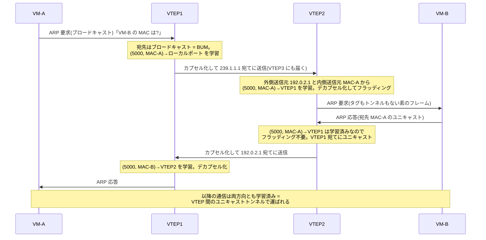

# VXLAN の基礎 — L3 ネットワークの上に L2 セグメントを建てる

## 概要

この章では、L3(IP)ネットワークの上に仮想的な L2 セグメントをトンネルとして構築する
**VXLAN**(Virtual eXtensible Local Area Network、**RFC 7348**)を学ぶ。
前提知識は、[前章](02_trunking_native_vlan.md) までの 802.1Q / トランキングの理解と、
第1部の [ルーティングテーブルの基礎](../01_fundamentals/02_routing_table_basics.md) で扱った
ECMP・コントロールプレーン/データプレーンの対比である。
本章はカプセル化のフォーマットとデータプレーン動作(フラッド&ラーン)までを扱い、
コントロールプレーンの選択肢は [次章](04_vxlan_control_plane.md) に委ねる。

## 導入 — そもそも何のための技術か

### 前章の結論を出発点にする

[前章](02_trunking_native_vlan.md) の末尾で確認したことを、もう一度正確に言い直す。
QinQ(802.1ad)は VLAN の識別空間を約 1670 万まで広げたが、
大規模な多テナント L2 収容の解にはならなかった。
フレームの転送が透過的ブリッジングのままである限り、
**中継網のすべてのスイッチが全端末の MAC を学習し、
フラッディングが網全体に及ぶ**という動作原理そのものが規模の壁になるからである。

つまり壁を越えるには、識別子を増やすのではなく、
**「中継網に L2 の仕事をさせない」**という発想の転換が要る。
これが VXLAN の出発点である。

### データセンターの2つの相反する要求

VXLAN が生まれた背景であるデータセンターネットワークには、
一見両立しない2つの要求がある(RFC 7348 Section 3 が動機として挙げる内容を整理する)。

**要求1: 端末(仮想マシン)には L2 の連続性が欲しい。**
サーバ仮想化により、1台の物理サーバ上で多数の VM が動き、
VM は稼働したまま別の物理サーバへ移動する(ライブマイグレーション)。
移動後も IP アドレスと通信セッションを保つには、移動元と移動先が
**同じブロードキャストドメイン(同じサブネット)**に属している必要がある。
つまり「データセンター内のどのサーバへ移動しても同じ L2 セグメントにいる」
状態を作りたい。また、クラウド事業者は数千〜数万のテナントを収容するが、
テナントごとに独立した L2 セグメントを与えるには VLAN の 4094 では足りない。

**要求2: 物理ネットワークは L2 で組みたくない。**
要求1を素直に VLAN とトランクで実現すると、データセンター全体が
1つの巨大な L2 網になる。すると、

- 全スイッチが全 VM の MAC を学習する(VM は物理サーバより桁違いに多い)
- フラッディングと障害(ブロードキャストストーム等)の影響範囲が網全体に及ぶ
- L2 にはループ防止のため冗長リンクを塞ぐ仕組み
  ([スパニングツリー](../06_redundancy/01_stp_basics.md))が必要で、
  並列リンクを同時に使えず、増設した帯域が活きない

一方、物理網を L3(ルーティング)で組めば、第1部で学んだ道具がすべて使える。
経路は [ECMP](../01_fundamentals/02_routing_table_basics.md) で並列リンクに分散でき、
障害時は [リンクステートプロトコル](../01_fundamentals/04_distance_vector_link_state.md) が
高速に収束し、ブロードキャストドメインはリンクごとに分割されて障害が局所化する。
現在のデータセンターの物理網(いわゆる Clos / リーフ・スパイン構成)が
ほぼ例外なく L3 で組まれるのはこのためである。

### 解: L3 の上に L2 をトンネルする

2つの要求は「物理網は L3、端末に見せる網は L2」と読み替えれば両立する。
端末の L2 フレームを丸ごと IP パケットの中に**カプセル化**して、
L3 網の上をトンネルで運べばよい。

```text
 オーバーレイ(端末に見える論理ネットワーク):

   VM-A ●────────── 1つの L2 セグメント(VNI 5000)──────────● VM-B

 アンダーレイ(実際にパケットを運ぶ物理ネットワーク):

   [サーバ1]                                              [サーバ2]
    VTEP1 ○───R1───R2───○ VTEP2      ← ただの IP ネットワーク
           └────R3────┘               (ECMP で分散、L2 は知らない)
```

このとき、実際にパケットを運ぶ下側の L3 網を**アンダーレイ(underlay)**、
その上に仮想的に構築される L2 網を**オーバーレイ(overlay)**と呼ぶ。
トンネルの出入口となる装置が **VTEP**(VXLAN Tunnel End Point)であり、
物理サーバ内の仮想スイッチ(ハイパーバイザ)やリーフスイッチがこの役を担う。

重要なのは役割の分離である。**MAC を学習するのは VTEP だけ**であり、
アンダーレイの中継ルータ(R1〜R3)は外側の IP ヘッダしか見ない。
中継網から見れば、VM 間の通信は「VTEP1 と VTEP2 の間の UDP のやりとり」にすぎない。
前章まで問題だった「中継網の MAC 学習・フラッディング」は、
中継網を L2 転送から解放することで根本から消える。
これは第1部の [カプセル化](../01_fundamentals/01_l2_l3_recap.md) の原則
「各レイヤは自レイヤのヘッダのみを解釈する」の応用そのものである。

## 理論

### RFC 7348 — MAC-in-UDP カプセル化

VXLAN の仕様は **RFC 7348** で定義されている(標準化過程の Standards Track ではなく、
既に普及していた実装を記録した Informational RFC である点は知っておいてよい。
相互接続の事実上の基準として機能している)。

設計の骨格は **MAC-in-UDP** と呼ばれる。元の Ethernet フレームを、
VXLAN ヘッダ・UDP・IP・外側 Ethernet で包む。

```text
 ワイヤ上の VXLAN パケット(外側から順に):

 +----------------+------------+-----------+--------------+-------------------------+-----+
 | 外側 Ethernet  | 外側 IPv4  | 外側 UDP  | VXLAN ヘッダ | 元の Ethernet フレーム  | FCS |
 | (ホップごと)   | (VTEP間)   | (宛先4789)| (VNI)        | (内側: VM の MAC/IP…)   |     |
 +----------------+------------+-----------+--------------+-------------------------+-----+
  ~~~~~~~~~~~~~~~~~~~~~~~~~~~~~~~~~~~~~~~~~~~~~~~~~~~~~~~~
  ここまでがカプセル化のオーバーヘッド: 計 50 オクテット(IPv4、外側タグなしの場合)
```

- 外側 IP の送信元・宛先は**両端の VTEP のアドレス**である。VM のアドレスではない。
- 内側(元のフレーム)は FCS を除いた Ethernet フレームがそのまま入る。
  内側フレームの MAC・IP は end-to-end で不変のまま運ばれる。
- 第1部の言葉で言えば、**外側ヘッダの世界では通常のホップバイホップ転送**が起こる:
  外側 Ethernet は1ホップごとに書き換わり、外側 IP(VTEP 間)は不変、
  そして内側フレームは「ただのペイロード」として一切触られない。

### なぜ UDP なのか — アンダーレイの ECMP を活かすための設計

トンネルを作るだけなら IP の上に直接載せる方式(GRE など)もある。
VXLAN があえて UDP を挟むのは、**アンダーレイの ECMP に分散のヒントを与えるため**である。

[第1部](../01_fundamentals/02_routing_table_basics.md) で学んだとおり、ECMP は
フロー単位の分散を 5 タプル(送信元/宛先 IP、プロトコル、送信元/宛先ポート)の
ハッシュで行う。もし VTEP 間のトンネルが単一のヘッダ構成なら、
VTEP1→VTEP2 の全トラフィックが同じ 5 タプルになり、
中の VM が何千フローを流していても、アンダーレイの並列リンクの
**1本だけ**に張り付いてしまう。

そこで RFC 7348 は、**外側 UDP の送信元ポートを内側フレームのヘッダの
ハッシュから決める**ことを推奨している(範囲はエフェメラルポート 49152〜65535 が推奨)。
内側のフローが違えば外側の送信元ポートが変わるので、アンダーレイのルータは
VXLAN を理解しなくても、通常の 5 タプルハッシュだけで
フローごとの分散ができる。**内側のフローの多様性を、外側ヘッダに
「エントロピー」として写し取る**——UDP はそのための運び役である。

### VNI — 24 ビットのセグメント識別子

オーバーレイ上の L2 セグメントは **VNI**(VXLAN Network Identifier)で識別される。
VNI は VXLAN ヘッダ内の 24 ビットのフィールドで、約 1677 万(2^24)の
セグメントを表現できる。

ここで前章の議論を思い出してほしい。識別空間の広さだけなら
QinQ(4094 × 4094 ≒ 約 1670 万)とほぼ同じである。
**VXLAN の本質は識別子の数ではなく、転送原理の置き換え**
(透過的ブリッジングの網 → IP ルーティングの網)にある。
VNI の広さは、テナント数の上限問題を「ついでに」解決しているにすぎない。

VNI の役割は VLAN の VID と相似である。

| | VLAN | VXLAN |
|---|---|---|
| 識別子 | VID(12 ビット、〜4094) | VNI(24 ビット、〜約 1677 万) |
| 識別子が存在する場所 | トランク上のタグ | トンネル上の VXLAN ヘッダ |
| 端末はそれを知るか | 知らない(アクセスポートで消える) | 知らない(VTEP で消える) |
| MAC 学習のキー | (VLAN, MAC) | (VNI, MAC) |
| フラッディングの範囲 | VLAN のメンバーポート | 同じ VNI に参加する VTEP の集合 |

[VLAN の章](01_vlan_basics.md) で「タグはスイッチ群の内部だけで意味を持つ管理情報」
と述べたのと同型で、**VNI は VTEP 群の内部だけで意味を持つ**。
端末収容側の境界では、VLAN と VNI の対応付け(例: VLAN 10 ↔ VNI 5000)を
VTEP に設定し、カプセル化の際に 802.1Q タグは外すのが通常である
(所属情報は VNI が引き継ぐため、タグを残す必要がない)。

### フラッド&ラーン — データプレーンだけで動く素朴な方式

VTEP が既知のユニキャストを転送するには、
「宛先 MAC がどの VTEP の先にいるか」という対応表が必要である。
RFC 7348 が定める方式は、透過的ブリッジングの学習をトンネルに拡張した
**フラッド&ラーン(Flood-and-Learn)**である。

- **学習**: VXLAN パケットをデカプセル化するとき、
  **内側フレームの送信元 MAC** と**外側 IP ヘッダの送信元アドレス(= 送信元 VTEP)**の
  対応を学習する。「この MAC はあの VTEP の先にいる」という知識が
  (VNI, MAC) → リモート VTEP アドレスの形でテーブルに積まれる。
- **フラッディング**: 宛先 MAC が未学習のフレーム、ブロードキャスト、
  マルチキャスト——まとめて **BUM トラフィック**(Broadcast, Unknown unicast,
  Multicast)と呼ぶ——は、同じ VNI に参加している**全 VTEP** へ届けなければならない。

問題は後者である。物理 LAN ならフラッディングは「全ポートに送る」だけだが、
トンネルの世界では「同じ VNI の全 VTEP」へ複製して届ける仕組みが要る。
RFC 7348 の解は **IP マルチキャスト**である: VNI ごとにアンダーレイの
マルチキャストグループを対応付け、各 VTEP は自分が収容する VNI のグループに
IGMP で参加する。BUM フレームはそのグループ宛てにカプセル化して1回送れば、
アンダーレイが複製して全参加 VTEP へ届けてくれる。
実装によっては、マルチキャストが使えないアンダーレイ向けに、
送信元 VTEP が宛先 VTEP の数だけユニキャストで複製送信する方式
(ヘッドエンドレプリケーション / ingress replication)も使われる。

ここで第1部の [RIB/FIB の章](../01_fundamentals/02_routing_table_basics.md) で導入した
**コントロールプレーン/データプレーンの対比**を当てはめると、
フラッド&ラーンの位置づけが明確になる。この方式には
**コントロールプレーンが存在しない**。MAC と VTEP の対応表は、
実際に流れたトラフィック(データプレーン)の観察だけで作られる。
静的ルーティングにも動的ルーティングにも頼らず「歩いた跡が道になる」方式であり、
単純で設定も少ない反面、

- 通信が始まるまで対応表が作れない(最初は必ずフラッディングになる)
- BUM トラフィックがアンダーレイのマルチキャスト運用に依存する
- 誰がどこにいるかを事前に配布・検証する手段がない

という限界を持つ。この限界を「MAC の所在を経路情報としてプロトコルで配布する」
ことで解決するのが EVPN であり、マルチキャスト方式との比較も含めて
[次章](04_vxlan_control_plane.md) の主題とする。
本章の残りは、方式に依存しないカプセル化フォーマットと、
フラッド&ラーンでの具体的なパケットの流れを詳しく見る。

## プロトコル動作の詳細

### VXLAN ヘッダのフォーマット

VXLAN ヘッダは 8 オクテットで、RFC 7348 Section 5 で次のように定義される。

```text
 0                   1                   2                   3
 0 1 2 3 4 5 6 7 8 9 0 1 2 3 4 5 6 7 8 9 0 1 2 3 4 5 6 7 8 9 0 1
+-+-+-+-+-+-+-+-+-+-+-+-+-+-+-+-+-+-+-+-+-+-+-+-+-+-+-+-+-+-+-+-+
|R|R|R|R|I|R|R|R|                   Reserved                    |
+-+-+-+-+-+-+-+-+-+-+-+-+-+-+-+-+-+-+-+-+-+-+-+-+-+-+-+-+-+-+-+-+
|                VXLAN Network Identifier (VNI) |   Reserved    |
+-+-+-+-+-+-+-+-+-+-+-+-+-+-+-+-+-+-+-+-+-+-+-+-+-+-+-+-+-+-+-+-+
```

- **I フラグ(ビット 4)**: 1 のとき VNI フィールドが有効であることを示す。
  正規の VXLAN パケットでは必ず 1 にセットされる。
- **VNI(24 ビット)**: セグメント識別子。
- **Reserved**: 残りはすべて予約領域で、送信時に 0、受信時には無視される。
  この「ほぼ空」のヘッダ構造は意図的で、のちに予約領域を使って
  ヘッダを拡張する仕様(VXLAN-GPE など)が生まれる余地になった。

### 外側ヘッダの各フィールド

**外側 UDP**

- **宛先ポート**: IANA 割り当ての **4789**。受信側はこのポート番号で
  「これは VXLAN だ」と判定してデカプセル化に回す。
- **送信元ポート**: 前述のとおり内側フレームのハッシュから生成する
  (ECMP のエントロピー源)。
- **チェックサム**: RFC 7348 では 0(計算しない)で送ることが推奨される
  (SHOULD)。内側フレームは元々 FCS で保護されていた L2 フレームであり、
  トンネルのために毎パケットのチェックサム計算コストを払わない、という割り切りである。
  チェックサム 0 の UDP パケットを受信側は受け入れなければならない。

**外側 IP**

- 送信元 = カプセル化した VTEP、宛先 = 宛先 VTEP(BUM の場合はマルチキャストグループ)。
- VTEP のアドレスには、第1部の [IGP の章](../01_fundamentals/05_igp_overview.md) で述べた
  定石どおり**ループバックアドレス**を使うのが通常である。物理インタフェースの
  障害に影響されない安定した終端点になり、アンダーレイの IGP が
  その到達性を維持する。「IGP はループバックとインフラだけを運ぶ土台」という
  第1部の構図が、ここでそのまま再登場している。

**サイズとフラグメンテーション**

カプセル化のオーバーヘッドは、外側 Ethernet 14 + 外側 IPv4 20 + UDP 8 +
VXLAN 8 = **50 オクテット**である(外側に 802.1Q タグが付けば 54、
外側が IPv6 なら 70)。内側の VM が MTU 1500 のつもりでフルサイズの
パケットを送ると、ワイヤ上には 1550 オクテットのフレームが現れる。

RFC 7348 は、VTEP がカプセル化後のパケットを**フラグメントしないこと**を
推奨し(SHOULD NOT)、経路上でフラグメントされたパケットを受信側 VTEP が
黙って捨てることも許容している(MAY)。つまり実務上の結論はただ1つで、
**アンダーレイの MTU をオーバーヘッド分だけ大きくしておく**
(1550 以上、実際にはジャンボフレーム 9000 超で組むことが多い)。
[第1部](../01_fundamentals/01_l2_l3_recap.md) で学んだ MTU の議論が、
トンネルでは「見えない 50 オクテット」として牙をむく。
これはトラブルシューティングの節で最重要項目として再訪する。

**デカプセル化時の検査**

受信側 VTEP は、I フラグが 1 であること、そして **VNI が自分の収容する
セグメントであること**を確認してからデカプセル化する。知らない VNI の
パケットは廃棄される。VLAN における ingress filtering
([前章](02_trunking_native_vlan.md))と同じ役割の境界検査である。

### パケットウォークスルー — ARP 解決から既知ユニキャストまで

フラッド&ラーンの全体像を、VM-A(サーバ1、VTEP1 = 192.0.2.1 配下)から
VM-B(サーバ2、VTEP2 = 192.0.2.2 配下)への初回通信で追う。
両 VM は VNI 5000 の同一セグメント・同一サブネットに属し、
VNI 5000 にはマルチキャストグループ 239.1.1.1 が対応付けられ、
VTEP1・VTEP2・VTEP3 が参加しているとする。

```text
        オーバーレイ: VNI 5000(1つの L2 セグメント)

   VM-A                                            VM-B
    |                                               |
 [VTEP1: 192.0.2.1]    [VTEP3: 192.0.2.3]    [VTEP2: 192.0.2.2]
    |                        |                      |
    +------------ アンダーレイ(IP 網)-------------+
              マルチキャストグループ 239.1.1.1
```



1. **ARP 要求(BUM)**: VM-A の ARP 要求はブロードキャストなので、
   VTEP1 はこれを VNI 5000 の BUM として扱い、VXLAN でカプセル化して
   グループ 239.1.1.1 宛てに送る。アンダーレイが複製し、VTEP2 と VTEP3 に届く。
2. **学習(受信側)**: VTEP2 は受信パケットの外側送信元 IP(192.0.2.1)と
   内側送信元 MAC(MAC-A)から、**(VNI 5000, MAC-A) → VTEP1** を学習する。
   その上でデカプセル化し、VNI 5000 のローカルポートへフラッディングする。
   VM-B に素の ARP 要求が届く。VTEP3 も同様に学習・フラッディングするが、
   該当端末がいないので応答は起きない。
3. **ARP 応答(既知ユニキャスト)**: VM-B の応答は宛先 MAC-A のユニキャストである。
   VTEP2 は手順2で MAC-A の所在を学習済みなので、フラッディングせず
   **VTEP1 宛てのユニキャスト**としてカプセル化して送る。
4. **学習(逆方向)**: VTEP1 はこの応答から (VNI 5000, MAC-B) → VTEP2 を学習し、
   デカプセル化して VM-A へ届ける。
5. 以降、VM-A と VM-B の通信は両方向とも学習済みとなり、
   VTEP1–VTEP2 間のユニキャストの VXLAN パケットとして流れる。
   アンダーレイの中継ルータは終始、VTEP 間の UDP フローしか見ていない。

VM-A と VM-B から見れば、ARP して通信するだけの
[第1部で見た同一セグメント通信](../01_fundamentals/01_l2_l3_recap.md) と
完全に同じ体験であることに注意してほしい。トンネルの存在は端末から見えない。

### MAC テーブルの見え方 — 「ポート」が IP アドレスになる

[前章](02_trunking_native_vlan.md) で「トランクの先の MAC は
すべてトランクポートに集まって見える」ことを確認し、VXLAN でも同じ形が
再登場すると予告した。VTEP の MAC テーブルは次のようになる。

```text
  VTEP1 の MAC テーブル(概念図)
  VNI     MAC        転送先
  5000    MAC-A      ローカルポート(直収の VM)
  5000    MAC-B      VTEP2(192.0.2.2)   ← リモートの MAC は「宛先 VTEP の IP」
  5000    MAC-X      VTEP3(192.0.2.3)
```

トランクでは「向こう側の MAC → 物理ポート P24」だったものが、
VXLAN では「向こう側の MAC → **リモート VTEP の IP アドレス**」になる。
転送先の欄に IP アドレスが入る——L2 のテーブルが L3 の宛先を指すこの形が、
オーバーレイという技術の本質を一枚で表している。
実際に転送するときは、この IP を宛先としてカプセル化し、
あとはアンダーレイのルーティングテーブル(第1部の世界)に委ねるだけである。

## 設定例 — Linux の vxlan デバイスで確かめる

[前章](02_trunking_native_vlan.md) までの Linux bridge の続きとして、
VTEP を1つ作ってみる(以下は Linux の iproute2 での例)。
Linux では VXLAN トンネルが「vxlan 型の仮想 NIC」として現れ、
それを bridge に参加させるだけで VTEP ができる。

```bash
# VNI 5000 の VXLAN デバイスを作る
#   local: 自分の VTEP アドレス(ループバックに付けたアドレス)
#   group: BUM 用のマルチキャストグループ / dev: アンダーレイ側インタフェース
#   dstport: IANA 標準の 4789 を明示(後述の罠を参照)
ip link add vxlan5000 type vxlan id 5000 local 192.0.2.1 \
    group 239.1.1.1 dev eth0 dstport 4789

# 既存の bridge に参加させる(端末収容ポートと同格の1ポートになる)
ip link set vxlan5000 master br0
ip link set vxlan5000 up
```

学習結果は bridge の FDB(forwarding database)で観察できる。

```bash
$ bridge fdb show dev vxlan5000
00:00:00:00:00:00 dst 239.1.1.1 via eth0 self permanent  ← BUM の宛先(フラッディング先)
52:54:00:bb:bb:02 dst 192.0.2.2 self                     ← 学習済み: MAC-B は VTEP2 の先
```

注目してほしい点が2つある。第一に、**リモート MAC のエントリに
`dst 192.0.2.2` と IP アドレスが付いている**。本文の「MAC テーブルの転送先が
IP になる」がコマンド出力にそのまま現れている。第二に、オール0の MAC
(`00:00:00:00:00:00`)がマルチキャストグループを指している。
これが「未学習・ブロードキャストはここへ送る」というフラッディング規則の実体で、
フラッド&ラーンの2要素(学習エントリ + フラッディング先)が
FDB の2種類のエントリとして見えている。

## トラブルシューティング

### 症状1: ping は通るのに、大きな転送だけ止まる(最頻出)

VXLAN 環境で最も遭遇しやすいのが MTU 問題である。症状が独特で、

- ping(小さいパケット)は通る
- SSH もログインまでは進むのに、画面出力の多いコマンドを打つと固まる
- HTTP は接続できるがレスポンスが返ってこない

という「小さい通信だけ生きている」パターンを示す。原因は、
内側 1500 + オーバーヘッド 50 = 1550 オクテットのパケットが、
MTU 1500 のままのアンダーレイのどこかで捨てられていることである。
やっかいなことに、経路途中のルータが ICMP Too Big を返しても
その宛先は**外側の送信元 = VTEP** であり、内側の VM には届かない。
VM から見ると Path MTU Discovery が機能せず、大きいパケットだけが
黙って消える([第1部で述べた PMTUD ブラックホール](../01_fundamentals/01_l2_l3_recap.md)
のトンネル版である)。

切り分けは DF ビット付きのサイズ指定 ping が早い。

```bash
# VM 上で: ペイロード 1472 = ちょうど 1500 オクテットのパケットを DF 付きで送る
ping -M do -s 1472 <VM-Bのアドレス>   # これが通らず
ping -M do -s 1422 <VM-Bのアドレス>   # これが通るなら、経路上で 50 オクテット消えている
```

対処はアンダーレイの MTU をオーバーヘッド分以上引き上げること
(全リンクで。1つでも 1500 のリンクが残ると再発する)。
それができない場合の次善策としてオーバーレイ側の MTU を下げる。

### 症状2: 何も通らない — ポート番号とファイアウォールを疑う

学習以前にトンネル自体が開通しない場合、まず外側 UDP が
両 VTEP 間で通っているかを確認する。原因の定番は2つある。

1. **アンダーレイ途中のファイアウォールが UDP 4789 を止めている**。
   VTEP 間で `ping` が通っても、それは ICMP が通る証明にしかならない。
2. **ポート番号の不一致**。IANA 標準は 4789 だが、**Linux の vxlan
   デバイスのデフォルトは 8472** である(標準化前のポート番号が
   互換性のため残っている)。片側が Linux デフォルト、片側が標準準拠の
   機器という構成で「設定はどこも間違っていないのに通らない」が起こる。
   設定例で `dstport 4789` を明示したのはこのためである。

```bash
# VTEP で: VXLAN パケットが出ているか/届いているかを外側から観察
tcpdump -n -i eth0 udp port 4789
# 何も見えなければポート番号違いを疑う
tcpdump -n -i eth0 udp port 8472
```

### 症状3: 既知ユニキャストは通るのに ARP が解決しない

「リモート VTEP への静的 FDB エントリを手で入れると通るのに、
放っておくと ARP が解決しない」という症状は、**BUM だけが死んでいる**
サインである。フラッド&ラーンではブロードキャスト(ARP 要求)が
マルチキャストに依存するため、アンダーレイのマルチキャスト
(IGMP での参加、マルチキャストルーティング)が機能していないと、
ユニキャストの経路が健全でも初回の解決だけが失敗する。

切り分けとして、送信側 VTEP でグループ宛ての VXLAN パケットが
出ていることを確認し(`tcpdump -n -i eth0 udp port 4789 and dst 239.1.1.1`)、
受信側 VTEP で同じパケットが**届いていない**ことを確認できれば、
問題はアンダーレイのマルチキャスト配送に絞られる。
このマルチキャスト依存の運用負担こそ、次章で扱う
EVPN コントロールプレーンへの移行動機の1つである。

### 症状4: キャプチャに UDP しか見えない/内側が見たい

トンネル区間のキャプチャには VXLAN パケットがそのまま写る。
Wireshark はポート 4789 を自動で VXLAN として解釈し、内側フレームまで
展開してくれるが、8472 など非標準ポートの場合は
「Decode As...」で VXLAN を指定する必要がある。
tcpdump も 4789 なら内側を表示できる(古いバージョンでは
`-T vxlan` の指定が必要な場合がある)。

逆に、内側の VM のトラフィックをフィルタしたいのに
`tcpdump icmp` などと書いても、外側から見れば全パケットが UDP なので
マッチしない。[前章](02_trunking_native_vlan.md) の 802.1Q の
オフセットの罠と同じ構図で、**「フィルタ式は外側ヘッダを基準に解釈される」**
ことを忘れると「トラフィックが存在しない」ように見える。
確実なのは vxlan デバイス側(デカプセル化後)でキャプチャすることである
(`tcpdump -i vxlan5000 icmp`)。

## 演習・確認問題

**問1.** データセンターネットワークの「端末には L2 の連続性が必要」
「物理網は L3 で組みたい」という2つの要求を挙げ、VXLAN がこれをどう両立するか、
オーバーレイ/アンダーレイの語を使って説明せよ。

**問2.** VXLAN のカプセル化オーバーヘッドは何オクテットか(外側 IPv4・タグなしの場合)。
その内訳と、アンダーレイの MTU 設計への含意を述べよ。

**問3.** VXLAN が(GRE のような IP 直載せではなく)UDP でカプセル化するのはなぜか。
外側 UDP の送信元ポートの決め方と、アンダーレイの ECMP の動作に触れて説明せよ。

**問4.** フラッド&ラーンにおいて、VTEP は「どの MAC がどの VTEP の先にいるか」を
何を見て学習するか。また、この方式が BUM トラフィックの配送に
アンダーレイの IP マルチキャストを必要とするのはなぜか。

**問5.** VNI は 24 ビットで約 1677 万のセグメントを表現できるが、
「識別空間の広さ」は QinQ とほぼ同水準である。それでも VXLAN が
QinQ で越えられなかった規模の壁を越えられる理由を、
アンダーレイの中継ルータが何を学習するか/しないかに着目して説明せよ。

---

**解答**

**問1.** VM のライブマイグレーションや多テナント収容のため端末には同一
ブロードキャストドメイン(L2)の連続性が必要だが、物理網を L2 で組むと
MAC 学習・フラッディング・スパニングツリーの制約が規模を殺す。VXLAN は
物理網(アンダーレイ)を ECMP と高速収束が使える L3 で組み、その上に
端末用の仮想 L2 セグメント(オーバーレイ)を MAC-in-UDP トンネルとして
構築することで、端末には L2 を見せつつ物理網は L3 の利点を保つ。

**問2.** 50 オクテット。内訳は外側 Ethernet 14 + 外側 IPv4 20 + UDP 8 +
VXLAN ヘッダ 8(外側にタグが付けば 54)。内側 MTU 1500 のパケットは
ワイヤ上で 1550 になるため、アンダーレイの全リンクの MTU を 1550 以上
(実務ではジャンボフレーム)に引き上げる必要がある。VTEP は
フラグメントしないことが推奨されるため、MTU 不足は黙った廃棄として現れる。

**問3.** アンダーレイの ECMP はフロー分散を 5 タプルのハッシュで行うため、
ヘッダ構成が固定のトンネルでは VTEP 間の全トラフィックが1本のリンクに
張り付く。VXLAN は外側 UDP の送信元ポートを内側フレームのハッシュから
生成することで、内側フローの多様性を外側 5 タプルに反映し、
アンダーレイのルータが VXLAN を解釈しなくてもフロー単位の分散ができるようにしている。

**問4.** デカプセル化時に、内側フレームの送信元 MAC と外側 IP ヘッダの
送信元アドレス(送信元 VTEP)の対応から学習する。ブロードキャスト・
未学習ユニキャスト(BUM)は「同じ VNI に参加する全 VTEP」へ複製して
届ける必要があるが、フラッド&ラーンにはメンバー VTEP の一覧を配布する
コントロールプレーンがないため、VNI 対応のマルチキャストグループに
各 VTEP が参加し、アンダーレイの複製配送に委ねる。

**問5.** QinQ では転送が透過的ブリッジングのままなので、中継網の全スイッチが
全端末の MAC を学習し、フラッディングも網全体に及ぶ。VXLAN では端末の
フレームが VTEP 間の IP パケットに包まれるため、中継ルータは外側 IP
(VTEP のアドレス)への経路だけを持てばよく、端末 MAC を一切学習しない。
MAC を扱うのはエッジの VTEP だけになり、規模の負担が網の中心から
端に移される。壁の正体が識別子の数ではなく L2 の転送原理だったため、
原理を置き換えた VXLAN だけが壁を越えられる。

## まとめ

- VXLAN(RFC 7348)は、L3 アンダーレイの上に仮想 L2 セグメント
  (オーバーレイ)をトンネルする **MAC-in-UDP** カプセル化である。
  中継網は外側 IP しか見ず、端末 MAC の学習から解放される。
- セグメントは 24 ビットの **VNI** で識別され、トンネルの出入口 **VTEP** だけが
  意味を解釈する。VLAN のタグと同じく、端末は VNI の存在を知らない。
- 外側 UDP の送信元ポートに内側フローのハッシュを載せることで、
  アンダーレイの ECMP がトンネル内のフローを分散できる。
- RFC 7348 のデータプレーンは**フラッド&ラーン**: デカプセル化時に
  内側送信元 MAC と外側送信元 VTEP の対応を学習し、BUM は VNI 対応の
  マルチキャストグループへ送る。コントロールプレーンを持たない素朴さと、
  マルチキャスト依存・初回フラッディングという限界が表裏一体である。
- カプセル化のオーバーヘッドは 50 オクテット。アンダーレイの MTU 引き上げは
  設計の必須項目であり、怠ると「小さい通信だけ通る」形で現れる。
- フラッド&ラーンの限界を、MAC の所在をプロトコルで配布する
  コントロールプレーンで解決するのが次章の主題(マルチキャスト vs EVPN)である。
