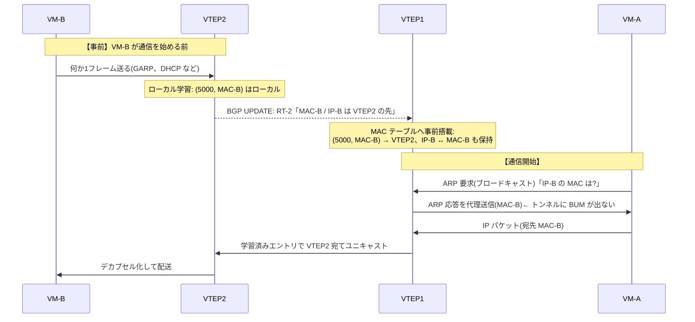

# VXLAN のコントロールプレーン — マルチキャスト vs EVPN

## 概要

この章では、VXLAN の「知識をどう得るか」を主題として、
アンダーレイマルチキャストに依存するフラッド&ラーン、静的なヘッドエンド
レプリケーション、そして BGP ベースのコントロールプレーンである
**EVPN**(Ethernet VPN、**RFC 7432** / **RFC 8365**)の3方式を比較する。
前提知識は [前章](03_vxlan_fundamentals.md)(VXLAN のカプセル化とフラッド&ラーン)と、
第1部の [静的 vs 動的ルーティング](../01_fundamentals/03_static_vs_dynamic.md)・
[コントロールプレーン/データプレーンの対比](../01_fundamentals/02_routing_table_basics.md) である。
なお、EVPN を実装として支える BGP そのものの仕組みは第3部で扱う。
本章は「なぜコントロールプレーンが必要で、なぜそれが BGP なのか」という
方式選択の理解までを目標とし、EVPN の内部(ルートタイプの詳細、IRB など)は
[次章](05_evpn_vxlan.md)に委ねる。

## 導入 — VTEP は何を知らなければならないか

### 2つの問い

[前章](03_vxlan_fundamentals.md) の VTEP の動作を思い返すと、
VTEP がフレームを正しく転送するために答えるべき問いは、突き詰めれば2つしかない。

- **問い A(メンバーシップ)**: この VNI に参加している VTEP はどこにいるか?
  —— BUM トラフィックの届け先の集合を決めるために必要。
- **問い B(所在)**: この宛先 MAC はどの VTEP の先にいるか?
  —— 既知ユニキャストをフラッディングせずに届けるために必要。

RFC 7348 のフラッド&ラーンは、この2つの問いに次のように答えていた。

- 問い A → **アンダーレイの IP マルチキャストに丸投げする**。
  VNI に対応するグループへ各 VTEP が参加し、「誰が参加しているか」は
  マルチキャストルーティングだけが知っている。VTEP 自身はメンバー一覧を持たない。
- 問い B → **流れたトラフィックの観察から学ぶ**(データプレーン学習)。
  誰も教えてくれないので、最初は必ずフラッディングになる。

この章で扱うのは、「この2つの問いへの、もっと良い答え方はないか」である。

### 第1部の構図の再演 — 静的 vs 動的、もう一度

ここで、第1部の [静的 vs 動的ルーティング](../01_fundamentals/03_static_vs_dynamic.md) の
構図を思い出してほしい。あの章では「経路という知識をテーブルに載せる方法」として、
人間が手で書く(静的)/プロトコルが自動で配る(動的)という対比を学んだ。

実は、まったく同じ対比が **MAC の所在という知識**についても成立する。

| 知識の得方 | 経路情報(第1部) | MAC の所在情報(本章) |
|---|---|---|
| 観察だけで済ます | (該当なし)(注) | フラッド&ラーン |
| 人間が手で書く | 静的経路 | 静的なフラッディングリスト(HER) |
| プロトコルが配る | 動的ルーティング(OSPF、BGP) | **EVPN** |

(注)L3 には「宛先が分からなければ全員に送る」という逃げ道がないため、
観察だけで動く方式は存在しない。L2 にはフラッディングという逃げ道が
あったからこそ、コントロールプレーンなしのフラッド&ラーンが成立していた——
そしてその逃げ道のコストこそが、これまで繰り返し見てきた規模の壁である。

この表を先に頭に入れておくと、本章の結論は一行で言える。
**MAC の所在情報にも「動的ルーティング」に相当するものが欲しい。それが EVPN である。**
第1部で静的経路の限界(変化に追従しない、規模で破綻する)を学んだときの
論法が、本章でそのまま再利用できる。

## 理論

### 方式1: アンダーレイマルチキャスト — RFC 7348 の標準解

まず、前章で「アンダーレイが複製して届けてくれる」と一言で済ませた
マルチキャスト配送の中身を開く。IP マルチキャストは2つのプロトコルの
組み合わせで動く。

**IGMP(Internet Group Management Protocol、RFC 3376)** は、
受信希望者が「このグループのトラフィックが欲しい」と最寄りのルータへ
表明するプロトコルである。VXLAN では各 VTEP が受信希望者であり、
自分が収容する VNI に対応するグループ(例: VNI 5000 ↔ 239.1.1.1)への
参加(join)を、アンダーレイの隣のルータへ表明する。

**PIM(Protocol Independent Multicast)**、実用上はその
**PIM-SM(Sparse Mode、RFC 7761)** は、ルータどうしが協調して
「送信元から全受信希望者へ届く配送木」をアンダーレイに構築する
マルチキャストルーティングプロトコルである。PIM-SM は
**RP(Rendezvous Point)**と呼ばれる集合点のルータを決めておき、
受信側は RP へ向かって参加を伝搬させ(共有木)、送信側のトラフィックは
いったん RP 経由で受信者へ届く(その後、送信元への最短経路の木へ
切り替える最適化が働く)。

ここまでで気づくべきことがある。VXLAN の BUM 配送では、
**同じ VNI を収容する全 VTEP が、そのグループの送信者であり同時に受信者**である
(どの VM がブロードキャストを打つかは分からないから)。つまり VTEP が
100 台あれば、1つのグループに送信元が 100 いる。マルチキャストルーティングは
送信元ごとに配送状態((S, G) ステート)を持つため、グループ数 × 送信元数の
状態がアンダーレイの中継ルータに積み上がる。
「中継網を端末の状態から解放する」ために導入した VXLAN が、
皮肉にも**中継網にマルチキャストの状態を要求し返す**構図になっている。
なお、全員が送信者かつ受信者という通信パターン向けに双方向共有木だけで動く
**PIM-BiDir(RFC 5015)** という変種もあり、まさにこの用途に合うのだが、
対応機器・運用ノウハウの点で採用は限られる。

**VNI とグループの対応付けの設計**も運用者に委ねられている。
RFC 7348 は対応付けを管理者の設定事項とし、1:1 でも多:1 でもよい。

- **1 VNI : 1 グループ**: フラッディングが正確に「その VNI の参加 VTEP」だけに
  届く。代償はグループ数=VNI 数となり、アンダーレイの状態が最大化する。
- **多 VNI : 1 グループ**: 状態は減るが、VTEP は自分が収容していない VNI の
  BUM も受信することになり(受信後に VNI で判定して捨てる)、
  無駄なトラフィックと処理が生じる。

どちらにせよ、**L2 セグメントを1つ増やすたびにアンダーレイの
マルチキャスト設計に触る**必要がある。オーバーレイの利点は「物理と論理の分離」
だったはずなのに、この方式ではオーバーレイの増設が物理網の設定に漏れ出す。

まとめると、マルチキャスト方式の問題は技術的欠陥というより**運用上の重さ**である。
マルチキャストルーティングはユニキャストとは別体系の知識(IGMP、PIM、RP 設計、
配送木のデバッグ)を要求し、しかも多くの組織ではデータセンターの VXLAN 以外に
使い道がない。「この機能のためだけに別のプロトコル体系を1式運用する」
というコストが、次の方式への動機になる。

### 方式2: ヘッドエンドレプリケーション — 複製を自分でやる

前章で名前だけ挙げた **ヘッドエンドレプリケーション**(Head-End Replication /
HER、ingress replication とも呼ぶ)は、マルチキャストへの依存を絶つ
最も素朴な方法である。**入口(head-end)の VTEP が、BUM フレームを
宛先 VTEP の数だけユニキャストで複製して送る。**

```text
 マルチキャスト方式:                HER 方式:
                                                      
 VTEP1 ──1パケット──▶ アンダーレイ   VTEP1 ──▶ VTEP2 宛てユニキャスト
              (網内で複製)          ├──▶ VTEP3 宛てユニキャスト
             ├──▶ VTEP2             └──▶ VTEP4 宛てユニキャスト
             ├──▶ VTEP3            (送信側で N-1 複製)
             └──▶ VTEP4
```

アンダーレイはただのユニキャスト IP 網でよくなり、マルチキャストの
運用体系が丸ごと不要になる。代償は2つある。

第一に、**複製コストが送信側 VTEP に集中する**。参加 VTEP が N 台なら
BUM 1フレームにつき N−1 個のパケットを送信側が作って送る。
BUM が少数(ARP 程度)であれば十分許容できるが、ブロードキャストの多い
セグメントや N が大きい環境では入口のリンクと CPU を圧迫する。

第二に、こちらが本質的な問題だが、**問い A(メンバーシップ)に answering する
何かが依然として必要**である。マルチキャストなら「グループに参加している者に届く」
という仕組み自体がメンバー管理を兼ねていた。HER では送信側 VTEP が
**宛先 VTEP の一覧表**を自分で持たなければならない。その一覧はどこから来るのか?

コントロールプレーンなしでの答えは「**管理者が手で設定する**」である
(静的なフラッディングリスト)。そしてこれは第1部で学んだ静的経路と
まったく同じ病理を持つ。

- VTEP を追加するたびに、**既存の全 VTEP のリストへ**追記が必要
  (設定箇所が O(N²) で増える)
- 追記を1台忘れると、「その VTEP 配下の VM とだけ ARP が解決しない」という
  非対称な部分障害になる(トラブルシューティングの節で再訪する)
- VTEP の撤去・障害にも追従しない

静的経路が「小規模・変化しない末端」でだけ定石だったのと同様に、
静的 HER が成立するのは VTEP が数台で増減しない環境に限られる。
規模と変化に耐えるには、この一覧表を**プロトコルに配らせる**しかない。

### 方式3: EVPN — MAC の所在を「経路」として配る

いよいよ本命である。**EVPN(Ethernet VPN)は、MAC アドレスの所在や
VTEP のメンバーシップといった L2 の知識を、BGP の経路情報として
配布するコントロールプレーン**である。仕様の本体は **RFC 7432**
(BGP MPLS-Based Ethernet VPN)で、これはもともと MPLS 網向けに
定義されたものだが、**RFC 8365** がデータプレーンとして VXLAN 等を使う場合の
適用方法を定めており、現在のデータセンターで「EVPN」と言えば
ほぼこの EVPN/VXLAN の組み合わせを指す。

#### なぜ BGP なのか

「MAC の一覧を配るだけなら、専用の軽いプロトコルを作ればよいのでは」と
思うかもしれない。BGP が選ばれたのには積み上がった理由がある。

第一に、**BGP は「到達可能性の情報を、ポリシー制御つきで、大規模に配る」
汎用機構として既に完成していた**。[第1部の IGP の章](../01_fundamentals/05_igp_overview.md)
で予告したとおり、BGP はインターネット全体(数十万経路・数万 AS)を支えている
実績があり、経路の選別・加工(ポリシー)の道具立ても揃っている。

第二に、BGP は **MP-BGP(Multiprotocol BGP、RFC 4760)**という拡張により、
「IPv4 の経路」以外の情報を運べる器になっていた。MP-BGP は運ぶ情報の種類を
アドレスファミリ(AFI/SAFI)という番号の組で区別する仕組みで、
EVPN はその1ファミリ(AFI 25 = L2VPN, SAFI 70 = EVPN)として定義されている。
つまり EVPN は「BGP に MAC を運ばせる改造」ではなく、
**最初から多目的に設計された枠組みの、正規の利用**である。
MP-BGP の仕組み自体は第3部で詳しく扱う。本章では
「BGP には経路以外の情報を型付きで運ぶ拡張性があり、EVPN はそれに載っている」
という理解で先へ進んでよい。

第三に、実務的な理由として、データセンターのアンダーレイでは
すでに BGP を使っていることが多く(大規模 DC では IGP の代わりに BGP で
アンダーレイを組む設計もある)、**新しいプロトコルを足さずに済む**。

#### 2つの問いへの EVPN の答え

EVPN は BGP で運ぶ情報をルートタイプという型で区別する。全体像は次章に譲り、
ここでは本章の2つの問いに対応する2つだけを押さえる。

- **問い A(メンバーシップ)への答え — ルートタイプ3
  (Inclusive Multicast Ethernet Tag route)**:
  各 VTEP は「私は VNI 5000 に参加している。BUM は私(VTEP アドレス)へ
  送ってほしい」という広告を BGP で流す。全 VTEP はこの広告を集めるだけで、
  VNI ごとの**参加 VTEP 一覧が自動的に手に入る**。
  この一覧を HER のフラッディングリストとして使えば、
  静的設定なしの HER が完成する。EVPN/VXLAN の実務構成の多くが
  「BUM は HER、リストは RT-3 で自動構築」を採るのはこのためで、
  **アンダーレイからマルチキャストが消える**。
- **問い B(所在)への答え — ルートタイプ2(MAC/IP Advertisement route)**:
  VTEP は自分の配下で学習した MAC を「MAC-B は私の先にいる」という
  BGP 経路として広告する。他の VTEP はそれを受信して MAC テーブルへ
  **事前に**載せる。宛先が既にテーブルにあるのだから、
  **未知ユニキャストのフラッディングが原理的にほぼ消える**。

さらに RT-2 は MAC と併せて **IP アドレスも運べる**。全 VTEP が
「MAC-B ↔ IP-B」の対応を事前に知っているなら、VM-A が IP-B の解決のために
打つ ARP 要求に、**手元の VTEP がその場で代理応答**できる
(**ARP サプレッション**)。BUM の主要な発生源だった ARP ブロードキャストが
トンネルに入る前に消えるため、フラッディングは「本当に未知の宛先」だけに絞られる。

#### 学習はなくなるのではなく、向きが変わる

誤解しやすい点を先に正しておく。EVPN でも **MAC 学習そのものは消えない**。
VTEP が「自分の配下(ローカル)にどの VM がいるか」を知る手段は、
依然として受信フレームの送信元 MAC の観察である(これをローカル学習と呼ぶ)。
EVPN が置き換えるのは**リモート側**、すなわち「他の VTEP の配下に何がいるか」を
知る手段である。

```text
 フラッド&ラーン:                     EVPN:
   ローカル: フレーム観察で学習          ローカル: フレーム観察で学習(同じ)
   リモート: フレーム観察で学習          リモート: BGP 広告で受信
            (トラフィックが来るまで不明)          (トラフィックが流れる前に既知)
```

言い換えると、フラッド&ラーンは「全員が全員ぶんを自力で観察する」方式、
EVPN は「各自が自分の担当分だけ観察し、結果を**プロトコルで共有する**」方式である。
これは第1部で見た、リンクステートが「自分の直結リンクという一次情報だけを
各自が広告し、全員が同じ地図を得る」構図([DV と LS の章](../01_fundamentals/04_distance_vector_link_state.md))
と同じ設計思想であり、観察という仕事の分担と、知識の共有の分離である。

## プロトコル動作の詳細

### マルチキャストモードの BUM の一生

前章のウォークスルーでは「アンダーレイが複製し、VTEP2 と VTEP3 に届く」と
省略した部分を、アンダーレイ側から見る。VNI 5000 ↔ 239.1.1.1、
参加 VTEP は VTEP1〜3 とする。

1. **参加**: 各 VTEP は vxlan の設定投入時に、アンダーレイ側インタフェースから
   239.1.1.1 への IGMP Membership Report(join)を送る。
   最寄りのルータがこれを受け、PIM-SM の作法で RP へ向けて
   (*, 239.1.1.1) の join を伝搬させる。この時点で「RP から各 VTEP へ届く木」が
   アンダーレイにでき上がる。
2. **送信**: VM-A の ARP 要求を受けた VTEP1 は、外側宛先 239.1.1.1 で
   カプセル化して送出する。アンダーレイのルータ群が配送木に沿って複製し、
   参加中の VTEP2・VTEP3 に届く(送信元の VTEP1 自身には戻らない)。
3. **受信と判定**: 各受信 VTEP は VNI 5000 が自収容であることを確認して
   デカプセル化する(多:1 マッピングの場合、無関係な VNI はここで捨てる)。

この一連が成立するには、IGMP の join が正しく届き続け、PIM の隣接と RP が
健全で、配送木が全 VTEP を張っている必要がある。**ユニキャストの世界の
「経路がある」に相当する前提が、まるごともう1系統ある**ことが分かる。

### HER の動作 — フラッディングリストによる複製

HER では、VTEP は VNI ごとに宛先 VTEP の一覧(フラッディングリスト)を持ち、
BUM フレームをリストの各エントリ宛てに個別にカプセル化して送る。

```text
  VTEP1 のフラッディングリスト(VNI 5000): {192.0.2.2, 192.0.2.3}

  VM-A の ARP 要求(ブロードキャスト)1個
    → 外側宛先 192.0.2.2 の VXLAN パケット
    → 外側宛先 192.0.2.3 の VXLAN パケット   の 2 個を送信
```

受信側の動作は完全にユニキャストの VXLAN 受信であり、
マルチキャスト方式と違ってアンダーレイに特別な仕掛けは何もない。
学習(内側送信元 MAC ↔ 外側送信元 VTEP)も前章のとおり機能する。
つまり HER は**フラッド&ラーンの「フラッド」の実現手段の差し替え**であって、
学習方式そのものは変えていない。このリストを誰が書くか(人間か、RT-3 か)だけが
静的 HER と EVPN 構成の違いである。

### EVPN モードでの同じ場面 — 事前配布と代理応答

同じ「VM-A から VM-B への初回通信」が、EVPN では次のように変わる。
前章の [フラッド&ラーンのシーケンス](03_vxlan_fundamentals.md) と見比べてほしい。



対比を整理する。

- フラッド&ラーンでは、ARP 要求が**全 VTEP へフラッディング**され、
  学習は「その通信が起きたから」成立した(通信が学習を作る)。
- EVPN では、VM-B の存在が**通信より先に**全 VTEP へ広告されており、
  ARP は手元で代理応答され、最初のデータパケットからユニキャストで飛ぶ
  (学習=広告が通信に先行する)。

なお、RT-2 の広告の契機はローカル学習である(VM-B が最初の1フレームを
送るまで VTEP2 も存在を知らない)。多くの VM は起動時に GARP や DHCP を
送るため実用上は「起動直後に広告済み」となる。また、VM がライブ
マイグレーションで別 VTEP へ移った場合には広告の付け替え(MAC モビリティ)が
必要で、移動の競合を裁く仕組みが RFC 7432 に定義されているが、
これは次章で扱う。

### 3方式の比較

| | フラッド&ラーン+マルチキャスト | フラッド&ラーン+静的 HER | EVPN |
|---|---|---|---|
| 問い A(BUM の届け先) | アンダーレイのグループ参加が兼ねる | 手書きのフラッディングリスト | RT-3 で自動構築(通常 HER と併用) |
| 問い B(MAC の所在) | データプレーン学習 | データプレーン学習 | RT-2 で事前配布(+ローカル学習) |
| アンダーレイへの要求 | IP ユニキャスト+**マルチキャスト一式** | IP ユニキャストのみ | IP ユニキャスト+**BGP の到達性** |
| 未知ユニキャストのフラッディング | 起こる(初回は必ず) | 起こる(初回は必ず) | 原理的にほぼ消える |
| ARP ブロードキャスト | トンネルで全 VTEP へ | トンネルで全 VTEP へ | ARP サプレッションで手元処理可 |
| VTEP 追加時の作業 | グループ設計の確認+自 VTEP の設定 | **全既存 VTEP のリスト更新** | 自 VTEP の設定のみ(広告が伝える) |
| 複製の負担 | アンダーレイの中継ルータ | 送信側 VTEP(N−1 複製) | 送信側 VTEP(N−1 複製)(注) |
| 相当する第1部の概念 | (コントロールプレーンなし) | 静的経路 | 動的ルーティング |

(注)EVPN でも BUM 配送自体にアンダーレイマルチキャストを使う構成は可能
(RT-3 はその調整にも使える)。本書では以後、断りがなければ
「EVPN+HER」の構成を前提とする。

この表で押さえるべき本質は2行目までである。フラッド&ラーンの2方式は
問い B を依然として観察に頼っており、違いは問い A の実現手段だけである。
EVPN だけが両方の問いをコントロールプレーンで解いている。

## 設定例 — 静的 HER を手で組んで「EVPN が自動化するもの」を見る

[前章](03_vxlan_fundamentals.md) の Linux vxlan デバイスを、マルチキャストを
使わない静的 HER 構成に組み替えてみる。EVPN を導入する前にこれを一度
手で組むと、「EVPN の RT-3 が何を自動化しているか」が具体的に見える。

```bash
# group を指定せずに VXLAN デバイスを作る(マルチキャスト不使用)
ip link add vxlan5000 type vxlan id 5000 local 192.0.2.1 \
    dev eth0 dstport 4789
ip link set vxlan5000 master br0
ip link set vxlan5000 up

# フラッディングリストを静的に投入する:
# オール0 MAC のエントリを「宛先 VTEP の数だけ append」する
bridge fdb append 00:00:00:00:00:00 dst 192.0.2.2 dev vxlan5000 self permanent
bridge fdb append 00:00:00:00:00:00 dst 192.0.2.3 dev vxlan5000 self permanent
```

```bash
$ bridge fdb show dev vxlan5000
00:00:00:00:00:00 dst 192.0.2.2 self permanent   ← フラッディングリスト
00:00:00:00:00:00 dst 192.0.2.3 self permanent   ←(この2行が「問い A」の答え)
52:54:00:bb:bb:02 dst 192.0.2.2 self             ← データプレーン学習(問い B)
```

前章ではオール0エントリが1行(マルチキャストグループ)だったのに対し、
静的 HER では**宛先 VTEP の数だけ並ぶ**。BUM フレームはこの全行へ
複製送信される。ここに 192.0.2.4 の VTEP を増設したら、
**この `append` を既存全 VTEP で打って回る**必要がある——それが静的 HER の
運用である。EVPN 構成では、まさにこのオール0エントリ群を BGP(RT-3)が
自動で出し入れし、学習エントリ(問い B)も RT-2 由来の静的搭載に置き換わる
(その際はデバイスに `nolearning` を付けてデータプレーン学習を止める)。
「EVPN は Linux の FDB 操作を自動化する何か」という身も蓋もない理解は、
実装レベルでは的を射ている。

## トラブルシューティング

### 症状1: BUM だけ全滅(マルチキャスト方式)— 前章の症状3の深掘り

前章で「BUM だけが死ぬのはマルチキャスト起因」と切り分けた。その先の
定番原因を挙げる。いずれも**ユニキャストの健全性からは何も分からない**点が共通する。

- **IGMP の参加が維持されていない**: IGMP の participation は
  クエリア(querier)からの定期的な問い合わせに応答することで維持される。
  アンダーレイの L2 セグメント上にクエリアが不在だと、IGMP snooping の
  エントリがタイムアウトし、**最初は通っていた BUM が数分後に死ぬ**という
  時限式の症状になる。
- **RP の設定不一致・障害**(PIM-SM): 各ルータが認識する RP が食い違うと
  配送木がつながらない。VTEP 側の設定は一切間違っていないのに BUM が届かない。
- **一部の VTEP だけ届かない**: 配送木がその VTEP の枝だけ張れていない
  (途中のルータの PIM 隣接ダウンなど)。「特定のサーバ上の VM とだけ
  ARP が解決しない」という HER のリスト漏れと似た見え方をするので、
  方式がどちらかをまず確認する。

切り分けの起点は、受信側 VTEP のアンダーレイ側インタフェースで
グループ宛てパケットが**届いているか**(`tcpdump -n -i eth0 dst 239.1.1.1`)、
そして VTEP が join を**出し続けているか**(`tcpdump -n -i eth0 igmp`)である。

### 症状2: 新設 VTEP 配下の VM とだけ通信できない(静的 HER)

静的 HER 環境で VTEP を増設したあと、「新しいサーバ上の VM から外へは
通れるのに、外から新しい VM への初回通信が失敗する」あるいはその逆、という
**非対称な症状**が出たら、フラッディングリストの更新漏れをまず疑う。

- 新 VTEP のリストに既存 VTEP を入れ忘れた → 新 VM の ARP 要求が誰にも届かない
- 既存 VTEP のリストに新 VTEP を入れ忘れた → 既存 VM の ARP 要求が新 VM に届かず、
  かつ**新 VM 側から通信を始めれば学習が成立して通ってしまう**
  (「一度こちらから ping すると直る」という典型的な迷宮入りパターン)

後者の「片側から始めると通る」は、ARP 応答がユニキャストであり
学習済み経路で戻れてしまうことによる。フラッディングリストは
**全 VTEP で相互に整合していなければならない**——この整合性維持こそ
コントロールプレーンの仕事であり、症状自体が静的方式の限界の実演である。

### 症状3: 方式の混在 — 片方向だけ ARP が届く

マルチキャスト方式の VTEP と HER の VTEP が同じ VNI に混在すると、
HER 側から送った BUM は(リストにあれば)相手に届くが、
マルチキャスト側から送った BUM はグループに参加していない HER 側 VTEP に
届かない、という**片方向のフラッディング不全**になる。移行作業の途中や、
機器種の混在環境で起こる。BUM の配送方式は VNI 内で統一されている
必要がある——「トンネルが張れているか」ではなく「**フラッディングの
実現方式が両端で一致しているか**」を移行計画の確認項目に含めること。

### 症状4: EVPN 導入後も古い対応が残る

EVPN 構成では問い B の情報源が BGP になるため、データプレーン学習が
残っていると情報源が2系統になり、「BGP は最新の所在を広告しているのに、
古いデータプレーン学習のエントリが上書きされずに残って黒穴になる」型の
不整合が起こりうる(VM 移動時など)。実装は通常、EVPN 管理下の
デバイスで動的学習を無効化する(Linux なら `nolearning`)ことでこれを防ぐ。
「情報源が複数あるときの優先と整合」という、第1部で
[管理距離](../01_fundamentals/02_routing_table_basics.md) として学んだ問題の
L2 版である。MAC モビリティの正式な扱いは次章で述べる。

## 演習・確認問題

**問1.** VTEP がフレーム転送のために答えるべき「2つの問い」を挙げ、
フラッド&ラーン(マルチキャスト方式)がそれぞれをどう解決していたかを説明せよ。

**問2.** ヘッドエンドレプリケーションはマルチキャスト方式の何を解決し、
何を解決しないか。「静的経路」との類推を使って、静的 HER の運用上の限界を述べよ。

**問3.** EVPN のルートタイプ2とルートタイプ3は、それぞれ「2つの問い」の
どちらに答えるものか。また RT-2 が IP アドレスも運べることが、
BUM トラフィックの削減にどう効くかを説明せよ。

**問4.** 「EVPN を導入すると VTEP は MAC 学習をしなくなる」という説明は
不正確である。何が正しいかを、ローカル/リモートの区別を使って述べよ。

**問5.** 静的 HER 環境で「既存 VM から新設 VTEP 配下の VM への初回通信は
失敗するが、新 VM 側から一度通信すると以後は双方向で通る」という症状が出た。
原因と、そのメカニズムを説明せよ。

---

**解答**

**問1.** 問い A: この VNI に参加する VTEP はどこか(BUM の届け先)。
問い B: 宛先 MAC はどの VTEP の先か(既知ユニキャストの転送先)。
マルチキャスト方式は、A を「VNI 対応のグループへの IGMP 参加」で
アンダーレイのマルチキャストルーティングに委ね、B を「デカプセル化時の
内側送信元 MAC と外側送信元 VTEP の対応観察」(データプレーン学習)で解いていた。

**問2.** 解決するのは問い A の実現手段のみ: 入口 VTEP が宛先 VTEP の数だけ
ユニキャスト複製することで、アンダーレイからマルチキャストの運用体系
(IGMP、PIM、RP)を不要にする。解決しないのは問い B(依然データプレーン学習)と、
フラッディングリストの出所である。静的 HER は静的経路と同じく変化に追従せず、
VTEP 追加のたびに既存全 VTEP のリスト更新が必要で、更新漏れは非対称な
部分障害となる。規模と変化に耐えるには一覧の配布をプロトコル化するしかない。

**問3.** RT-3(Inclusive Multicast Ethernet Tag)が問い A: 各 VTEP の
VNI 参加宣言を集めることでフラッディングリストが自動構築される。
RT-2(MAC/IP Advertisement)が問い B: 学習済み MAC の所在を経路として
事前配布する。RT-2 が IP も運ぶことで、VTEP は MAC↔IP の対応を事前に持ち、
端末の ARP 要求へ手元で代理応答(ARP サプレッション)できる。
BUM の主成分である ARP ブロードキャストがトンネルに入る前に消えるため、
フラッディングは本当に未知の宛先だけに絞られる。

**問4.** ローカル(自 VTEP 配下)の MAC は、EVPN でも受信フレームの
送信元観察で学習する(この学習が RT-2 広告の契機になる)。EVPN が
置き換えるのはリモート側で、他 VTEP 配下の MAC をデータプレーン観察ではなく
BGP 広告の受信で知る。「各自が自分の担当分だけ観察し、結果をプロトコルで
共有する」への転換であり、学習の廃止ではなく分担と配布の導入である。

**問5.** 既存 VTEP のフラッディングリストへ新 VTEP を追加し忘れている。
既存 VM の ARP 要求(BUM)は新 VTEP へ複製されないため初回通信が失敗する。
一方、新 VTEP 側のリストが正しければ新 VM の ARP 要求は既存側へ届き、
このとき既存 VTEP は外側送信元から新 VTEP の存在を学習する。ARP 応答以降は
両方向とも学習済みユニキャストとなるため、BUM(リスト)の欠陥が隠れて
「一度逆から通せば直る」ように見える。リストの整合性は全 VTEP で
相互に必要であり、これを自動維持するのがコントロールプレーンの役割である。

## まとめ

- VTEP の知識は「BUM をどこへ届けるか(メンバーシップ)」と
  「MAC はどの VTEP の先か(所在)」の2つに帰着する。方式の違いは
  この2つの問いへの答え方の違いである。
- RFC 7348 のマルチキャスト方式は、メンバーシップをアンダーレイの
  IGMP/PIM に委ねる。技術的には成立するが、マルチキャストという
  別体系の運用をアンダーレイに要求する重さが実務上の壁になる。
- ヘッドエンドレプリケーションはマルチキャストを不要にするが、
  フラッディングリストという新たな知識を必要とし、静的設定では
  静的経路と同じ「変化に追従しない・規模で破綻する」限界に行き着く。
- EVPN(RFC 7432 / RFC 8365)は、MAC の所在(RT-2)と VTEP の
  メンバーシップ(RT-3)を MP-BGP の経路情報として配布する
  コントロールプレーンであり、未知ユニキャストのフラッディングを
  ほぼ消し、ARP サプレッションで BUM 自体も削る。
- 学習は消えるのではなく向きが変わる: ローカルは観察、リモートは広告。
  「各自の一次情報を全員へ配る」というリンクステート以来の設計思想が
  L2 の世界で再演されている。EVPN の内部構造は次章で開く。
