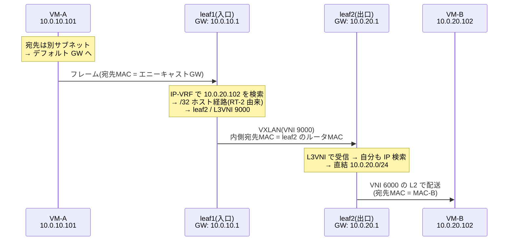

# EVPN/VXLAN — 統合的理解

## 概要

この章では、前章でコントロールプレーンとして選択した **EVPN**(**RFC 7432** /
**RFC 8365**)の内部を開き、EVPN/VXLAN ファブリックを1つのシステムとして
理解する。主題は、ルートタイプの全体像、経路の名前空間(RD と RT)、
オーバーレイ上の L3(IRB、**RFC 9135**)、MAC モビリティ、マルチホーミングである。
前提知識は [前章](04_vxlan_control_plane.md)(なぜ EVPN か)と
[VXLAN の基礎](03_vxlan_fundamentals.md) である。
また、ロードマップで示したとおり、本章は第3部(BGP、特に
[05 章](../03_bgp/05_mp_bgp.md) の MP-BGP)を読了してから読むことを推奨する。
ただし、BGP を「型付きの到達性情報をポリシー制御つきで大規模に配る機構」とだけ
理解していても本筋は追えるように書いてある。

## 導入 — 「2つの問い」の先にあるもの

### 前章の到達点と、残っている問い

前章の結論はこうだった。VTEP の知識は「BUM の届け先(ルートタイプ3)」と
「MAC の所在(ルートタイプ2)」の2つの問いに帰着し、EVPN はその両方を
BGP の経路として事前配布する——。

しかし、この理解だけでは実際のデータセンターファブリックはまだ組めない。
考えてみてほしい。

- **その MAC は誰のものか?** データセンターは複数のテナント(顧客、部門、
  システム)を収容する。テナント A の 10.0.10.0/24 とテナント B の
  10.0.10.0/24 が同居するとき、「MAC-X は VTEP2 の先」という広告は
  **どのテナントの話なのか**を区別できなければならない。
- **サブネットをまたぐ通信はどうするのか?** ここまでの VXLAN は徹頭徹尾
  L2 の延長だった。しかし VM 同士の通信の大半は実際にはサブネットをまたぐ。
  ルーティングは**どこで**行うのか。[第2部の最初の章](01_vlan_basics.md) で見た
  SVI の考え方は、オーバーレイではどう変わるのか。
- **端末が動いたらどうなるのか?** 仮想化環境では VM がライブマイグレーションで
  物理サーバ間を移動する。「MAC-B は VTEP2 の先」という配布済みの知識は、
  移動の瞬間に**全 VTEP で**訂正されなければならない。
- **VTEP が落ちたらどうなるのか?** 物理サーバやスイッチは冗長化される。
  1つの端末(やスイッチ)が2台の VTEP に同時接続しているとき、
  「MAC-B はどの VTEP の先か」への答えは1つではなくなる。

EVPN が「L2 の到達性を BGP で配る仕組み」を超えて **Ethernet VPN** という
名前を持つのは、これらすべて——マルチテナンシー、L2/L3 の統合、モビリティ、
冗長化——への答えを1つのプロトコル体系として備えているからである。
本章はその全体像を、これまでどおり「なぜその設計か」から積み上げる。

### 舞台: リーフ・スパインファブリック

まず、EVPN/VXLAN が実際に動く舞台を固定しておく。
[VXLAN の基礎](03_vxlan_fundamentals.md) で一言だけ触れた
**リーフ・スパイン(leaf-spine)構成**である(Clos 網とも呼ばれる。
1950年代に電話交換網の多段構成を定式化した Charles Clos に由来する)。

```text
              spine1              spine2      ← アンダーレイの中継専用。
             /  |  |  \          /  |  |  \      オーバーレイ(VNI・MAC)を
            /   |  |   \        /   |  |   \     一切知らない
           /    |  |    \      /    |  |    \
          /     |  |     ×————×     |  |     \
         /      |  └──────┼──┼──────┘  |      \
        /       └────────┐│  │┌────────┘       \
     leaf1        leaf2   ││  ││    leaf3        leaf4
    (VTEP1)      (VTEP2) ←┴┴──┴┴→ (VTEP3)      (VTEP4)
       |            |     全リーフが   |            |
      VM群         VM群   全スパインへ VM群         VM群
                          接続
```

(図が煩雑になるため一部の線を省略している。構成の規則は単純で、
**全リーフが全スパインに接続し、リーフ同士・スパイン同士は接続しない**。)

役割分担は次のとおりで、これまでの章で学んだ道具がすべてはまる。

- **リーフ**が VTEP である。端末(サーバ)を収容し、カプセル化の境界となり、
  EVPN のコントロールプレーンに参加する。MAC を学習するのはリーフだけである。
- **スパイン**はアンダーレイの中継専用である。外側 IP ヘッダしか見ず、
  VNI も端末 MAC も一切関知しない。[第1部の IGP の章](../01_fundamentals/05_igp_overview.md)
  で学んだ「土台」——各リーフのループバック(VTEP アドレス)への到達性——を
  提供するだけである。
- どのリーフ間も等しく「リーフ→スパイン→リーフ」の2ホップであり、
  スパインの本数ぶんの等コスト経路が常に存在する。
  [ECMP](../01_fundamentals/02_routing_table_basics.md) と、VXLAN が外側 UDP
  送信元ポートに載せたエントロピーが、ここで効く。

以後の説明はこの構成を前提とする。「オーバーレイの知識はリーフ(VTEP)にだけ
あり、スパインは L3 の土管である」という分担を頭に置いて読み進めてほしい。

## 理論

### EVPN の情報モデル — ルートタイプの全体像

MP-BGP の枠組み(AFI 25 / SAFI 70)の中で、EVPN は運ぶ情報を
**ルートタイプ(route type)**という型で区別する。RFC 7432 が定義するのは
タイプ1〜4、後続の RFC 9136 がタイプ5を追加した。

| タイプ | 名称 | 運ぶ情報(一言で) | 答える問い |
|---|---|---|---|
| RT-1 | Ethernet Auto-Discovery | 「このイーサネットセグメントは私を経由して到達可能」 | 冗長化(マルチホーミング) |
| RT-2 | MAC/IP Advertisement | 「この MAC(と IP)は私の先」 | MAC の所在(前章の問い B) |
| RT-3 | Inclusive Multicast Ethernet Tag | 「この VNI の BUM は私へ」 | メンバーシップ(前章の問い A) |
| RT-4 | Ethernet Segment | 「このセグメントには私も接続している」 | 冗長化(代表選出) |
| RT-5 | IP Prefix(RFC 9136) | 「このプレフィックスは私の先」 | オーバーレイの L3 経路 |

(このほか、マルチキャスト視聴情報を運ぶタイプ6〜8(RFC 9251)なども
追加されているが、本書では扱わない。)

眺め方を1つ与えておく。**RT-2/RT-3 が前章で学んだ「基本の L2」、
RT-5 が本章で扱う「L3 への拡張」、RT-1/RT-4 が「冗長化」**である。
単一接続のサーバだけを収容する最小構成なら RT-2 と RT-3 だけで動く。
つまりルートタイプの一覧は機能の積み増しの歴史でもあり、
すべてを一度に理解する必要はない。

なお、表記について。本書では前章から「ルートタイプ2/RT-2」の略記を
用いているが、**BGP の文脈で RT と書くと後述のルートターゲット
(Route Target)を指すのが通例**である。紛らわしいことこの上ないが、
どちらも現場で確立した略記なので、本書では「RT-数字」はルートタイプ、
単独の「RT」はルートターゲットと使い分ける。

### 経路の名前空間 — RD と RT

#### MAC-VRF: テナントごとのテーブル

導入で挙げた最初の問い——「その MAC は誰のものか」——への EVPN の答えは、
[第1部](../01_fundamentals/02_routing_table_basics.md) で学んだ RIB/FIB の
発想の延長にある。**テーブルそのものをテナントごとに分ければよい。**

RFC 7432 は、VTEP(仕様の用語では PE)がテナントごとに持つ独立の
MAC テーブルを **MAC-VRF** と呼ぶ(VRF = Virtual Routing and Forwarding は
もともと L3VPN でルーティングテーブルを顧客ごとに分ける仕組みの呼称で、
その MAC 版である。L3VPN は第5部で扱う)。VXLAN では実用上、
**1つの VNI が1つのブロードキャストドメイン**に対応し、MAC-VRF は
1つ以上の VNI を束ねるテナント単位の入れ物になる
(1 MAC-VRF = 1 VNI の最も単純な形を **VLAN-based サービス**と呼ぶ。
本書は以後これを前提とする。複数 VLAN を1つの MAC-VRF に束ね
Ethernet Tag フィールドで区別する VLAN-aware bundle という形態もある、
とだけ知っておけばよい)。

テーブルを分けるだけなら VTEP 内部で完結する。問題は **BGP で配るとき**である。
テナント A とテナント B が同じ MAC アドレス(あるいは後述の RT-5 で
同じ IP プレフィックス)を広告したら、BGP はそれらを同一の経路と誤認して
片方を選んで捨ててしまう。区別のための仕掛けが2つ必要になる。

#### RD — 経路を全世界で一意にする

**RD(Route Distinguisher、ルート識別子)**は、経路の先頭に付ける
8オクテットの値で、**「同じ中身でも出所が違えば別の経路」にするための接頭辞**
である。MP-BGP はプレフィックスを RD 込みで比較するため、
テナント A の MAC-X とテナント B の MAC-X は、RD が違えば別経路として
両方とも配布される。RD は区別のためだけの値であり、それ自体に
「どのテナントか」という意味はない。実装は通常
「VTEP アドレス : 内部番号」の形式で VNI ごとに自動生成する
(だから同じテナントでも VTEP が違えば RD は違う。それでよい)。

#### RT — 経路をどのテーブルに取り込むか

RD が「衝突の防止」なら、**RT(Route Target、ルートターゲット)**は
「**仕分けのラベル**」である。RT は経路に付ける拡張コミュニティ
(BGP の経路に付けられるタグの一種。詳細は
[第3部のポリシー制御の章](../03_bgp/04_policy_control.md) で扱う)で、
各 VTEP は MAC-VRF ごとに次の2つを設定する。

- **export RT**: この MAC-VRF から広告する経路に、このラベルを付ける
- **import RT**: このラベルが付いた経路を、この MAC-VRF に取り込む

つまり、**同じ RT を export/import する VTEP 群が、1つの仮想 L2 ネットワークの
参加者集合**になる。前章で「RT-3 を集めるとフラッディングリストが自動構築される」
と述べたが、正確には「**自分の import RT に一致する** RT-3 を集める」のである。
経路は BGP のトポロジに沿って全員へ運ばれ、各自が RT を見て
「自分に関係ある分だけ」テーブルへ取り込む——広告は無差別、取り込みは選択的、
という設計である。

VXLAN では「VNI = 仮想ネットワーク」なので、RT は VNI から機械的に
導出できると都合がよい。実際 RFC 8365 は「AS 番号 : VNI」形式の
自動導出を定めており、実装の既定値も概ねこれに従う。全 VTEP が同じ
AS 番号なら、同じ VNI の RT は自動的に一致する——**逆に言うと、
リーフごとに AS 番号を変える設計では自動導出が一致しない**。
これは実によく踏む罠なので、トラブルシューティングの節で再訪する。

まとめると、1本の RT-2 広告は概念的には次の形をしている。

```text
  RD(出所の一意化) : [MAC-B, IP-B] + VNI + ネクストホップ(VTEP2)
  付随タグ: RT = 65000:5000(仕分け先の指定)
```

受信側 VTEP は、RT を見て自分の MAC-VRF(VNI 5000)への取り込みを判断し、
取り込んだら「(VNI 5000 の)MAC-B → VTEP2」を FDB へ搭載する。
前章の理解に、名前空間の管理が1層加わっただけである。

### オーバーレイの L3 — IRB

#### ゲートウェイはどこに置くか

導入の2番目の問い——サブネットをまたぐ通信——に移る。
[VLAN の章](01_vlan_basics.md) で学んだとおり、L2 セグメント間の通信は
必ず L3(ルータ/SVI)を経由する。VXLAN のオーバーレイでも原理は同じで、
各 VNI のどこかに SVI に相当するゲートウェイが必要である。素朴には
「ファブリックのどこか1箇所(例えば特定のスイッチ対)に全 VNI の SVI を
集約する」構成が考えられ、実際に初期の設計では使われた(集中型ゲートウェイ)。
しかしこれには明白な問題がある。**別サブネット宛てのトラフィックは、
たとえ宛先が同じサーバ上の隣の VM でも、いったんゲートウェイまで
往復しなければならない**(いわゆるヘアピン)。東西トラフィックが支配的な
データセンターでは、この迂回とゲートウェイへの集中が許容できない。

そこで現在の標準構成は**分散ゲートウェイ**である。**全リーフが、
自分が収容する全サブネットの SVI を持つ。**しかも全リーフで
**同じゲートウェイ IP アドレスと同じ MAC アドレス**を設定する
(**エニーキャストゲートウェイ**)。VM から見るとデフォルトゲートウェイは
「どのリーフに収容されていても、常に手元のリーフ」であり、
ライブマイグレーションで別のサーバへ移っても、ゲートウェイの IP も MAC も
変わらないから通信は途切れない。ARP で解決したゲートウェイ MAC が
移動先でもそのまま通用する、という仕掛けである。

#### 対称 IRB — L3VNI という「ルーティング用の VNI」

ルーティングとブリッジングを各リーフで一体運用するこの形態を
**IRB(Integrated Routing and Bridging、統合ルーティング&ブリッジング)**と
呼び、その標準的な実現方法は **RFC 9135** が定める。RFC 9135 には
2つの方式が併記されているが、まず実務の主流である**対称(symmetric)IRB**
から説明する。

対称 IRB の鍵は、**テナントの L3 ルーティング専用の VNI(L3VNI)を1つ設ける**
ことである。端末を収容する通常の VNI(区別のため **L2VNI** と呼ぶ)とは
別に、テナント(IP-VRF)ごとに L3VNI を割り当てる。サブネットをまたぐ
パケットは次のように運ばれる。

```text
  VM-A(10.0.10.101, VNI 5000)→ VM-B(10.0.20.102, VNI 6000)の場合:

  入口リーフ(leaf1):
    VM-A からゲートウェイ MAC 宛てのフレームを受ける
    → L3 ルックアップ(テナントの IP-VRF で 10.0.20.102 を引く)
    → 経路の指す出口 VTEP(leaf2)へ、L3VNI 9000 でカプセル化して送る

  出口リーフ(leaf2):
    L3VNI 9000 でデカプセル化 → 自分も L3 ルックアップ
    → 直結サブネット 10.0.20.0/24 の VM-B へ、VNI 6000 の L2 で配送
```

**入口も出口もルーティングを1回ずつ行う**(処理が対称なので symmetric)。
トンネルを流れるのは L2VNI ではなく L3VNI のパケットであり、
これは「オーバーレイ上のルータ間リンク」のように振る舞う。
入口リーフが知るべきことは「10.0.20.102 は leaf2 の先」という **L3 の知識**
だけで、宛先サブネットの L2VNI(6000)を自分が収容している必要はない。
このための情報は RT-2 が運ぶ——前章で「RT-2 は MAC と併せて IP も運べる」と
述べたのがここで効く。leaf2 は VM-B の MAC/IP を学習した時点で、
「MAC-B は VNI 6000(L2 の話)」と「IP-B は L3VNI 9000 経由で私へ(L3 の話)」を
**1本の RT-2 に同梱して**広告する。受信した leaf1 は前者を MAC-VRF へ、
後者をテナントの IP-VRF へ、それぞれ /32 のホスト経路として取り込む。

細部だが動作理解に必須の点を1つ。L3VNI のトンネルを渡る内側フレームの
宛先 MAC には何を入れるのか? ルータ間リンクなのだから「次のルータ
(=出口リーフ)の MAC」である。このため各リーフは自分の**ルータ MAC**を
拡張コミュニティ(Router's MAC)として RT-2 に添えて広告し、
入口リーフはそれを内側宛先 MAC に使う。エニーキャストゲートウェイの
共有 MAC とは別物であることに注意してほしい。

#### 非対称 IRB — もう1つの方式と、対称が主流である理由

**非対称(asymmetric)IRB** は L3VNI を使わない。入口リーフが
ルーティングと**宛先サブネットへのブリッジング**まで行い、
トンネルには最初から**宛先の L2VNI(6000)**で、内側宛先 MAC も
**VM-B の実 MAC** で送り込む。出口リーフはデカプセル化して
L2 転送するだけである(入口はルーティング+ブリッジング、出口は
ブリッジングのみ——処理が非対称)。

一見こちらが単純だが、決定的な代償がある。入口リーフが宛先 L2VNI で
直接カプセル化するには、**全リーフが、自分に収容 VM がいないサブネットも
含めて、テナントの全 L2VNI と全端末の MAC/IP を持たなければならない**。
サブネット数×端末数に比例する状態が全リーフに複製されるわけで、
規模が大きくなるほど対称 IRB(必要なのは自収容サブネット+L3VNI のみ)との
差が開く。本書では以後、断りがなければ対称 IRB を前提とする。
なお両方式は**ファブリック内で混在できない**(入口が宛先 L2VNI で送ったのに
出口が L3VNI を待っている、という不一致になる)。これも
トラブルシューティングの節で再訪する。

#### RT-5 — ホスト経路ではなくプレフィックスを配る

RT-2 が配るのは端末単位(/32、/128)のホスト経路である。しかし
オーバーレイの L3 には「サブネットまるごと」「ファブリック外部への経路」を
配りたい場面がある——典型は、外部ネットワークとの境界に立つリーフ
(ボーダーリーフ)が、デフォルトルートや社内集約経路をテナントの IP-VRF へ
注入する場合である。これを担うのが **RT-5(IP Prefix route、RFC 9136)**で、
MAC を伴わない純粋な IP プレフィックスを EVPN の枠組みで運ぶ。
「EVPN は L2 の技術」という第一印象は RT-5 で完全に崩れる。実際の
EVPN/VXLAN ファブリックは、RT-2(ホスト経路)と RT-5(プレフィックス)を
併用する**テナント別 L3 ネットワーク基盤**として運用されるのが普通である。

### 動くものを追いかける — MAC モビリティ

導入の3番目の問い、VM の移動である。ライブマイグレーションで
VM-B が leaf2 配下から leaf4 配下へ移ったとする。移動後の VM-B が
最初のフレーム(多くのハイパーバイザは移動完了時に GARP を打つ)を送ると、
leaf4 がローカル学習して RT-2 を広告する。だがこの時点で、
ネットワークには **leaf2 発の古い RT-2 と leaf4 発の新しい RT-2 が併存**する。
全 VTEP はどちらを信じればよいのか。BGP の経路選択に委ねると、
選択基準(第3部で扱う)は「どちらが新しいか」を知らないため、
古い方が勝ち続けることが起こりうる。

RFC 7432 の答えは、**シーケンス番号で経路に新旧を刻む**ことである
(MAC Mobility 拡張コミュニティ、RFC 7432 Section 7.7 / 15)。

1. 最初の広告はシーケンス番号 0(コミュニティ省略可)
2. leaf4 は、自分がローカル学習した MAC-B について**他 VTEP 発の広告が
   既に存在する**ことに気づくと、その番号+1 を付けて広告する(0 → 1)
3. 各 VTEP は番号の大きい方を採用する
4. leaf2 は自分より大きい番号の広告を見て、「VM-B はもういない」と悟り、
   自分の古い広告を撤回(withdraw)する

移動のたびに番号が増えていく(1 → 2 → 3 …)。この仕組みには
副産物として**異常検知**がある。同じ MAC が短時間に何度も「移動」する
——番号が急速に増える——のは、実際には移動ではなく、**同じ MAC が
2箇所に同時に存在する**(MAC 重複。VM のクローン事故や L2 ループが典型)
兆候である。RFC 7432 は「M 秒間に N 回」(既定値の推奨は 180 秒に 5 回)を
超えたら、それ以上の広告更新を停止して管理者に警告することを求めている
(**重複 MAC 検出**)。広告合戦によるコントロールプレーンの暴走を止める
安全弁だが、「検出発動中はその MAC の所在情報が凍結される」という
運用上の症状を生む。これもトラブルシューティングで再訪する。

なお、逆に「絶対に動かないはず」の MAC(ファイアウォールの仮想 MAC など)には、
static フラグ(sticky bit)を付けて広告し、移動の主張自体を拒否させることもできる。

### 冗長化 — マルチホーミングと ESI(概観)

最後の問いである。サーバやアクセススイッチを**2台のリーフに同時接続**
(マルチホーミング)して、リーフ1台の故障に耐えたい。このとき
「MAC-B はどの VTEP の先か」の答えは leaf1 と leaf2 の**両方**になる。
EVPN はこれを正面から扱う数少ない L2 技術であり、RT-1 と RT-4 が
このために存在する。骨子だけ示す。

- 同じ端末群につながるリンクの束を**イーサネットセグメント**と呼び、
  10 オクテットの **ESI(Ethernet Segment Identifier)**で識別する。
  leaf1 と leaf2 は RT-4(Ethernet Segment route)で「私もこの ESI に
  接続している」と広告し合い、**同じセグメントを収容する仲間**を自動発見する
- 両リーフがトラフィックを転送してよい **all-active** 冗長では、
  他の VTEP は RT-1/RT-2 の情報から「MAC-B へは leaf1 と leaf2 のどちらへ
  送ってもよい」と判断し、ECMP で分散する(エイリアシング)
- BUM フレームだけは、両方が配下へ流すと二重配送になるため、
  RT-4 の参加者間で **DF(Designated Forwarder)**を選出し、
  セグメントへ BUM を流す係を一意に決める
- リーフが故障したときは、MAC 1個ずつの撤回を待たず、RT-1 の撤回1本で
  「このセグメント経由の全 MAC が無効」と伝える(マスウィズドロー)。
  収束時間が MAC 数に依存しなくなる

このほか、セグメント発の BUM がトンネルを経由して同じセグメントへ
戻って二重配送になることを防ぐスプリットホライズンの仕掛けがある
(MPLS 版の ESI ラベルに代えて、VXLAN では RFC 8365 が local bias という
方式を定める)。マルチホーミングの詳細設計は本書の範囲を超えるため
概観にとどめるが、「**従来 MC-LAG などベンダー独自技術だったスイッチ冗長化を、
標準プロトコルの経路広告だけで実現している**」という位置づけは
押さえておいてほしい。

## プロトコル動作の詳細

### RT-2 のフォーマット

理論で述べた要素がどう1本の経路に収まっているかを、RFC 7432 Section 7.2 の
NLRI フォーマットで確認する(MP-BGP がこの NLRI をどう UPDATE メッセージに
載せるかは第3部で扱う)。

```text
  +---------------------------------------+
  |  RD(8オクテット)                      | ← 出所の一意化
  +---------------------------------------+
  |  Ethernet Segment Identifier(10)      | ← マルチホーミング用(単一接続なら0)
  +---------------------------------------+
  |  Ethernet Tag ID(4)                   | ← VLAN-based サービスでは 0
  +---------------------------------------+
  |  MAC Address Length(1)                |
  +---------------------------------------+
  |  MAC Address(6)                       | ← 問い B の答え(L2)
  +---------------------------------------+
  |  IP Address Length(1)                 |
  +---------------------------------------+
  |  IP Address(0, 4, または 16)          | ← ARP サプレッション・IRB 用(任意)
  +---------------------------------------+
  |  MPLS Label1(3)                       | ← VXLAN では L2VNI(RFC 8365)
  +---------------------------------------+
  |  MPLS Label2(0 または 3)              | ← 対称 IRB では L3VNI
  +---------------------------------------+
```

フィールド名に MPLS Label とあるのは、RFC 7432 が MPLS 網向けに
書かれた名残である。RFC 8365 は VXLAN で使う場合にこのフィールドへ
**24 ビットの VNI をそのまま入れる**と定めた(Label1 = L2VNI、
対称 IRB では Label2 = L3VNI)。1本の RT-2 が「MAC-B は VNI 5000 で私へ」
(ブリッジング用)と「IP-B は L3VNI 9000 で私へ」(ルーティング用)を
同時に運ぶ、という理論の節の説明は、この2つのラベルフィールドの実装である。

これに BGP の属性として、ネクストホップ(=広告元 VTEP のアドレス。
トンネルの終点そのもの)、RT 拡張コミュニティ(仕分け)、必要に応じて
MAC Mobility 拡張コミュニティ(シーケンス番号)や Router's MAC
拡張コミュニティ(対称 IRB 用)が付く。**NLRI が「何がどこに」、
属性が「どう扱うか」**という分担である。

### RT-3 のフォーマットと PMSI トンネル属性

```text
  +---------------------------------------+
  |  RD(8オクテット)                      |
  +---------------------------------------+
  |  Ethernet Tag ID(4)                   |
  +---------------------------------------+
  |  IP Address Length(1)                 |
  +---------------------------------------+
  |  Originating Router's IP Address(4/16)| ← 「私」= 参加を宣言する VTEP
  +---------------------------------------+
```

RT-3 の NLRI 自体は「誰が」だけを言い、「BUM をどう届けてほしいか」は
**PMSI トンネル属性**(P-Multicast Service Interface、RFC 6514 で定義され
EVPN が流用)という BGP 属性で伝える。属性の中身はトンネルタイプ
(ヘッドエンドレプリケーションなら Ingress Replication = タイプ6。
アンダーレイマルチキャストを使う構成では PIM のグループアドレスが入る)、
VNI、そして複製の宛先アドレスである。前章の3方式比較で「EVPN でも
BUM 配送にマルチキャストを使う構成は可能」と注記したのは、
この属性がどちらの方式も表現できるからである。

### ウォークスルー1: VM 起動から遠隔 FDB 搭載まで

理論の総合演習として、テナント(VNI 5000、RT 65000:5000)の VM-B
(MAC-B / 10.0.10.102)が leaf2(VTEP アドレス 192.0.2.2)配下で
起動してから、leaf1 の FDB にエントリが載るまでを通しで追う。

1. **ローカル学習**: 起動した VM-B が GARP を送る。leaf2 のブリッジが
   送信元 MAC-B をポートから学習し、GARP の中身から IP-B との対応も得る
2. **経路生成**: leaf2 の BGP プロセスが学習を検知し、RT-2 を生成する——
   RD = 192.0.2.2:2(自動生成)、MAC-B、IP-B、Label1 = 5000
   (対称 IRB なら Label2 = 9000 と Router's MAC も)、
   ネクストホップ = 192.0.2.2、RT = 65000:5000
3. **配布**: BGP が経路をピアへ広告する。ファブリック内の経路配布の
   トポロジ(スパインをルートリフレクタにする iBGP 構成が典型。
   [第3部の大規模設計の章](../03_bgp/06_large_scale_design.md)で扱う)に沿って全リーフへ届く
4. **取り込み判定**: leaf1 は受信した RT-2 の RT 65000:5000 が
   自分の MAC-VRF(VNI 5000)の import RT に一致することを確認して取り込む。
   一致しなければ **BGP のテーブルには残るが、FDB には何も起こらない**
5. **テーブル搭載**: leaf1 は FDB へ「(VNI 5000)MAC-B → 192.0.2.2」を、
   ARP サプレッション用テーブルへ「IP-B ↔ MAC-B」を、
   (対称 IRB なら)テナント IP-VRF へ「10.0.10.102/32 → 192.0.2.2
   (L3VNI 9000)」を搭載する

以後、leaf1 配下の VM-A が VM-B 宛てに通信を始めるときの動きは
前章のシーケンス図のとおりである(ARP は leaf1 が代理応答し、
最初のデータパケットからユニキャストで飛ぶ)。なお EVPN の
ARP/ND 代理応答の運用上の詳細(どのメッセージに応答してよいか、
エントリの寿命など)は **RFC 9161** に整理されている。

### ウォークスルー2: 対称 IRB でのサブネット間通信

VM-A(10.0.10.101、VNI 5000、leaf1 配下)から
VM-B(10.0.20.102、VNI 6000、leaf2 配下)への通信。
テナントの L3VNI は 9000 とする。



押さえるべきは3点である。第一に、VM-A が解決した宛先 MAC は
エニーキャストゲートウェイの共有 MAC であり、**トンネル内の宛先 MAC
(leaf2 のルータ MAC)とは別物**である。第二に、トンネルを流れる VNI は
5000 でも 6000 でもなく **L3VNI の 9000** である(トンネル区間の
キャプチャで VNI を見て混乱しないこと)。第三に、[第1部で学んだ
「L3 アドレスは末端間不変、L2 アドレスは毎ホップ書き換え」](../01_fundamentals/01_l2_l3_recap.md)
が、オーバーレイの上でそのまま再演されている——leaf1 と leaf2 は
オーバーレイ上の2台のルータであり、内側フレームの MAC は
「VM-A→GW」「leaf1→leaf2」「GW→VM-B」と2回書き換わる。

### MAC モビリティの動作 — 移動の瞬間

VM-B が leaf2 から leaf4 へライブマイグレーションする瞬間を追う。

1. 移動完了。ハイパーバイザが VM-B に代わって GARP を送出する
2. leaf4 がローカル学習。このとき leaf4 の BGP テーブルには
   leaf2 発の RT-2(シーケンス番号 0)が既にある。leaf4 は
   MAC Mobility 拡張コミュニティにシーケンス番号 1 を載せて RT-2 を広告する
3. 全リーフは番号 1 > 0 により leaf4 発を採用し、FDB を
   「MAC-B → 192.0.2.4」へ書き換える。GARP を待つ必要も、
   古いエントリのエージングを待つ必要もない
4. leaf2 は leaf4 発の広告(番号 1)を見て、ローカルの古い学習を消し、
   自分の RT-2(番号 0)を撤回する

コントロールプレーン経由の伝搬は通常サブ秒で完了する。ここで
[前章の症状4](04_vxlan_control_plane.md)(データプレーン学習との2系統問題)を
思い出してほしい。もし各リーフでデータプレーン学習が生きていると、
移動直後に leaf2 経由で戻ってきた残留トラフィックから
「MAC-B は leaf2」と**観察で**学び直してしまい、BGP の正しい知識と
競合する。EVPN 管理下のトンネルデバイスで動的学習を止める
(`nolearning`)のは、モビリティを正しく動かすための前提でもある。

## 設定例 — FRRouting で EVPN の経路を覗く

理論で述べた RD・RT・ルートタイプが実物でどう見えるかを確認する。
以下は FRRouting での例。Linux では[前章まで](03_vxlan_fundamentals.md)に
組んだ vxlan デバイス+ブリッジをデータプレーンとして流用でき、
EVPN の設定は BGP 側に数行足すだけである。

```text
router bgp 65000
 neighbor 192.0.2.11 remote-as 65000        ! スパイン(ルートリフレクタ)
 !
 address-family l2vpn evpn
  neighbor 192.0.2.11 activate              ! EVPN ファミリを有効化
  advertise-all-vni                         ! 全 VNI を EVPN で広告(RD/RT 自動導出)
 exit-address-family
```

`show bgp l2vpn evpn` で BGP テーブルを見ると(出力は代表的な形):

```text
Route Distinguisher: 192.0.2.2:2                ← leaf2 発の経路群(RD で束ねて表示)
*>i [2]:[0]:[48]:[52:54:00:bb:bb:02]
                 192.0.2.2                      ← RT-2(MAC のみ)
*>i [2]:[0]:[48]:[52:54:00:bb:bb:02]:[32]:[10.0.10.102]
                 192.0.2.2                      ← RT-2(MAC+IP)
*>i [3]:[0]:[32]:[192.0.2.2]
                 192.0.2.2                      ← RT-3(VNI 参加宣言)
```

行頭の `[2]` `[3]` がルートタイプ、RD が見出しになっていることが読み取れる。
そして取り込みの結果は Linux 側の FDB に現れる:

```text
$ bridge fdb show dev vxlan5000
00:00:00:00:00:00 dst 192.0.2.2 self extern_learn   ← RT-3 由来(フラッディングリスト)
00:00:00:00:00:00 dst 192.0.2.3 self extern_learn
52:54:00:bb:bb:02 dst 192.0.2.2 self extern_learn   ← RT-2 由来(MAC の所在)
```

[前章の静的 HER の設定例](04_vxlan_control_plane.md) と見比べてほしい。
手で `append` していたオール0エントリと learned エントリが、
`extern_learn`(外部=BGP からの搭載)フラグ付きで**自動的に**現れている。
「EVPN は FDB 操作を自動化する何か」という前章の身も蓋もない理解が、
そのまま画面で確認できる。

## トラブルシューティング

### 症状1: 経路は届いているのに FDB に載らない — RT 不一致

EVPN の詰まりでまず疑うべき定番である。`show bgp l2vpn evpn` には
相手の RT-2/RT-3 が**見えている**のに、FDB にエントリが現れず、
通信できない。BGP セッションは Established で、経路も届いている——
つまり**配布は健全で、取り込み(import)だけが失敗している**。

原因の典型は RT の不一致である。特に、**アンダーレイをリーフごとに
別 AS 番号の eBGP で組む設計**(第3部で扱う)では、RT の自動導出が
「自 AS 番号 : VNI」であるため、**リーフごとに違う RT が生成されて
誰も取り込めない**という罠に一直線にはまる。対処は RT の明示設定
(全リーフで同じ値を揃える)か、実装が持つ AS 非依存の導出オプション
(FRR では `autort rfc8365-compatible`)である。

切り分けの手順が重要である。(1) BGP セッション → (2) BGP テーブルに
経路があるか → (3) FDB/ARP テーブルに取り込まれたか、の順に見れば、
「配布の問題」か「取り込みの問題」かが機械的に切り分かる。
これは第1部で学んだ [RIB と FIB の分離](../01_fundamentals/02_routing_table_basics.md)
と同じ「テーブルの段階を順に追う」思考である。

### 症状2: 同一サブネットは通るのに、サブネット間だけ通らない

L2(同一 VNI 内)の疎通は完璧なのに、VNI をまたぐ通信だけが失敗する。
IRB の構成要素のどれかが欠けているサインであり、確認は理論の節の
要素をそのまま逆に辿る。

- **L3VNI の不一致・設定漏れ**: テナントの L3VNI が全リーフで同じ値に
  なっているか。片側だけ L3VNI が未設定だと、RT-2 に Label2 が付かず、
  相手はホスト経路を IP-VRF へ取り込めない
- **Router's MAC が広告されていない**: 入口リーフが内側宛先 MAC を
  組み立てられない
- **対称/非対称の混在**: 入口が宛先 L2VNI で送る(非対称)のに、
  出口は L3VNI しか受けない(対称)——ベンダー混在環境の典型的な不一致。
  前章の症状3(BUM 方式の混在)と同型の「**方式は両端で一致していなければ
  ならない**」問題である
- **エニーキャストゲートウェイの不整合**: 一部のリーフだけゲートウェイ MAC が
  違うと、VM の移動後に「移動先のリーフがゲートウェイ宛てフレームを
  自分宛てと認識しない」形で、**移動した VM だけ外に出られない**症状になる

トンネル区間をキャプチャするときは、ウォークスルー2で述べたとおり
**サブネット間トラフィックは L3VNI で流れる**ことを忘れないこと。
「VNI 5000 のパケットが見えない」のは正常である。

### 症状3: 同じ MAC の所在が行ったり来たりする — 重複 MAC 検出

ログに MAC の移動(mobility)イベントが数秒おきに記録され、
やがて duplicate MAC を検出した旨の警告とともに更新が止まる。
理論の節で述べた重複 MAC 検出の発動である。原因は本物の移動ではなく、
**同じ MAC が2箇所に同時に存在している**こと——VM のクローンや
テンプレートの複製で MAC まで複製された、あるいはどこかで L2 ループが
起きてフレームが2箇所から観測されている、が典型である。

注意すべきは検出発動**後**の見え方である。多くの実装は検出後その MAC の
広告更新を凍結するため、片方の(たまたま最後に勝った)所在で固定される。
その後に重複の原因を取り除いても、**凍結が解除されるまで
(タイマー満了または手動クリア)所在情報が古いまま残る**ことがある。
「原因は直したのに通信が復旧しない」ときは、検出状態のクリアまでが
復旧作業だと覚えておく。

### 症状4: リーフ増設後、既存テナントの一部だけ経路が来ない

新しいリーフを増設し、既存と同じはずの設定を入れたのに、
特定 VNI の経路だけが取り込まれない。症状1の RT 不一致の変種のほか、
EVPN 特有の落とし穴として **VNI とテーブルの対応付けの不一致**がある。
EVPN の経路はあくまで「RD : MAC/IP + VNI」であり、それを
**ローカルのどのブリッジ・どの VRF に結びつけるか**は各リーフの
ローカル設定(VLAN↔VNI↔VRF のマッピング)である。マッピングが
1箇所でもずれると、「BGP 上は完全に健全なのに、違うブロードキャスト
ドメインに配送される」という、[第2部冒頭のネイティブ VLAN 不一致](02_trunking_native_vlan.md)
と同型の混線が、ファブリック規模で起こる。EVPN はテナントの識別子
(VNI・RT)を運んでくれるが、**識別子と実体の対応はいまも人間の設定**である
——第2部を貫いてきた「設定の一致は誰も保証してくれない」問題の最後の再演として、
増設手順のレビュー項目に含めてほしい。

## 演習・確認問題

**問1.** EVPN のルートタイプ2〜5について、それぞれが運ぶ情報と
「何のためにあるか」を一言ずつで述べよ。

**問2.** RD と RT はどちらも経路に付く識別子だが、役割が異なる。
「テナント A とテナント B が同じ MAC アドレスを使っている」状況を例に、
それぞれが何を解決するかを説明せよ。

**問3.** 対称 IRB において、VM-A(VNI 5000)から VM-B(VNI 6000)への
パケットがトンネルを流れるとき、(a) 外側 IP の宛先、(b) VXLAN ヘッダの VNI、
(c) 内側フレームの宛先 MAC はそれぞれ何か。

**問4.** ライブマイグレーションした VM の新しい所在が、GARP の
フラッディングに頼らず全 VTEP へ正しく伝わるために、EVPN が
RT-2 に付与する情報は何か。また、その仕組みが「異常検知」としても
機能するのはなぜか。

**問5.** `show bgp l2vpn evpn` では相手 VTEP の RT-2 が見えているのに
FDB にエントリが現れない。疑うべき原因と、リーフごとに AS 番号が異なる
eBGP アンダーレイ設計でこれが起こりやすい理由を述べよ。

---

**解答**

**問1.** RT-2: MAC(と IP)の所在をホスト単位で配る(L2 転送と
ARP サプレッション・IRB のホスト経路のため)。RT-3: VNI への参加宣言
(BUM のフラッディングリスト自動構築のため)。RT-4: イーサネット
セグメントへの接続宣言(マルチホーミングの仲間発見と DF 選出のため)。
RT-5: MAC を伴わない IP プレフィックスの広告(サブネット経路・外部経路を
テナントの IP-VRF へ注入するため)。(RT-1 はセグメント単位の到達性で、
エイリアシングとマスウィズドローを支える。)

**問2.** RD は経路の一意性を守る: 両テナントの MAC-X の広告は RD が
異なるため BGP 上で別経路として共存でき、比較・上書きが起こらない。
RT は仕分けを決める: 各 VTEP はテナント A の import RT が付いた経路だけを
A の MAC-VRF に取り込むため、同じ MAC-X がテナントごとに正しいテーブルへ
別々に搭載される。RD がなければ経路が潰し合い、RT がなければ
どのテーブルに入れるべきか決められない。

**問3.** (a) 出口リーフ(VM-B を収容する VTEP)のアドレス。
(b) L2VNI(5000/6000)ではなくテナントの L3VNI。(c) VM-B の MAC でも
エニーキャストゲートウェイの MAC でもなく、出口リーフのルータ MAC
(RT-2 の Router's MAC 拡張コミュニティで事前に広告された値)。
出口リーフが再度 L3 ルックアップを行い、VNI 6000 の L2 で VM-B へ配送する。

**問4.** MAC Mobility 拡張コミュニティのシーケンス番号。移動先 VTEP は
既存広告の番号+1 を付けて広告し、全 VTEP は番号の大きい方を採用、
旧 VTEP は自分より大きい番号を見て撤回する。番号は移動のたびに単調増加する
ため、「M 秒間に N 回」(推奨既定 180 秒に 5 回)を超える急増は、移動ではなく
同一 MAC の二重存在(クローン事故・L2 ループ)の兆候として検出できる。
番号という順序情報が、正しい収束と異常検知の両方の基盤になっている。

**問5.** 配布(BGP テーブル到達)は健全で取り込み(import)が失敗している
ので、経路の RT とローカル MAC-VRF の import RT の不一致をまず疑う。
RT の自動導出は「自 AS 番号 : VNI」の形式(RFC 8365)であるため、
リーフごとに AS 番号が異なる eBGP 設計では、同じ VNI でもリーフごとに
異なる RT が生成・期待され、全員が互いの経路を取り込めない。
対処は RT の明示設定による統一か、実装の AS 非依存導出オプション。

## まとめ

- EVPN はルートタイプという型で機能を積み増す: RT-2/RT-3 が基本の L2
  (所在とメンバーシップ)、RT-5 が L3(プレフィックス)、RT-1/RT-4 が
  冗長化(マルチホーミング)を担う。
- マルチテナンシーは RD(経路の一意化)と RT(テーブルへの仕分け)で
  実現される。RT の自動導出は AS 番号に依存するため、設計との相性に注意する。
- オーバーレイの L3 は分散エニーキャストゲートウェイ+対称 IRB が主流。
  テナントごとの L3VNI がオーバーレイ上のルータ間リンクとして働き、
  RT-2 が L2(MAC+L2VNI)と L3(IP+L3VNI)の知識を1本で運ぶ。
- MAC モビリティはシーケンス番号による新旧の順序付けで解決され、
  同じ仕組みが重複 MAC(クローン・ループ)の検出器を兼ねる。
- リーフ・スパインのアンダーレイに BGP(EVPN)のオーバーレイを重ねる
  この構成が、現代のデータセンターネットワークの標準形である。
  第2部で「L2 の規模の壁」から出発した物語は、L2 の到達性を BGP の経路に
  写像することで決着した。その BGP 自体がどう動くのか——第3部で正面から扱う。
