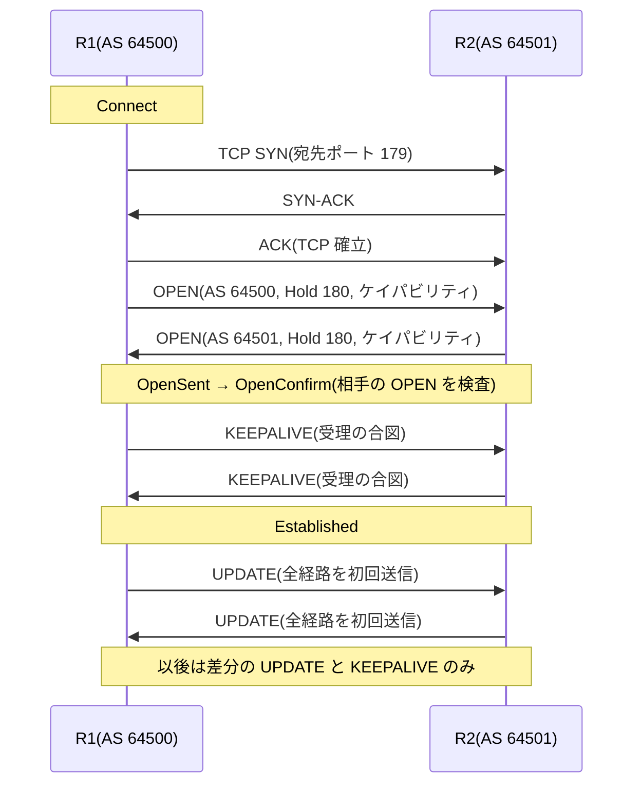

# BGP の基礎 — なぜインターネットはパスベクタを選んだか

## 概要

この章では **BGP(Border Gateway Protocol)** を、「IGP と何が違うのか」という
設計思想から立ち上げ、メッセージフォーマットとセッションのステートマシンまでを扱う。
前提知識は [IGP の位置づけの章](../01_fundamentals/05_igp_overview.md) の
AS・IGP/EGP の2階建て構造と、
[DV/LS の章](../01_fundamentals/04_distance_vector_link_state.md) のパスベクタの予告である。

## 導入 — 「最短」が答えにならない世界

[IGP の位置づけの章](../01_fundamentals/05_igp_overview.md) で見たとおり、
インターネットは AS(自律システム)の相互接続であり、AS の内側は IGP が
「正確な地図と最短経路」で面倒を見る。では AS と AS の**間**では
何が問題になるのか。IGP をそのまま外に延ばせない理由は、突き詰めると3つである。

**第一に、相手を信頼できない。**
リンクステート型は「全員が正直に一次情報をフラッディングする」ことが大前提だった。
他組織のルータが混ざった瞬間、この前提は崩れる。誰かの誤設定(あるいは悪意)が
全員の SPF 計算を狂わせる仕組みを、組織の境界を越えて使うことはできない。

**第二に、最短経路が正解とは限らない。**
AS 間の経路選択を駆動するのは距離ではなく**契約と経済関係**である。
「顧客から学んだ経路を優先する」「競合他社の網は経由しない」
「この回線は帰り道にだけ使う」— こうした要求はどれも実在するが、
メトリック最小化のアルゴリズムでは表現のしようがない。
必要なのは最適化ではなく**ポリシー(方針)の表現力**である。

**第三に、規模が桁違いである。**
インターネット全体の経路は IPv4 だけで 100 万経路規模に達する
([ルーティングテーブルの章](../01_fundamentals/02_routing_table_basics.md) 参照)。
この量を、リンク単位の詳細トポロジ付きで全ルータに持たせ、
変化のたびに全員が再計算する、という方式は量的に成立しない。
運ぶ情報を抽象化し、変化の影響範囲を絞り込む必要がある。

この3つの要求に応えるために設計されたのが BGP である。
現行仕様の BGP-4 は **RFC 4271** で定義されている
(RFC 1771 を廃止して 2006 年に改訂されたもので、
CIDR 対応・経路集約を最初から織り込んだ版である)。
本章の主題は、BGP の一見奇妙な設計 — TCP を使う、ピアを自動発見しない、
道筋を丸ごと運ぶ、定期再送しない — のすべてが、
この3要求からの必然的な帰結であることを理解することである。

なお、BGP には AS 間で使う **eBGP** と AS 内部で経路を運び回すための
**iBGP** という2つの使い方があり、両者の規則の違いが実務設計の中心論点になる。
本章はその手前の、両者に共通する土台(セッション・メッセージ・状態機械)までを扱い、
eBGP/iBGP の違いは[次章](02_ibgp_ebgp.md)に委ねる。

## 理論

BGP の設計は「4つの選択」として整理できる。それぞれが導入の3要求の
どれに応えるものかを意識しながら読んでほしい。

### 選択① トランスポートに TCP を使う

BGP のメッセージは **TCP(ポート 179)** の上で交換される。
OSPF が IP に直接載り、到達保証(ACK・再送)を自前で実装していたのとは対照的である。

これは単なる手抜きではなく、合理的な分業である。OSPF の相手は直結の隣人であり、
マルチキャストによる 1 対多の配布が本質だったから、TCP(1 対 1 の
コネクション)は使いようがなかった。一方 BGP のピアは 1 対 1 で、
しかも(iBGP では)直結ですらない相手と話すことがある。
ならば、順序保証・再送・フロー制御という面倒な仕事は
枯れた TCP に任せ、BGP 自身は経路情報の意味の処理に集中するのが筋がよい。

TCP の**順序保証**は次の選択④(差分更新)の土台にもなる。
「送った更新は必ず順番どおり相手に届く」ことが保証されているからこそ、
毎回全体を再送せず差分だけを送り続けられるのである。

### 選択② ピアは自動発見しない

OSPF は Hello のマルチキャストで隣人を自動発見した。BGP にはそれに当たる
仕組みが**存在しない**。ピアの IP アドレスと相手の AS 番号を両側で明示的に設定し、
双方の設定が噛み合って初めてセッションが確立する。

これは信頼の問題(要求その1)への直接の回答である。AS の境界では
「**誰と経路情報を交換するか」それ自体が契約事項**であり、
たまたま同じリンクにいた相手と自動的に地図を混ぜてよい世界ではない。
設定の手間は、境界での意図しない経路交換を防ぐ安全装置として機能している。
[静的 vs 動的の章](../01_fundamentals/03_static_vs_dynamic.md) の言葉を借りれば、
BGP は「経路は動的に、しかし**誰から聞くかは静的に(人間の意思で)**」という
折衷なのである。

### 選択③ 距離ではなく道筋を運ぶ — パスベクタ

[DV/LS の章](../01_fundamentals/04_distance_vector_link_state.md) の伏線を
ここで回収する。BGP は広告する経路に、その経路が**通ってきた AS の並び**を
丸ごと載せる。これが **AS_PATH** であり、この方式を**パスベクタ**と呼ぶ。

```text
AS 64500 が 203.0.113.0/24 を生成し、広告が伝搬していく:

  AS 64500 ──→ AS 64501 ──→ AS 64502 ──→ AS 64503
 (生成元)
 AS_PATH:      AS_PATH:      AS_PATH:      AS_PATH:
  (空)          64500         64501 64500   64502 64501 64500
                              ↑ 通過した AS が先頭に積まれていく
```

ループ検出はこれ以上ないほど単純になる。
**受け取った経路の AS_PATH に自分の AS 番号が入っていたら、その広告を捨てる**
(RFC 4271 Section 9.1.2)。それは自分が過去に広告した情報が
巡り巡って戻ってきたものだからである。
ディスタンスベクタの無限カウントは「広告に経路の素性が含まれない」ことが
根本原因だった。パスベクタは素性を情報自体に内蔵することでこれを解決した。

そして AS_PATH は一石二鳥である。ループ検出のために載せた道筋は、
そのまま**ポリシーの判断材料**(要求その2)になる。
「AS_PATH に AS X が含まれる経路は使わない」「道筋の短い経路を好む」といった
制御が、追加の情報なしに可能になる。
リンクステートが規模と信頼の問題で AS 間に持ち出せない以上(要求その1・3)、
トポロジを「AS の並び」まで抽象化したパスベクタは、
3つの要求すべてに同時に応えるバランス点なのである。

### 選択④ 定期再広告しない — 差分更新とハードステート

RIP は 30 秒ごとに全経路を再広告した。OSPF ですら LSA を 1800 秒ごとに
リフレッシュする。BGP はどちらもしない。セッション確立直後に全経路を
1回だけ送り、**以後は変化した分(追加・変更・撤回)だけを送る**。
再送も定期確認もすべて TCP に任せているから、
「送ったものは届いている」前提で差分を積み上げられる(選択①の帰結)。

100 万経路規模(要求その3)では、これは不可欠の設計である。
全経路の定期再送など帯域的にも処理的にも成立しない。
代償として、一度受け取った経路は相手がセッションを保っている限り
「今も有効」とみなし続けるしかない(ハードステート)。
だからこそ BGP にとって**セッションの生死判定**(後述のホールドタイマー)が
決定的に重要になる。またこの設計では「ポリシーを変えたので相手の経路を
もう一度最初から評価し直したい」ときに再受信の手段がないため、
再広告を明示的に依頼する **Route Refresh** 機能(**RFC 2918**)が
後から追加された。

### 経路はどこに溜まるのか — 3つの RIB

[ルーティングテーブルの章](../01_fundamentals/02_routing_table_basics.md) で
導入した RIB を、BGP は概念上3段に分けて使う(RFC 4271 Section 3.2):

```text
 ピア A から受信 ──→ [Adj-RIB-In (A)] ──┐
                                        ├─ 入力ポリシー → ┌─────────┐ → 出力ポリシー → [Adj-RIB-Out (A)] ──→ ピア A へ広告
 ピア B から受信 ──→ [Adj-RIB-In (B)] ──┘   + 経路選択     │ Loc-RIB │ → 出力ポリシー → [Adj-RIB-Out (B)] ──→ ピア B へ広告
                                                          └─────────┘
                                                               │
                                                               ↓ 最良経路を RIB(ルーティングテーブル)へ差し出す
```

- **Adj-RIB-In**: ピアごとの「受信したままの経路」の置き場
- **Loc-RIB**: 入力ポリシーを通過した候補から**経路選択**で選ばれた、自分が使う経路
- **Adj-RIB-Out**: ピアごとの「広告すると決めた経路」の置き場

重要なのは、ピアとの受け渡しの**前後に必ずポリシーの関所がある**ことである。
IGP では「受け取った情報は地図に反映する」以外の選択肢がなかったが、
BGP では受信した経路を使うか・どう加工するか・誰に広告するかのすべてが
制御点になる(制御の道具立ては [04 章](04_policy_control.md) で扱う)。

Loc-RIB での経路選択も IGP と根本的に異なる。メトリックという単一の数値の
最小化ではなく、**複数の属性を決まった順序で比較する多段の判定**
(RFC 4271 Section 9.1 の Decision Process)であり、
管理者はポリシーで属性を書き換えることによって判定結果を操作する。
比較の各段(LOCAL_PREF、AS_PATH 長、MED、…)は
[パスアトリビュートの章](03_path_attributes.md)の主題である。

なお、勝者が Loc-RIB からルーティングテーブル(RIB)へ差し出されたあと、
[管理距離](../01_fundamentals/02_routing_table_basics.md) による情報源間の比較や
ネクストホップの再帰的ルックアップという第1部の仕組みがそのまま適用される。
BGP は経路の「選び方」こそ独特だが、テーブルへの載り方は
これまで学んだ枠組みの中にある。

## プロトコル動作の詳細

### メッセージ — 共通ヘッダと4つの型

BGP のメッセージは4種類しかない。すべてのメッセージは
19 オクテットの共通ヘッダで始まる(RFC 4271 Section 4.1):

```text
 0                   1                   2                   3
 0 1 2 3 4 5 6 7 8 9 0 1 2 3 4 5 6 7 8 9 0 1 2 3 4 5 6 7 8 9 0 1
+-+-+-+-+-+-+-+-+-+-+-+-+-+-+-+-+-+-+-+-+-+-+-+-+-+-+-+-+-+-+-+-+
|                                                               |
+                                                               +
|                                                               |
+                            Marker(16 オクテット、全ビット 1)  +
|                                                               |
+                                                               +
|                                                               |
+-+-+-+-+-+-+-+-+-+-+-+-+-+-+-+-+-+-+-+-+-+-+-+-+-+-+-+-+-+-+-+-+
|            Length             |     Type      |
+-+-+-+-+-+-+-+-+-+-+-+-+-+-+-+-+-+-+-+-+-+-+-+-+
```

Marker は旧仕様で認証に使われた名残で、現在は全ビット 1 の固定値である
(同期ずれの検出に使われる)。メッセージの最大長は 4096 オクテット
(**RFC 8654** により 65535 まで拡張するオプションもある)。

| Type | 名称 | 役割 |
|---|---|---|
| 1 | OPEN | セッション開始時の自己紹介と条件交渉 |
| 2 | UPDATE | 経路の広告と撤回(BGP の本業) |
| 3 | NOTIFICATION | エラーの通知。送信後セッションは切断される |
| 4 | KEEPALIVE | 生存通知(共通ヘッダのみの 19 オクテット) |

### OPEN — 自己紹介と条件交渉

TCP コネクションが確立すると、双方がまず OPEN を送る(RFC 4271 Section 4.2):

```text
+-+-+-+-+-+-+-+-+
|    Version    |                    ← 常に 4(BGP-4)
+-+-+-+-+-+-+-+-+-+-+-+-+-+-+-+-+
|     My Autonomous System      |    ← 自分の AS 番号(2 オクテット)
+-+-+-+-+-+-+-+-+-+-+-+-+-+-+-+-+
|           Hold Time           |    ← 提案するホールドタイム
+-+-+-+-+-+-+-+-+-+-+-+-+-+-+-+-+-+-+-+-+-+-+-+-+-+-+-+-+-+-+-+-+
|                         BGP Identifier                        |
+-+-+-+-+-+-+-+-+-+-+-+-+-+-+-+-+-+-+-+-+-+-+-+-+-+-+-+-+-+-+-+-+
| Opt Parm Len  |  Optional Parameters(可変長)...
+-+-+-+-+-+-+-+-+-+-+-+-+-+-+-+-+-+-+-+-+-+-+-+-+-+-+-+-+-+-+-+-+
```

- **My Autonomous System**: 受信側は、この値が**自分が設定で期待している
  相手 AS 番号**と一致するかを検査する。不一致なら NOTIFICATION
  (OPEN Message Error / Bad Peer AS)で拒絶する。
  フィールドは 2 オクテットしかないため、32 ビット AS 番号
  ([RFC 6793](../01_fundamentals/05_igp_overview.md))は
  ここに AS_TRANS(23456)を置き、実際の値をケイパビリティで伝える
- **Hold Time**: 生存判定のタイムアウト値の**提案**。双方の提案の
  **小さいほう**が採用される。値は 0(生存監視の無効化)か 3 秒以上で
  なければならない。RFC 4271 Section 10 の推奨値は 90 秒だが、
  実装の既定値は 180 秒(KEEPALIVE 60 秒間隔)であることが多い
- **BGP Identifier**: BGP スピーカーの 32 ビット識別子。OSPF のルータ ID と
  同様に IPv4 アドレスの形をした「ただの番号」であり、
  自分の IPv4 アドレスの1つを使うのが伝統的だが、一意でありさえすればよい
  (**RFC 6286** で要件が緩和された)
- **Optional Parameters**: 事実上**ケイパビリティ広告**(**RFC 5492**)のための
  場所である。「32 ビット AS 番号を使える」「IPv6 経路も運べる(MP-BGP、
  詳細は [05 章](05_mp_bgp.md))」「Route Refresh に応じられる」といった
  拡張機能を双方が申告し、**両方が申告した機能だけ**がセッションで有効になる。
  BGP が 30 年にわたり後方互換を保って拡張されてこられたのは、
  この交渉の仕組みによるところが大きい

KEEPALIVE はホールドタイムの 1/3 の間隔で送るのが規定である
(90 秒なら 30 秒間隔。ただし RFC 4271 Section 4.4 により 1 秒より短くしてはならない)。
ホールドタイムの間、UPDATE も KEEPALIVE も受信しなければ
ピアは死んだとみなされ、セッションは破棄される。

### UPDATE — 広告と撤回

BGP の本業である UPDATE の構造は次のとおり(RFC 4271 Section 4.3):

```text
+-----------------------------------------------------+
|   Withdrawn Routes Length(2 オクテット)            |
+-----------------------------------------------------+
|   Withdrawn Routes(可変長)                         |  ← 撤回する経路の一覧
+-----------------------------------------------------+
|   Total Path Attribute Length(2 オクテット)        |
+-----------------------------------------------------+
|   Path Attributes(可変長)                          |  ← AS_PATH、NEXT_HOP など
+-----------------------------------------------------+
|   Network Layer Reachability Information(可変長)   |  ← 広告する経路の一覧
+-----------------------------------------------------+
```

広告される経路(プレフィックス)は **NLRI(Network Layer Reachability
Information)** と呼ばれる。ここで設計上の要点が1つある:
**1つの UPDATE に載る NLRI は、すべて同じパスアトリビュート一式を共有する**。
「属性の組が同じ経路はまとめて1通で送る」ことで、
大量の経路を効率よく運べる(逆に、属性が1つでも違う経路は別の UPDATE になる)。

撤回は Withdrawn Routes にプレフィックスを列挙するだけで、属性は付かない。
「その宛先にはもう行けない」という事実の通知だけで十分だからである。
1通の UPDATE は「撤回だけ」「広告だけ」「両方」のいずれもありうる。

パスアトリビュートそれぞれの意味論(AS_PATH、NEXT_HOP、LOCAL_PREF、MED、…)は
第3部の中心テーマとして [03 章](03_path_attributes.md)で扱う。
本章では「UPDATE = 属性一式を共有するプレフィックス群の広告 + 撤回リスト」
という構造だけ押さえればよい。

### NOTIFICATION — 引き返せないエラー通知

エラーを検出した側は NOTIFICATION(エラーコード + サブコード + データ)を
送信し、**直後にセッションを切断する**。交渉や回復の手段ではなく、
「なぜ切ったか」を相手のログに残すための遺言である。
管理的な切断・リセットを表す Cease コードのサブコード(**RFC 4486**)まで含めて、
トラブルシューティングでは NOTIFICATION の中身が最初の手がかりになる。

### セッションのステートマシン

BGP の FSM(RFC 4271 Section 8)は6状態である:

| 状態 | 意味 |
|---|---|
| Idle | 初期状態。設定はあるが何もしていない(エラー後の待機もここに戻る) |
| Connect | 自分から TCP コネクションを張りに行っている |
| Active | TCP 接続の**受け身**待ち(自分からの接続試行が実らず、相手からの着信を待つ) |
| OpenSent | TCP 確立、OPEN を送信し、相手の OPEN を待っている |
| OpenConfirm | 相手の OPEN を検査して受理し、KEEPALIVE(受理の合図)を待っている |
| Established | セッション確立。UPDATE の交換が始まる |

名前の罠に注意してほしい。**Active は「活発に動いている」状態ではない**。
自分からの TCP 接続が成立せず、ConnectRetry タイマー(推奨 120 秒)を抱えて
Connect と Active を行き来している状態は、
ほぼ確実に「TCP ポート 179 の疎通がない」ことを意味する
(トラブルシューティングの節で扱う)。

双方が同時に接続を張りにいくと TCP コネクションが2本できることがある
(コネクション衝突)。この場合は双方の BGP Identifier を比較し、
**大きい側が張ったコネクションを残す**という規則で1本に畳まれる
(RFC 4271 Section 6.8)。

確立までの正常系を通しで見ると:



Established 後の日常は静かである。ネットワークに変化がなければ
流れるのは KEEPALIVE だけであり、変化があったときだけ差分の UPDATE が流れる。
OSPF の LSA リフレッシュのような定期的な再広告は存在しない(選択④)。

## 設定例(補助)

セッションの状態と「差分だけが流れる」動作は、実機で直接観察できる。
以下は FRRouting での最小の eBGP 設定例である:

```text
router bgp 64500
 neighbor 192.0.2.2 remote-as 64501
 !
 address-family ipv4 unicast
  network 203.0.113.0/24
 exit-address-family
```

「相手のアドレス」と「相手の AS 番号」を明示する neighbor 文が
選択②(自動発見しない)の具体的な姿である。相手側にも対になる設定が必要で、
`remote-as` が実際の相手と食い違えば OPEN の検査で拒絶される。

状態確認の基本は summary 表示である:

```text
router# show bgp summary

Neighbor        V   AS   MsgRcvd MsgSent   Up/Down  State/PfxRcd
192.0.2.2       4 64501     1024    1021  01:02:03            12
```

State/PfxRcd 列は「Established なら受信経路数を、そうでなければ状態名を」表示する。
つまり**数字が見えていれば正常**、Idle / Connect / Active が見えていれば
セッション未確立である。Up/Down(セッション継続時間)が異常に短いまま
リセットを繰り返していないかも、この1行から読み取れる。

## トラブルシューティング

BGP の切り分けは「FSM のどこで止まっているか」から始めるのが定石である。
状態名がそのまま原因の層を教えてくれる。

### 症状: Idle → Connect → Active を巡回して Established にならない

- OPEN 以前、**TCP ポート 179 の疎通の問題**である。ピアアドレスへの
  IP 到達性(ping)、途中のフィルタ(ACL・ファイアウォールが 179 を
  落としていないか)、そして eBGP なら TTL の問題
  (eBGP パケットの TTL は既定で 1 であり、直結でないピアへは届かない。
  詳細は[次章](02_ibgp_ebgp.md))を順に確認する
- tcpdump では `tcp port 179` で観察する。SYN が出ているのに応答がなければ
  経路上で落ちており、RST が返っていれば相手に到達はしているが
  相手側で BGP が待ち受けていない(設定漏れ・ピアアドレスの不一致)

### 症状: OpenSent / OpenConfirm まで進んですぐ切れる

- TCP は通っており、**OPEN の検査で拒絶されている**。相手からの
  NOTIFICATION のコードがそのまま答えである: Bad Peer AS なら
  こちらの `remote-as` 設定と相手の実際の AS 番号の不一致、
  Bad BGP Identifier なら BGP Identifier の重複(コピーした設定の
  修正漏れで起こりやすい)を疑う
- ログに残る NOTIFICATION を必ず読む。BGP は「なぜ切ったか」を明示的に
  伝えてくるプロトコルであり、当てずっぽうで設定を触る必要はない

### 症状: Established で経路も受信しているのに、通信できない

- BGP としては健全で、問題は**テーブルへの反映**にある。第1部の枠組みで切り分ける:
  受信経路のネクストホップが[再帰的ルックアップ](../01_fundamentals/02_routing_table_basics.md)
  で解決できなければ、その経路は無効であり RIB に載らない
  (IGP との分業([IGP の位置づけの章](../01_fundamentals/05_igp_overview.md))が
  崩れている典型 — ネクストホップのループバックが IGP から消えていないか)
- `show bgp ipv4 unicast <プレフィックス>` で当該経路の詳細を見ると、
  ネクストホップとその解決可否、選択された/されなかった理由が表示される。
  「BGP のテーブルにはあるがルーティングテーブルにない」なら
  ほぼネクストホップ解決か管理距離の問題である

### 症状: 安定稼働していたセッションが周期的に Hold Timer Expired で切れる

- KEEPALIVE は 19 オクテットと小さいため、これが届かないのは単純な断ではなく
  **輻輳か、大きなパケットだけ落ちる経路**を疑う。特に後者
  (PMTUD ブラックホール)は典型で、大きな UPDATE が MTU の壁で
  送信できないまま TCP の送信キューに詰まると、**後続の KEEPALIVE も
  同じ TCP ストリームの後ろに並んで送信されなくなり**、
  経路自体は生きているのにホールドタイマーが満了する
- 「セッションが確立し、経路交換が始まった直後に必ず切れる」という
  パターンなら PMTUD ブラックホールの疑いが濃い。
  [VXLAN の章](../02_vlan_vxlan_evpn/03_vxlan_fundamentals.md) で述べた
  MTU の切り分け(DF 付き ping のサイズ二分探索)がそのまま使える

## 演習・確認問題

1. IGP を AS 間の経路制御にそのまま使えない理由を、
   信頼モデル・ポリシー・規模の3つの観点から説明せよ。
2. BGP が OSPF と異なり TCP を使えるのはなぜか。また TCP の順序保証が
   BGP の「差分更新」の設計とどう結びついているかを説明せよ。
3. BGP がピアを自動発見しないことは、AS 境界においてどのような
   安全装置として機能するか。
4. AS_PATH によるループ検出の仕組みを述べ、ディスタンスベクタの
   無限カウント問題がなぜパスベクタでは起こらないのかを説明せよ。
5. Adj-RIB-In、Loc-RIB、Adj-RIB-Out の役割をそれぞれ述べ、
   IGP にはない「ポリシーの関所」がどこに挟まるかを示せ。
6. OPEN メッセージのホールドタイムはどのように合意されるか。
   また KEEPALIVE の送信間隔の規定値との関係を述べよ。
7. ピアの状態が Active のまま進まない場合と、OpenSent から
   NOTIFICATION(Bad Peer AS)で切れる場合とでは、
   調べるべき層がどう違うか。
8. 「BGP のテーブルには経路があるのに、ルーティングテーブルに載らない」
   という状態はなぜ起こりうるか。第1部で学んだ2つの概念
   (再帰的ルックアップ・管理距離)を使って説明せよ。

## まとめ

- BGP(RFC 4271)は AS 間の経路制御プロトコルであり、その設計は
  「相手を信頼できない・最短ではなくポリシーで選ぶ・桁違いの規模」という
  IGP と異なる3要求からの帰結である
- TCP(ポート 179)への分業、ピアの明示設定、AS_PATH による
  パスベクタ(ループ検出とポリシー材料の一石二鳥)、差分更新という
  4つの選択が BGP の骨格をなす
- メッセージは OPEN / UPDATE / NOTIFICATION / KEEPALIVE の4種のみ。
  UPDATE は「属性一式を共有する NLRI 群の広告 + 撤回リスト」である
- セッションは Idle → Connect/Active → OpenSent → OpenConfirm → Established と
  進む。状態名は切り分けの地図であり、Active 止まりは TCP 疎通、
  OPEN 直後の切断は NOTIFICATION の中身を見る
- 経路は Adj-RIB-In → Loc-RIB → Adj-RIB-Out の3段を、
  ポリシーの関所を通りながら流れる。選択の詳細(パスアトリビュートと
  Decision Process)が次章以降の主題である
