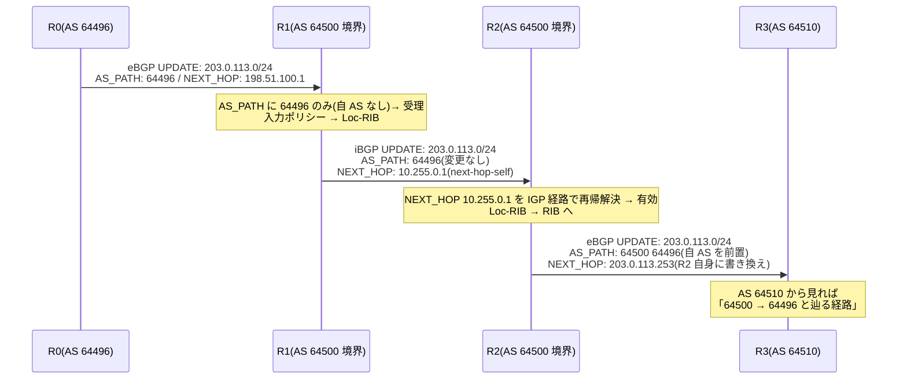

# iBGP と eBGP — 同じプロトコル、2つの規則

## 概要

この章では、BGP の2つの使い方 — AS 間の **eBGP**(external BGP)と
AS 内部の **iBGP**(internal BGP)— の規則の違いと、その違いが生まれる必然を扱う。
前提知識は [BGP の基礎の章](01_bgp_basics.md) のセッション・メッセージ・3段の RIB と、
[IGP の位置づけの章](../01_fundamentals/05_igp_overview.md) の IGP/BGP の分業である。

## 導入 — 経路は AS をどう「通り抜ける」のか

前章では BGP を「AS 間のプロトコル」として導入した。ところが実際の AS の中を
覗くと、BGP は AS の**内部でも**動いている。なぜ内部のプロトコルである IGP が
あるのに、内部で BGP を走らせる必要があるのか。この問いが本章の出発点である。

トランジット AS(他 AS 間のトラフィックを中継する AS)を考える。
AS 64500 が、左隣の AS 64496 から eBGP で経路を受け取り、
右隣の AS 64510 へ広告するとしよう:

```text
   AS 64496              AS 64500(トランジット)              AS 64510
  ┌────────┐        ┌──────────────────────────────┐        ┌────────┐
  │   R0   │─ eBGP ─│   R1 ────── P ────── R2      │─ eBGP ─│   R3   │
  └────────┘        └──────────────────────────────┘        └────────┘
 203.0.113.0/24        ↑                        ↑
   を生成          ここで受信した経路を、反対側の境界 R2 まで
                   どうやって運ぶか?
```

境界ルータ R1 が受け取った経路を、もう一方の境界 R2 が知らなければ、
R2 は AS 64510 へ何も広告できない。つまり **AS の内部で経路を運ぶ仕組み**が要る。

素朴な答えは「IGP に再配送すればよい」である。しかしこれは二重に破綻する。
第一に**規模**。インターネットの経路は 100 万経路規模であり
([ルーティングテーブルの章](../01_fundamentals/02_routing_table_basics.md) 参照)、
リンクの変化のたびに SPF を回す IGP にこの量を背負わせる設計は成立しない。
[再配送](../01_fundamentals/03_static_vs_dynamic.md) は本来、少数の経路を
橋渡しする道具である。第二に**情報の喪失**。IGP の経路には AS_PATH を
載せる場所がない。再配送した瞬間に道筋の情報が失われ、ループ検出も
ポリシー判断もできない「ただの宛先」に退化してしまう。

そこで BGP は、**AS 内部の運搬にも BGP 自身を使う**。これが iBGP である。
ピアの AS 番号が自分と同じなら iBGP、異なれば eBGP — 使うメッセージも
FSM も UPDATE の形式も前章のものと完全に同一であり、プロトコルとしては
1つである。違うのは**広告の規則**、すなわち「受け取った経路を誰に・どう
加工して渡すか」だけである。そしてこの規則の違いこそが、
iBGP フルメッシュ、ネクストホップ問題、ルートリフレクタといった
BGP 実務設計の中心論点をすべて生み出す源になっている。

先に釘を刺しておくと、**iBGP は IGP の代替ではない**。
[IGP の位置づけの章](../01_fundamentals/05_igp_overview.md) の分業
— IGP は土台(ルータ間リンクとループバック)、BGP は積み荷(顧客・外部経路)—
はそのままである。それどころか後述のとおり、iBGP は自分のセッションと
ネクストホップ解決を IGP に**依存して**動く。2つは代替関係ではなく積層関係にある。

## 理論

### eBGP の規則 — 境界の作法

eBGP ピアへ経路を広告するとき、BGP スピーカーは次の加工を行う。

**① AS_PATH に自分の AS 番号を前置する**(RFC 4271 Section 5.1.2)。
前章で見た「通過した AS が積まれていく」動作の実体はここにある。
AS_PATH が伸びるのは**経路が AS の境界を外向きに越える瞬間だけ**である。

**② NEXT_HOP を自分のアドレス(ピアと向き合うインタフェース)に書き換える**
(RFC 4271 Section 5.1.3)。境界を越えたら「この宛先へはまず私に投げよ」と
名乗り直す。相手 AS から見れば、隣 AS の内部トポロジは見えないのだから、
入口である境界ルータ自身がネクストホップになるのが自然である
(なお同一セグメント上に3台以上が同居する場合、余計な1ホップを省くために
自分以外のアドレスをネクストホップとして案内する「第三者ネクストホップ」も
仕様上は認められているが、例外的な最適化である)。

**③ TTL = 1 で送る(直結前提の慣例)**。
RFC 4271 自体はピアの直結を要求していないが、eBGP ピアは境界のリンクで
直接向き合うのが典型であるため、多くの実装は eBGP パケットの TTL を 1 に
設定し、遠くから来た BGP 接続を受け付けない。これは「境界の相手は
物理的にも隣にいるはずだ」という前提を安全装置に変えたものである。
直結でない eBGP ピアが必要な場合は、TTL を明示的に増やす
(いわゆる eBGP マルチホップ)。

さらに強い形として **GTSM(Generalized TTL Security Mechanism、RFC 5082)**
がある。発想が逆転している点が面白い: TTL を**最大値の 255 で送り**、
受信側は「TTL がほぼ 255 のまま届いたか」を検査する。
[TTL](../01_fundamentals/01_l2_l3_recap.md) はルータを通過するたびに
減ることはあっても増えることはないから、**ネットワークの遠くにいる攻撃者には
TTL 255 で届くパケットを偽造する手段が原理的にない**。
「小さい TTL で届かなくする」のではなく「大きい TTL を直結の証明に使う」のである。

### iBGP の規則 — 内側の作法

iBGP ピアへ経路を広告するときは、eBGP と正反対の規則が働く。

**① AS_PATH を変更しない**。自 AS 番号を積むのは境界を越えるときだけであり、
AS の内側を運ばれている間、AS_PATH は受け取ったままである。

**② NEXT_HOP を変更しない**(RFC 4271 Section 5.1.3、SHOULD NOT)。
eBGP で学んだときの外部ネクストホップが、そのまま AS 内部を運ばれていく。
この規則が後述の「ネクストホップ解決問題」を生む。

そして①には重大な帰結がある。AS_PATH が変化しないということは、
**AS の内部では AS_PATH によるループ検出が働かない**ということである。
iBGP ピアの間で経路が広告され回っても、AS_PATH に自 AS が現れることは
ないから、前章のループ検出(自 AS を含む広告の破棄)は一度も発火しない。

BGP はこの穴を、力ずくの規則で塞いだ:

**③ iBGP ピアから学んだ経路は、他の iBGP ピアへ再広告しない**
(RFC 4271 Section 9.2)。

聞いた話を内側で又聞きさせない、という**伝聞の禁止**である。
経路が iBGP 上を移動できるのは常に1ホップだけになり、
ループは構造的に起こりようがなくなる。
[DV/LS の章](../01_fundamentals/04_distance_vector_link_state.md) の
スプリットホライズン(教えてくれた本人には返さない)との類推で、
この規則は **iBGP スプリットホライズン**と俗称される
(RFC 4271 にこの名は登場しない。仕様上は Update-Send Process の
再配布制限であり、DV のものより格段に強い — 本人どころか
内部の**全員**に返さないのだから)。

### フルメッシュ — 規則③の代償

規則③の代償は明白である。経路が iBGP を1ホップしか移動できないなら、
**すべての iBGP スピーカーが互いに直接ピアを張る**しかない。
これが **iBGP フルメッシュ**の要求である。

```text
 R1 ─── R2        4台なら 6 本:   n 台なら n(n-1)/2 本:
 │ ╲   ╱ │         R1-R2, R1-R3,    10 台 →  45 本
 │   ╳   │         R1-R4, R2-R3,    50 台 → 1225 本
 │ ╱   ╲ │         R2-R4, R3-R4    100 台 → 4950 本
 R3 ─── R4
 (物理リンクではなく iBGP セッションの網であることに注意。
  TCP なので直結は不要、IGP が届けてくれる限り誰とでも張れる)
```

セッション数は台数の2乗で増える。設定量だけの問題ではなく、
1台追加するたびに**既存の全台の設定に触る**という運用の性質が痛い
([静的 vs 動的の章](../01_fundamentals/03_static_vs_dynamic.md) で見た
「静的な構成が規模で破綻する」パターンの再演であり、
[ヘッドエンドレプリケーション](../02_vlan_vxlan_evpn/04_vxlan_control_plane.md)の
静的リストと同型の問題でもある)。
この破綻を救う**ルートリフレクタ**(RFC 4456)と**コンフェデレーション**
(RFC 5065)は、[第3部の大規模設計の章](06_large_scale_design.md)の
主題である。本章では「フルメッシュが原則、緩和策は別章」とだけ押さえる。

なお、eBGP にはこの制限がない。eBGP から学んだ経路は eBGP へも iBGP へも
再広告できる(AS_PATH が守ってくれる)。iBGP から学んだ経路も eBGP へは
再広告できる(境界を越える瞬間に自 AS が積まれ、以後は AS_PATH が守る)。
禁じられているのは「iBGP → iBGP」の1パターンだけである。

### 境界と内側で何が変わるか — 一覧

| 項目 | eBGP ピアへの広告 | iBGP ピアへの広告 |
|---|---|---|
| AS_PATH | 自 AS 番号を前置する | 変更しない |
| NEXT_HOP | 自分のアドレスに書き換える | 変更しない |
| 再広告の制限 | なし(AS_PATH がループを防ぐ) | iBGP から学んだ経路は広告不可 |
| LOCAL_PREF 属性 | 付けない(AS 内ローカルな値) | 必ず付ける |
| MED 属性 | 付けられる(受け取った隣 AS 止まり) | 受けた値を保持して運ぶ |
| TTL(慣例) | 1(直結前提) | 通常値(遠隔ピア前提) |
| 管理距離(Cisco 系慣例) | 20 | 200 |

LOCAL_PREF と MED の行は次章の予告である。属性には「AS 内だけで通用するもの」と
「境界を越えるもの」があり、**どの属性がどこまで届くかというスコープの違い**が
そのままポリシー設計の道具立てになる。意味論の詳細は
[パスアトリビュートの章](03_path_attributes.md)で扱う。

管理距離の行は [第1部の管理距離](../01_fundamentals/02_routing_table_basics.md) の
復習である(RFC 非標準のベンダー慣例であることも同様)。eBGP の 20 は
静的経路に迫る強さで、iBGP の 200 は全情報源中の最弱クラス —
「外の世界から境界で直接聞いた話は信じるが、内部を伝聞で運ばれてきた話は
IGP が同じ宛先を知っているならそちらに譲る」という思想の表現である
(Juniper 系は両者を区別せず 170 とするなど、ここも慣例の分かれる領域である)。

### ネクストホップ問題 — iBGP が IGP に依存する場所

iBGP の規則②(NEXT_HOP を変更しない)の帰結を追いかけよう。
冒頭のトランジット構成で、R1 が R0(198.51.100.1)から経路を受けたとする。
R1 がこれを iBGP で R2 へ渡すとき、NEXT_HOP は **198.51.100.1 のまま**である。

R2 にとって 198.51.100.1 は、自分の直結どころか AS 64500 の外側、
R0 と R1 の間の境界リンクのアドレスである。R2 はこのネクストホップを
[再帰的ルックアップ](../01_fundamentals/02_routing_table_basics.md) で
解決できなければ、**経路を Loc-RIB に採用できない**
(前章のトラブルシューティングで見た「BGP のテーブルにはあるのに使われない」
状態そのものである)。解決策は2つしかない:

- **境界リンクのサブネットを IGP に載せる**。R2 の IGP テーブルに
  198.51.100.0/30 への経路ができ、再帰が解決する。ただし「IGP には
  土台だけを載せる」という分業からは半歩はみ出す
- **R1 が iBGP へ渡すときに NEXT_HOP を自分のループバックに
  書き換える** — いわゆる**ネクストホップセルフ**(next-hop-self)。
  規則②は SHOULD NOT であって MUST NOT ではなく、境界ルータが
  「外の詳細は私が引き受ける。内側の諸君は私(のループバック)まで
  届けばよい」と宣言するこの設定は、SHOULD を破る正当な理由の代表である。
  ループバックは IGP が常に運んでいる(分業の定石)から、再帰は必ず解決する

実務の主流は後者である。境界の外のアドレスを AS 内部の全ルータに
知らせて回るより、境界ルータで知識を打ち切るほうが、
IGP を土台に保つ分業に忠実だからである。

### ピアリングの張り方 — 物理か、ループバックか

eBGP と iBGP では、セッションをどのアドレスで張るかの定石も逆になる。

**eBGP は境界リンクの物理インタフェースアドレスで張る**のが基本である。
ピアは直結であり(TTL = 1 の慣例とも整合)、境界リンクが死んだら
セッションも道連れに死んでくれるほうが、切り替えが速くて正しい。

**iBGP はループバックアドレスで張る**のが定石である。
[IGP の位置づけの章](../01_fundamentals/05_igp_overview.md) で
「ルータの不変の名前」として導入したループバックの、これが本領である。
R1 と R2 の間に物理経路が複数あるとき、物理アドレスでセッションを張ると
そのリンクの断でセッションが無意味に死ぬ。ループバック同士で張っておけば、
**IGP が迂回路を見つけて再収束する限り、TCP は途切れず、
iBGP セッションは障害を関知すらしない**。IGP の収束の速さが
そのまま iBGP の可用性になる — これが「積層関係」の具体的な意味である。

このとき忘れてはならないのが**送信元アドレスの指定**(update-source)である。
TCP コネクションの送信元は既定では出力インタフェースのアドレスになるため、
何も指定しなければ「ループバック宛てに張ったのに、送信元は物理アドレス」という
非対称が生じる。相手は物理アドレスからの接続を「設定にないピア」として
拒絶する(トラブルシューティングの節で再訪する)。

## プロトコル動作の詳細

### ウォークスルー — 1本の経路がトランジット AS を通り抜ける旅

冒頭の構成で、203.0.113.0/24 の広告が AS 64500 を通り抜ける全行程を追う。
R1・R2 はループバック(10.255.0.1 / 10.255.0.2)で iBGP を張り、
R1 はネクストホップセルフを設定しているものとする。



各区間で何が起こったかを整理する:

| 区間 | 種別 | AS_PATH | NEXT_HOP |
|---|---|---|---|
| R0 → R1 | eBGP | 64496(R0 が自 AS を前置) | R0 の境界アドレス |
| R1 → R2 | iBGP | 64496 のまま | R1 のループバック(next-hop-self) |
| R2 → R3 | eBGP | 64500 64496(R2 が前置) | R2 の境界アドレス |

AS_PATH が伸びるのは境界を越える2回だけ、NEXT_HOP の書き換えは
eBGP の規則1回と next-hop-self の判断1回。表のすべてのマス目が
理論の節の規則の適用結果になっていることを確認してほしい。

### 経路を知らない中継ルータ — P の問題

ウォークスルーには意図的に無視した登場人物がいる。R1 と R2 の間にいる
中継ルータ **P** である。P が IGP しか話さないとすると、何が起こるか。

R2 が AS 64510 から 203.0.113.0/24 宛てのパケットを受け取り、
RIB に従って R1 方向 — 物理的には P — へ転送する。ところが
**P のテーブルに 203.0.113.0/24 は存在しない**。P は IGP の経路
(ループバックとリンク)しか知らないからである。パケットは P で捨てられ、
[ブラックホール](../01_fundamentals/03_static_vs_dynamic.md) が完成する。
コントロールプレーン(R1・R2 の間の iBGP)は健全なのに、
データプレーンがホップバイホップ転送である以上、
**通り道の全員が宛先を知らなければ運べない**のである。

古い BGP 実装が持っていた**同期(synchronization)**という規則
— iBGP で学んだ経路は、同じ宛先が IGP にも現れるまで使わない・広告しない —
はこの事故の防止装置だった(IGP への再配送とセットで使う前提の、
BGP-4 以前からの運用規則であり、RFC 4271 のプロトコル仕様には含まれない)。
しかし外部経路を IGP に再配送する前提そのものが規模で破綻したため、
この規則は歴史的遺物となり、現代の実装では無効が既定である。

現代の答えは2つある。**①転送に関与する全ルータに iBGP を話させる**
(P もフルメッシュ(または後述のルートリフレクタ配下)に参加させる)。
**②パケットをトンネルで包み、P には外側の宛先(R1 のループバック)だけを
見せる**。②は [VXLAN の章](../02_vlan_vxlan_evpn/03_vxlan_fundamentals.md) で
学んだ「中継網を学習から解放する」発想そのものであり、
[MPLS](../05_mpls_srv6/01_mpls_basics.md)(第5部)が
ISP のコアでまさにこれを行う(BGP フリーコア)。
本章の時点では①を前提に進む。

### セッションから見た違いの正体

ここまでの規則を「セッションの張り方」の観点で束ね直すと、
eBGP と iBGP の性格の違いが一枚の絵になる:

- **eBGP セッションは境界リンクに寄り添う**。直結・物理アドレス・TTL 1。
  リンクの生死とセッションの生死を一致させ、境界の障害に即応する。
  信頼の単位は「この物理的な接続そのもの」である
- **iBGP セッションはトポロジから浮いている**。ループバック・マルチホップ・
  IGP 依存。物理障害は IGP が吸収し、セッションは論理的な関係として持続する。
  信頼の単位は「同じ AS に属する管理下のルータ」である

同じプロトコルでありながら、境界では物理に密着し、内側では物理から遊離する。
規則の違い(AS_PATH・NEXT_HOP・再広告制限)はすべて、
「境界の外は信用しないが情報は加工して受け渡す/内側は信用するが
伝聞は禁じる」という信頼モデルの違いの写像である。

## 設定例(補助)

以下は FRRouting での、ウォークスルーの R1 に相当する設定である。
eBGP と iBGP の対比に注目してほしい:

```text
router bgp 64500
 neighbor 198.51.100.1 remote-as 64496      ← AS 番号が異なる → eBGP(直結・物理アドレス)
 neighbor 10.255.0.2 remote-as 64500        ← AS 番号が同じ → iBGP(相手のループバック)
 neighbor 10.255.0.2 update-source lo       ← 送信元も自分のループバックに固定
 !
 address-family ipv4 unicast
  neighbor 10.255.0.2 next-hop-self         ← iBGP へ渡すとき NEXT_HOP を自分に
 exit-address-family
```

eBGP か iBGP かを指定する専用のコマンドはない。**remote-as が自分の
AS 番号と同じか否か**、それだけで動作規則の一式が切り替わる。
「同じプロトコル、2つの規則」が設定の形にも表れている。

R2 側で受信経路を見ると:

```text
router# show bgp ipv4 unicast
     Network          Next Hop            Metric LocPrf Weight Path
 *>i 203.0.113.0/24   10.255.0.1               0    100      0 64496 i
```

行頭の **i** が「iBGP から学んだ経路」の印である。Next Hop は
R1 のループバック(next-hop-self の結果)、LocPrf 列に値が入っている
(LOCAL_PREF は iBGP では必ず付く)、そして Path は 64496 のみ
(内側では自 AS が積まれない)。前節までの規則がすべて1行に凝縮されている。

## トラブルシューティング

### 症状: 直結でない eBGP ピアが Connect / Active を巡回する

- 前章の「Active 止まりは TCP 疎通」の各論として、eBGP 特有の原因が
  **TTL** である。eBGP パケットは既定で TTL 1 のため、ピアとの間に
  ルータが1台でも挟まると、SYN は届いても BGP のパケットが途中で
  寿命切れになる(あるいは実装によっては着信側が受信パケットの TTL を
  検査して捨てる)
- tcpdump で `tcp port 179` を観察し、届いたパケットの TTL を確認する。
  マルチホップの設定(TTL の引き上げ)で解決するが、その前に
  「本当に直結でないピアリングが必要か」を疑うべきである。
  また GTSM(RFC 5082)を使う場合は**両側で**有効にする —
  片側だけだと、TTL 255 を期待する側に TTL 1 のパケットが届き、
  今度は逆向きの理由でセッションが確立しない

### 症状: iBGP ピアがループバック間で確立しない(eBGP は正常)

- ループバックピアリング特有の落とし穴を順に疑う。
  **①送信元の不一致**: update-source の指定漏れで、TCP SYN の送信元が
  物理インタフェースのアドレスになっている。相手はそのアドレスを
  ピアとして設定していないから、接続は「知らない相手」として拒絶される
  (tcpdump では SYN への RST 応答、あるいは相手のログに
  未設定ピアからの接続試行として記録される)。
  **②ループバックへの経路がない**: IGP がループバックを配っていなければ
  TCP 以前に IP 到達性がない。`ping <相手ループバック> source <自ループバック>` が
  最初の切り分けである。
  **③ TTL**: iBGP は TTL の制限なし(通常値)が既定なので通常は問題に
  ならないが、GTSM を iBGP に適用している場合はホップ数の見積もりを確認する

### 症状: R1 が受けた外部経路が、R2 の先の iBGP ピアに届かない

- フルメッシュの欠けを疑う。R1 → R2 は届いているのに R2 → R3(iBGP)へ
  出ていかないのは、**故障ではなく規則③の正常動作**である。
  R3 が経路を必要とするなら、R1 と R3 が直接ピアを張らなければならない
- 「iBGP は経路を1ホップしか運ばない」を思い出せば、
  経路が**どこまで届いていてどこから消えているか**を追うだけで
  欠けているセッションが特定できる。台数が増えてこの管理が
  破綻しはじめたら、それは[ルートリフレクタ](06_large_scale_design.md)の
  導入時期である

### 症状: iBGP で経路は見えるのに Loc-RIB / RIB に載らない

- `show bgp ipv4 unicast <プレフィックス>` でネクストホップの解決状態を
  確認する(FRR では解決不能なら inaccessible と表示される)。
  外部ネクストホップがそのまま運ばれてきて再帰解決に失敗している —
  つまり境界ルータの **next-hop-self 設定漏れ**(または境界リンクを
  IGP に載せる設計の崩れ)が典型である
- 前章の同種の症状(IGP からループバックが消えた)との違いに注意。
  あちらは「解決すべきアドレスが IGP から消えた」障害、こちらは
  「そもそも解決できないアドレスが案内されてくる」設計・設定の問題である。
  どちらも現象は「BGP テーブルにあるのに使われない」で共通しており、
  **ネクストホップが何であるべきか**から逆算すると区別できる

## 演習・確認問題

1. トランジット AS の内部で外部経路を運ぶ手段として、IGP への再配送が
   不適切な理由を「規模」と「情報の喪失」の2つの観点から説明せよ。
2. eBGP ピアへの広告と iBGP ピアへの広告で、AS_PATH と NEXT_HOP の
   扱いはそれぞれどう異なるか。また AS_PATH の規則の違いが、
   iBGP でのループ検出にどのような穴を生むかを述べよ。
3. 「iBGP から学んだ経路は他の iBGP ピアへ再広告しない」という規則
   (RFC 4271 Section 9.2)がループを防げるのはなぜか。
   また、この規則がフルメッシュ要求を導く理屈を説明せよ。
4. iBGP スピーカーが 30 台あるとき、フルメッシュに必要なセッション数を
   求めよ。またセッション数そのものより深刻な、運用上の問題は何か。
5. next-hop-self を設定しない境界ルータが eBGP 経路を iBGP へ広告した
   場合に、受信側で経路が使われなくなる仕組みを、再帰的ルックアップの
   語を使って説明せよ。また next-hop-self 以外の解決策を1つ挙げよ。
6. iBGP セッションをループバック間で張る利点を、IGP の収束との関係から
   説明せよ。また update-source の指定を忘れたとき、セッション確立が
   どのように・なぜ失敗するかを述べよ。
7. GTSM(RFC 5082)は TTL をどう使うか。「TTL 1 で送る」方式と比べて、
   何が原理的に強いのかを TTL の性質から説明せよ。
8. コントロールプレーン(iBGP)は健全なのに、経路を知らない中継ルータ P で
   パケットが捨てられるのはなぜか。この問題への現代的な解決策を2つ挙げよ。

## まとめ

- eBGP と iBGP はプロトコルとしては同一で、ピアの AS 番号の異同だけで
  広告規則が切り替わる。eBGP は境界の作法(AS_PATH 前置・NEXT_HOP
  書き換え・TTL 1 の直結慣例)、iBGP は内側の作法(どちらも変更しない)に従う
- iBGP では AS_PATH によるループ検出が働かないため、「iBGP から学んだ
  経路は iBGP へ再広告しない」規則で代替する。その代償がフルメッシュ
  (n(n-1)/2 本)であり、緩和策(ルートリフレクタ等)は 06 章で扱う
- NEXT_HOP が変更されないまま運ばれる外部アドレスは再帰解決を壊す。
  境界ルータの next-hop-self で「外の知識は境界で打ち切る」のが定石である
- eBGP は物理アドレス・直結でリンクと生死を共にし、iBGP はループバック +
  update-source で物理から遊離して IGP の収束に生存を委ねる —
  iBGP は IGP の代替ではなく、IGP の上に積層する
- 転送はホップバイホップである以上、通り道の全員が宛先を知る必要がある。
  全員参加の iBGP か、トンネル(MPLS、第5部)かが現代の二択である
