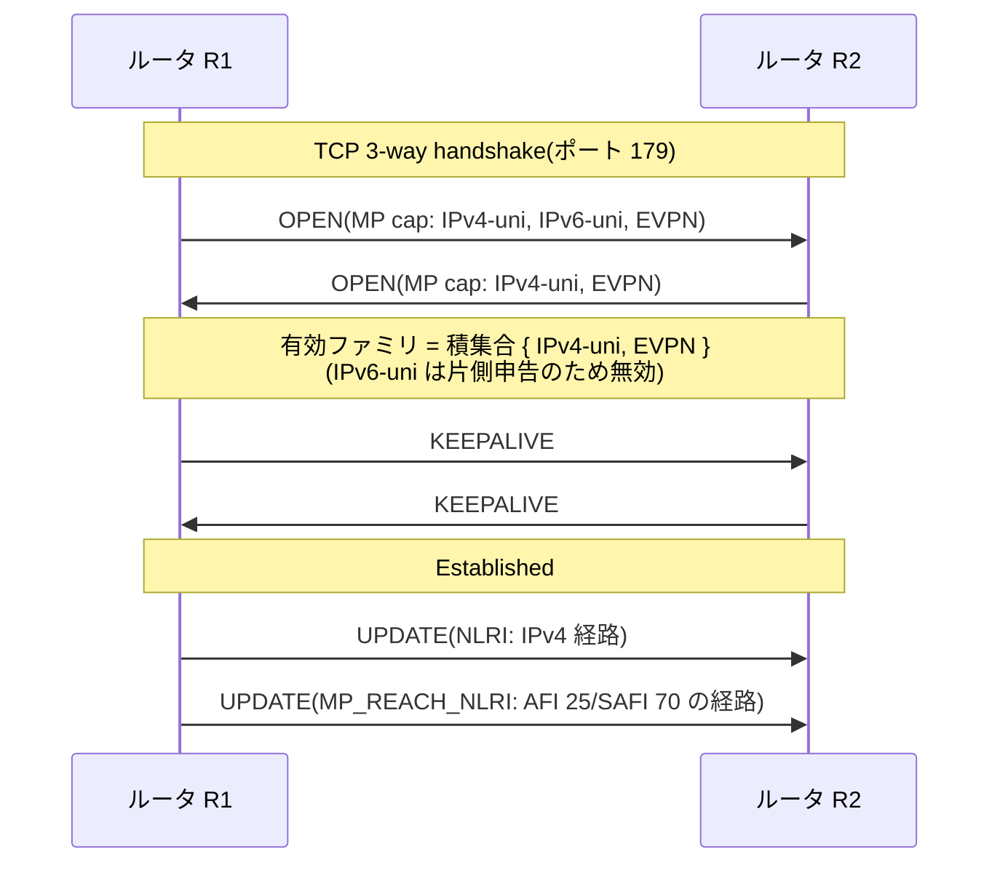

# MP-BGP — BGP を「IPv4 経路のプロトコル」から解放する拡張

## 概要

この章では、BGP に IPv4 ユニキャスト経路以外の情報を運ばせる拡張
**MP-BGP(Multiprotocol BGP、RFC 4760)**を扱う。主題は、アドレスファミリ
(AFI/SAFI)という型の仕組み、情報の新しい器である MP_REACH_NLRI /
MP_UNREACH_NLRI 属性、ケイパビリティによるファミリの合意、そして
ファミリごとに分かれる RIB とポリシーである。前提知識は
[01 章](01_bgp_basics.md)(メッセージとケイパビリティ交渉)と
[03 章](03_path_attributes.md)(属性の4分類)。この章を読み終えると、
[第2部で保留にした「AFI 25 / SAFI 70」の正体](../02_vlan_vxlan_evpn/04_vxlan_control_plane.md)
が明らかになる。

## 導入 — 完成した配布機構を、経路以外にも使いたい

### ここまでに組み上がったもの

第3部のここまでの4つの章で見てきた BGP の道具立てを、一度棚卸ししてみる。

- **TCP 上の信頼性ある差分配布**: 一度伝えた情報は再送しない。
  変化だけを流す([01 章](01_bgp_basics.md))
- **明示設定のピアと境界の安全装置**: 誰と何を交換するかは管理者の意思で決まる
- **属性の束という情報モデル**: 運ぶ情報に履歴書(AS_PATH)と荷札
  (コミュニティ)が付き、未知の属性の扱いまで規定された後方互換な
  拡張性を持つ([03 章](03_path_attributes.md))
- **2つの関所によるポリシー制御**: 受け取る前・渡す前に、情報を選別し
  加工できる([04 章](04_policy_control.md))
- **AS 単位のループ検出とスコープ制御**: どの情報がどこまで届くかを
  設計できる

ここで気づいてほしいのは、この一覧のどこにも「IPv4」が登場しないことである。
BGP の本体は「**型のある到達性情報を、大規模に、ポリシー制御つきで配る機構**」
であり、運んでいる中身が IPv4 のプレフィックスであることは、
機構の本質とは独立している。

### 最初の動機 — IPv6 の経路をどう配るか

1990 年代後半、IPv6(第4部で扱う)の実用化が視野に入ったとき、
設計者たちは問いに直面した。**IPv6 の AS 間ルーティングはどうするのか。**

選択肢は2つあった。IPv6 用の EGP を新しく作るか、BGP-4 を拡張するか。
前者を選ぶと、TCP 上のセッション管理、FSM、差分更新、パスベクタの
ループ検出、ポリシーの枠組み、そして何より運用者の経験と実装の成熟——
第3部で見てきたすべてを、もう一度発明し直すことになる。

後者が選ばれた。決め手は、**BGP-4 の仕様の中で IPv4 に依存している場所が、
調べてみると驚くほど少なかった**ことである。RFC 4760 は冒頭でこう整理している
(初版は **RFC 2283**(1998 年)、改訂を経て現行は **RFC 4760**(2007 年)):

> BGP-4 が IPv4 に固有なのは、(1) ネクストホップ(NEXT_HOP 属性)、
> (2) 集約(AGGREGATOR は IPv4 アドレスを含む)、(3) NLRI、の3箇所だけである。

AS_PATH も LOCAL_PREF もコミュニティも、メッセージ形式も FSM もタイマーも、
中身が何であろうと変わらず機能する。ならば、**IPv4 が焼き付いた「器」の部分
だけを差し替え可能にすればよい**。これが MP-BGP の設計方針である。

### 結果 — BGP は「経路のプロトコル」を超えた

この拡張の帰結は、当初の動機(IPv6)をはるかに超えた。運ぶ中身を型で
宣言できる汎用の配布バスになった BGP には、その後、次々と新しい積み荷が
定義されていく。

- **IPv6 ユニキャスト経路**(RFC 2545)— 当初の動機。第4部で扱う
- **VPN 経路**(RFC 4364)— 顧客ごとに独立した経路空間を運ぶ。
  [第5部で扱う](../05_mpls_srv6/03_l3vpn_l2vpn.md)
- **EVPN**(RFC 7432)— MAC アドレスの所在という「L2 の到達性」。
  [第2部](../02_vlan_vxlan_evpn/05_evpn_vxlan.md) で使ったものの正体
- **Flow Specification**(RFC 8955)— 経路ですらない、トラフィック
  フィルタリング規則の配布(DDoS 対策)
- **BGP-LS**(RFC 9552)— IGP のリンクステート情報を外部の計算機へ
  吸い上げる読み取り専用の口

[第2部で EVPN を導入したとき](../02_vlan_vxlan_evpn/04_vxlan_control_plane.md)、
「なぜ MAC の配布に、よりによって BGP なのか」という問いに対して
「型付きの情報をポリシー制御つきで大規模配布する完成した機構だから」と
答えを先取りした。この章はその答えの技術的な裏付けである。

## 理論

### どこを直せば BGP は多目的になるか

[01 章で見た UPDATE メッセージ](01_bgp_basics.md) の構造を思い出してほしい。
「撤回する経路のリスト」「パスアトリビュート」「NLRI」の3部構成だった。
このうち IPv4 が構造に焼き付いているのは:

| 場所 | 何が IPv4 固有か |
|---|---|
| UPDATE の NLRI・Withdrawn Routes フィールド | 「プレフィックス長+プレフィックス」の形式が IPv4 アドレス前提 |
| NEXT_HOP 属性(Type 3) | 4 オクテットの IPv4 アドレス1個に固定 |
| AGGREGATOR 属性(Type 7) | 集約ルータの識別に IPv4 アドレスを含む |

このうち AGGREGATOR は [03 章で見たとおり](03_path_attributes.md)
経路選択にも転送にも関与しない出所表示なので、値を「IPv4 アドレスの形をした
識別子」と読み替えるだけで済み、拡張は不要である。迂回路を作るべきは
前の2つ——**到達性情報の入れ物(NLRI・撤回リスト)とネクストホップ**だけであり、
他のすべて——セッション、FSM、属性、ポリシー、ループ検出——は
**無改造で**流用できる。

### 新しい器 — MP_REACH_NLRI と MP_UNREACH_NLRI

RFC 4760 の解は、2つの新しいパスアトリビュートである。

- **MP_REACH_NLRI(Type 14)**: 広告する到達性情報。
  「**この型の**(AFI/SAFI)」「**この NLRI 群が**」「**このネクストホップで**
  届く」の3点セットを1つの属性に収める
- **MP_UNREACH_NLRI(Type 15)**: 撤回する到達性情報。
  「この型の」「この NLRI 群を」取り下げる(撤回にネクストホップは不要)

つまり、UPDATE メッセージの旧来の NLRI・Withdrawn Routes フィールドに
入っていた情報を、**属性の中へ引っ越しさせた**のである。MP-BGP で運ばれる
経路の UPDATE では、旧フィールドは空になり、到達性情報はすべて
属性領域の中にいる。

この設計の妙は2つある。

**第一に、ネクストホップが NLRI と同じ器に入り、型から自由になった。**
NEXT_HOP 属性(Type 3)は IPv4 アドレス1個しか運べなかったが、
MP_REACH_NLRI のネクストホップは可変長であり、ファミリに応じた形を取れる。
IPv6 経路なら IPv6 アドレス、[EVPN](../02_vlan_vxlan_evpn/05_evpn_vxlan.md)
なら VTEP のアドレス、という具合である。さらに重要な帰結として、
**経路のファミリとネクストホップのファミリは論理的には独立**になった
(IPv6 ネクストホップで IPv4 経路を広告する使い方が **RFC 8950** で
定義されている。動作の節で再訪する)。

**第二に、両属性とも optional non-transitive である。**
[03 章の4分類](03_path_attributes.md) の使い分けがここで効いている。
optional だから、旧実装は意味を知らなくてもエラーにしない。そして
non-transitive だから、**旧実装はこの属性を中継せず、黙って捨てる**。

AS4_PATH(optional transitive、03 章)と比べてみてほしい。AS4_PATH は
「意味が分からなくても運んでくれれば、その先の新実装が使える」情報だった。
一方、到達性情報はそうではない。経路を受け取るとは、Adj-RIB-In に格納し、
経路選択に参加させ、ネクストホップを解決し、次のピアへ広告するときには
規則に従って書き換える——という**処理への参加**を意味する。処理できない者に
盲目的に中継されると、「誰も転送できない経路」が世界に広まってしまう。
non-transitive の選択は、**MP-BGP の情報は MP-BGP を理解する者の間だけを
流れる**ことの保証である。

### 型の宣言 — AFI と SAFI

器を差し替え可能にしたら、次は「中に何が入っているか」を宣言する仕組みが要る。
MP_REACH_NLRI / MP_UNREACH_NLRI の先頭には、2つの番号が置かれる。

- **AFI(Address Family Identifier、2 オクテット)**: NLRI とネクストホップが
  **どのネットワーク層プロトコルのアドレスか**。1 = IPv4、2 = IPv6、
  25 = L2VPN(MAC アドレスの世界)。IANA のレジストリで管理される
- **SAFI(Subsequent Address Family Identifier、1 オクテット)**: その情報を
  **どういう用途・構造で使うか**。1 = ユニキャスト、2 = マルチキャスト
  (RPF 検査用の経路)、128 = MPLS ラベル付き VPN、70 = EVPN、など

この (AFI, SAFI) の組を**アドレスファミリ**と呼び、これが NLRI フィールドの
**解釈を決める型宣言**として働く。同じバイト列でも、(1, 1) と宣言されれば
IPv4 プレフィックスとして、(25, 70) と宣言されれば EVPN のルートタイプとして
読まれる。本書に登場する主要なファミリを挙げる:

| AFI / SAFI | 通称 | 運ぶもの | 本書での登場 |
|---|---|---|---|
| 1 / 1 | IPv4 ユニキャスト | 従来の BGP 経路 | 第3部(本体) |
| 2 / 1 | IPv6 ユニキャスト | IPv6 経路(RFC 2545) | 第4部 |
| 1 / 128 | VPN-IPv4(VPNv4) | RD 付きの顧客経路(RFC 4364) | [第5部](../05_mpls_srv6/03_l3vpn_l2vpn.md) |
| 1 / 4 | ラベル付きユニキャスト | MPLS ラベル付き経路(RFC 8277) | 第5部 |
| 25 / 70 | L2VPN EVPN | MAC/IP の所在ほか(RFC 7432) | 第2部 |
| 1 / 133 | Flowspec | フィルタ規則(RFC 8955) | 言及のみ |

ここで [第2部の EVPN](../02_vlan_vxlan_evpn/05_evpn_vxlan.md) を振り返ると、
入れ子の型システムになっていたことが分かる。**外側の型が (AFI 25, SAFI 70)
「これは EVPN の情報である」を宣言し、内側の型(ルートタイプ、RT-2 や RT-3)が
EVPN の中での意味を宣言する**。MP-BGP 本体から見れば、EVPN の NLRI は
「Route Type(1 オクテット)+ Length(1 オクテット)+ 中身」という
不透明な可変長データにすぎず、意味の解釈はファミリごとの処理系に委ねられる。
だから BGP 本体に手を入れずに、新しいファミリを足し続けられるのである。

### 合意の形成 — ケイパビリティによるファミリの交渉

もう1つ必要なのは、**ピアとの間でどのファミリを交換するかの合意**である。
相手が理解しないファミリの UPDATE を送りつけても、器(属性)の
レベルでは無視されるだけで、意図した情報共有は成立しない。

ここで [01 章の OPEN メッセージ](01_bgp_basics.md) の伏線が回収される。
OPEN の Optional Parameters で行われるケイパビリティ広告(**RFC 5492**)の、
最も重要な用途がこれである。Capability Code 1(Multiprotocol Extensions)の
値はまさに AFI(2 オクテット)+ 予約(1)+ SAFI(1)であり、
**対応するファミリを1つずつ列挙して申告する**。

規則は単純で、**双方が申告したファミリ(積集合)だけがセッションで有効**になる。
自分が IPv4 ユニキャストと EVPN を申告し、相手が IPv4 ユニキャストだけを
申告すれば、そのセッションで流れるのは IPv4 ユニキャストのみである。
なお、ケイパビリティを一切載せない旧実装との互換のため、その場合は
IPv4 ユニキャストだけが有効とみなされるのが伝統的な振る舞いである。

重要な制約が1つある。**ケイパビリティは OPEN でしか交換できない**。
つまりファミリの集合はセッション確立の瞬間に固定され、後からファミリを
足すには、原則としてセッションをいったん破棄して張り直すしかない
(トラブルシューティングの節で再訪する)。

### セッションとファミリ — 1本に多重するか、分けるか

MP-BGP では、**1本の TCP セッションに複数のファミリを多重できる**。
このときの内部構造を正確に押さえておくことが、第4部・第5部の理解の土台になる。

**多重されるのはセッションだけであり、経路の世界はファミリごとに完全に別**である。

- [3段の RIB](01_bgp_basics.md)(Adj-RIB-In / Loc-RIB / Adj-RIB-Out)は
  **ファミリごと**に存在する
- [経路選択プロセス](03_path_attributes.md) はファミリごとに独立に走る。
  IPv4 の最良経路の選択が IPv6 の選択に影響することはない
- [ポリシー(2つの関所)](04_policy_control.md) もファミリごとに設定する。
  IPv4 ユニキャストに置いた prefix-list は EVPN の経路には一切触れない
- Route Refresh(RFC 2918)の要求メッセージにも AFI/SAFI が含まれ、
  再広告の依頼はファミリ単位で行われる

一方、**セッションは1本**なので、生死は全ファミリの運命共同体である。
1つのファミリの属性エラーがセッションリセットに至れば
(RFC 7606 の treat-as-withdraw で緩和されるとはいえ)、同居する
全ファミリの経路が道連れで消える。ホールドタイム満了も同じである。

ここから実務の設計論が生まれる。

- **IPv6 経路は IPv6 の TCP セッションで運ぶ**のが AS 間接続の定石である。
  経路情報が通る道とデータが通る道の生死を一致させる(fate sharing)ためで、
  IPv4 セッションだけで IPv6 経路を交換していると、「IPv6 のデータプレーンは
  死んでいるのに経路広告は生きている」というブラックホールを検出できない
- 逆に **EVPN や VPN のようなオーバーレイ系ファミリは、ループバック間の
  1本のセッションに多重する**のが普通である。これらの経路の実際の転送は
  アンダーレイ(IGP + ユニキャスト経路)が担っており、セッションの経路と
  データの経路がもともと別物だからである。
  [第2部のファブリック](../02_vlan_vxlan_evpn/05_evpn_vxlan.md) で
  リーフの EVPN ピアリングがループバック間だったのは、この形である

## プロトコル動作の詳細

### MP_REACH_NLRI のフォーマット

RFC 4760 Section 3 の定義は次のとおり:

```text
+---------------------------------------------------------+
| Address Family Identifier(2 オクテット)               |
+---------------------------------------------------------+
| Subsequent Address Family Identifier(1 オクテット)    |
+---------------------------------------------------------+
| Length of Next Hop Network Address(1 オクテット)      |
+---------------------------------------------------------+
| Network Address of Next Hop(可変長)                   |
+---------------------------------------------------------+
| Reserved(1 オクテット、0 で送信)                      |
+---------------------------------------------------------+
| Network Layer Reachability Information(可変長)        |
+---------------------------------------------------------+
```

読みどころは**ネクストホップが長さ付きの可変長フィールド**になったことである。
ファミリごとの代表的な中身は:

- **IPv6 ユニキャスト(AFI 2 / SAFI 1)**: 長さ 16(グローバルアドレス1個)
  または **32(グローバル+リンクローカルの2個)**。RFC 2545 は、直結の
  ピアに対してはリンクローカルアドレスも併せて載せることを求めている。
  実際の転送(FIB のネクストホップ)には直結ならリンクローカルを使うのが
  IPv6 の流儀であり(理由は第4部の NDP の章で扱う)、経路広告にも
  その2面性がそのまま現れている
- **EVPN(AFI 25 / SAFI 70)**: VTEP のアドレス(IPv4 なら長さ 4)。
  「MAC-X はこの VTEP の先」の「この VTEP」がここに入る。
  [第2部で見た](../02_vlan_vxlan_evpn/05_evpn_vxlan.md)
  「RT-2 のネクストホップ = トンネルの終点」である
- **VPN-IPv4(AFI 1 / SAFI 128)**: RD 付きの形式
  ([第5部で扱う](../05_mpls_srv6/03_l3vpn_l2vpn.md))

なお NEXT_HOP 属性(Type 3)の意味論
——[eBGP で書き換え、iBGP で保持、next-hop-self](02_ibgp_ebgp.md)——は、
器が MP_REACH_NLRI に変わってもそのまま適用される。変わったのは
入れ物と型だけで、規則は共通である。

### MP_UNREACH_NLRI のフォーマット

```text
+---------------------------------------------------------+
| Address Family Identifier(2 オクテット)               |
+---------------------------------------------------------+
| Subsequent Address Family Identifier(1 オクテット)    |
+---------------------------------------------------------+
| Withdrawn Routes(可変長)                              |
+---------------------------------------------------------+
```

撤回は「あの経路は取り下げる」と言えれば足りるので、ネクストホップは
含まれない。RFC 4760 は、**この属性1つだけを含む UPDATE メッセージ**を
正当と定めている(撤回だけなら他の属性は一切不要)。

### 1通の UPDATE の新旧対比

MP-BGP の経路を運ぶ UPDATE を、[01 章の構造図](01_bgp_basics.md) と
対比すると:

```text
        従来(IPv4 ユニキャスト)         MP-BGP(例: IPv6 / EVPN)
+---------------------------+    +---------------------------------+
| Withdrawn Routes: 撤回経路 |    | Withdrawn Routes: (空)         |
+---------------------------+    +---------------------------------+
| Path Attributes:           |    | Path Attributes:                |
|   ORIGIN, AS_PATH,         |    |   ORIGIN, AS_PATH,              |
|   NEXT_HOP, ...            |    |   (LOCAL_PREF, COMMUNITY, ...)  |
|                            |    |   MP_REACH_NLRI ←経路はここ     |
|                            |    |   MP_UNREACH_NLRI ←撤回もここ   |
+---------------------------+    +---------------------------------+
| NLRI: 広告経路             |    | NLRI: (空)                     |
+---------------------------+    +---------------------------------+
```

見てのとおり、**AS_PATH・LOCAL_PREF・コミュニティなどの属性は、
ファミリを問わず同じ場所に同じ形で載る**。1つの UPDATE の属性一式が
その NLRI 群すべてに共通なのも従来どおりである。器(NLRI とネクストホップ)
だけが差し替わり、履歴書と荷札の仕組みは全ファミリ共通——これが
「BGP の道具立てを無改造で流用する」の具体的な姿である。
EVPN の経路に AS_PATH が付き、RT(拡張コミュニティ)が貼れて、
route-map で選別できるのは、この共通性の直接の帰結である。

### OPEN での交渉 — 積集合の成立

ファミリ交渉を含むセッション確立を通しで見る:



積集合に入らなかったファミリについて、双方は UPDATE を送らない。
これはエラーではなく交渉の正常な結果であり、**セッションは何事もなく
Established になる**——後述するとおり、これがトラブルシューティングで
最も紛らわしい点になる。

### ファミリの後付けとセッションリセット

運用中のセッションに新しいファミリ(たとえば EVPN)を追加したい場合、
ケイパビリティは OPEN でしか交換できないため、**原則はセッションの再確立**である。
多くの実装は、address-family の設定追加を検知すると NOTIFICATION
(Cease サブコード)を送ってセッションを畳み、新しいケイパビリティ一式で
張り直す。既存ファミリ(IPv4 の全経路)も一瞬すべて撤回・再学習に
なることを意味し、計画作業として扱うのが常識である。

なおセッションを切らずにケイパビリティを追加する Dynamic Capability という
提案は長く存在するが、標準化・普及には至っていない。一部の実装は
Route Refresh と組み合わせた部分的な緩和(該当ファミリだけの再交渉)を
持つが、挙動は実装依存であり、本書では「後付けはリセットを伴う」を
原則として覚えることを勧める。

### ポリシーの適用面 — 関所はファミリの数だけある

[04 章](04_policy_control.md) で「ポリシーは、どこで(ピア・方向)」に
分解したが、MP-BGP ではここに「**どのファミリで**」が加わる。
同じピアに対しても、IPv4 ユニキャストの入力ポリシーと EVPN の入力ポリシーは
別の設定であり、評価も別々に行われる。

実装の設定体系もこれを反映して、ピアのセッションレベルの設定
(AS 番号、送信元アドレス、タイマー)と、address-family ごとの設定
(activate、ポリシー、next-hop-self など)の2層構造になっているのが普通である。
[02 章で学んだ next-hop-self](02_ibgp_ebgp.md) がファミリごとの設定である
ことに注意してほしい——IPv4 では有効にして EVPN では触らない、
といった構成が現に成立する。

## 設定例(補助)

以下は FRRouting での例。1本の eBGP セッションに IPv4 ユニキャストと
IPv6 ユニキャストを多重する(仕組みの確認が目的であり、前節で述べた
とおり実務の AS 間接続ではファミリごとにセッションを分けるのが定石である)。

```text
router bgp 65001
 neighbor 192.0.2.2 remote-as 65002
 !
 address-family ipv4 unicast
  neighbor 192.0.2.2 route-map IN-V4 in
 exit-address-family
 !
 address-family ipv6 unicast
  neighbor 192.0.2.2 activate          ! ← IPv6 ファミリを明示的に有効化
  neighbor 192.0.2.2 route-map IN-V6 in
 exit-address-family
```

2層構造がそのまま見える。`neighbor ... remote-as` はセッション
(全ファミリ共通)の設定、`address-family` ブロックの中がファミリごとの
設定である。IPv6 側にだけ `activate` があるのは、FRR では既定で
IPv4 ユニキャストが自動的に有効化されるためである(`no bgp default
ipv4-unicast` で無効化できる。この既定は実装・バージョンにより異なるので、
「どのファミリが暗黙に有効か」は必ず確認する癖をつけたい)。

交渉の結果は `show bgp neighbors` で確認できる(抜粋):

```text
  Neighbor capabilities:
    Multiprotocol Extensions:
      IPv4 Unicast: advertised and received
      IPv6 Unicast: advertised and received
```

`advertised and received` が積集合の成立、つまりそのファミリが有効である
ことを示す。片方だけ(`advertised` のみ / `received` のみ)なら、
そのファミリは流れない。経路の確認はファミリごとに
`show bgp ipv4 unicast` / `show bgp ipv6 unicast` /
`show bgp l2vpn evpn` と、コマンド体系も AFI/SAFI で分かれている。

## トラブルシューティング

### 症状: セッションは Established なのに、特定ファミリの経路だけ来ない

MP-BGP のトラブルの筆頭である。ファミリの交渉は「片側しか申告しなければ
流れない、ただしセッションは正常」という静かな失敗の仕方をするため、
`show bgp summary` を眺めていても気づけない(IPv4 のプレフィックス数は
正常に見える)。

`show bgp neighbors` のケイパビリティ表示を見て、当該ファミリが
`advertised and received` になっているかを確認する。`received` しか
なければ自分側の activate 漏れ、`advertised` しかなければ相手側である。
[04 章の「関所に何も置かなかったら」](04_policy_control.md) と合わせて、
「経路が来ない」の切り分け順は **① ファミリは合意できているか →
② ポリシーで落としていないか → ③ 相手は広告しているか** となる。

### 症状: IPv6 経路は受信できているのに、通信できない(ネクストホップ解決不能)

MP_REACH_NLRI のネクストホップは可変長・型付きになったぶん、
解決の失敗パターンも増えた。代表は2つ。

1つめは、**IPv4 のセッションで IPv6 経路を交換している**構成である。
このときネクストホップに何を入れるかは自明でなく(セッションの相手は
IPv4 アドレスでしか知らない)、RFC 8950 系の取り決めに双方が対応して
いなければ、解決不能なネクストホップやリンクローカルだけの
ネクストホップが Adj-RIB-In に残る。[02 章](02_ibgp_ebgp.md) で見た
「経路はあるのに inaccessible」と同じ見え方をする。
素直な対処は、ファミリとセッションを揃える(IPv6 経路は IPv6 セッションで
交換する)ことである。

2つめは、iBGP でのネクストホップ到達性である。器が変わっても
[NEXT_HOP の規則と next-hop-self の必要性](02_ibgp_ebgp.md) はそのまま
なので、「eBGP で学んだ IPv6 経路のネクストホップ(外部のアドレス)が
IGP に載っていない」という古典的な問題が、ファミリごとに再演される。
next-hop-self がファミリ単位の設定であることを思い出し、
足りていないファミリを探す。

### 症状: address-family を追加したら、無関係な IPv4 の経路まで全部消えた

仕様どおりの動作である。ケイパビリティは OPEN でしか交換できないため、
ファミリの追加はセッションの再確立を伴い、そのセッションに同居する
**全ファミリ**の経路がいったん撤回される。「EVPN を足しただけなのに
IPv4 が揺れた」は、多重の運命共同体性を忘れているときの典型的な驚きである。
影響を分けたければセッションを分ける——前述の設計論そのものである。

### 症状: EVPN 経路が BGP テーブルには見えるのに、MAC-VRF に入らない

`show bgp l2vpn evpn` に経路がある(= ファミリの交渉とセッションは正常)のに
転送に反映されない場合、疑うべきは MP-BGP の層ではなく、その上の
**取り込みの層**である。[第2部で扱った](../02_vlan_vxlan_evpn/05_evpn_vxlan.md)
とおり、EVPN 経路が MAC-VRF に入るには import RT の一致が必要で、
RT 不一致の経路は「受信はされるが、どのテーブルにも取り込まれない」状態になる。

切り分けの層構造を整理しておく。**① セッション(Established か)→
② ファミリ(ケイパビリティの積集合に入っているか)→ ③ ポリシー(関所で
落ちていないか)→ ④ 取り込み(RT が一致するか)→ ⑤ ネクストホップ
(解決できるか)**。MP-BGP は、01〜04 章の切り分けの各段が
「ファミリごと」に増殖したもの、と捉えると見通しがよい。

## 演習・確認問題

1. BGP-4 の仕様の中で IPv4 に依存していた3箇所を挙げ、MP-BGP が
   それぞれをどう迂回したかを述べよ。また AS_PATH やコミュニティが
   無改造で全ファミリに使える理由を、UPDATE メッセージの構造から説明せよ。
2. MP_REACH_NLRI / MP_UNREACH_NLRI が optional **non-transitive** と
   定義されたのはなぜか。AS4_PATH(optional transitive)との違いを、
   「意味を知らない実装に中継させてよい情報か」という観点から論ぜよ。
3. AFI と SAFI の役割分担を説明し、(1, 1)、(2, 1)、(25, 70)、(1, 128) の
   それぞれが何を運ぶファミリかを答えよ。
4. 1本のセッションに複数ファミリを多重するとき、「ファミリごとに分かれる
   もの」と「セッションで共有されるもの」をそれぞれ3つ以上挙げよ。
5. AS 間の IPv6 経路交換を IPv6 セッションで行うべき理由を、
   fate sharing の観点から説明せよ。逆に EVPN がループバック間の
   セッションへの多重で問題ない理由も述べよ。
6. ピアとの間で IPv6 ユニキャストの経路が流れてこない。セッションは
   Established である。確認すべき項目を順序立てて挙げよ
   (ケイパビリティ、activate、ポリシー、相手側の広告)。
7. 運用中の EVPN ファブリックで、リーフのペアリングに新しいファミリを
   追加する作業を計画している。何が起こるか、なぜ計画作業とすべきかを
   ケイパビリティ交渉の仕様から説明せよ。

## まとめ

- MP-BGP(RFC 4760)は、BGP-4 で IPv4 が焼き付いていた3箇所(NLRI・
  撤回リスト・NEXT_HOP)を MP_REACH_NLRI / MP_UNREACH_NLRI(Type 14/15、
  optional non-transitive)へ移設し、運ぶ中身を差し替え可能にした拡張である
- 中身の型は AFI/SAFI(アドレスファミリ)で宣言され、NLRI の解釈は
  ファミリごとの処理系に委ねられる。EVPN(AFI 25 / SAFI 70)の
  ルートタイプは、この枠組みの中の入れ子の型である
- 交換するファミリは OPEN のケイパビリティ広告(RFC 5492)で合意され、
  双方が申告した積集合だけが有効になる。合意はセッション確立時に固定され、
  ファミリの後付けはセッション再確立を伴う
- 1本のセッションに複数ファミリを多重できるが、RIB・経路選択・ポリシー・
  Route Refresh はすべてファミリごとに独立し、セッションの生死だけが
  全ファミリの運命共同体になる。AS 間の経路はファミリとセッションを
  揃え、オーバーレイ系はループバック間セッションに多重するのが定石である
- AS_PATH・コミュニティ・関所のポリシーという BGP の道具立ては
  全ファミリ共通に働く。この共通性こそが、EVPN や VPN が「BGP に乗る」
  ことを選んだ理由である
