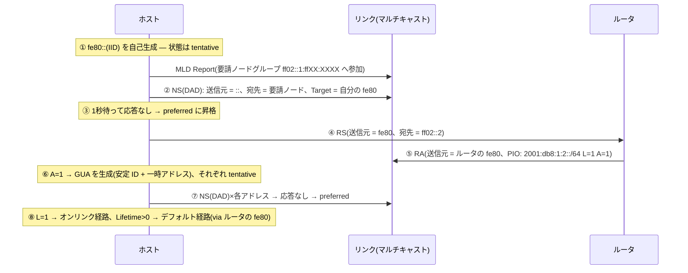

# NDP と SLAAC — 「つなげば動く」を支える近隣探索と自動構成

## 概要

この章では、IPv6 のリンク上の隣人との対話をすべて担う NDP(近隣探索、
RFC 4861)と、その上で動くアドレス自動構成 SLAAC(RFC 4862)を扱う。
前提知識は[前章](02_addressing.md)(リンクローカル、要請ノードマルチキャスト、
アドレスの一生)と[第1部01章](../01_fundamentals/01_l2_l3_recap.md)(ARP、
デフォルトゲートウェイ)。ルータ側の IPv6(OSPFv3 等)は
[次章](04_routing_ipv6.md)で扱う。

## 導入 — ARP の置き換えではなく、境界業務の再設計

IPv4 のホストがネットワークにつながって動き出すまでを思い出すと、
そこには出自の異なる仕組みが寄り集まっている。

- 同一リンクの相手の MAC アドレスを知る: **ARP**
  (EtherType 0x0806 の独立プロトコル。IP ですらない)
- 自分のアドレス・ゲートウェイ・DNS を知る: **DHCP**(UDP 上のアプリケーション)
- もっと良い出口があると教わる: **ICMP リダイレクト**
- ルータを自動発見する: ICMP Router Discovery(RFC 1256。
  ほぼ使われず、実務は DHCP が代行)

それぞれが別々に設計され、互いを知らない。ARP には「教えた相手が
まだ生きているか」を確かめる仕組みがなく、DHCP はサーバが
アドレスの貸し出し台帳(状態)を抱え込む。

IPv6 はこの「リンクに参加するための一連の仕事」を、**NDP(Neighbor
Discovery Protocol、近隣探索)**という1つの体系に再設計した(RFC 4861)。
アドレス解決も、ルータ発見も、リダイレクトも、そして次章の主役である
到達性の確認も、すべて **ICMPv6 のメッセージ**である。
[01章](01_why_ipv6.md)で「ICMPv6 は補助機能ではなく IPv6 の可動部品」と
述べた理由の中心がここにある — ICMPv6 を止めると、IPv6 は
隣人と会話できなくなる。

NDP が使うメッセージは、わずか5種類である。

| Type | メッセージ | 役割 |
|---|---|---|
| 133 | **RS**(Router Solicitation / ルータ要請) | ホスト→ルータ「いますか、今すぐ教えて」 |
| 134 | **RA**(Router Advertisement / ルータ広告) | ルータ→リンク「私がルータ。プレフィックスはこれ、MTU はこれ」 |
| 135 | **NS**(Neighbor Solicitation / 近隣要請) | 「このアドレスの人、MAC を教えて」(ARP 要求に相当+α) |
| 136 | **NA**(Neighbor Advertisement / 近隣広告) | 「私です、MAC はこれ」(ARP 応答に相当+α) |
| 137 | Redirect(リダイレクト) | ルータ→ホスト「その宛先はあちらの出口が近い」 |

この5種類の組み合わせで、ホストは**誰の助けもなく、ケーブルを挿した
数秒後には通信できる状態**になる。リンクローカルアドレスを自己生成し、
重複がないか確かめ(DAD)、ルータを見つけ(RS/RA)、プレフィックスを
教わって自分でアドレスを作り(SLAAC)、隣人の MAC を解決する(NS/NA)。
本章はこの一連の流れを、仕組みの側から追う。

## 理論

### なぜ ICMPv6 の上に作ったか

ARP のような独立プロトコルではなく ICMPv6(RFC 4443)のメッセージと
した設計には、明確な利点がある。

1. **マルチキャストが使える。** ARP が L2 ブロードキャストに頼ったのに
   対し、NDP のメッセージは IPv6 パケットなので、
   [前章](02_addressing.md)の要請ノードマルチキャストのような
   「宛先を絞った問いかけ」がアドレス体系ごと使える。
2. **拡張が容易である。** すべてのメッセージは末尾に TLV 形式の
   オプションを連ねられる(後述)。DNS サーバの広告(RFC 8106)の
   ような機能追加が、メッセージを増やさずに済んできた。
3. **IP の道具で守れる。** NDP パケットは IPv6 パケットなので、
   通常の ACL・検査の枠組みに載る。

そして RFC 4861 は、全 NDP メッセージに独特の検査を課している —
**Hop Limit 255 で送信し、受信側は 255 のまま届いたかを検査する**。
Hop Limit はルータを通過するたび減ることはあっても増えることはないから、
255 のまま届いたパケットは**同一リンクから発信されたことの証明**になる。
リンクの外にいる攻撃者は、偽の NA や RA を届けること自体ができない。
[第3部02章](../03_bgp/02_ibgp_ebgp.md)で見た GTSM(RFC 5082)と
同じ原理であり、GTSM の RFC より先に NDP がこの発想を標準に
組み込んでいた。

### RA — 「配給」ではなく「放送」という構成モデル

NDP の中でもっとも設計思想が濃いのが RA である。DHCP と RA は
どちらも「ホストにネットワークの情報を伝える」が、モデルが逆向きである。

- **DHCP**: ホストが要求し、サーバが**個別に応答**する。サーバは
  「誰に何を貸したか」の台帳(状態)を持つ。
- **RA**: ルータがリンク全体へ**周期的に放送**する(全ノード
  ff02::1 宛て。既定では最大 600 秒間隔)。誰が聞いているかを
  ルータは知らないし、知る必要がない。

RA が運ぶのは**ネットワーク側の知識**だけである — このリンクの
プレフィックス、MTU、推奨 Hop Limit、そして「私をデフォルトルータと
して使ってよい期間」(Router Lifetime)。ホストはそれを聞いて、
**ホスト側の知識**(自分のインタフェース ID)を足し合わせ、
アドレスを自分で完成させる。これが **SLAAC**(StateLess Address
AutoConfiguration、RFC 4862)の「ステートレス」の意味である —
ネットワーク側は個々のホストのアドレスを配らず、覚えず、
台帳を持たない。プレフィックスという「部品」を放送するだけで、
組み立ては各ホストの仕事になる。

この分業は[前章](02_addressing.md)の IID 生成方式と噛み合っている。
IID を安定不透明 ID(RFC 7217)で作るか一時アドレス(RFC 8981)を
重ねるかはホストの自由であり、ネットワーク側の関与なしに
プライバシーの設計を選べる。代償も同じ場所にある — 誰がどの
アドレスを使ったかを**誰も記録していない**ため、監査・追跡の要件が
ある環境では別途の手当(NDP スヌーピングによる記録、または
DHCPv6)が必要になる。

なお、ホストは起動時に RA の周期を待たず、RS(ff02::2 =
全ルータ宛て)で「今すぐ広告してほしい」と促せる。RA には
これへの応答(要請された RA)と周期的な放送の2つの契機がある。

### アドレスとオンリンクの分離 — RFC 5942

IPv4 には「自分のアドレスとサブネットマスクから、同一サブネット宛ては
直接届く(オンリンク)」という暗黙の等式があった。IPv6 はこの等式を
**廃止した**(この整理は RFC 5942)。

- アドレスの構成(このプレフィックスから自分のアドレスを作ってよい)と、
- オンリンク判定(このプレフィックス宛ては同一リンクにいるから
  直接解決してよい)は、

**別の知識**であり、RA のプレフィックス情報オプションの**別々の
フラグ**(A フラグと L フラグ、後述)で独立に伝えられる。
既定の振る舞いも IPv4 と逆で、**明示的にオンリンクと教わっていない
宛先はすべてオフリンク扱い**となり、デフォルトルータへ送られる
(ルータ側は必要ならリダイレクトで訂正する)。「アドレスが同じ
プレフィックスなのに、隣に直接届かず一度ルータを経由する」構成は、
IPv6 では設計として合法である。

### NUD — ARP に欠けていた「まだ生きているか」

ARP のキャッシュは「一度教わった対応を、消えるまで信じる」だけの
表だった。相手が死んでも、NIC が交換されても、タイムアウトまでは
古い MAC へ送り続ける。NDP はここに**到達性の確認**という概念を
入れた — **NUD**(Neighbor Unreachability Detection、近隣不到達性検出)
である。

近隣キャッシュ(ARP テーブルに相当)の各エントリは、単なる
「IPv6 → MAC」の対応ではなく、**到達性の状態機械**を持つ。

| 状態 | 意味 |
|---|---|
| INCOMPLETE | アドレス解決中(NS を送って NA 待ち) |
| REACHABLE | 到達性を確認済み(確認から ReachableTime 以内) |
| STALE | 対応は知っているが、最近の確認がない(**正常な状態**) |
| DELAY | STALE のエントリへ送信した直後。上位層の確認を少し待つ |
| PROBE | ユニキャスト NS で能動的に確認中 |

秀逸なのは、確認の手段が NS/NA だけではないことである。
**上位プロトコルの前進**(送った TCP セグメントに ACK が返ってくる等)も
到達性の確認としてカウントされ、その間 NUD はパケットを1つも
追加送信しない。プローブが走るのは「送りたいのに、しばらく確認が
取れていない」ときだけ — 確認のコストを通信そのものに相乗りさせる
設計である。`ip -6 neigh` で STALE が大量に見えて不安になるのは
IPv4 の感覚であり、トラフィックが流れれば DELAY → REACHABLE へ
遷移する(設定例で見る)。

### SLAAC と DHCPv6 の関係 — M/O フラグ

IPv6 にも DHCP はある(**DHCPv6**、RFC 8415)。ただし役割分担が
IPv4 と根本的に違う。

- **デフォルト経路は常に RA が配る。** DHCPv6 にはゲートウェイを
  伝えるオプションが**存在しない**。DHCPv6 だけでは IPv6 ホストは
  外に出られず、RA は常に必要である。
- RA の **M フラグ**(Managed)は「アドレスは DHCPv6 でもらえ」、
  **O フラグ**(Other configuration)は「アドレスは SLAAC でよいが、
  DNS 等の付加情報は DHCPv6 で取れ」という**ホストへのヒント**である。

| 構成 | A フラグ(プレフィックス) | M | O | アドレス | DNS 等 |
|---|---|---|---|---|---|
| SLAAC のみ | 1 | 0 | 0 | SLAAC | RA(RDNSS) |
| SLAAC + 情報だけ DHCPv6 | 1 | 0 | 1 | SLAAC | DHCPv6 |
| フル DHCPv6 | 0 | 1 | (1) | DHCPv6 | DHCPv6 |

DNS サーバは長らく「SLAAC の穴」だったが、現在は RA 自身が
RDNSS / DNSSL オプション(RFC 8106)で広告でき、SLAAC だけで
構成が完結する。逆に「アドレスの払い出しを台帳で管理したい」
エンタープライズでは M=1 の DHCPv6 が選ばれる。ここで実装の現実に
注意が要る — **DHCPv6 を実装しない主要 OS(Android)が存在する**ため、
「M=1 だけで SLAAC を止める」設計はそうした端末を IPv6 から
締め出す。両方式は排他ではなく併用できる(A=1 かつ M=1 なら、
ホストは SLAAC のアドレスと DHCPv6 のアドレスを両方持ちうる —
複数アドレスの原則はここでも前提である)。
なお DHCPv6 にはプレフィックス委任(DHCPv6-PD)という
「ルータへサブネット単位でプレフィックスを貸す」重要な用途があり、
これは(後述: `05_transition_technologies.md`)で再登場する。

## プロトコル動作の詳細

### メッセージフォーマットとオプション TLV

NDP メッセージは ICMPv6 の共通ヘッダ(Type / Code / Checksum)に
続く固定部と、末尾の可変オプション列から成る。RA の固定部:

```text
 0                   1                   2                   3
 0 1 2 3 4 5 6 7 8 9 0 1 2 3 4 5 6 7 8 9 0 1 2 3 4 5 6 7 8 9 0 1
+-+-+-+-+-+-+-+-+-+-+-+-+-+-+-+-+-+-+-+-+-+-+-+-+-+-+-+-+-+-+-+-+
|   Type = 134  |    Code = 0   |           Checksum            |
+-+-+-+-+-+-+-+-+-+-+-+-+-+-+-+-+-+-+-+-+-+-+-+-+-+-+-+-+-+-+-+-+
| Cur Hop Limit |M|O|  Reserved |        Router Lifetime        |
+-+-+-+-+-+-+-+-+-+-+-+-+-+-+-+-+-+-+-+-+-+-+-+-+-+-+-+-+-+-+-+-+
|                         Reachable Time                        |
+-+-+-+-+-+-+-+-+-+-+-+-+-+-+-+-+-+-+-+-+-+-+-+-+-+-+-+-+-+-+-+-+
|                          Retrans Timer                        |
+-+-+-+-+-+-+-+-+-+-+-+-+-+-+-+-+-+-+-+-+-+-+-+-+-+-+-+-+-+-+-+-+
|   Options ...
+-+-+-+-+-+-+-+-+-+-+-+-
```

- **Router Lifetime**(秒): この RA の送信元をデフォルトルータとして
  使ってよい残り時間。**0 なら「私はデフォルトルータではない」**
  (プレフィックスだけ広告するルータが使う)。既定は RA 間隔の3倍
  (600 秒間隔なら 1800 秒)— 前章の設定例で `expires 1795sec` と
  見えたデフォルト経路の寿命の正体である。
- Reachable Time / Retrans Timer(ミリ秒): リンク全体の NUD の
  タイマーをルータから統一供給する(0 = 指定なし)。
- Reserved の上位2ビットは RFC 4191 が Router Preference
  (high / medium / low)として再定義しており、複数ルータの優先を
  ホストに伝えられる。

NS / NA の固定部は Target Address(問い合わせ/回答の対象アドレス)
1つが本体である。NA は先頭に3つのフラグを持つ:

```text
+-+-+-+-+-+-+-+-+-+-+-+-+-+-+-+-+-+-+-+-+-+-+-+-+-+-+-+-+-+-+-+-+
|   Type = 136  |    Code = 0   |           Checksum            |
+-+-+-+-+-+-+-+-+-+-+-+-+-+-+-+-+-+-+-+-+-+-+-+-+-+-+-+-+-+-+-+-+
|R|S|O|                       Reserved                          |
+-+-+-+-+-+-+-+-+-+-+-+-+-+-+-+-+-+-+-+-+-+-+-+-+-+-+-+-+-+-+-+-+
|                                                               |
+                         Target Address                        +
|                          (128 ビット)                          |
+-+-+-+-+-+-+-+-+-+-+-+-+-+-+-+-+-+-+-+-+-+-+-+-+-+-+-+-+-+-+-+-+
```

- **R**(Router): 送信者はルータである(ルータ→ホスト降格の検知に使う)
- **S**(Solicited): NS への応答である。**S=1 の NA だけが NUD の
  到達性確認になる**(往復が成立した証拠だから)
- **O**(Override): キャッシュの既存エントリを上書きしてよい

オプションはすべて「Type 1オクテット + Length 1オクテット
(8オクテット単位)+ 値」の TLV で、主要なものは少数である。

| Type | オプション | 載る場所 |
|---|---|---|
| 1 | Source Link-Layer Address(送信元の MAC) | RS、NS、RA |
| 2 | Target Link-Layer Address(対象の MAC) | NA、Redirect |
| 3 | **Prefix Information**(プレフィックス情報) | RA |
| 5 | MTU | RA |
| 25 / 31 | RDNSS / DNSSL(RFC 8106) | RA |

SLAAC の核心であるプレフィックス情報オプション(PIO)は
本章の理論を1枚に集約している:

```text
+-+-+-+-+-+-+-+-+-+-+-+-+-+-+-+-+-+-+-+-+-+-+-+-+-+-+-+-+-+-+-+-+
|   Type = 3    |   Length = 4  | Prefix Length |L|A| Reserved1 |
+-+-+-+-+-+-+-+-+-+-+-+-+-+-+-+-+-+-+-+-+-+-+-+-+-+-+-+-+-+-+-+-+
|                         Valid Lifetime                        |
+-+-+-+-+-+-+-+-+-+-+-+-+-+-+-+-+-+-+-+-+-+-+-+-+-+-+-+-+-+-+-+-+
|                       Preferred Lifetime                      |
+-+-+-+-+-+-+-+-+-+-+-+-+-+-+-+-+-+-+-+-+-+-+-+-+-+-+-+-+-+-+-+-+
|                           Reserved2                           |
+-+-+-+-+-+-+-+-+-+-+-+-+-+-+-+-+-+-+-+-+-+-+-+-+-+-+-+-+-+-+-+-+
|                                                               |
+                        Prefix(128 ビット)                     +
|                                                               |
+-+-+-+-+-+-+-+-+-+-+-+-+-+-+-+-+-+-+-+-+-+-+-+-+-+-+-+-+-+-+-+-+
```

- **L**(on-link): このプレフィックス宛ては同一リンク(直接 NS で解決してよい)
- **A**(autonomous): このプレフィックスから SLAAC でアドレスを作ってよい
- **Valid / Preferred Lifetime**: 生成したアドレスの
  `valid_lft` / `preferred_lft` の供給源。[前章](02_addressing.md)で見た
  「アドレスの一生」の残り時間は、RA を受信するたびここから更新される

L と A が独立したフラグであることが、前節「アドレスとオンリンクの
分離」の実装である。

### ウォークスルー① — ケーブルを挿してから通信できるまで

ホストの起動時、NDP と SLAAC は次の一連の動作を無人で完了する。



各段に、ここまでの理論が対応している。

1. **リンクローカルの自己生成**(RFC 4862)。外部の情報を一切
   使わないため、リンクに誰もいなくても完了する。
2. **DAD**(重複アドレス検出)。まだ使えないアドレス(tentative)を
   名乗る前に、「このアドレスを既に使っている人はいるか」を NS で
   確かめる。**送信元は未指定アドレス ::**(まだ自分のアドレスが
   ないから)、宛先はそのアドレスの要請ノードマルチキャスト。
   既定では NS を1回送り、RetransTimer(既定 1 秒)以内に
   応答(そのアドレスを名乗る NA)がなければ合格とする。
   同じ Target への NS を他ノードから受信した場合も重複
   (相手も同じアドレスで DAD 中)である。DAD は**すべての**
   ユニキャストアドレスに義務づけられており(RFC 4862)、
   一時アドレスの世代交代のたびにも走る。
3. RS で RA を促す(周期 RA を待つと最大 10 分かかるため)。
4. **RA の受信と検証**(Hop Limit 255、送信元はリンクローカル)。
5. PIO の A フラグに従い **GUA を組み立てる**。プレフィックス
   (ネットワークの知識)+ IID(ホストの知識)という分業の瞬間である。
6. デフォルト経路のネクストホップには **RA の送信元 =
   ルータのリンクローカル**が入る。前章の
   「fe80 のゲートウェイは正常」はこうして生まれる。

DHCP サーバも管理者も登場しないまま、ホストは通信可能になる。
所要時間の大半は DAD の待ち時間であり、これを短縮するために
「合格を待たずに使い始めるが、重複と分かったら即座に手を引く」
楽観的 DAD(RFC 4429)も標準化されている。

### ウォークスルー② — アドレス解決と NUD の一生

`2001:db8:1:2::a` から同一リンクの `2001:db8:1:2::b` へ初めて
パケットを送る場面。

1. 宛先はオンリンク(RA の L=1 で学習済み)→ 直接解決する。
   近隣キャッシュにエントリを **INCOMPLETE** で作成。
2. NS を `::b` の要請ノードグループへ送信。**自分の MAC を
   Source Link-Layer Address オプションで同梱する** — 相手が
   応答を返すときに、逆向きのアドレス解決を省けるようにする
   (ARP が要求フレームに送信元 MAC を載せていたのと同じ配慮)。
3. `::b` は**ユニキャスト**で NA を返す(S=1、O=1、Target
   Link-Layer Address = 自分の MAC)。
4. 受信側エントリは **REACHABLE** になり、パケットが流れ出す。

以後の一生は「確認の鮮度」の管理である。

```text
INCOMPLETE ──NA(S=1)──▶ REACHABLE ──ReachableTime 経過──▶ STALE
                            ▲                               │ 送信再開
      上位層の確認(TCP ACK 等)│                               ▼
      または NA(S=1)          │◀──────── PROBE ◀──5秒──── DELAY
                                    (ユニキャスト NS ×3)
                                          │ 全滅
                                          ▼
                                     エントリ削除(解決やり直し)
```

- REACHABLE の寿命は既定 30 秒 × 乱数(0.5〜1.5)。切れても
  即座には何もせず **STALE** で保持する。
- STALE のエントリへ送信すると **DELAY** に入り、5 秒だけ上位層の
  確認を待つ。TCP の ACK が返ればプローブなしで REACHABLE へ戻る。
- 確認が取れなければ **PROBE** — 今度はマルチキャストではなく
  **ユニキャスト NS** を 1 秒間隔で最大 3 回。全滅したらエントリを
  消し、次のパケットで解決からやり直す(このとき初めて上位に
  到達不能が波及する)。

ARP との差分は2つに要約できる — **確認の概念があること**
(S=1 の NA と上位層の前進だけが「生きている証拠」)、そして
**確認のためのトラフィックを極力発生させないこと**(STALE で
待つ、通信に相乗りする、プローブはユニキャスト)。

### リダイレクト

同一リンクに複数のルータがいるとき、ホストは1台をデフォルトとして
選ぶが、宛先によっては別のルータが近いことがある。最初のパケットを
受けたルータは転送したうえで **Redirect(Type 137)** を送信元へ返し、
「この宛先(Destination Address)へは、この隣人(Target Address)へ
直接送れ」と教える。Target = Destination なら「その宛先は実は
オンリンクだ」という意味になる。ホストは宛先キャッシュにこの
訂正を記録し、以後のパケットは近道を通る。IPv4 の ICMP リダイレクトと
同じ発想だが、Hop Limit 255 検査と「教わった Target の解決には
通常の NUD が働く」ことにより、体系の中に統合されている。

## 設定例 — RA を出す側と読む側(任意)

FRR のルータで RA を有効にする(FRR は既定で RA を抑止しており、
明示的に解除する):

```text
interface eth1
 ipv6 address 2001:db8:1:2::1/64
 no ipv6 nd suppress-ra
 ipv6 nd prefix 2001:db8:1:2::/64 86400 14400
 ipv6 nd rdnss 2001:db8::53
 ipv6 nd ra-interval 300
```

(Linux をルータにする場合は `net.ipv6.conf.all.forwarding=1` も
必要である。この sysctl の副作用はトラブルシューティング①で扱う。)

ホスト側から RA の中身を直接観察する。RA は ICMPv6 Type 134 なので、
IPv6 基本ヘッダ(40 オクテット)の直後の1オクテットでフィルタできる:

```bash
$ sudo tcpdump -i eth0 -vv 'icmp6 and ip6[40] == 134'
12:00:00.000000 IP6 (hlim 255) fe80::5054:ff:fe00:1 > ff02::1: ICMP6,
  router advertisement, length 88
        hop limit 64, Flags [none], pref medium,
        router lifetime 900s, reachable time 0ms, retrans timer 0ms
          prefix info option (3), length 32 (4): 2001:db8:1:2::/64,
            Flags [onlink, auto], valid time 86400s, pref. time 14400s
          rdnss option (25), length 24 (3): lifetime 900s, addr: 2001:db8::53
          source link-address option (1), length 8 (1): 52:54:00:00:00:01
```

本章の理論がそのまま読める — `hlim 255`(リンク内の証明)、
送信元はルータの fe80、`Flags [none]` は M=0 / O=0(純粋な SLAAC)、
PIO の `[onlink, auto]` が L=1 / A=1、valid / pref. time が
前章の `valid_lft 86375 / preferred_lft 14375` の供給源である
(受信からの経過分だけ減っている)。

近隣キャッシュと NUD の状態は `ip -6 neigh` で見える:

```bash
$ ip -6 neigh show dev eth0
fe80::5054:ff:fe00:1 lladdr 52:54:00:00:00:01 router REACHABLE
2001:db8:1:2::b lladdr 52:54:00:00:00:0b STALE
2001:db8:1:2::dead dev eth0 FAILED
```

STALE は異常ではない(通信すれば DELAY → REACHABLE に戻る)。
FAILED は PROBE まで進んで全滅したエントリであり、こちらは
「相手がいない/応答できない」のサインである。

## トラブルシューティング

### ① ルータにしたら自分の IPv6 が消えた — forwarding と accept_ra

Linux ホストを実験的にルータ化(`forwarding=1`)した途端、
そのマシン自身の SLAAC アドレスとデフォルト経路が消える。
これは RFC 4861 の役割分担の実装である — **ルータは RA を
「出す側」であり、聞く側ではない**。Linux はこれを
`accept_ra` の解釈に組み込んでおり、`accept_ra=1`(既定)は
「ホストである間だけ RA を受理」を意味し、forwarding を有効に
した時点で RA を無視し始める。

- 観察: `sysctl net.ipv6.conf.eth0.forwarding` と
  `net.ipv6.conf.eth0.accept_ra` を確認。tcpdump で RA 自体は
  届いている(のに反映されない)ことを確かめると切り分けが早い。
- 対策の方向: 「上流からは SLAAC で受け、配下へは自分が RA を出す」
  という宅内ルータ型の構成では `accept_ra=2`(forwarding 中でも
  受理)を明示する。設計として上流を静的/DHCPv6-PD にするなら不要。

### ② 不正 RA — リンク全体が数秒で乗っ取られる

RA は認証なしの放送であり、**リンク上の誰でも出せる**。テザリングや
仮想マシンの接続共有が誤って RA を出す事故、そして意図的な攻撃
(偽のプレフィックスと自分をゲートウェイとして広告し、リンク全体の
トラフィックを吸い込む)の両方が起こる(問題の整理は RFC 6104)。
ホストは新しい RA を数秒で受理するため、影響は即時かつリンク全域に
及ぶ。DHCP の偽サーバと違い「先に応答した者勝ち」ですらなく、
**全ホストが同時に汚染される**のが RA の怖さである。

- 観察: `ip -6 route` に見覚えのないデフォルト経路・プレフィックスが
  増えていないか。tcpdump(上の RA フィルタ)で送信元 MAC を特定する。
- 対策の方向: アクセスポートで RA(と DHCPv6 サーバ応答)を落とす
  **RA Guard**(RFC 6105)をスイッチで有効化するのが本筋。
  拡張ヘッダの断片化で RA Guard をすり抜ける攻撃が知られており、
  NDP パケットの断片化自体を禁じる RFC 6980(と RA Guard 実装への
  要求 RFC 7113)がその穴を塞ぐ。暗号的な解(SEND、RFC 3971)も
  標準化されているが、証明書基盤を要し普及していない。

### ③ アドレスが tentative / dadfailed のまま — DAD 失敗

`ip -6 addr` にアドレスはあるのに通信に使われず、
`tentative dadfailed` のフラグが付いている — DAD が重複を検出し、
アドレスの使用を止めた状態である。原因の典型は、VM のクローンや
誤設定による**実際の重複**(EUI-64 なら MAC の重複を意味する)と、
もう1つ見落としやすい **L2 のヘアピン**(スイッチやボンディングの
不具合で自分の送った NS が自分に返ってくる。自分の DAD-NS を
他人の DAD と誤認して失敗する)である。後者への対策として、
NS に乱数ノンスを入れて自分のパケットを見分ける Enhanced DAD
(RFC 7527)がある。

- 観察: `ip -6 addr show | grep -B2 dadfailed`。
  `dmesg` に `IPv6: eth0: IPv6 duplicate address ... detected!` が
  残る。tcpdump で該当 Target の NS/NA の送信元 MAC を見れば、
  実重複(他人の MAC)かヘアピン(自分の MAC)か区別できる。
- 注意: リンクローカルが DAD に失敗すると、RFC 4862 の規定により
  そのインタフェースの IPv6 は事実上停止する(すべての NDP が
  リンクローカルの上で動くため)。「IPv6 だけ完全に沈黙している」
  ときは真っ先に疑う価値がある。

### ④ RA は届くのにアドレス解決だけ失敗する — MLD スヌーピング

「SLAAC でアドレスは付く。外向きの通信もできる。なのに同一リンクの
特定ホストとだけ、時間が経つと通信できなくなる」— NDP が
マルチキャストに依存していることの裏返しで、犯人はしばしば
L2 スイッチの **MLD スヌーピング**である。全ノード宛て(ff02::1)の
RA は多くの実装が無条件に流すため生き残るが、**要請ノード
グループ宛ての NS** はスヌーピングの転送表に従う。リンクに MLD
クエリアが不在だと、ホストの参加状態(MLD Report)がエージングで
消え、NS がそのホストに届かなくなる — 起動直後は動き、数分後に
死ぬ、という時限式の壊れ方をする。
[第2部04章](../02_vlan_vxlan_evpn/04_vxlan_control_plane.md)で見た
「IGMP クエリア不在の時限式障害」の IPv6 版であり、原理は同一である。

- 観察: 送信側で tcpdump すると NS の再送(1秒間隔×3)だけが見え、
  NA が返らない。受信側で tcpdump すると **NS がそもそも届いて
  いない**。スイッチの `bridge mdb show`(Linux ブリッジの場合)で
  要請ノードグループの登録が消えていることを確認する。
- 対策の方向: MLD クエリアを有効にする(スヌーピングを使うなら
  クエリアとセット、の原則)。または当該セグメントでスヌーピングを
  無効化する。

## 演習・確認問題

1. IPv4 で ARP・DHCP・ICMP リダイレクトに分かれていた機能が、
   NDP ではどの ICMPv6 メッセージ(Type 133〜137)に対応するかを
   整理せよ。また NDP がすべてのメッセージに Hop Limit 255 を
   要求する理由を、GTSM(RFC 5082)と対比して説明せよ。
2. SLAAC が「ステートレス」と呼ばれる理由を、RA が運ぶ知識と
   ホストが足す知識の分業として説明せよ。その代償として
   失われる運用上の情報は何か。
3. RA のプレフィックス情報オプションの L フラグと A フラグが
   独立している意味を、RFC 5942 の「アドレスとオンリンク判定の
   分離」に基づいて説明せよ。L=0 / A=1 のプレフィックスを受けた
   ホストは、同一プレフィックスの宛先へどう送るか。
4. DAD の NS が送信元 :: で送られる理由と、宛先が要請ノード
   マルチキャストである理由を述べよ。リンクローカルアドレスの
   DAD 失敗が他のアドレスの失敗より深刻なのはなぜか。
5. 近隣キャッシュの STALE 状態が「異常ではない」理由を、NUD の
   設計方針(確認コストの最小化)から説明せよ。STALE のエントリへ
   パケットを送ったあと、NS が1つも送信されずに REACHABLE へ戻る
   のはどういう場合か。
6. DHCPv6(M=1)だけでは IPv6 ホストが通信できない理由を述べよ。
   また「M=1 で SLAAC を使わせない」設計がリンク上の一部の端末を
   締め出しうるのはなぜか。
7. NA の S フラグと O フラグの役割を説明せよ。要請されていない
   NA(S=0)を受信した近隣キャッシュのエントリが REACHABLE では
   なく STALE になるのはなぜか。

## まとめ

- NDP(RFC 4861)は ARP・ルータ発見・リダイレクト・到達性確認を
  ICMPv6 の5メッセージ(RS/RA/NS/NA/Redirect)に統合した体系である。
  全メッセージが Hop Limit 255 検査(リンク内証明)と TLV オプションを
  共有し、要請ノードマルチキャストの上で「全員を起こさず」動く。
- RA は DHCP と逆の「放送」モデルであり、ネットワーク側の知識
  (プレフィックス、L/A フラグ、寿命、MTU、RDNSS)だけを配る。
  ホストが IID を足してアドレスを完成させるのが SLAAC(RFC 4862)で、
  誰も台帳を持たない。デフォルト経路は常に RA 由来(DHCPv6 は
  ゲートウェイを配れない)。
- すべてのアドレスは使用前に DAD(送信元 :: の NS)を通り、
  近隣キャッシュは NUD の状態機械(REACHABLE/STALE/DELAY/PROBE)で
  「確認の鮮度」を管理する。上位層の前進も到達性の証拠に使い、
  確認トラフィックを最小化する。
- 運用の急所はマルチキャスト依存(MLD スヌーピングとクエリア)と
  RA の無認証性(RA Guard)にある。「RA は届くのに NS だけ死ぬ」
  「ルータ化すると RA を聞かなくなる」は仕様に根ざした挙動である。
