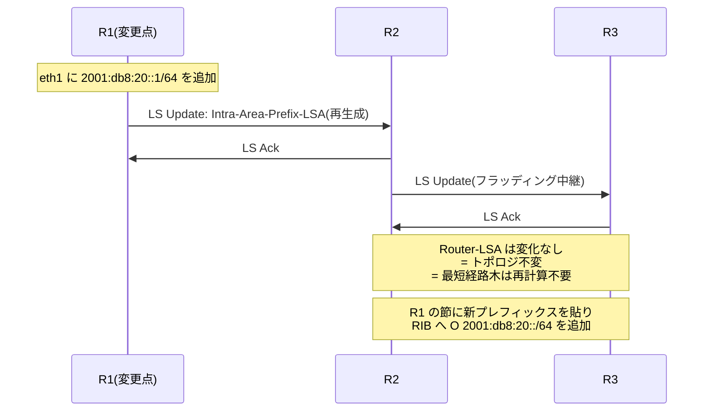

# IPv6 ルーティング — 原理は変わらず、道具立てが変わる

## 概要

この章では、IPv6 の経路制御 — 経路表の読み方(リンクローカルネクストホップ)、
IGP の IPv6 対応(OSPFv3 = RFC 5340 を中心に、IS-IS、RIPng)、BGP での IPv6
(RFC 2545 の伏線回収)、そして転送における ICMPv6 の役割(Packet Too Big)を扱う。
前提知識は[第1部](../01_fundamentals/02_routing_table_basics.md)(経路選択の原理、
[IGP の位置づけ](../01_fundamentals/05_igp_overview.md))、本部の
[01](01_why_ipv6.md)〜[03章](03_ndp_slaac.md)、および
[第3部05章](../03_bgp/05_mp_bgp.md)(MP-BGP)。

## 導入 — 何が変わらないのか、をまず確定する

新しいアドレスファミリを前にすると、すべてを学び直すような気分になるが、
実際には**ルーティングの原理は何一つ変わっていない**。第1部で積み上げた
道具立てを思い出そう。

- **ロンゲストマッチ**: 宛先に一致する最長のプレフィックスが勝つ。
  128 ビットになっても規則は同一で、デフォルトルートは `::/0` と書く
- **ホップバイホップ転送**: 各ルータは次の一歩だけを決める。L3 アドレスは
  末端間で不変、L2 は毎ホップ書き換え
- **3段フィルタ**: 同一プロトコル内はメトリック、情報源間は管理距離、
  転送時はロンゲストマッチ([第1部02章](../01_fundamentals/02_routing_table_basics.md))
- **RIB/FIB の分離、再帰的ルックアップ、ECMP、収束** — すべてそのまま

ディスタンスベクタ・リンクステート・パスベクタという方式の理論も、
IGP/EGP の2階建て構造も、アドレスのビット数には依存しない。
IPv6 のルーティングを学ぶことは、第2のルーティング理論を学ぶことではない。

では何が変わるのか。変更点は3つに集約できる。

1. **ネクストホップがリンクローカルアドレスになる。**
   [02章](02_addressing.md)で「fe80 のデフォルトゲートウェイは正常」と
   述べた。これはホストだけの話ではなく、ルータ間でも IPv6 の
   ネクストホップは原則リンクローカルである。経路表の見た目と
   静的経路の書き方がここで変わる。
2. **ルータの仕事から経路上フラグメンテーションが消え、代わりに
   ICMPv6 が転送の可動部品になった。**
   [01章](01_why_ipv6.md)で見たとおり、IPv6 ルータは大きすぎるパケットを
   分割せず、Packet Too Big を送り返して捨てる。「ICMPv6 は補助ではなく
   可動部品」という本部の基本線が、転送の場面でも効いてくる。
3. **ルーティングプロトコル自身を IPv6 対応させる必要がある。**
   ここに2つの流儀がある — プロトコルの新版を作る(OSPFv2 → OSPFv3)か、
   運べる情報の型を広げる(IS-IS の TLV 追加、BGP の MP-BGP)か。
   この設計の分岐が本章の理論編の中心になる。

もう1つ、先に整理しておくべき分業がある。[前章](03_ndp_slaac.md)で見た
RA は、**ホストへ経路(デフォルト経路とオンリンク知識)を供給する仕組み**
であって、ルータどうしが経路を交換するルーティングプロトコルではない。
IPv6 のネットワークでは、

- **ルータ間**: ルーティングプロトコル(OSPFv3、IS-IS、BGP)が経路を交換し、
- **ルータ → ホスト**: RA がその成果の「窓口」(デフォルト経路)だけを配る

という2層の供給網ができている。ホストは経路表のほぼ全部を
「`::/0` はあのルータへ」という1行で済ませ、細かい地図はルータだけが持つ。
この分業は IPv4(DHCP がゲートウェイを配る)にもあったが、IPv6 では
RA という**ルーティング寄りの仕組み**(寿命つき、ルータ自身が広告)に
一本化された点が新しい。

## 理論

### IPv6 の経路表 — リンクローカルネクストホップという流儀

IPv6 の経路表を初めて見たときに戸惑うのは、ネクストホップの欄である。

```
2001:db8:2::/64 via fe80::5054:ff:fe00:2 dev eth0
```

宛先はグローバルなのに、ネクストホップはリンクローカル。IPv4 の感覚では
「経路の向こう側のアドレス」が入るべき場所に、そのリンクでしか通用しない
アドレスが入っている。これは異常でも省略でもなく、**RFC 4861 が要求する
IPv6 の流儀**である。理由は3つある。

1. **NDP との一貫性。** ICMPv6 リダイレクト(RFC 4861 Section 8)は、
   より良い次ホップをリンクローカルアドレスで通知する。RA が配る
   デフォルト経路のネクストホップも RA の送信元 = リンクローカルである
   ([前章](03_ndp_slaac.md))。ルータ間の経路だけグローバルを使うと、
   同じ隣人が2つの名前で近隣キャッシュに現れ、突き合わせができなくなる。
2. **リナンバリングへの耐性。** リンクローカルはインタフェースが
   自己生成する不変の土台であり([02章](02_addressing.md))、リンクの
   グローバルプレフィックスを付け替えても変わらない。ネクストホップを
   リンクローカルにしておけば、**アドレス計画の変更が隣接関係と経路表の
   ネクストホップに波及しない**。
3. **そもそもグローバルアドレスがなくてもよい。** ルータ間リンクは
   リンクローカルだけで転送が成立する。これを徹底し、インフラの
   ルータ間リンクにグローバルアドレスを一切振らない設計も標準化されている
   (RFC 7404)。IPv4 の unnumbered に相当するが、IPv6 では「もともと
   全リンクにアドレスがある」ため、より自然に成立する
   (代償は traceroute の応答元や ping による区間切り分けのしにくさで、
   RFC 7404 自身が利害得失を整理している)。

ただしリンクローカルには[02章](02_addressing.md)で見た制約が付いて回る:
**リンクごとに重複しうるため、アドレス単体では宛先が定まらない**。
したがって、リンクローカルをネクストホップとする経路は
**必ず出力インタフェースとセット**で初めて意味を持つ。動的プロトコルは
経路を学んだインタフェースを知っているから自動で組になるが、
**静的経路では人間がインタフェースを明示しなければならない**。

```
# IPv4 の感覚(アドレスだけ)— IPv6 のリンクローカルでは不可
ip -6 route add 2001:db8:100::/64 via fe80::1          # → エラー
# インタフェースとセットで指定する
ip -6 route add 2001:db8:100::/64 via fe80::1 dev eth1
```

グローバルアドレスをネクストホップに書けば IPv4 と同様に再帰的
ルックアップで解決されるが、リンクローカル+インタフェース指定のほうが
IPv6 の設計意図に沿った基本形である。

### 直結経路とオンリンク — 「同じ /64」は根拠にならない

IPv4 では、インタフェースにアドレスとマスクを設定すると、そのサブネットへの
直結経路が RIB に載った([第1部02章](../01_fundamentals/02_routing_table_basics.md))。
IPv6 のルータでも見た目は同じで、`2001:db8:1::1/64` を設定すれば
`2001:db8:1::/64` の直結経路が生まれる。

ただし[前章](03_ndp_slaac.md)の RFC 5942 の分離を思い出してほしい。
IPv6 では「自分と同じプレフィックスに見える宛先 = 直接届く」という等式が
廃止されており、オンリンクという知識は明示的に与えられたものだけが持つ。
ルータにとっての「明示」はインタフェースへのプレフィックス長つきの設定で
あり、ホストにとっては RA の L フラグである。ここで注意すべきは、
**RA を出す側(ルータ)の直結経路と、受ける側(ホスト)のオンリンク知識は
別々に管理されている**ことだ。ルータに /64 を設定しても、PIO の L フラグを
落として広告すれば、ホストは同じ /64 宛てでもすべてルータへ送る。
「同じ /64 にいるのに直接通信しない」構成は IPv6 では作れるし、
実際に使われる(端末間の直接通信を禁じたいゲスト網など)。

なお、ルータ間のポイントツーポイントリンクには /127 を使う例外
(RFC 6164)が[02章](02_addressing.md)のとおり認められている。
直結経路が /127 になるだけで、転送の扱いは変わらない。

### IGP の IPv6 対応 — 新版を作るか、入れ物を広げるか

ルーティングプロトコルが IPv6 を運ぶには、2つの改造点がある。
**運ぶ中身**(経路情報のアドレスを 128 ビットにする)と、
**自分自身の足回り**(プロトコルパケットをどう運び、ネイバーをどう
識別するか)である。既存プロトコルはこの2点への対処で、対照的な
2つの流儀に分かれた。

- **流儀 A — 新版プロトコルを作る**: OSPFv2 は IPv4 を前提にした設計が
  プロトコルの芯まで染みており(ネイバーの識別、LSA の中身、認証)、
  TLV のような拡張の受け皿もなかった。そこで**別プロトコルとして
  OSPFv3(RFC 5340)を新造**した。RIP も同様に RIPng(RFC 2080、
  UDP ポート 521、ff02::9)を新造している。旧版と新版は互換性がなく、
  デュアルスタックでは両方を並走させる。
- **流儀 B — 入れ物を広げる**: IS-IS はもともと IP の上ではなく
  L2 上で直接動き([第1部05章](../01_fundamentals/05_igp_overview.md))、
  情報をすべて TLV で運ぶ。IPv6 対応は **TLV を2つ足すだけ**
  (RFC 5308: IPv6 Interface Address TLV 232、IPv6 Reachability TLV 236)で、
  プロトコル自体は1つのまま両ファミリを運べる。
  BGP も同じ側にいる — [第3部05章](../03_bgp/05_mp_bgp.md)で見たとおり、
  MP-BGP(RFC 4760)は AFI/SAFI という型システムで NLRI の入れ物を
  広げる設計で、IPv6 は AFI 2 の1ファミリにすぎない。

この分岐は「プロトコルが自分の運ぶ情報の形にどれだけ依存して
設計されていたか」の裏返しである。TLV や属性という**型付きの入れ物**を
最初から持っていたプロトコル(IS-IS、BGP)は無傷で拡張でき、
固定フォーマットにアドレス意味論を焼き付けていたプロトコル(OSPF、RIP)は
作り直しになった。[第3部05章](../03_bgp/05_mp_bgp.md)の
「IPv4 が焼き付いていた3箇所」の議論と同じ構図が、IGP でも再演されている。

### OSPFv3 — 「OSPF からアドレスを抜く」という再設計

OSPFv3(RFC 5340)は、単に LSA のアドレス欄を 128 ビットに広げた
ものではない。設計の主題は **「プロトコル処理からアドレスの意味論を
取り除く」** ことにある。OSPFv2 との違いを、この主題に沿って整理する。

**① 足回りはリンクローカルで動く。**
OSPFv3 のパケットは、仮想リンクを除きすべて**送信元がリンクローカル
アドレス**で、宛先はマルチキャスト ff02::5(AllSPFRouters)/
ff02::6(AllDRouters)またはネイバーのリンクローカルである。
グローバルアドレスが1つもないリンクでも隣接が張れる — 前節の
リンクローカルネクストホップの流儀、RFC 7404 の設計は、
IGP の足回りがこうなっているから成立する。

**② ネイバーは常にルータ ID で識別する。**
OSPFv2 はブロードキャスト型ネットワークでネイバーを IPv4 アドレスで
識別していた。OSPFv3 は常に 32 ビットのルータ ID で識別する。
[第1部05章](../01_fundamentals/05_igp_overview.md)で「ルータ ID は
IPv4 アドレスと同じ表記だがアドレスではない」と述べたことが、
OSPFv3 で文字どおりになる — IPv4 を1アドレスも持たないルータでも
OSPFv3 は動くが、その場合ルータ ID の自動決定ができないため
**明示設定が必須**になる(トラブルシューティング②で再登場)。

**③ 「サブネットごと」から「リンクごと」へ。**
OSPFv2 はインタフェースをサブネットに結びつけて動いたが、OSPFv3 は
**リンク**そのものの上で動く。1つのリンクに複数の IPv6 プレフィックスが
共存しても(複数アドレスが正常、という[02章](02_addressing.md)の世界)、
インタフェースは1つの OSPFv3 インタフェースである。さらに共通ヘッダに
**Instance ID** フィールドが加わり、同一リンク上で独立した OSPFv3
インスタンスを複数動かせる(値が一致しないパケットは黙って捨てられる)。

**④ トポロジ情報とアドレス情報の分離。**
これが最も本質的な変更である。OSPFv2 の Router-LSA / Network-LSA は
トポロジ(誰と誰がつながっているか)とアドレス(そのリンクのサブネット)を
一体で運んでいた。OSPFv3 はこれを分離し、Router-LSA / Network-LSA は
**トポロジだけ**(ルータ ID とインタフェース ID の言葉で記述され、
IPv6 アドレスを含まない)を運ぶ。プレフィックスは新設の2つの LSA —
リンク内の情報を運ぶ **Link-LSA** と、エリアへプレフィックスを供給する
**Intra-Area-Prefix-LSA** — に移された。

分離の利益は SPF 計算に現れる。地図(トポロジ)と地名(プレフィックス)が
別の LSA になったため、**アドレスの追加・削除ではトポロジが変わらず、
最短経路木の再計算が原理的に不要**になる(プレフィックスの貼り替えだけで
済む。IS-IS では同じ最適化が部分再計算 PRC として知られる)。
[第1部04章](../01_fundamentals/04_distance_vector_link_state.md)で
「リンクステートは伝搬と計算を分離した」と述べたが、OSPFv3 はさらに
「トポロジとアドレスを分離した」と言える。

**⑤ 認証をプロトコルから外した。**
OSPFv2 が自前で持っていた認証フィールドは削除され、当初は IPsec
(AH/ESP)に委ねる設計だった。実務では IPsec の鍵運用が重く、後に
パケット末尾へ認証データを付ける Authentication Trailer(RFC 7166)が
定義されて主流になっている。

なお OSPFv3 は IPv6 専用ではない。Instance ID の値域を使って
**IPv4 のアドレスファミリも運べる**拡張(RFC 5838)があり、
「OSPFv3 に一本化し v2 を廃止する」設計も可能である。ただし実務の
多数派は依然として OSPFv2(IPv4)+ OSPFv3(IPv6)の並走であり、
本書も以後この前提で書く。

### IS-IS — 無関心ゆえの無傷

IS-IS の IPv6 対応(RFC 5308)は対照的にあっけない。L2 上で直接動くため
足回りに IP がなく、ネイバー識別ももともとシステム ID で行う。
IPv4 の経路を運んでいた TLV と並べて IPv6 用の TLV(232 / 236)を
足せば終わり、である。[第1部05章](../01_fundamentals/05_igp_overview.md)で
「IS-IS は情報を TLV 形式で運ぶため拡張が容易」と述べた典型例が
これで、後の [第5部で見る](../05_mpls_srv6/04_srv6.md)
セグメントルーティング対応でも同じ強みが効く。

ただし1点、設計上の落とし穴がある。素朴に TLV を足しただけの構成
(シングルトポロジ)では、**IPv4 と IPv6 が同一の SPF・同一の
最短経路木を共有する**。全リンクが完全にデュアルスタックなら問題ないが、
「このリンクは IPv6 未対応」が混ざると、IPv4 では通れるのに IPv6 では
通れない経路へ両方のトラフィックが計算されてしまう(逆も然り)。
これを解くのが**マルチトポロジ**(RFC 5120)で、ファミリごとに独立の
トポロジと SPF を持たせる。OSPFv2/v3 並走は「プロトコルが別」という形で
最初から2枚の地図に分かれているのに対し、IS-IS は「1プロトコルの中で
地図を分けるか」を選択することになる。

### BGP for IPv6 — 伏線の回収

BGP の IPv6 対応は[第3部05章](../03_bgp/05_mp_bgp.md)で実質的に学び終えて
いる。IPv6 ユニキャストは (AFI 2, SAFI 1) の1ファミリであり、経路は
MP_REACH_NLRI で運ばれ、AS_PATH・コミュニティ・経路選択・ポリシーの
枠組みはすべて共通に働く。本章で回収すべき伏線は、RFC 2545 が定める
**ネクストホップの2個併記**の理由である。

RFC 2545 は、MP_REACH_NLRI のネクストホップ欄に、グローバルアドレス
1個(16 オクテット)または**グローバル+リンクローカルの2個**
(32 オクテット)を載せると定め、共有リンク上のピアへ広告するときは
リンクローカルも併記することを求めている。ここまでの本章の内容で、
この設計は素直に読める。

- FIB のネクストホップは、直結ならリンクローカルにしたい —
  NDP・リダイレクトとの一貫性、リナンバ耐性(本章冒頭の流儀)。
  だから**直結の受信者のためにリンクローカルを併記する**。
- 一方、iBGP で AS 内を運ばれた先の受信者にとって、発信元の
  リンクローカルは無意味である(リンクが違えば通用しない)。再帰的
  ルックアップで解決できる**グローバル(またはループバック)の
  アドレスも常に必要**になる。

つまり2個併記は冗長ではなく、「直結の隣人用」と「遠くの iBGP ピア用」
という**受信者の距離に応じた2つの答え**を1つの広告に同居させたもの
である。eBGP セッション自体をリンクローカルで張る(RFC 7404 の
インフラ設計と組み合わせる)ことも可能だが、ゾーン ID の指定など
運用の癖が強く、ループバック(GUA)でのピアリングが定石である点は
IPv4 と変わらない。IPv4 経路を IPv6 ネクストホップで運ぶ RFC 8950 に
ついても[第3部05章](../03_bgp/05_mp_bgp.md)で述べたとおりである。

### デュアルスタックのルーティング設計 — 2枚の地図を重ねて持つ

[01章](01_why_ipv6.md)で確立した基本構図 — IPv6 は別プロトコルであり、
移行は並走である — は、ルーティング設計では次の形をとる。
**IPv4 と IPv6 は RIB も FIB も別であり、互いを一切参照しない。**
OSPFv2 と OSPFv3 は独立に隣接を張り、独立に収束する(この並走を
ships in the night と呼ぶことがある)。IS-IS のシングルトポロジだけが
例外的に地図を共有し、それは前述のとおり利点と同時に罠になる。

2枚の地図が独立であることの運用上の帰結は明快で、
**両者を一致させ続けるのは人間の仕事**だということである。
リンクの追加・メトリック変更・ポリシー変更を片方のファミリにしか
適用しなければ、トポロジは静かに食い違う。そして食い違いは
「IPv6 だけ遠回りしている」「IPv6 だけ帯域の細い経路にいる」という
形で現れるが、[01章](01_why_ipv6.md)で見た Happy Eyeballs が
体感差を隠すため、**ユーザの申告からは発見されにくい**。
設計の定石は退屈だが強力である — 同じリンクで、同じメトリック設計で、
同じポリシーを、両ファミリに機械的に適用する(可能なら設定生成を
自動化し、差分が出ない仕組みにする)。

## プロトコル動作の詳細

### 経路の出自を読む — RA 由来とプロトコル由来

IPv6 の経路表では、経路の出自(proto)と寿命に IPv4 にはない顔ぶれが
現れる。ホストのデフォルト経路は RA 由来であり、**寿命つき**である。

```
$ ip -6 route
2001:db8:1::/64 dev eth0 proto ra metric 100 expires 2591998sec pref medium
fe80::/64 dev eth0 proto kernel metric 256 pref medium
default via fe80::5054:ff:fe00:1 dev eth0 proto ra metric 100 expires 1795sec pref medium
```

`proto ra` と `expires` が目印で、[前章](03_ndp_slaac.md)で見たとおり
Router Lifetime(最大 9000 秒)と PIO の寿命が RA の受信のたびに
更新され続けている。ルータの経路表にはこれが**ない** — ルータは
RA を聞かない(forwarding 有効時の accept_ra、[前章](03_ndp_slaac.md)
トラブル①)ため、ルータの経路はもっぱら直結・静的・ルーティング
プロトコル由来で構成される。「この箱はホストとして経路を得ているのか、
ルータとして得ているのか」は、`proto ra` の有無で即座に判別できる。

### OSPFv3 のパケットとLSA

OSPFv3 の共通ヘッダは v2 から認証フィールドが消え、Instance ID が
入った 16 オクテットである。

```
 0                   1                   2                   3
 0 1 2 3 4 5 6 7 8 9 0 1 2 3 4 5 6 7 8 9 0 1 2 3 4 5 6 7 8 9 0 1
+-+-+-+-+-+-+-+-+-+-+-+-+-+-+-+-+-+-+-+-+-+-+-+-+-+-+-+-+-+-+-+-+
|  Version = 3  |     Type      |        Packet Length          |
+-+-+-+-+-+-+-+-+-+-+-+-+-+-+-+-+-+-+-+-+-+-+-+-+-+-+-+-+-+-+-+-+
|                          Router ID                            |
+-+-+-+-+-+-+-+-+-+-+-+-+-+-+-+-+-+-+-+-+-+-+-+-+-+-+-+-+-+-+-+-+
|                           Area ID                             |
+-+-+-+-+-+-+-+-+-+-+-+-+-+-+-+-+-+-+-+-+-+-+-+-+-+-+-+-+-+-+-+-+
|           Checksum            |  Instance ID  |       0       |
+-+-+-+-+-+-+-+-+-+-+-+-+-+-+-+-+-+-+-+-+-+-+-+-+-+-+-+-+-+-+-+-+
```

パケット5種(Hello / DD / LS Request / LS Update / LS Ack)と
隣接ステートマシン(Down〜Full)は
[第1部05章](../01_fundamentals/05_igp_overview.md)の OSPFv2 と同じである。
チェックサムは ICMPv6 と同様に IPv6 擬似ヘッダを含めて計算される。

LSA の型は 16 ビットに拡張され、上位3ビットが**フラッディング範囲の
規律をヘッダ自身に内蔵**した。

```
 0                   1
 0 1 2 3 4 5 6 7 8 9 0 1 2 3 4 5
+-+-+-+-+-+-+-+-+-+-+-+-+-+-+-+-+
|U|S2 S1|     Function Code     |
+-+-+-+-+-+-+-+-+-+-+-+-+-+-+-+-+
  U: 未知の LSA の扱い(0 = 中継しない / 1 = スコープどおり中継)
  S2 S1: フラッディング範囲(00 = リンク / 01 = エリア / 10 = AS)
```

U ビットは「未知の型を受け取ったときの動作」を型自身が宣言する仕組みで、
[第3部03章](../03_bgp/03_path_attributes.md)で見た BGP の optional /
transitive フラグと同じ思想 — **未知への動作を規格化しておくことが
後方互換な拡張性の基盤になる** — の OSPF 版である。

主要な LSA と OSPFv2 との対応は次のとおり。

| LS Type | 名称 | OSPFv2 相当 | スコープ | 中身 |
|---|---|---|---|---|
| 0x2001 | Router-LSA | Type 1 | エリア | トポロジのみ(プレフィックスなし) |
| 0x2002 | Network-LSA | Type 2 | エリア | トポロジのみ(同上) |
| 0x2003 | Inter-Area-Prefix-LSA | Type 3(Summary) | エリア | エリア間のプレフィックス+距離 |
| 0x2004 | Inter-Area-Router-LSA | Type 4 | エリア | 他エリアの ASBR への距離 |
| 0x4005 | AS-External-LSA | Type 5 | AS | 再配送された外部経路 |
| 0x0008 | **Link-LSA(新設)** | — | **リンク** | 自分のリンクローカル+リンク上のプレフィックス |
| 0x2009 | **Intra-Area-Prefix-LSA(新設)** | — | エリア | Router/Network-LSA に対応するプレフィックス |

新設の2つが「④ トポロジとアドレスの分離」の実体である。

- **Link-LSA**(リンクスコープ。そのリンクの外へ出ない)は、
  「私のリンクローカルアドレスはこれ、このリンクには以下のプレフィックスが
  ある」を隣人にだけ伝える。DR はこれを集めてリンクの代表情報を作る。
  隣人のリンクローカル = 将来のネクストホップの通知が LSA として
  形式化されている、と読める。
- **Intra-Area-Prefix-LSA**(エリアスコープ)は、プレフィックスの束を
  「どの Router-LSA / Network-LSA にぶら下がるか」という参照つきで運ぶ。
  SPF はトポロジ LSA だけで最短経路木を作り、その木の節に
  この LSA のプレフィックスを貼り付けて経路表を得る。

### ウォークスルー — プレフィックスの追加は SPF を走らせない

分離の実利を、具体的な変化で確かめる。エリア 0 のルータ R1 の
LAN 側に新しいプレフィックス 2001:db8:20::/64 を追加したとする。



OSPFv2 なら Router-LSA 自体が変わり、受信者は SPF の再実行を要した
(実装のスロットリングはあるにせよ、地図の変更として扱われる)。
OSPFv3 ではトポロジ LSA が不変のため、受信側の仕事はプレフィックスの
貼り替えだけで済む。アドレスの付け替えが日常であるデータセンターや、
リナンバリングを前提とする IPv6 の運用([02章](02_addressing.md)の
複数アドレス・寿命の世界)と整合する設計である。

### 転送と ICMPv6 — ルータが「できません」を言う義務

IPv6 ルータの転送処理で、IPv4 と挙動が分かれる場面は2つある。

1. **Hop Limit が尽きた**: 1 のパケットを受け取ったら破棄し、
   Time Exceeded(ICMPv6 Type 3)を送信元へ返す。IPv4 の TTL と同じで、
   traceroute の原理も変わらない。
2. **出力リンクの MTU を超えた**: IPv4 ルータは(DF=0 なら)自分で
   フラグメントしたが、**IPv6 ルータは決してフラグメントしない**
   ([01章](01_why_ipv6.md))。破棄し、**Packet Too Big(ICMPv6 Type 2、
   通過できる MTU 値つき)**を送信元へ返す。送信元はこれを受けて
   Path MTU を学習し、以後そのサイズに収めて送る(PMTUD、RFC 8201)。

この2つはどちらも「転送できないことを送信元へ知らせる」義務であり、
ICMPv6(RFC 4443)がルーティングの一部として動いている場面である。
特に Packet Too Big は**フィルタしてはならない**(RFC 4890 が ICMPv6
フィルタリングの推奨を型ごとに整理しており、Packet Too Big は
「絶対に落とすな」の筆頭にある)。落とせば、[01章](01_why_ipv6.md)で
述べた PMTUD ブラックホール — 小さいパケットは通るのに大きいパケット
だけが黙って消える — がそのまま発生する。

もう1点、ICMPv6 エラーには**レート制限**が規定されている(RFC 4443
Section 2.4)。ルータは Packet Too Big や Time Exceeded を無制限には
返さないため、「エラーが返ることに依存する」PMTUD は、大量フローの
環境では最初の数パケットで学習が完了することが前提の仕組みである。
なお ECMP のフローハッシュ([第1部02章](../01_fundamentals/02_routing_table_basics.md))は
IPv6 でも5タプルが基本だが、拡張ヘッダの連鎖でポート番号が深くなる場合に
備え、基本ヘッダの Flow Label をハッシュに使う実装もある
([01章](01_why_ipv6.md)で述べたとおり本書はこれ以上立ち入らない)。

## 設定例 — FRR で OSPFv3 を動かす(任意)

2台のルータ R1・R2 を eth0 どうしで接続し、それぞれの eth1 側の
/64 を OSPFv3 で交換する最小構成である(FRR を使用)。

```
! R1(R2 は対称に)
interface eth0
 ipv6 ospf6 area 0.0.0.0
!
interface eth1
 ipv6 ospf6 area 0.0.0.0
 ipv6 ospf6 passive
!
router ospf6
 ospf6 router-id 10.0.0.1
```

眺めどころは3つある。第1に、**ネットワーク文にプレフィックスが
登場しない**。OSPFv2 の `network 10.0.0.0/24 area 0` のような
「サブネットで参加を指定する」構文ではなく、リンク(インタフェース)を
エリアに入れる。per-subnet から per-link へ、という理論編④の変更が
設定の形にそのまま現れている。第2に、IPv4 アドレスを持たないルータでも
動くよう **router-id を明示している**。第3に、端末収容側(eth1)は
passive にして Hello を止める — この定石は OSPFv2 と共通である。

隣接と経路の確認:

```
R1# show ipv6 ospf6 neighbor
Neighbor ID     Pri    DeadTime    State/IfState       Duration InterfaceName
10.0.0.2          1    00:00:32     Full/BDR           00:15:03 eth0

R1# show ipv6 route ospf6
O>* 2001:db8:2::/64 [110/20] via fe80::5054:ff:fe00:2, eth0, 00:14:55
```

ネイバーが**ルータ ID**(10.0.0.2 — IPv4 アドレスではなく単なる
32 ビット ID)で表示されること、学んだ経路のネクストホップが
**fe80 + インタフェース**の組であることを確認してほしい。
OSPFv3 が経路として広告しているのは 2001:db8:2::/64 だけで、
ネクストホップは受信側が Link-LSA / Hello の送信元から知った
リンクローカルである。カーネル側の見え方も同様になる:

```
$ ip -6 route | grep 2001:db8:2
2001:db8:2::/64 via fe80::5054:ff:fe00:2 dev eth0 proto ospf6 metric 20
```

## トラブルシューティング

### ① 静的経路が入らない・使われない — リンクローカルとゾーンの罠

fe80 をネクストホップにした静的経路は、インタフェース指定がなければ
拒否される(`Error: IPv6 next hop is link-local, but no output interface
specified.` のようなエラーになる)。また、正しいアドレスでも**別の
リンクのインタフェースを指定すれば**、そのリンクには当該アドレスの
持ち主がいないため、NDP のアドレス解決が失敗して経路はブラックホールに
なる — リンクローカルはリンクごとに重複しうる、という
[02章](02_addressing.md)の性質の帰結で、アドレス自体は「正しい」だけに
気づきにくい。

- 観察: `ip -6 neigh show dev eth1 | grep fe80::1` が INCOMPLETE /
  FAILED のまま。tcpdump では NS の再送だけが見え、NA が返らない。
- 対策の方向: ネクストホップの実在をまず `ping fe80::1%eth1` で確認
  してから経路を入れる。インタフェースまで含めて初めて宛先が
  一意になる、を作業手順に織り込む。

### ② OSPFv3 の隣接が上がらない — v2 と共通の原因、v3 固有の原因

エリア不一致・Hello/Dead タイマー不一致・MTU 不一致(DD で停滞)と
いった原因は OSPFv2 と共通である。v3 固有に確認すべきは3つ。

- **ルータ ID の欠落・重複**: IPv4 アドレスを持たない箱では自動決定
  できず、ID 0.0.0.0 のままプロセスが動かない。また2台が同じ ID を
  持つと隣接や LSDB が壊れる(v2 でも起こるが、v3 では「IPv4 アドレスを
  流用する慣例」が使えない環境が増えるぶん、手動設定のミスが増える)。
- **Instance ID の不一致**: 共通ヘッダで一致しないパケットは
  **エラーも出さずに捨てられる**。両側の設定を突き合わせる。
- **ff02::5 が届いていない**: Hello はマルチキャストであり、
  [前章](03_ndp_slaac.md)トラブル④で見た MLD スヌーピングの問題が
  ここでも再演される。L2 スイッチ越しに隣接を張る構成でクエリア不在
  だと、「最初は上がるのに数分後に落ちる」時限式になりうる。
  tcpdump で `ip6 dst ff02::5` を観察し、双方向に Hello が見えるかを
  最初に切り分ける。

### ③ 経路は正しいのに大きいパケットだけ消える — PMTUD ブラックホール

ping は通る、SSH のログインもできる、しかし scp やページの重い
HTTPS だけが止まる — [01章](01_why_ipv6.md)で予告した典型パターンで
あり、ルーティングの観点からは「経路表は完全に正しいのに通信が
壊れている」ことが特徴である。経路のどこかに MTU の細い区間
(VXLAN・各種トンネルが定番。[第2部03章](../02_vlan_vxlan_evpn/03_vxlan_fundamentals.md)の
50 オクテット)があり、そこで生成される Packet Too Big が
途中のフィルタで落とされている。

- 観察: `ping -6 -s 1400 宛先` は通り `-s 1452` は返らない、のように
  境界サイズが再現する。`tracepath -6 宛先` は PMTU の学習過程と
  詰まる区間を示してくれる。細い区間のルータで tcpdump すれば
  Packet Too Big の送信までは見えることが多い(消えるのは帰り道)。
- 対策の方向: 恒久対策は ICMPv6 Type 2 を end-to-end で通すこと
  (RFC 4890)。トンネル区間の TCP に限れば MSS クランプで回避できるが、
  UDP(QUIC 含む)には効かない対症療法である点を認識しておく。

### ④ IPv6 だけ遅い・遠回りする — 2枚の地図の不一致

デュアルスタック網で「IPv4 は直行、IPv6 は迂回」が起こると、
Happy Eyeballs のおかげでユーザ体感は「なんとなく遅い」にしか
ならず、申告からの発見が難しい。原因は理論編で見た2枚の地図の
食い違いである — 新設リンクを OSPFv2 にしか入れていない、
メトリック調整を片方にしか適用していない、IS-IS シングルトポロジで
IPv6 未対応リンクが混ざっている、など。

- 観察: 同じ宛先ホストへ `traceroute`(IPv4)と `traceroute -6` を
  並べて実行し、ホップ列を突き合わせる。差があれば、分岐した
  ルータの両ファミリの RIB を比較する(`show ip route` vs
  `show ipv6 route`、または `show isis topology` のファミリ別表示)。
- 対策の方向: 両ファミリの設定を機械的に同期させる(設定生成の
  自動化、レビュー時の対比チェック)。IS-IS ならマルチトポロジ
  (RFC 5120)の採用を検討し、「地図が2枚あること」を前提にした
  監視(ファミリ別の経路数・traceroute の定点観測)を仕込む。

## 演習・確認問題

1. IPv6 の経路のネクストホップにリンクローカルアドレスを使う理由を
   3つ挙げよ。また、そのために静的経路の設定で必須になるものは何か。
2. OSPFv2 に対する OSPFv3 の変更点のうち「プロトコル処理から
   アドレス意味論を取り除く」に該当するものを3つ挙げ、それぞれが
   どの場面で効くかを述べよ。
3. Link-LSA と Intra-Area-Prefix-LSA の役割分担を説明せよ。
   「プレフィックスの追加が SPF の再計算を要しない」のはなぜか。
4. IS-IS の IPv6 対応が TLV の追加だけで済んだ理由を、OSPF との
   設計の違いから説明せよ。また、シングルトポロジ構成の落とし穴と
   マルチトポロジ(RFC 5120)が解く問題を述べよ。
5. RFC 2545 が BGP の IPv6 ネクストホップに「グローバル+
   リンクローカルの2個併記」を求める理由を、直結の eBGP ピアと
   AS 内の遠くの iBGP ピア、それぞれの立場から説明せよ。
6. ホストのデフォルト経路(RA 由来)とルータの経路(プロトコル由来)の
   違いを、寿命・供給元・accept_ra の観点から整理せよ。
7. 「経路表は正しいのに大きいパケットだけ届かない」障害について、
   原因の連鎖(どこで何が捨てられているか)と、恒久対策・対症療法の
   それぞれを述べよ。

## まとめ

- ルーティングの原理(ロンゲストマッチ、ホップバイホップ、3段フィルタ、
  RIB/FIB)は IPv6 でも不変である。変わるのはネクストホップが
  リンクローカルになる流儀(NDP との一貫性・リナンバ耐性)、
  経路上フラグメンテーションの廃止に伴う ICMPv6 の転送への組み込み、
  そしてプロトコル自身の IPv6 対応である。
- プロトコルの対応は2流儀に分かれた。固定フォーマットにアドレスが
  焼き付いていた OSPF・RIP は新版(OSPFv3 = RFC 5340、RIPng)を新造し、
  型付きの入れ物を持っていた IS-IS(TLV、RFC 5308)と BGP
  (MP-BGP + RFC 2545)は拡張だけで対応した。
- OSPFv3 の主題は「OSPF からアドレスを抜く」ことである。足回りは
  リンクローカル、識別はルータ ID、参加はリンク単位、そして
  トポロジ(Router/Network-LSA)とプレフィックス(Link-LSA /
  Intra-Area-Prefix-LSA)の分離により、アドレスの変更が SPF に
  波及しない。
- デュアルスタックの実体は独立した2枚の地図の並走であり、一致を保つのは
  人間の仕事である。不一致は Happy Eyeballs に隠されて「IPv6 だけ遅い」
  として現れ、ファミリ別の traceroute と RIB の突き合わせで切り分ける。
- Packet Too Big(ICMPv6 Type 2)は IPv6 ルーティングの可動部品であり、
  フィルタしてはならない(RFC 4890)。「経路は正しいのに大きいパケット
  だけ消える」はこの部品の欠落を疑う。
