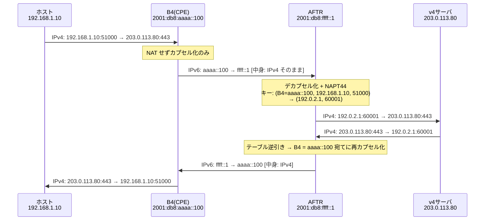
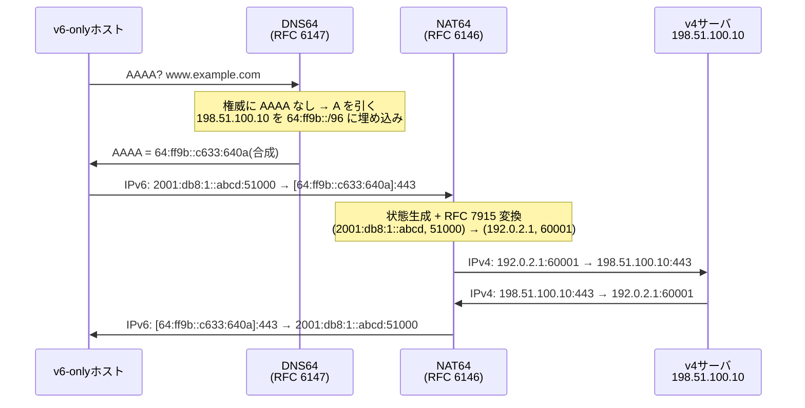

# IPv4/IPv6 移行技術 — トンネルと変換、そして状態の置き場所

## 概要

この章では、IPv4 と IPv6 の並走を支える移行技術 — DS-Lite(RFC 6333)、
MAP-E(RFC 7597)、NAT64/DNS64(RFC 6146/6147)、464XLAT(RFC 6877)— を扱う。
前提知識は [01章](01_why_ipv6.md)(NAT/CGN、デュアルスタック)、
[02章](02_addressing.md)(アドレス体系、64:ff9b::/96)、
[03章](03_ndp_slaac.md)(DHCPv6-PD)、および
[第2部03章](../02_vlan_vxlan_evpn/03_vxlan_fundamentals.md)(カプセル化の原理)。

## 導入 — デュアルスタックの自己矛盾

[01章](01_why_ipv6.md)で確認したとおり、IPv6 は IPv4 と互換のない
別プロトコルであり、移行は「切り替え」ではなく「並走」— デュアルスタック —
を基本形とする。ここまでの章はその前提で進めてきた。しかし、
デュアルスタックには最初から折り込まれていた自己矛盾がある。

**デュアルスタックは、全ノードに IPv4 アドレスを配り続けることを要求する。**
IPv4 アドレスが足りないから IPv6 へ移行しているのに、移行方式そのものが
IPv4 アドレスを消費し続ける。枯渇([01章](01_why_ipv6.md))以前は
これで問題なかったが、新規のアドレスブロックが手に入らなくなった今、
ISP が新しい加入者にグローバル IPv4 アドレスを1つずつ添えることは
できない。CGN で束ねる延命策の限界も 01章で見たとおりである。

そこで発想が逆転する。**土台を IPv6 にしてしまい、IPv4 のほうを
「上に載せるサービス」として提供する**のである。アクセス網・基幹網は
IPv6 だけで設計し(シングルスタック化 — 運用する地図が1枚に戻る)、
残る IPv4 の通信需要は、トンネルか変換で IPv6 の上を運ぶ。
この構図は **IPv4 as a Service(IPv4aaS)** と呼ばれ、方式間の得失は
RFC 9313 が整理している。本章の主役 — DS-Lite、MAP-E、NAT64/464XLAT —
はすべてこの IPv4aaS の道具である。

歴史的には逆向きの時代が先にあったことも押さえておきたい。
IPv6 の黎明期、少数の IPv6 の島を IPv4 の海の上でつなぐ
IPv6-over-IPv4 トンネル(6in4、6to4、Teredo、6rd)が移行技術の主役だった。
IPv6 が海に、IPv4 が島になった現在、方向は完全に反転している。
本章では黎明期の方式は歴史として短く整理し、現在の IPv4aaS を本編とする。

## 理論

### 道具は2つしかない — カプセル化と変換

移行技術は名前こそ多いが、使われている道具は本質的に2つしかない。

**1つ目はカプセル化(トンネル)である。** IPv4 パケットをそのまま
IPv6 パケットのペイロードに入れて運ぶ(IPv6 基本ヘッダの
Next Header = 4)。[第1部01章](../01_fundamentals/01_l2_l3_recap.md)の
カプセル化の原則、そして[第2部03章](../02_vlan_vxlan_evpn/03_vxlan_fundamentals.md)で
VXLAN が「L3 の海の上に L2 の島をつなぐ」ために使ったのと同じ原理である。
違いは載せる中身だけ — VXLAN は Ethernet フレームを、ここでは IPv4
パケットを運ぶ。

```text
+----------------+----------------+------------------------+
|  IPv6 ヘッダ    |  IPv4 ヘッダ   |  TCP/UDP + ペイロード   |
|  (40 オクテット) |  (20〜)       |                        |
+----------------+----------------+------------------------+
 Next Header = 4   ← 中身は無傷のまま運ばれる
```

カプセル化の長所は**中身に手を付けない**ことである。IPv4 パケットは
1ビットも変わらずに対岸へ届くから、IPv4 の意味論(オプション、
プロトコル番号、ICMP)は完全に保存される。短所は 40 オクテットの
オーバーヘッドと、トンネルの出入口という装置が要ることである。

**2つ目は変換(トランスレーション)である。** IPv4 ヘッダを読んで、
対応する IPv6 ヘッダに**書き直す**(逆方向も同様)。フィールドの
対応規則 — TTL ↔ Hop Limit、ToS ↔ Traffic Class、ICMP ↔ ICMPv6 の
タイプ読み替えなど — は RFC 7915(IP/ICMP Translation Algorithm)が
定める。アドレスの対応には [02章](02_addressing.md)の地図に登場した
**IPv4 埋め込み IPv6 アドレス**(RFC 6052)を使う — IPv6 アドレスの
末尾に IPv4 アドレス 32 ビットをそのまま埋め込む形式で、
well-known prefix は `64:ff9b::/96` である(02章の伏線がここで回収される)。

変換の長所は、**片側が純粋な IPv6 ノードでよい**ことである。
トンネルは両端に「IPv4 を理解する装置」が要るが、変換なら
IPv6 しか知らないホストが IPv4 の世界と会話できる。短所は
書き直しに伴う情報の損失・歪みである — 両プロトコルは1対1に
対応しないため(フラグメンテーションの扱い、ICMP の意味論の差)、
変換は原理的に「だいたい等価」にしかならない。アドレスを
ペイロードに埋めるプロトコルが壊れる問題も NAT と同様に付いて回る。

| | カプセル化(トンネル) | 変換 |
|---|---|---|
| 中身の保存 | 完全(無傷で運ぶ) | 近似(書き直す。RFC 7915) |
| 必要な装置 | 両端にトンネル終端 | 変換器1点(+アドレス規則) |
| 端末側の要件 | IPv4 スタックが必要 | IPv6 のみでよい |
| 代表 | DS-Lite、MAP-E、6rd | NAT64、SIIT、MAP-T |

### 状態の置き場所という設計軸 — CGN の反省と A+P

もう1つの設計軸は、**アドレス共有の状態をどこに置くか**である。
IPv4 アドレスを加入者間で共有する以上、「ポート 60001 は
どの加入者のどのフローか」という対応表(NAPT の状態)がどこかに要る。
[01章](01_why_ipv6.md)で見た CGN の問題 — 状態と障害の集中、
装置のコスト、ログの重さ — は、この状態を**網の中央に集めた**ことの
帰結だった。

これに対する反省が **A+P(Address plus Port、RFC 6346)** の発想である。
「アドレスの延長としてポート範囲を割り当てる」— つまり加入者ごとに
「IPv4 アドレス X のポート 1232〜1235、5328〜5331、…を使ってよい」と
**事前に静的に決めて**しまう。そうすれば、

- NAPT の処理(自分の持ちポートへの変換)は**加入者宅の CPE が自分で**
  やればよく、網の中央に状態が要らなくなる
- 「ポート 60001 は誰か」が計算で決まるため、フローごとのログも要らない
- 網側の装置はステートレスになり、故障しても状態が失われない

「状態を端に押し出し、中央を無状態に保つ」— これは
[第1部02章](../01_fundamentals/02_routing_table_basics.md)以来の
「網の中間は無状態転送」という原則の回復でもある。本章の方式は、
この軸の上に一列に並ぶ:

- **DS-Lite**: 状態は中央(AFTR)に集中 — CGN のトンネル版
- **MAP-E**: 状態は端(CE)に分散、中央(BR)は完全ステートレス — A+P の実装
- **NAT64**: 状態は中央(変換器)に集中
- **lw4o6**: 中間(中央は加入者ごとの対応だけ持ち、フロー状態は端)

この軸は運用の性格を決定づける。ステートレスな中央装置は
**エニーキャスト・ECMP でそのまま冗長化できる**(どの装置に当たっても
同じ計算をするだけ)のに対し、ステートフルな中央装置は状態の同期か
フローの固定が必要になる — [第2部](../02_vlan_vxlan_evpn/04_vxlan_control_plane.md)で
見た「状態を持つ装置は増やしにくい」問題の再演である。

### 黎明期の道具 — IPv6-over-IPv4(歴史として)

現在の本編に入る前に、逆方向の時代を短く整理する。

- **設定トンネル / 6in4(RFC 4213)**: IPv6 パケットを IPv4(プロトコル
  番号 41)で包む、両端を手動設定する最も素朴なトンネル。トンネル
  ブローカ経由で個人が IPv6 を得る手段として使われた。
- **6to4(RFC 3056)**: 自分のグローバル IPv4 アドレスから
  `2002:V4ADDR::/48` の IPv6 プレフィックスを自動導出する仕掛け。
  野良の中継(リレー)に依存する経路の非対称と品質問題が深刻で、
  エニーキャストリレー(RFC 3068)は RFC 7526 で**非推奨化**された。
- **Teredo(RFC 4380)**: NAT の内側からでも使えるよう UDP で包む方式。
  同じく品質問題で役目を終えつつある。
- **6rd(RFC 5969)**: 6to4 の「アドレス自動導出」を ISP 自身の
  プレフィックスと管理されたリレーで行う改良版。ISP の商用大規模展開の
  実績を作った点で重要であり、その設計 — **IPv6 アドレスの中に IPv4
  アドレスを埋め込み、トンネル対向を計算で求める(ステートレス)** — は、
  方向を反転させた MAP-E にそのまま受け継がれている。

これらが教えた教訓は2つ — 野良の中継に頼る自動トンネルは品質を
保証できない(6to4 の失敗)、そして**アドレスに対応情報を埋め込めば
中央の状態を消せる**(6rd の成功)である。

### DS-Lite(RFC 6333)— トンネル × 集中ステートフル

DS-Lite(Dual-Stack Lite)は「CGN をトンネルの向こうに置く」方式である。
登場人物は2人:

- **B4**(Basic Bridging BroadBand element): 加入者宅の CPE にある
  トンネル始点。IPv4 パケットを **NAT せずそのまま** IPv6 で包んで送る
- **AFTR**(Address Family Transition Router): ISP 網内のトンネル終端 +
  CGN。カプセル化を解き、NAPT44 してインターネットへ出す

肝は **NAT が AFTR の1回だけ**という点である(01章で見た NAT444 の
二重 NAT を避けている)。宅内のプライベートアドレスは書き換えられず
AFTR まで届き、AFTR の NAPT テーブルは通常の5タプルに加えて
**「どの B4(の IPv6 アドレス)から来たか」をキーに含む**。この拡張に
より、加入者 A と加入者 B がどちらも 192.168.1.10 を使っていても
衝突しない — プライベートアドレスの一意性を、外側の IPv6 アドレスが
肩代わりする。B4 は AFTR のアドレスを DHCPv6 オプション
(AFTR-Name、RFC 6334)で教わる。[03章](03_ndp_slaac.md)で見た
「DHCPv6 は付加情報の配給が得意」の実例である。

トンネル区間の IPv4 側には、予約済みの 192.0.0.0/29(B4 = 192.0.0.2、
AFTR = 192.0.0.1)というアドレスが定義されており、トンネル内部の
ICMP エラーの送信元などに使われる。

DS-Lite の得失は素直である。CE の実装は単純(ただのトンネル + DHCPv6)で、
ポートの割り当ては動的だから加入者は必要なだけ使える。代わりに
AFTR に CGN の重さ — 状態・ログ・障害の集中 — がそのまま残る。

### MAP-E(RFC 7597)— トンネル × ステートレス分散

MAP-E(Mapping of Address and Port with Encapsulation)は、
6rd の「アドレスに埋め込む」設計と A+P の「ポートを事前配分する」発想を
合流させた方式である。登場人物:

- **CE**(Customer Edge): 加入者宅の CPE。**自分に割り当てられた
  IPv4 アドレス+ポートセットの範囲内で自ら NAPT44 を行い**、
  結果をカプセル化して送る
- **BR**(Border Relay): ISP 側の境界。**完全にステートレス**で、
  カプセル化の解除と、逆方向の「宛先 IPv4 アドレス+ポート →
  加入者の IPv6 アドレス」の**算術的な導出**だけを行う

すべての対応は **BMR(Basic Mapping Rule)** という共有ルールと、
加入者に DHCPv6-PD で委任された IPv6 プレフィックスから**計算で**決まる
([03章](03_ndp_slaac.md)の DHCPv6-PD の伏線がここで回収される)。
委任プレフィックスのうちルールプレフィックスを除いた部分
(**EA-bits** = Embedded Address bits)に、IPv4 アドレスの下位ビットと
**PSID**(Port-Set ID = ポートセットの番号)が埋め込まれている:

```text
加入者の委任プレフィックス(例: /56)
+------------------------+------------------+
| BMR IPv6 prefix (/40)  | EA-bits (16 bit) |
+------------------------+------------------+
                         /                  \
                        +----------+---------+
                        | IPv4下位  |  PSID   |
                        | (8 bit)  | (8 bit) |
                        +----------+---------+
```

- 共有比(1つの IPv4 アドレスを共有する加入者数)は 2^(PSID長)。
  PSID 8 ビットなら 256 加入者で1アドレスを共有する
- 各加入者が使えるポートは、well-known ポート(0〜1023)を除外する
  オフセット規則(既定 a = 6)により、**連続ではなく飛び飛びの範囲の
  集合**として与えられる(詳細は動作の節)

BR がステートレスであることの帰結は大きい。BR は**エニーキャストで
複数台置ける**(どの BR に当たっても同じ計算をするだけ)、故障しても
失われる状態がない、フローのログは不要(ポートから加入者が計算で
一意に決まる)。代償は、ポート割り当てが**静的**であること — 加入者は
共有比で決まった数のポート(後述の例では 252 個)しか使えず、
足りなくても融通は利かない。動的に融通する CGN/AFTR と正反対の
トレードオフである。

なお同じ MAP の枠組みで、カプセル化の代わりに変換(RFC 7915)を使う
**MAP-T**(RFC 7599)、状態の置き方を中間にした **lw4o6**(Lightweight
4over6、RFC 7596。中央は加入者ごとの結び付けだけ持ち、フロー状態は
持たない — 共有比とポート割り当てを加入者ごとに変えられる)という
兄弟仕様がある。本書では代表として MAP-E を扱う。

### NAT64/DNS64(RFC 6146/6147)— 変換 × 集中ステートフル

ここまでの2方式は「端末には IPv4 も見せる」IPv4aaS だった。
NAT64 は一歩進んで、**端末側を IPv6 だけにする**(IPv6-only ネットワーク)
ための変換方式である。

- **NAT64**(RFC 6146): IPv6-only ホストから IPv4 サーバへの通信を
  中継するステートフル変換器。IPv6 側の宛先は「NAT64 プレフィックス +
  IPv4 アドレス埋め込み」(既定は well-known prefix `64:ff9b::/96`、
  RFC 6052)で表現され、変換器は NAPT44 と同様の状態テーブル
  (IPv6 側5タプル ↔ IPv4 側5タプル)を持ってヘッダを書き直す
- **DNS64**(RFC 6147): その宛先アドレスを**作り出す**共犯者。
  ホストが AAAA を問い合わせたとき、正解が存在しなければ A レコードを
  引き、その IPv4 アドレスを埋め込んだ**偽の AAAA を合成して**返す

つまり NAT64 単体では「IPv6-only ホストが IPv4 サーバの存在を
知る方法」がなく、DNS64 が名前解決の段階で IPv4 の世界を IPv6 の
アドレス空間に**射影**してみせる、という分業である。ホストは自分が
IPv4 サーバと話していることに気づかない。

この設計の弱点は、**射影が DNS を通るものにしか働かない**ことである。

- **IPv4 リテラル**: アプリが `http://198.51.100.10/` のように
  アドレス直書きで接続すると、DNS64 の出番がなく詰む
- **独自リゾルバ**: アプリ・OS が網の DNS64 を使わず外部の
  リゾルバへ直接問い合わせると、合成 AAAA が得られない
- **DNSSEC**: 合成 AAAA は権威の署名と一致しないため、検証する
  クライアントとは相性が悪い(RFC 6147 はこの制約を明記している)
- **NAT の宿命**: アドレスをペイロードに埋めるプロトコルは
  やはり壊れる(01章の NAT の議論がそのまま当てはまる)

また well-known prefix `64:ff9b::/96` にはプライベート IPv4 アドレスを
埋め込めない(RFC 6052)ため、組織内の IPv4 資源も対象にしたい場合は
自組織のプレフィックスから切り出した Network-Specific Prefix を使う。
なお変換自体をステートレスに行う SIIT(RFC 7915 + 明示対応表 RFC 7757)
という選択肢もあり、データセンターの IPv6-only 化などで使われる。

### 464XLAT(RFC 6877)— 変換の二段重ねで弱点を消す

NAT64/DNS64 の弱点(リテラル・独自リゾルバ)は、スマートフォンの
アプリ群には致命的だった。これを端末側の仕掛けで塞いだのが
464XLAT である。

- **CLAT**(customer-side translator): 端末(またはCPE)内で動く
  **ステートレス**変換器(RFC 7915)。アプリには普通の IPv4
  インタフェースを見せ、出ていく IPv4 パケットを機械的に IPv6 へ変換する
- **PLAT**(provider-side translator): 網側のステートフル NAT64
  (RFC 6146 そのもの)

アプリ → **CLAT(4→6 変換)** → IPv6-only 網 → **PLAT(6→4 変換)** →
IPv4 インターネット、と4-6-4 で挟むため 464 の名がある。
アプリから見れば端末は今までどおりデュアルスタックに見え、
IPv4 リテラルも独自リゾルバも問題なく動く。一方、網は完全に
IPv6-only にできる。モバイル網で世界的に採用され、Android/iOS は
CLAT を標準実装している。「端末の中に小さな変換器を置くことで、
網から IPv4 を消す」— IPv4aaS の現時点での完成形の1つである。

CLAT が変換に使う NAT64 プレフィックスの発見には、DNS で
`ipv4only.arpa`(A レコードしか持たないことが保証された名前)の
AAAA を引いてみる方法(RFC 7050)と、[03章](03_ndp_slaac.md)の RA に
PREF64 オプションで載せて配る方法(RFC 8781)がある。さらに
「この網は IPv6-only 優先である(CLAT があるなら IPv4 を止めてよい)」を
DHCPv4 オプション 108 で伝える仕掛け(RFC 8925)もあり、
ホスト側から IPv4 を畳んでいく道具立てが揃いつつある。

### 方式の全体地図

| 方式 | 道具 | 状態の所在 | 端末側 | 主な適用場面 |
|---|---|---|---|---|
| デュアルスタック | — | — | v4 + v6 | 基本形(ただし IPv4 アドレスを消費) |
| DS-Lite(RFC 6333) | トンネル | 中央(AFTR)に集中 | v4 + v6 | 固定回線の IPv4aaS |
| MAP-E(RFC 7597) | トンネル | 端(CE)に分散・中央は無状態 | v4 + v6 | 固定回線の IPv4aaS |
| lw4o6(RFC 7596) | トンネル | 中間(加入者単位の対応のみ中央) | v4 + v6 | 固定回線の IPv4aaS |
| NAT64/DNS64(RFC 6146/6147) | 変換 | 中央に集中 | **v6 のみ** | IPv6-only 網 → v4 インターネット |
| 464XLAT(RFC 6877) | 変換×2 | 端は無状態・中央(PLAT)に集中 | v6 のみ(v4 は擬態) | モバイル、IPv6-only 網 |

どの方式でも変わらない本質を2つ確認しておく。第一に、
**IPv4 アドレス共有の総量は変わらない** — 1つのグローバル IPv4
アドレスのポート約6万個をどう分けるかという 01章の CGN の算数は、
方式が変わっても消えない。変わるのは状態の置き場所と分け方
(動的か静的か)だけである。第二に、これらはすべて
**IPv4 の延命装置であって IPv6 の代替ではない** — IPv6 どうしの通信は
どの方式でも素通しであり、コンテンツ側の IPv6 対応が進むほど
これらの装置を通るトラフィックは減っていく。移行技術の理想は
「いつの間にか使われなくなっている」ことである。

## プロトコル動作の詳細

### DS-Lite のウォークスルー — 拡張された NAT テーブル

加入者宅のホスト(192.168.1.10)が IPv4 サーバ 203.0.113.80:443 へ
接続する。B4 の IPv6 アドレスを 2001:db8:aaaa::100、AFTR を
2001:db8:ffff::1、AFTR の変換プールを 192.0.2.1 とする。



注目点は AFTR の NAPT テーブルである。通常の NAPT44 のエントリ
`(192.168.1.10, 51000) → (192.0.2.1, 60001)` に **B4 の IPv6 アドレスが
連結キーとして加わる**ため、別の加入者(B4 = 2001:db8:bbbb::100)の
192.168.1.10:51000 とは別エントリとして共存できる。戻りパケットの
配送先(どの B4 へ包み直すか)もこのキーから決まる。状態は
すべて AFTR にあり、B4 には何もない — B4 が再起動しても
セッションは AFTR 側に残る一方、AFTR の障害は全加入者の全セッションを
失わせる。

### MAP-E のアドレス計算 — 状態の代わりに算術

BMR を次のとおりとする(値は説明用):

- Rule IPv6 prefix: `2001:db8::/40`
- Rule IPv4 prefix: `198.51.100.0/24`
- EA-bits 長: 16(委任プレフィックスは /56)
- ポートオフセット a = 6(既定)

加入者に DHCPv6-PD で `2001:db8:12:3400::/56` が委任されたとする。

```text
2001:db8:12:3400::/56
= 2001:0db8:00 | 12:34 | 00…
  └ Rule /40 ┘ └EA=0x1234┘

EA-bits 0x1234 = 0001 0010 0011 0100
                 └ 0x12 ┘ └ 0x34 ┘
IPv4 下位 8 bit = 0x12 = 18 → IPv4 アドレス = 198.51.100.18
PSID(8 bit)   = 0x34 = 52
```

- **共有比**: PSID が 8 ビットなので、198.51.100.18 は 256 加入者で共有
- **使えるポート**: ポート番号 16 ビットを `[ A(6) | PSID(8) | j(2) ]` と
  区切り、A ≥ 1 の組み合わせだけを使う(A = 0 の範囲 = 0〜1023 の
  well-known ポートを全員が避ける)。この加入者(PSID = 52)なら

  ```text
  A=1:  0b000001_00110100_00 〜 11 = 1232〜1235
  A=2:  2256〜2259
  …
  A=63: 64720〜64723
  ```

  つまり **4 ポートずつ 63 か所、計 252 ポート**。連続レンジではなく
  飛び飛びなのは、A を上位に置くことでどの PSID の加入者にも
  「高い番号・低い番号」がまんべんなく当たるようにするためである

CE はこの範囲内で NAPT44 し(送信元ポートを自分の持ちポートに限定した
NAPT)、BR へカプセル化して送る。逆方向は BR が
「宛先 198.51.100.18:1233 → PSID 52 → 委任プレフィックス
2001:db8:12:3400::/56 の CE」を**計算だけで**導出して包む。
テーブルはどこにもない。また CE の MAP 用 IPv6 アドレスの
インタフェース ID には IPv4 アドレス全 32 ビットと PSID が埋め込まれる
形式(RFC 7597 Section 6)が定義されており、パケットを見ただけで
対応が検算できる。

同じ BMR を共有する CE どうし(FMR として設定した場合)は、BR を
経由せず**直接**相手 CE の IPv6 アドレスを計算してトンネルを張れる
(メッシュモード)。ハブ&スポークしかできない DS-Lite との
違いであり、これもステートレス(=誰でも計算できる)の恩恵である。

### NAT64/DNS64 のウォークスルー — 名前解決から始まる変換

IPv6-only ホスト(2001:db8:1::abcd)が `www.example.com`
(A = 198.51.100.10 のみ、AAAA なし)へ接続する。



`64:ff9b::c633:640a` の末尾 32 ビットは 198.51.100.10 の16進表現
(c6.33.64.0a)そのものである。網内では `64:ff9b::/96` への経路が
NAT64 装置を向くよう広告されており、ホストにとっては
[第1部02章](../01_fundamentals/02_routing_table_basics.md)の
ロンゲストマッチで NAT64 へ吸い込まれる、ただの1経路にすぎない。
変換器は TCP/UDP/ICMP のヘッダを RFC 7915 の規則で書き直す —
TTL ↔ Hop Limit の減算、チェックサムの再計算(IPv6 側に L3
チェックサムはない — [01章](01_why_ipv6.md))、ICMPv4 ↔ ICMPv6 の
タイプ対応(Fragmentation Needed ↔ Packet Too Big など)が含まれる。

464XLAT はこの絵の左側に CLAT が加わるだけである。アプリの
IPv4 パケット(送信元は CLAT 用の 192.0.0.0/29 — RFC 7335)を
CLAT がステートレスに IPv6 化し(送信元は端末の専用 /64 から、
宛先は PLAT プレフィックス + 埋め込み)、あとは上と同じ道をたどる。

### MTU の算数 — カプセル化の請求書は IPv4 に届く

トンネル型(DS-Lite、MAP-E)は IPv6 ヘッダ 40 オクテットを積む。
[第2部03章](../02_vlan_vxlan_evpn/03_vxlan_fundamentals.md)の VXLAN の
50 オクテットと同じ「カプセル化はフレームを太らせる」問題だが、
今回は**中身が IPv4** である点が事情を複雑にする。

- アクセス網の IPv6 MTU が 1500 のとき、中の IPv4 は 1460 までしか
  運べない。1500 で作られた IPv4 パケットが来たら、トンネル入口は
  (1) DF = 0 なら IPv4 として分割できるが、(2) DF = 1(現代の TCP は
  ほぼ常にこれ)なら **ICMPv4 Fragmentation Needed を返す**か、
  RFC 2473 の規定で**外側の IPv6 のほうを分割する**しかない
- つまり [前章](04_routing_ipv6.md)で見た PMTUD の問題系が、今度は
  「**IPv4 の PMTUD が、見えない IPv6 区間の都合を知らされる**」という
  二層構造で現れる。ICMPv4 が加入者側でフィルタされていれば
  そのままブラックホールになる
- 実務の定石は2つ — アクセス網の MTU を増やす(RFC 6333 Section 5.3 は
  B4〜AFTR 間の全リンクの MTU を**少なくとも 40 オクテット**増やすことを
  SHOULD として推奨する。標準的な 1500 基準なら結果は 1540 以上)か、
  それができなければ CE で **TCP MSS を 1420 程度にクランプ**する
  (1460 − TCP/IP ヘッダ 40)。
  MSS クランプが UDP に効かない対症療法であることは前章と同じ

変換型(NAT64)にはこの 40 オクテットがなく、IPv6 側(最小 MTU 1280)と
IPv4 側(分割可)の差を RFC 7915 が吸収する。MTU の扱いやすさは
変換の隠れた長所である。

## 設定例(補助)— 移行装置の挙動を観察する

DNS64 の合成は、公開されている DNS64 リゾルバに `ipv4only.arpa`
(A レコードしか存在しないことが保証された名前 — RFC 7050 が
プレフィックス発見に使うのもこれ)を引くだけで観察できる:

```
$ dig +short A ipv4only.arpa
192.0.0.170
192.0.0.171

$ dig +short AAAA ipv4only.arpa @dns64.dns.google
64:ff9b::c000:aa
64:ff9b::c000:ab
```

権威サーバに AAAA は存在しないのに、DNS64 経由では
`64:ff9b::` + c0.00.00.aa(= 192.0.0.170)の合成 AAAA が返る —
「射影」が名前解決の段で起きていることが直接確認できる。

トンネル側の仕組みは、Linux の IPv4-in-IPv6 トンネル(`ip6tnl`)で
B4 相当を手組みしてみると腑に落ちる:

```
# B4 相当: IPv4 を IPv6 で包むトンネルを AFTR へ向けて張る
ip -6 tunnel add b4tun mode ipip6 \
    local 2001:db8:aaaa::100 remote 2001:db8:ffff::1
ip link set b4tun up mtu 1460
ip route add default dev b4tun   # IPv4 デフォルトルートをトンネルへ
```

IPv4 のデフォルトルートの出口が「IPv6 アドレスで指定された
トンネル」になる — 前章まで見てきた「2枚の地図」の IPv4 側の地図が、
IPv6 の地図の上に**間借り**する構図が経路表に現れる。tcpdump で
このインタフェースの外側(物理側)を見れば、IPv6 ヘッダ
(Next Header = 4)の中に無傷の IPv4 パケットが確認できる。

## トラブルシューティング

### ① 同時接続が多いときだけ失敗する — ポートの算数の再演

MAP-E 環境で「普段は正常なのに、画像の多いページや並列ダウンロードで
一部の接続だけ間欠的に失敗する」— 典型的なポートセット枯渇である。
理論編の例なら持ちポートは 252 個で、タイムウェイト中のものも
数に入るから、並列接続の多いワークロードでは現実に尽きる。

- 観察: CE(が Linux なら)`conntrack -C` などで NAT テーブルの
  エントリ数を時系列で見る。持ちポート数に張り付くタイミングと
  失敗が一致するかを突き合わせる。**MAP-E は NAPT が手元(CE)に
  あるため加入者側で観察できる** — 状態が網の中央にあって外から
  見えない CGN・AFTR・PLAT との、状態の所在の違いがそのまま
  可観測性の違いになる
- 対策の方向: 短命接続を減らす(HTTP の多重化・持続接続の活用)、
  NAT タイムアウトの調整、恒常的に足りなければ共有比の小さい
  契約・方式(lw4o6 なら加入者ごとに変えられる)の検討。そして
  本質的には **IPv6 で通信させる**こと — ポートを消費するのは
  IPv4 のフローだけである

### ② 大きいパケットだけ消える(再演)— ただし今度は二層構造

[前章](04_routing_ipv6.md)トラブル③の症状(ping は通るのに転送が
固まる)がトンネル型 IPv4aaS でも起こる。ただし原因の層が増えている:
IPv4 の PMTUD を成立させるには、トンネル入口が返す
**ICMPv4** Fragmentation Needed が発信元まで届く必要があり、
IPv6 区間の都合(実際の細さ)を IPv4 の言葉に翻訳して伝える
リレーが挟まる。

- 観察: 境界サイズの特定(`ping -M do -s 1432` は通り 1433 は
  消える、なら IPv4 MTU 1460 = 1500 − 40 が疑われる)。CE の
  トンネルインタフェースの MTU 設定、CE から出る ICMPv4 Type 3
  Code 4 が LAN 側で観測できるかをキャプチャで確認する
- 対策の方向: CE での MSS クランプ(TCP のみの対症療法)、
  アクセス網 MTU の拡大(1540 以上、恒久策)。切り分けの early check
  として「IPv6 ネイティブの通信は同サイズで通るか」を試すと、
  トンネル起因かどうかが即座に分かる

### ③ NAT64 環境で特定のアプリだけ動かない — 射影の穴

IPv6-only + NAT64/DNS64 の網で、ブラウザは全く問題ないのに
特定のアプリだけ接続できない。疑うべきは理論編で挙げた射影の穴、
すなわち **DNS64 を経由しない宛先**である。

- 観察: そのアプリの通信をキャプチャし、(1) AAAA クエリを
  投げているか(独自リゾルバや DoH で網の DNS64 を迂回して
  いないか)、(2) 宛先に `64:ff9b::/96`(または網の NSP)宛てが
  現れているか、(3) IPv4 リテラルへの接続試行(= そもそも v4
  ソケットを開こうとして失敗)がないかを順に確認する
- 対策の方向: 端末側に CLAT があるか(現代のスマートフォンは
  標準装備、デスクトップ OS は環境差が大きい)を確認する。
  CLAT が使えるなら 464XLAT に寄せるのが正攻法で、リテラルも
  独自リゾルバも救われる。使えない環境では、当該アプリの
  IPv6 対応/設定変更しかない — DNS64 は「DNS を通らないものは
  救えない」仕様上の限界であることを認識して切り分けを打ち切る

### ④ 「ポート開放」ができない — 着信の可否は方式で決まっている

IPv4aaS 環境で自宅サーバ・ゲーム機の「ポート開放」が設定できない、
という相談は、障害ではなく**方式の仕様**であることが多い。
NAPT の内側への着信には対応する状態(または静的対応)が必要で、
それを作れるかどうかが方式で異なる。

- MAP-E: 自分の持ちポートセット**内**なら CE の設定で静的マッピング
  可能。ただし 1024 未満(well-known)は既定のオフセット規則では
  **誰にも割り当てられない**ため、443 で待ち受けるといった用途は
  原理的に不可
- DS-Lite / NAT64: 状態は網側(AFTR/PLAT)にあり、加入者は
  操作できない。PCP(Port Control Protocol、RFC 6887)を ISP が
  提供していれば要求できるが、一般的ではない
- 観察と切り分け: 外部からの SYN が CE まで届いているかを
  キャプチャで確認 — トンネル型なら「BR/AFTR がそもそも
  転送してこない」(手前で落ちる)のが正常動作である
- 対策の方向: 着信を受けたいサービスは **IPv6 側で公開する**のが
  本筋(グローバルアドレスの回復 — 01章のエンドツーエンド原則が
  ここで実利になる)。IPv4 での着信が必須なら、固定 IPv4 アドレスの
  オプション契約や VPS 経由の中継など、IPv4aaS の外の手段になる

## 演習・確認問題

1. デュアルスタックが移行方式として抱える自己矛盾を説明し、
   「IPv4 as a Service」への転回が何を解決するのかを述べよ。
2. カプセル化と変換のそれぞれの長所・短所を、「中身の保存性」
   「端末側に要求されるスタック」の2つの観点から比較せよ。
3. DS-Lite の AFTR が持つ NAPT テーブルは、通常の NAPT44 の
   テーブルと何が違うか。その違いが「加入者間のプライベート
   アドレス重複」を許す理由とあわせて説明せよ。
4. 理論編の BMR(Rule IPv6 prefix `2001:db8::/40`、Rule IPv4 prefix
   `198.51.100.0/24`、EA-bits 16、a = 6)の下で、委任プレフィックス
   `2001:db8:56:7800::/56` の加入者の IPv4 アドレス・PSID・
   共有比・使えるポート数を求めよ。
5. MAP-E の BR がステートレスであることから導かれる運用上の
   利点を3つ挙げよ。また、その代償(DS-Lite と比べて失うもの)は
   何か。
6. DNS64 の「射影」が働かない3つのケースを挙げ、464XLAT が
   そのうちどれをどのように解決するかを説明せよ。
7. トンネル型 IPv4aaS で「IPv4 の大きいパケットだけ消える」障害が
   起きる仕組みを、ICMPv4 と IPv6 区間の MTU の関係から説明せよ。
   恒久対策と対症療法をそれぞれ挙げよ。

## まとめ

- 移行の主戦場は「IPv6 の島を IPv4 で運ぶ」から「IPv6-only の網の上で
  IPv4 をサービスとして運ぶ」(IPv4aaS、RFC 9313)へ反転した。道具は
  カプセル化(中身を無傷で運ぶ)と変換(RFC 7915 で書き直す)の2つ、
  設計軸は状態の置き場所(中央集中か、A+P = RFC 6346 の分散か)である。
- DS-Lite(RFC 6333)はトンネル × 集中ステートフル — B4 は NAT せず包む
  だけ、AFTR が B4 アドレスをキーに含む NAPT を一手に担う。
  MAP-E(RFC 7597)はトンネル × ステートレス分散 — DHCPv6-PD の
  プレフィックスに IPv4 アドレスと PSID を埋め込み、CE が持ちポートの
  範囲で自ら NAPT し、BR は計算だけで戻り先を導く。
- NAT64(RFC 6146)は端末を IPv6-only にする変換方式で、DNS64
  (RFC 6147)が IPv4 の世界を `64:ff9b::/96`(RFC 6052)へ射影した
  合成 AAAA を供給する。DNS を通らない通信(リテラル・独自リゾルバ)は
  救えず、その穴を端末内のステートレス変換器 CLAT で塞いだのが
  464XLAT(RFC 6877)である。
- どの方式も IPv4 アドレス共有の総量は変えられない — ポートの算数
  (共有比と持ちポート数)と、着信可否・可観測性が状態の置き場所で
  決まることが、方式選択と障害切り分けの軸になる。
- トンネルの 40 オクテットは IPv4 側の PMTUD 問題として二層構造で
  現れる(MSS クランプは対症療法、MTU 拡大が恒久策)。そして
  すべての移行装置は IPv4 の延命装置であり、通信が IPv6 ネイティブに
  なるほど負荷ごと消えていく — 出口は装置の増強ではなく IPv6 化である。
