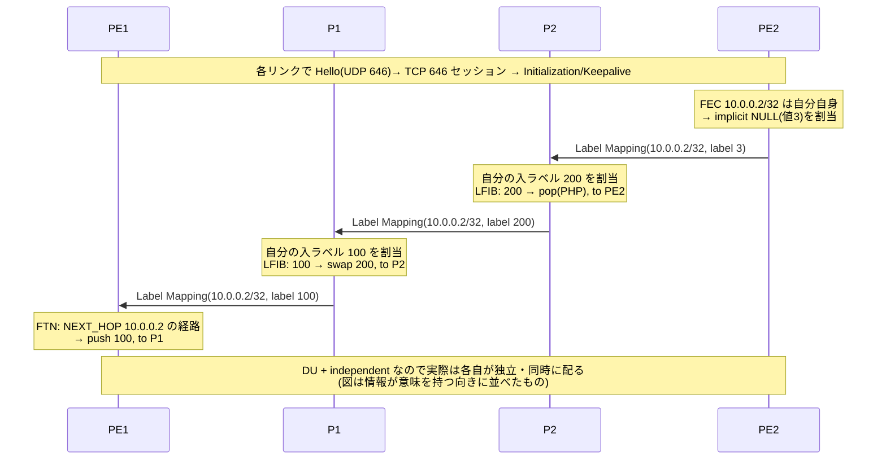
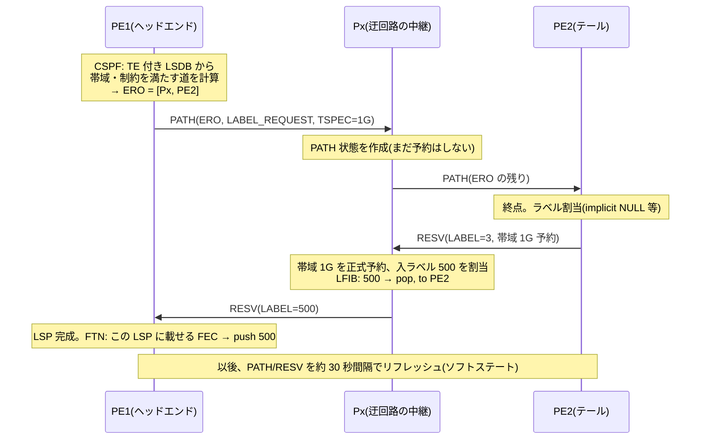

# LDP と RSVP-TE — ラベルをどう配るか、道をどう選ぶか

## 概要

この章では、MPLS のラベルを配布する2つの古典的プロトコル — LDP(RFC 5036)と
RSVP-TE(RFC 3209)— を学ぶ。両者は「何のためにラベルを配るか」が根本的に違い、
その違いと限界を理解することが、第4章で扱うセグメントルーティングの理解に直結する。
前提知識は [前章のラベル転送の仕組み](01_mpls_basics.md) と、
第1部の [リンクステートと LSDB](../01_fundamentals/04_distance_vector_link_state.md) である。

## 導入 — 2つの問いに、2つのプロトコル

[前章](01_mpls_basics.md) の最後で、MPLS のアーキテクチャは
ラベル配布の方法を仕様から分離している、と述べた。
実際に何が必要かを考えると、要求は2種類に分かれる。

**問い A: 「基本の道」に自動でラベルを張りたい。**
BGP フリーコアを成立させるには、全 PE のループバックへの LSP が
網の全域に張られていればよい。道は IGP の最短経路のままでよく、
特別な要求はない。欲しいのは「IGP が計算した道に、
人手なしでラベルを併設してくれる係」である。
この答えが **LDP(Label Distribution Protocol)**である。

**問い B: 「IGP が選ばない道」を意図的に使いたい。**
IGP の最短経路は全員に同じ答えを返す。その結果、
最短の道だけが混雑し、迂回路が遊ぶ。「この LSP は帯域 1G を確保して
北回りで」「障害時は 50 ミリ秒で予備の道へ」— こうした
**トラフィックエンジニアリング(TE)**の要求には、
経路の指定・資源の予約・高速迂回という、IGP にもラベルにもない
機能群が要る。この答えが **RSVP-TE** である。

2つは排他ではなく、実務では「土台の LSP は LDP、特定の太い流れだけ
RSVP-TE」という併用が長く定石だった。そして本章の最後に見るとおり、
どちらも固有の弱点を抱えており、その弱点への反省が
[セグメントルーティング](04_srv6.md) を生むことになる。

## 理論

### LDP — IGP に従属する「ラベル貼り係」(RFC 5036)

LDP の設計を一言で言えば、**経路について何も決めないプロトコル**である。
どの宛先にどう行くかはすべて IGP が決める。LDP の仕事は、
IGP のテーブルに載った各プレフィックス(= FEC)について
「私はこの FEC にラベル X を割り当てた」と隣人に知らせることだけである。
全ルータがこれを行うと、IGP の最短経路に沿ったラベルの合意の連鎖 —
つまり LSP — が、**すべての FEC について自動的に**出来上がる。

この従属関係は LDP の理解の要なので、強調しておく:

> LDP は道を作らない。IGP が作った道に、ラベルという舗装をするだけである。
> したがって LSP の行き先は常に IGP の最短経路と一致し、
> IGP が収束し直せば LSP も付け替わる。

#### 隣人の発見とセッション

LDP の動作は [OSPF](../01_fundamentals/05_igp_overview.md) と
[BGP](../03_bgp/01_bgp_basics.md) の中間のような形をしている:

1. **発見(discovery)**: UDP ポート 646 で Hello を
   マルチキャスト(224.0.0.2 = 全ルータ)し、リンク上の LDP スピーカーを
   自動発見する(OSPF 的)。直結でない相手と結ぶための
   targeted Hello(ユニキャスト)もある
2. **セッション**: 発見した相手と **TCP ポート 646** でセッションを張り、
   その上でラベル情報を確実に交換する(BGP 的 — 順序と再送を TCP に任せ、
   差分だけを送る)

セッションは Hello に載る **transport address**(通常はループバック)
どうしで張られ、アドレスの**大きいほう**が能動(接続する側)になる
(RFC 5036 Section 2.5.2:「If A1 > A2, LSR1 plays the active role」)。
各スピーカーは **LDP Identifier**(LSR ID 4 オクテット + ラベル空間 2 オクテット、
`10.0.0.1:0` のような表記)で識別される。

#### 配布の3つの選択肢 — そして事実上の一択

RFC 5036 はラベルの配り方・持ち方・作り方にそれぞれ2択を定義している。
組み合わせは8通りあるが、フレームベースの網(Ethernet 上の MPLS)では
事実上1つに収斂しているので、対比の意味だけ押さえればよい:

| 選択軸 | 選択肢 | フレームモードの定番 |
|---|---|---|
| 配布方式 | **DU**(Downstream Unsolicited: 頼まれなくても配る)/ DoD(Downstream on Demand: 求められたら配る) | **DU** |
| 保持方式 | **liberal**(使わないラベルも保持)/ conservative(現在のネクストホップの分だけ保持) | **liberal** |
| 制御方式 | **independent**(自分の判断で即座に割り当てる)/ ordered(出口側から順に割り当てる) | **independent** |

定番の組(DU + liberal + independent)に通底する思想は
「**メモリを使ってでも、収束を速くする**」である。
liberal retention の意味を考えてみてほしい — 現在のネクストホップが
R2 でも、R3 から届いたラベルも捨てずに取っておく。
IGP の障害収束でネクストホップが R3 に変わった瞬間、
**LDP の再交渉なしで**手持ちのラベルに切り替えられる。
ラベルの交換を待ってから転送を直すのでは、IGP が速く収束しても
意味がないからである。

ここには [第1部04章](../01_fundamentals/04_distance_vector_link_state.md) で見た
「伝搬と計算の分離が収束を速くする」と同じ設計思想が流れている。
情報(ラベル)は使う前から広く配っておき、選択(どれを使うか)は
IGP の答えに即座に追従する。

#### IGP との速度差が生む穴 — LDP-IGP 同期(RFC 5443)

LDP が IGP に従属していることは、固有の障害モードを生む。
**IGP と LDP は独立に収束するため、一瞬だけ足並みが乱れる**のである。

リンクが復旧した場面を考える。OSPF の隣接は数秒で Full になり、
IGP は新しい(短い)経路へトラフィックを向け直す。
ところが LDP セッションの確立とラベル交換がまだ終わっていないと、
その新経路には**ラベルの合意が存在しない**。
ラベル付きで送るべきパケットが送れない・途中で剥がれる状態になり、
VPN のトラフィック(ラベルがないと運べない)はブラックホールに落ちる。
IP の到達性だけ見ていると「復旧したのに壊れた」ように見える、
たちの悪い障害である。

対策が **LDP-IGP 同期(RFC 5443)**である。発想は単純で、
「LDP の準備ができていないリンクを、IGP に使わせない」。
具体的には、LDP セッションが未確立のリンクの IGP メトリックを
最大値(OSPF なら 65535)で広告し、他に道がある限り
そのリンクが最短経路に選ばれないようにする。LDP が追いついたら
本来のメトリックに戻す。2つのコントロールプレーンの
収束タイミングを、メトリックを介して縛るわけである。

### RSVP-TE — 道を予約するプロトコル(RFC 3209)

#### IGP の最短経路は「正しくて、貧しい」

TE の動機を正確に押さえておく。IGP(と、それに従属する LDP)の転送には
構造的な貧しさが2つある:

1. **全員が同じ答えに従う**。A から B への最短経路が1本なら、
   A→B の全トラフィックがそこに集中する。並行する迂回路が
   空いていても使われない(ECMP は等コストの場合しか救えない)。
   コスト調整で流れを変えようにも、メトリックは網全体で共有される
   1つの地図なので、ある流れを動かすと別の流れも動いてしまう
2. **資源の概念がない**。SPF は「近いか」を計算するが
   「空いているか」を知らない。リンクの帯域が埋まっていても
   最短なら使われ続ける

これは、有名な魚の形のトポロジ(fish problem)で説明される:

```text
            ┌── R2 ──┐            R1→R5 の最短経路が上回り(R2)なら、
   R1 ──────┤        ├────── R5   全トラフィックが上を通り、
            └── R3 ──┘            下回り(R3)は遊ぶ。
     (魚の胴体が2本に裂けている形)   「流れごとに道を割り振る」には
                                    宛先ベース転送では足りない
```

宛先ベースの転送では、R1 に届いた 2 つの流れは宛先が同じなら
同じ道しか通れない。**流れごとに道を変えるには、転送の根拠を
宛先から切り離す必要がある** — まさに前章で見た MPLS の本質である。
入口 R1 が流れ①には「上回りの LSP」のラベルを、流れ②には
「下回りの LSP」のラベルを push すれば、以後の転送は
ラベルが決めるので道が分かれる。

#### TE に必要な3つの部品

「帯域 1G を確保して北回りの LSP を張る」を実現するには、
3つの部品が要る。RSVP-TE はその3番目であり、
1・2番目は IGP と入口ルータが担う:

1. **資源つきの地図(IGP の TE 拡張)** —
   SPF の地図(LSDB)には「つながっているか」しか載っていない。
   各リンクの物理帯域・**予約可能な残り帯域**・管理グループ
   (アフィニティ、「衛星回線」「予備系」のような色付け)を
   載せる拡張が OSPF-TE(RFC 3630)/ IS-IS TE(RFC 5305)である。
   [IS-IS の TLV 拡張性](../04_ipv6/04_routing_ipv6.md) がここでも効いており、
   情報は TE 用の TLV/Opaque LSA として通常のフラッディングに相乗りする
2. **条件つきの経路計算(CSPF)** —
   入口(ヘッドエンド)ルータが、TE 付き LSDB から
   「帯域 1G 未満のリンクを除外」「色 X のリンクを除外」のように
   **条件に合わないリンクを刈ってから** SPF を回す。
   これが CSPF(Constrained SPF)である。答えは入口が
   ホップ列として決める — **ソースルーティングの復権**であり、
   ホップバイホップ転送の原則からの明確な離脱である
3. **予約とラベルの設置(RSVP-TE)** —
   CSPF が出した道に沿って、各ルータに「この LSP のために
   帯域を取り置け、ラベルを割り当てろ」と伝えて回る
   シグナリングプロトコル。これが RSVP-TE の仕事である

RSVP はもともとエンドホスト向けの資源予約プロトコル(RFC 2205、
IntServ の部品)として設計され、ほぼ使われずに終わったものを、
RFC 3209 が「LSP のトンネルを張る」用途に拡張して転生させた、
という経緯を持つ。

#### PATH と RESV — 行きで頼み、帰りでラベルが決まる

RSVP-TE の基本動作は2つのメッセージの往復である:

- **PATH**(入口 → 出口): CSPF の答えを **ERO(Explicit Route Object、
  明示経路オブジェクト)**として携え、その経路のとおりに
  ホップを渡り歩く。各ホップは「この LSP が来るぞ」という状態を作り、
  要求帯域(SENDER_TSPEC)を覚える。LABEL_REQUEST オブジェクトが
  「帰りにラベルをくれ」という依頼である
- **RESV**(出口 → 入口): 出口から**逆向きに**同じ道を戻りながら、
  各ホップが帯域を正式に予約し、**下流が割り当てたラベル**を
  LABEL オブジェクトで上流へ伝える。RESV が入口に着いた時点で、
  ラベルの連鎖 = LSP が完成している

ラベルが**下流から上流へ**伝わる点は LDP と同じである
(前章で見たとおり、ラベルは「受け取る側」が指定する値だからである)。
違いは、LDP が「全 FEC に、トポロジの隣人と」交換するのに対し、
RSVP-TE は「この LSP 1本のために、道沿いのルータとだけ」交換することである。

#### ソフトステートという設計 — そしてそれが限界になる

RSVP の状態は**ソフトステート**である。PATH/RESV は一度きりではなく、
周期的に再送される(RFC 2205 Section 3.7 の TIME_VALUES が運ぶリフレッシュ
周期 R の既定は 30 秒。実際の送出タイミングは網内での同期を避けるため
[0.5R, 1.5R] の範囲でランダム化される)。リフレッシュが途絶えた状態は
タイムアウトで消える。[BGP](../03_bgp/01_bgp_basics.md) が
「TCP と Keepalive を土台に、差分だけ送るハードステート」を選んだのと
正反対の設計である(RSVP は IP 上に直接載っており、信頼性を
自前の再送で賄う。リフレッシュの負荷軽減は RFC 2961)。

ここで冷静に勘定をしてみてほしい。RSVP-TE の LSP は
入口ごと・出口ごとに張る一方向のトンネルである。
N 台のエッジをフルメッシュで結ぶと **N(N−1) 本**の LSP になり、
コアのルータは自分を通過する**全 LSP の状態**
(PATH/RESV の記憶、帯域の取り置き、周期リフレッシュの処理)を持つ。
[第3部06章](../03_bgp/06_large_scale_design.md) で見た
iBGP フルメッシュの n(n-1)/2 と同じ形の破綻が、
今度はコントロールプレーンではなく**網の中間の状態**として現れる。

まとめると、2つのプロトコルの弱点は対照的である:

| | LDP | RSVP-TE |
|---|---|---|
| 得られるもの | 全 FEC への LSP が全自動 | 明示経路・帯域予約・高速迂回 |
| 道の自由 | なし(IGP の最短経路のみ) | 完全(ERO で指定) |
| 網の中間の状態 | FEC ごとのラベル(小さい) | **LSP ごとの状態(N² で膨張)** |
| 固有の弱点 | IGP との同期問題(RFC 5443) | ソフトステートの維持コスト |
| 追加プロトコル | LDP そのもの | RSVP-TE そのもの + IGP TE 拡張 |

「LDP の自動性と、RSVP-TE の経路自由を、**網の中間に状態を持たずに**
両立できないか」— この問いへの答えが、状態をパケット自身に載せる
[セグメントルーティング](04_srv6.md) である。
[第4部05章](../04_ipv6/05_transition_technologies.md) で
移行技術を貫いた「状態の置き場所」という設計軸が、
ここでもそのまま物語の背骨になっている。

### 高速迂回 — FRR(RFC 4090)

RSVP-TE が TE と並んで担った、もう1つの大きな役割が
**Fast Reroute(FRR、高速迂回)**である
(本書で設定例に使っている FRRouting と略称が衝突するが、別物である。
以下、高速迂回の意味では「FRR(RFC 4090)」と明記する)。

[第1部03章](../01_fundamentals/03_static_vs_dynamic.md) で見たとおり、
障害からの回復は「検知 → 伝搬 → 再計算 → テーブル更新」を経る。
BFD で検知を 50 ミリ秒級にしても、伝搬と再計算には
数百ミリ秒〜数秒かかる。音声など損失に敏感なトラフィックのために
これを 50 ミリ秒級にするには、**計算してから直すのでは間に合わない。
直し方を先に用意しておく**しかない。

FRR(RFC 4090)は、保護対象のリンク/ノードを迂回する
短いバックアップ LSP(bypass tunnel)を**事前に**張っておき、
障害検知の瞬間、迂回点のルータ(PLR: Point of Local Repair)が
本線 LSP のトラフィックをバックアップへ**ローカル判断で**流し込む。
IGP の収束もヘッドエンドへの通知も待たない — 検知した本人が
その場で応急処置し、正式な作り直し(ヘッドエンドによる再シグナリング)は
後から追いかける。この「ローカル修復」の考え方は、
セグメントルーティング時代の TI-LFA(04章)にそのまま受け継がれる。

## プロトコル動作の詳細

### LDP のメッセージとセッション確立

LDP の PDU は TLV 形式のメッセージ列で、主要メッセージは以下に整理できる:

| 分類 | メッセージ | 役割 |
|---|---|---|
| 発見 | Hello | UDP 646 / 224.0.0.2 へ周期送信。transport address を運ぶ |
| セッション | Initialization | パラメータ合意(Keepalive 時間等)。BGP の OPEN に相当 |
| セッション | Keepalive | 無通信時の生存確認。BGP と同じ発想 |
| 広告 | Address / Address Withdraw | 自分のインタフェースアドレスの通知(ネクストホップ照合用) |
| 広告 | **Label Mapping** | 「FEC X ↔ ラベル L」の本体 |
| 広告 | Label Withdraw / Release | ラベルの取り下げ / 返却 |
| 通知 | Notification | エラー通知 |

セッション確立から LSP 完成までの流れ(前章のトポロジで、
PE2 のループバック 10.0.0.2/32 という FEC について):



前章のウォークスルーで天下り的に与えたラベル(100, 200, implicit NULL)は、
このようにして配られたものである。independent 制御なので、
実際には各ルータは出口からの伝搬を待たず、IGP に経路が載った時点で
それぞれ勝手にラベルを割り当てて広告する(だから収束が速い)。
また DU + liberal なので、P1 は最短経路上にない隣人からの
Label Mapping も受け取り、捨てずに保持している —
IGP の経路が切り替わった瞬間に使うためである。

### RSVP-TE のシグナリング

同じトポロジで、PE1 が「P1 経由ではなく、迂回リンク経由で PE2 へ、
帯域 1G を確保した LSP」を張る場面を追う:



押さえるべき対比は3つある。
第一に、**経路を決めたのは PE1 ただ1台**である(CSPF はヘッドエンドの
ローカル計算)。LDP/IGP の「全員で同じ地図から各自計算」と違い、
TE の道は入口の意思である。
第二に、**帯域の「予約」はコントロールプレーンの帳簿上の話**である。
RESV で 1G を予約しても、データプレーンで 1G に絞る器官は
(別途ポリシングを設定しない限り)存在しない。予約の効果は
「以後の CSPF がこのリンクの残帯域を 1G 少なく見る」ことに現れる —
つまり TE の帯域管理は、入口たちの自己申告の合計で成り立っている。
第三に、TE の LSP に**どのトラフィックを載せるかは別問題**である。
LSP は張っただけでは使われない。静的経路のネクストホップにする、
IGP のショートカットとして扱わせる(autoroute)、
ポリシーで特定の流れだけ載せる、のいずれかを入口で設定して
初めてトラフィックが流れる(トラブルシューティング④)。

### ERO と経路の厳密さ

ERO のホップ指定には strict(次はこのノードに直接行け)と
loose(途中は任せるが、いずれこのノードを通れ)がある。
CSPF が完全な道を計算した場合は全ホップ strict の ERO になる。
loose は「自 AS 内は任せて、対外接続点だけ指定する」のような
粗い指定に使う — [デフォルトルート](../01_fundamentals/02_routing_table_basics.md) が
「詳細を知らない範囲を1行に委ねる」道具だったのと同様、
loose hop は「詳細を決めない区間」を明示する道具である。

## 設定例(補助)— FRRouting で LDP を動かす

以下は FRRouting(ldpd)での最小の LDP 設定である。
LDP 自体には経路の設定が一切ないこと —「何にラベルを貼るか」を
指定していないこと — を確認してほしい(貼る対象は IGP のテーブルが決める)。

```text
mpls ldp
 router-id 10.0.0.1
 !
 address-family ipv4
  discovery transport-address 10.0.0.1   ! セッションはループバックで
  interface eth0
  interface eth1
 exit-address-family
!
```

状態確認の代表は次の2つである:

```text
P1# show mpls ldp neighbor
AF   ID              State       Remote Address    Uptime
ipv4 10.0.0.1:0      OPERATIONAL 10.0.0.1        00:12:34
ipv4 10.0.0.2:0      OPERATIONAL 10.0.0.2        00:12:31

P1# show mpls ldp binding
AF   Destination      Nexthop         Local Label Remote Label  In Use
ipv4 10.0.0.1/32     10.0.0.1        16          imp-null      yes
ipv4 10.0.0.2/32     10.0.0.2        17          imp-null      yes
ipv4 10.0.0.3/32     10.0.0.2        18          19            yes
```

`binding` の見方が LDP 理解の縮図である。1つの FEC(行)について、
**Local Label(自分が配った入ラベル)と Remote Label(隣人が配った
出ラベル)の両方**が載る。`imp-null` は隣人が「PHP してくれ」と
言っていることを示す。liberal retention の環境では、
最短経路上にない隣人からの Remote Label も表示され、
`In Use` が no になる — 「使っていないが持っている」が目に見える。

## トラブルシューティング

### ① リンク復旧のたびに VPN だけ数十秒壊れる — LDP-IGP 同期の欠如

症状: 障害時ではなく**復旧時**に、ラベルを使うトラフィック(VPN 等)が
数秒〜数十秒落ちる。素の IP(ping)は正常。

原因は本文で見た IGP と LDP の収束タイミングのずれである。
IGP が先に復旧リンクへ経路を向け、LDP のラベル交換が追いつくまで、
その区間はラベルの合意なしにラベル付きパケットを受けることになる。
切り分けの決め手は「壊れるのが復旧の直後だけ」という時間的特徴と、
`show mpls ldp binding` で該当ネクストホップの Remote Label が
一瞬存在しないことの確認。恒久対策は LDP-IGP 同期(RFC 5443)の有効化
(FRR では IGP 側に `mpls ldp-sync`)である。

### ② Hello は見えるのにセッションが上がらない — transport address の罠

症状: `show mpls ldp neighbor` に相手が現れるが、
State が OPERATIONAL にならない(あるいはすぐ落ちる)。

Hello は**リンク上のマルチキャスト**なので直結なら必ず届く。
しかしセッションはその後、Hello に載っていた transport address
(通常はループバック)への **TCP 接続**である。
つまり「Hello は通るがセッションが張れない」は、
**ループバックへの IP 到達性がない**ことを意味する —
典型は IGP にループバックを広告し忘れているケースで、
[第3部02章](../03_bgp/02_ibgp_ebgp.md) の「update-source 漏れ」と
完全に同型の障害である(あちらは BGP、こちらは LDP という違いだけ)。
`telnet <相手ループバック> 646` に相当する疎通確認で切り分けられる。

### ③ 経路はあるのに TE LSP が張れない — CSPF は「予約の帳簿」を見ている

症状: 該当の宛先へ IGP 経路は健在なのに、TE トンネルが up しない。
ログには CSPF の経路計算失敗(no path)が出る。

CSPF が見ているのは素の地図ではなく、**帯域・アフィニティの
制約で刈り込んだ地図**である。物理的に道があっても、
(a) 途中リンクの予約可能帯域が要求に足りない、
(b) アフィニティ(色)の条件に合うリンクで道がつながらない、
(c) TE 拡張が一部ルータで無効で、そのリンクが TE の地図に
載っていない — のどれかで「道なし」になる。
特に (c) は見落としやすい。TE の地図は IGP の TE 拡張
(Opaque LSA / TE TLV)で作られるため、**1台でも TE 拡張を
広告していないルータがあると、その周辺だけ地図が欠ける**。
IGP の LSDB に TE 情報が揃っているか(`show ip ospf database opaque-area` 等)を
確認する。また前述のとおり帯域の帳簿は自己申告の積み上げなので、
実トラフィックがゼロでも帳簿上満杯なら CSPF は道を出さない。

### ④ LSP は up なのにトラフィックが乗らない — 「張る」と「載せる」は別

症状: TE トンネルは up、ping も(トンネル経由の宛先に)通るのに、
狙ったトラフィックが相変わらず IGP の最短経路を流れている。

本文で述べたとおり、RSVP-TE の LSP は張っただけでは使われない。
FIB の中で「この宛先はトンネルへ」という結線
(autoroute / 静的経路 / ポリシー)が入口に設定されて初めて
トラフィックが載る。切り分けは入口ルータの FIB を引くこと —
`show ip route <宛先>` の出力インタフェースが物理リンクのままなら、
LSP の問題ではなく結線の問題である。
「コントロールプレーンの完成(LSP up)とデータプレーンの利用
(FIB の向き先)は別の階層」という、
[第1部02章](../01_fundamentals/02_routing_table_basics.md) 以来の
区別がそのまま切り分けの道具になる。

## 演習・確認問題

1. **「LDP は経路を決めない」とはどういう意味か。LDP だけを再起動しても
   トラフィックの通り道が変わらない理由とあわせて説明せよ。**
   (答えの骨子: 道は IGP の SPF が決め、LDP はその道の各区間に
   ラベルの合意を併設するだけ。LSP は常に IGP 最短経路と一致する)

2. **liberal retention は「使わないラベルも保持する」。メモリの無駄に
   見えるこの設計が選ばれた理由を、収束の観点から説明せよ。**
   (答えの骨子: IGP のネクストホップ切り替え時に、新ネクストホップの
   ラベルを既に持っていれば LDP の再交渉なしで即座に切り替えられる。
   伝搬済みの情報から選び直すだけ、というリンクステートと同じ思想)

3. **fish problem(魚型トポロジ)を使って、「宛先ベースの転送では
   流れごとに道を分けられない」ことと、MPLS がそれをどう解決するかを
   説明せよ。**
   (答えの骨子: 同一宛先のパケットは各ホップで同じ FIB エントリを引く
   ため必ず同じ道になる。MPLS では入口が流れごとに別の LSP のラベルを
   push でき、以後の転送はラベルが決めるので道が分かれる)

4. **RSVP-TE の帯域予約は、データプレーンでの帯域保証ではない。
   では何をしているのか。「予約が満杯のリンク」で実際に起きることと
   あわせて述べよ。**
   (答えの骨子: 予約は TE 地図上の帳簿であり、効果は以後の CSPF が
   そのリンクを候補から外すこと。データは(ポリシングがなければ)
   物理帯域まで流れる。帳簿満杯のリンクは新規 LSP の道に選ばれなく
   なるだけで、既存トラフィックには何も起きない)

5. **N 台の PE をフルメッシュで結ぶとき、LDP と RSVP-TE それぞれで
   「コアのルータ P が持つ状態」はどう違うか。この違いが
   セグメントルーティングの動機になる理由を述べよ。**
   (答えの骨子: LDP は FEC(PE のループバック)ごとのラベルで N に比例。
   RSVP-TE は通過する LSP ごとの状態で N² に比例し、ソフトステートの
   リフレッシュ処理も伴う。TE の機能を保ったまま中間の状態を消すには、
   経路情報を網ではなくパケットに持たせる発想の転換が要る = SR)

## まとめ

- **LDP(RFC 5036)**は IGP に従属する自動のラベル貼り係である。
  UDP 646 の Hello で発見し TCP 646 で交換、フレームモードの定番は
  DU + liberal + independent —「メモリを使って収束を速く」。
  弱点は IGP との収束のずれで、LDP-IGP 同期(RFC 5443)で塞ぐ
- **RSVP-TE(RFC 3209)**は IGP が選ばない道を張るための道具である。
  IGP の TE 拡張(RFC 3630/5305)が資源つきの地図を作り、
  入口の CSPF が道を決め、PATH/RESV(ERO・下流からのラベル)が
  予約して張る。FRR(RFC 4090)による 50 ミリ秒級のローカル修復も担う
- 代償は対照的である — LDP は道を選べず、RSVP-TE は網の中間に
  LSP ごとのソフトステートを積み上げる(フルメッシュで N²)
- 「TE の自由を、中間の状態なしで」— この宿題への答えが
  セグメントルーティングであり、[04章](04_srv6.md) で回収する
