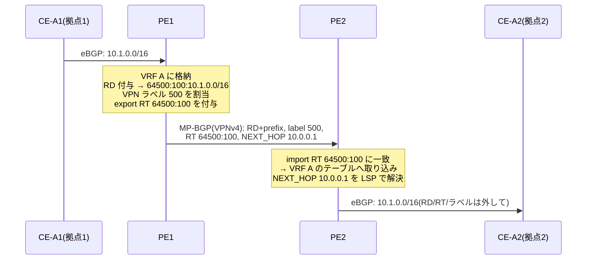

# MPLS VPN — L3VPN と L2VPN

## 概要

この章では、MPLS の最大の商用アプリケーションである VPN を学ぶ。
L3VPN(RFC 4364)を「VRF・MP-BGP・2段ラベル」の3部品として理解し、
L2VPN(疑似回線・VPLS)から EVPN への系譜を追う。
第2部で使った RD・RT・MAC-VRF の「出生地」がこの章である。
前提知識は [ラベルスタック](01_mpls_basics.md)、[LDP](02_ldp_rsvp_te.md)、
第3部の [MP-BGP](../03_bgp/05_mp_bgp.md) と
第2部の [EVPN/VXLAN](../02_vlan_vxlan_evpn/05_evpn_vxlan.md) である。

## 導入 — 1つの網の上に、互いに見えない多数の網を

### 専用線の置き換えという商売

企業が拠点間を結ぶ手段は、かつては物理的な専用線だった。
確実だが高価で、拠点が増えると回線数が
[おなじみの n(n-1)/2](../03_bgp/06_large_scale_design.md) で増える。
事業者側から見れば、顧客ごとに物理設備を占有させるのは効率が悪い —
**1つの共用網の上に、顧客ごとに完全に分離された仮想の網を多数作れれば**、
設備は一度で済む。これが VPN(Virtual Private Network)の商売であり、
MPLS はこの用途で爆発的に普及した
(なお本章の VPN は事業者網によるもので、インターネット上の
暗号化 VPN(IPsec 等)とは別物である。分離の手段が暗号ではなく
**経路情報の分離**である点が本章の主題になる)。

要求を正確に書くとこうなる:

1. **アドレスの重複を許す** — 顧客 A も顧客 B も
   [プライベートアドレス](../04_ipv6/01_why_ipv6.md) 10.0.0.0/8 を
   使っているだろう。顧客にリナンバリングを求める商売は成立しない
2. **経路情報を混ぜない** — 顧客 A の経路が顧客 B に見えては
   ならない(到達できてしまうことは、商品として致命的な欠陥である)
3. **共用網の設備は増やさない** — 顧客が1万でも、コアのルータには
   顧客の存在を意識させたくない([BGP フリーコア](01_mpls_basics.md) の要求と同じ)

[第2部](../02_vlan_vxlan_evpn/05_evpn_vxlan.md) の読者はここで
既視感を覚えるはずである — これはデータセンターの
**マルチテナンシー**の要求そのものである。歴史の順序は逆で、
**事業者 VPN(2000年代)で完成した道具立てを、データセンター(2010年代)が
EVPN/VXLAN として輸入した**。第2部で「詳細は第5部」と先送りした
RD・RT の種明かしを、本章で本家の文脈から行う。

### 解の形 — 縁で分離し、中は共用する

3つの要求への答えは、MPLS の2段ラベル(前章までの道具)と
BGP の拡張(第3部の道具)の組み合わせで、次の分業になる:

- **PE(縁)**: 顧客ごとの独立したルーティングテーブルを持ち、
  顧客の経路と自網の経路を混ぜない
- **MP-BGP(縁どうしの合意)**: 顧客の経路を、重複を許す形に
  一意化した上で PE 間で交換する
- **P(中)**: 何も知らない。PE 間の LSP でパケットを運ぶだけ

「知識を縁に寄せ、中間を単純に保つ」—
[エンドツーエンド原則](../04_ipv6/01_why_ipv6.md) の網内版とも言える
この構図が、L3VPN の設計のすべてを貫いている。

## 理論

### L3VPN の3部品(RFC 4364)

BGP/MPLS IP VPN の仕様は **RFC 4364** である(旧 RFC 2547。
業界で「2547 VPN」という古い呼び名が残るのはこのため)。
仕組みは3つの部品に分解できる。

#### 部品① VRF — テーブルを顧客ごとに分ける

**VRF(Virtual Routing and Forwarding)**は、PE の中に作る
顧客ごとの独立したルーティングテーブル(RIB/FIB の組)である。
PE の物理インタフェース(または VLAN サブインタフェース)は
どれか1つの VRF に所属し、そこから入ったパケットの経路検索は
**その VRF のテーブルだけ**で行われる。

- 顧客 A の VRF に 10.0.0.0/8 があり、顧客 B の VRF にも
  10.0.0.0/8 がある — 衝突しない。テーブルが別だからである
  (要求1の解決)
- グローバルテーブル(自網の IGP・インターネット経路)とも別 —
  顧客から事業者網の内部は見えない(要求2の解決)

[第2部](../02_vlan_vxlan_evpn/05_evpn_vxlan.md) の MAC-VRF は
この VRF の L2 版(テーブルの中身が経路ではなく MAC)であり、
VLAN の [IVL](../02_vlan_vxlan_evpn/01_vlan_basics.md)(VLAN ごとの
独立 MAC 学習)まで遡れば、「識別子でテーブルを分割する」という
同じ発想が L2 からずっと続いていることが分かる。

#### 部品② MP-BGP — RD で一意化し、RT で仕分けて運ぶ

VRF で分けたテーブルの中身を、離れた PE の同じ顧客の VRF へ
届けなければならない。運び役は
[MP-BGP](../03_bgp/05_mp_bgp.md) の **VPN-IPv4(VPNv4)ファミリ
(AFI 1 / SAFI 128)**である。ここで第2部から先送りしてきた
2つの道具が本来の文脈で登場する:

- **RD(Route Distinguisher)** — 顧客 A の 10.1.0.0/16 と
  顧客 B の 10.1.0.0/16 を、BGP という1つの土管の中で
  **別の経路として共存**させるための 8 オクテットの接頭辞。
  VPN-IPv4 の経路は「RD + IPv4 プレフィックス」(12 オクテット)を
  1つの NLRI とするので、RD が違えば BGP にとって別物であり、
  [経路選択プロセス](../03_bgp/03_path_attributes.md) で
  比較されることもない。RD は一意化の道具であって、
  仕分けの意味は持たない
- **RT(Route Target)** — 仕分けの道具。実体は
  [拡張コミュニティ](../03_bgp/04_policy_control.md) の一種で、
  各 VRF が export RT(広告に貼る)と import RT(一致したら取り込む)を
  持つ。「顧客 A の全拠点の VRF に RT 64500:100 を設定する」ことで、
  顧客 A の経路だけが顧客 A の VRF 群に行き渡る

RT の設計で VPN の**トポロジ**も表現できる点は、単なる分離を超えた
L3VPN の表現力である。全拠点が同じ RT を import/export すれば
フルメッシュ(any-to-any)。ハブ拠点が `export hub / import spoke`、
スポーク拠点が `export spoke / import hub` とすれば、
スポーク間の直接通信ができないハブ&スポークになる —
経路が配られなければ届かない、という
[第3部04章](../03_bgp/04_policy_control.md) の
「広告の制御=トラフィックの制御」がそのまま使われている。

#### 部品③ 2段ラベル — 運ぶ層と仕分ける層

経路が配れても、データプレーンに問題が残る。出口 PE2 に
パケットが届いたとき、PE2 には VRF が何十もある —
**このパケットはどの VRF で経路を引けばよいのか?**
IP ヘッダを見ても分からない(10.1.0.5 は顧客 A にも B にもいる)。

答えが [前章までに用意した](01_mpls_basics.md) ラベルスタックの2段構成である:

- **VPN ラベル(内側)**: 出口 PE2 が VPNv4 経路に付けて広告した
  ラベル(MP_REACH_NLRI の中で経路と一緒に運ばれる)。
  意味は「このラベルで届いたら、この VRF(またはこの経路)のものとして
  処理せよ」— PE2 の中でだけ通用する仕分け札である
- **トンネルラベル(外側)**: PE2 のループバックへの LSP のラベル
  (LDP または RSVP-TE が配布)。P ルータが見るのはこれだけ

コアの P は VPN ラベルの存在すら知らず、顧客の経路を1つも持たない
(要求3の解決)。[第2部](../02_vlan_vxlan_evpn/05_evpn_vxlan.md) の
対称 IRB で「外側 IP ヘッダが VTEP まで運び、L3VNI がテナントを
仕分けた」のと厳密に同型であり、EVPN の L3VNI は
「VPN ラベルの VXLAN 方言」だと言ってよい。

### まとめの一枚絵 — 3部品の対応関係

L3VPN と EVPN/VXLAN の対応を表にしておく。
第2部と本章が同じ設計の2つの方言であることが一望できる:

| 役割 | L3VPN(RFC 4364) | EVPN/VXLAN(RFC 8365) |
|---|---|---|
| 顧客/テナントのテーブル | VRF(経路) | MAC-VRF・IP-VRF |
| 経路の一意化 | RD | RD(同じもの) |
| 経路の仕分け | RT | RT(同じもの) |
| 経路の運び役 | MP-BGP VPNv4(AFI 1/SAFI 128) | MP-BGP EVPN(AFI 25/SAFI 70) |
| 出口まで運ぶ | トンネルラベル(LDP/RSVP-TE) | 外側 IP/UDP(アンダーレイ) |
| 着後の仕分け | VPN ラベル | VNI(L3VNI) |
| 中間の無知 | P は顧客経路を知らない | スパインは VNI/MAC を知らない |

### PE-CE の間 — 顧客の経路をどう受け取るか

VRF に顧客の経路が入る入口が PE-CE 間のルーティングである。
手段は普通のルーティングそのもの — 静的経路、eBGP、OSPF 等 — で、
VRF のテーブルに向けて動かすだけである。実務の主流は
**静的(小規模拠点)か eBGP(それ以外)**である。

eBGP を使う場合、顧客側から見ると「全拠点が事業者 AS を挟んで
つながる」形になる。ここで細かいが実務上重要な問題が生じる —
拠点1から出た経路は AS_PATH に事業者 AS を積んで拠点2へ届くが、
**全拠点が同じ顧客 AS 番号を使っていると、拠点2の CE は
自 AS を AS_PATH に見つけて経路を破棄する**
([第3部](../03_bgp/01_bgp_basics.md) のループ検出の正常動作)。
対策として PE 側で AS_PATH 中の顧客 AS を事業者 AS に
書き換える(as-override)、CE 側で自 AS の重複を許す
(allowas-in)などの実装ノブが使われる — いずれも RFC 4271 の
原則を意図的に緩める運用であり、慎重に使う類の道具である。

### L2VPN — 「経路」ではなく「回線」を売る

L3VPN は顧客のルーティングに事業者が関与する(PE が CE と
経路交換する)商品である。顧客によってはこれを嫌う —
「ルーティングは自分でやる。**ただの L2 の線**を貸してくれ」。
この要求に応えるのが L2VPN であり、2つの形がある。

#### 疑似回線(pseudowire)— 点対点の仮想線(RFC 3985)

**疑似回線(pseudowire、PW)**は、PSN(パケット交換網)の上に
点対点の仮想回線をエミュレートする枠組みである
(アーキテクチャは RFC 3985)。MPLS 上では、
おなじみの2段ラベル — トンネルラベルで対向 PE まで運び、
**PW ラベル**でどの疑似回線かを仕分ける — で実現され、
PE は CE から受けた Ethernet フレームを**まるごと**
(MAC ヘッダごと)ラベルに包んで対向へ送る。
PW ラベルの交換には targeted LDP(前章で言及した、
直結でない相手との LDP セッション)を使う(RFC 4447、
現行は RFC 8077)。この点対点サービスを VPWS
(Virtual Private Wire Service)と呼ぶ。

疑似回線は L2 フレームを運ぶので、Ethernet に限らず
ATM・フレームリレー・TDM といったレガシー回線の中身も運べる —
「回線という商品」を、回線種別ごとの物理網を維持せずに
1つの MPLS 網へ集約できたことが、事業者にとっての価値だった。

#### VPLS — マルチポイントの仮想スイッチ、そしてその限界

点対点でなく「全拠点が同じ LAN にいるように見せたい」
(マルチポイント)への答えが **VPLS(Virtual Private LAN
Service)**である(BGP シグナリング = RFC 4761、
LDP シグナリング = RFC 4762 の2流儀が並存した)。

VPLS の PE は、顧客ごとに仮想スイッチ(VSI)を持ち、
拠点間を**疑似回線のフルメッシュ**で結ぶ。そして VSI は
[透過的ブリッジング](../01_fundamentals/01_l2_l3_recap.md) そのものとして
動く — 送信元 MAC を学習し、未知宛先は全 PW へフラッディングする。
つまり **VPLS のデータプレーンは
[フラッド&ラーン](../02_vlan_vxlan_evpn/03_vxlan_fundamentals.md) である**。

L2 ループは、STP ではなく構造で防ぐ。
「PW(コア側)から受けたフレームは、他の PW へ転送しない」 —
iBGP の再広告禁止と同じ形の **スプリットホライズン規則**で、
フルメッシュを前提にループを断つ
([第3部02章](../03_bgp/02_ibgp_ebgp.md) の
「フルメッシュ+再広告禁止」とまったく同じ設計判断である)。

ここまで読んだ読者には、VPLS の限界が第2部の議論の再演として
見えるはずである:

- MAC 学習がデータプレーン任せ(未知宛先のフラッディングが必須)
- PW のフルメッシュが N² で膨らむ
- マルチホーミング(拠点を2台の PE に接続)の標準的な解がない —
  素朴にやると L2 ループか MAC の揺れを起こす

この限界への答えとして設計されたのが **EVPN(RFC 7432)**である。
MAC の所在を MP-BGP で事前配布し(コントロールプレーン学習)、
マルチホーミングを ESI・DF 選出として標準化する —
[第2部で学んだ内容](../02_vlan_vxlan_evpn/05_evpn_vxlan.md) の
すべてである。ここで種明かしをすると、**RFC 7432 の EVPN は
本来 MPLS のためのもの**であり(ラベルスタックで運ぶ。
RT-2 の Label フィールドに入るのは MPLS ラベル)、
第2部で使った VXLAN への適用(RFC 8365)は後から追加された
「カプセル化の差し替え」である。本書が第2部で EVPN を
VXLAN の文脈から先に学んだのは読了順の都合であり、
系譜としては「VPLS の反省 → EVPN(MPLS)→ EVPN(VXLAN)」の順になる。

### IPv6 との合流 — 6PE と 6VPE

[第4部](../04_ipv6/01_why_ipv6.md) との合流点にも触れておく。
IPv4 で組まれた MPLS コアの上で IPv6 を運ぶには、
IPv6 経路にラベルを付けて MP-BGP で配ればよい:

- **6PE(RFC 4798)**: グローバルテーブルの IPv6 経路を
  ラベル付きで運ぶ(AFI 2 / SAFI 4)。コアは IPv4/MPLS のまま、
  縁だけ IPv6 対応にする — デュアルスタック化の投資を
  縁に限定できる
- **6VPE(RFC 4659)**: その VPN 版(VPN-IPv6、AFI 2 / SAFI 128)

どちらも「コアは中身を知らないのだから、中身が IPv6 でも
何も変わらない」というトンネルの一般論の素直な帰結であり、
[第4部05章](../04_ipv6/05_transition_technologies.md) の
IPv4aaS(IPv6 の上で IPv4 を運ぶ)のちょうど鏡像になっている。

## プロトコル動作の詳細

### VPNv4 経路の中身

VPNv4 の経路が [MP_REACH_NLRI](../03_bgp/05_mp_bgp.md) で
運ばれるときの構造を分解すると、3部品の情報がすべて載っていることが分かる:

```text
MP_REACH_NLRI(AFI 1 / SAFI 128)
+---------------------------------------------------+
| ネクストホップ: PE1 のループバック(10.0.0.1)       | ← トンネルの終点
+---------------------------------------------------+
| NLRI:                                             |
|   ラベル: 500(VPN ラベル)                         | ← 着後の仕分け札
|   RD: 64500:100                                   | ← 一意化の接頭辞
|   プレフィックス: 10.1.0.0/16                      | ← 顧客の経路
+---------------------------------------------------+
パスアトリビュート(共通部)
|   拡張コミュニティ: RT 64500:100                   | ← 仕分けの荷札
|   AS_PATH、LOCAL_PREF など通常の属性               |
+---------------------------------------------------+
```

押さえるべきは、**VPN ラベルが NLRI の中に、RT が属性に**載る、
という置き場所の違いである。ラベルは経路1本ごとに違いうる情報
なので経路(NLRI)側に、RT は「この UPDATE の経路すべてに共通の
仕分け先」なので[属性側に](../03_bgp/03_path_attributes.md)置かれている。

### 経路とパケットの一生 — フルウォークスルー

顧客 A(RT 64500:100)の拠点1(CE-A1、10.1.0.0/16)と
拠点2(CE-A2、10.2.0.0/16)を、前章までと同じコア
(PE1—P1—P2—PE2)で結ぶ。
まず**経路**(コントロールプレーン)が右から左へ:



PE1-PE2 間の MP-BGP は、実際には
[スパイン/専用機の RR](../03_bgp/06_large_scale_design.md) を
介するのが大規模の定石である(RR はデータパスにいなくてよい、
という第3部の結論がここでも効く)。

次に**パケット**(データプレーン)が左から右へ。
CE-A2 配下のホストから 10.1.0.5 宛て:

| 区間 | ラベルスタック | 説明 |
|---|---|---|
| CE-A2 → PE2 | なし | ただの IP パケット |
| PE2 → P2 | **[300(トンネル), 500(VPN)]** | VRF A で経路を引き、VPN ラベル 500 + PE1 への LSP のラベル 300 を push |
| P2 → P1 | **[100, 500]** | P2 は外側だけ swap(300→100)。**内側 500 は見もしない** |
| P1 → PE1 | **[500]** | PHP: P1 が外側を pop。VPN ラベルだけが残って PE1 へ |
| PE1 → CE-A1 | なし | PE1 はラベル 500 を引き「VRF A のもの」と判定、VRF A の FIB で CE-A1 へ |

PHP(前章)がここで実益を生んでいることに注目してほしい —
PE1 に届くのは VPN ラベル1枚のパケットであり、PE1 は
**LFIB の1回のルックアップ**で VRF の判定まで終えられる。
また、P1・P2 の LFIB には顧客のいかなる情報も存在しない。
顧客が1万に増えても、コアのテーブルは PE の数(のループバック)
のままである。

### スケールの最後のピース — PE も全部は要らない(RFC 4684)

コアが顧客経路から自由になっても、素朴な構成では
**各 PE がすべての顧客の VPNv4 経路を受信**してしまう
(取り込むかは import RT で選別するが、受信と選別のコストは払う)。
PE には自分が収容する顧客の経路だけ届けばよいはずである。

これを解くのが **RT Constraint(RFC 4684)**である。
各 PE が「私が import する RT の一覧」を、それ自体を
BGP の1ファミリ(AFI 1 / SAFI 132)として広告し、
RR がそれを見て**必要な PE に必要な VPNv4 経路だけを配る**。
「何を配るべきかという情報も BGP で配る」という再帰的な解決で、
[MP-BGP の型システム](../03_bgp/05_mp_bgp.md) の面目躍如と言える。

## 設定例(補助)— FRRouting での最小 L3VPN

以下は FRRouting での PE1 側の骨格である(Linux の VRF 機能と併用。
IGP と LDP は前章までの設定が済んでいる前提)。
3部品 — VRF・RD/RT・アドレスファミリ — がどこに現れるかを見てほしい:

```text
router bgp 64500
 neighbor 10.0.0.2 remote-as 64500
 neighbor 10.0.0.2 update-source lo
 !
 address-family ipv4 vpn                  ! ← 部品②: VPNv4 ファミリの有効化
  neighbor 10.0.0.2 activate
 exit-address-family
!
router bgp 64500 vrf CUSTOMER_A           ! ← 部品①: VRF ごとの BGP インスタンス
 neighbor 192.168.1.2 remote-as 65001     !    (PE-CE の eBGP)
 address-family ipv4 unicast
  label vpn export auto                   ! ← 部品③: VPN ラベルの割当
  rd vpn export 64500:100                 ! ← RD
  rt vpn both 64500:100                   ! ← RT(import/export 両方)
  export vpn
  import vpn
 exit-address-family
!
```

確認は `show bgp ipv4 vpn` で行う。出力には RD ごとに経路が
グループ化され、各行に VPN ラベルが表示される —
「RD 付きプレフィックス+ラベル」という NLRI の構造が
そのまま画面に現れる:

```text
PE1# show bgp ipv4 vpn
Route Distinguisher: 64500:100
 *> 10.1.0.0/16      192.168.1.2 ...  label 500
 *>i10.2.0.0/16      10.0.0.2    ...  label 501
```

## トラブルシューティング

### ① 経路が対向の VRF に現れない — RT の不一致(再演)

症状: PE1 の VRF には経路があるのに、PE2 の VRF に取り込まれない。
`show bgp ipv4 vpn` では**届いている**(または届いてすらいない)。

[第2部05章](../02_vlan_vxlan_evpn/05_evpn_vxlan.md) の EVPN と
[MP-BGP 章](../03_bgp/05_mp_bgp.md) で定式化した切り分けの層構造
「①セッション → ②ファミリ(activate)→ ③ポリシー → ④取り込み(RT)→
⑤ネクストホップ」がそのまま使える。VPNv4 で特に多いのは
④ RT の import/export の食い違い(片方向だけ設定した、
拠点追加時に新 PE だけ RT が違う)である。
「BGP テーブルには在るが VRF に無い」なら RT、
「BGP テーブルにも無い」なら ②③(activate 漏れ、RR の設定)を疑う。

### ② VPN だけ全滅、IP は健全 — トンネルの底が抜けている

症状: PE 間の ping・iBGP は正常、VPNv4 経路も届いているのに、
顧客のトラフィックが通らない。

L3VPN のデータプレーンは「PE のループバックへの **LSP**」の上に
載っている。LSP が壊れていても(LDP セッション断、
[前章①](02_ldp_rsvp_te.md) の同期問題、途中 1 台のラベル転送無効)、
**IP の到達性は IGP が保つ**ため、ping や BGP セッションは
何事もなく通り続ける — 壊れているのはラベルの層だけ、という
非対称が切り分けを難しくする。

多くの実装は、BGP ネクストホップが**ラベル付き経路で**解決
できない VPN 経路を無効扱いにする(その場合は経路の時点で気づける)が、
LSP の途中断はデータプレーンだけの障害として残る。
[前章③](02_ldp_rsvp_te.md) と同じく、MPLS ping(RFC 8029)で
LSP 自体を検査するのが正道である。

### ③ マルチホーム拠点の冗長が効かない — RD 設計の罠

症状: 顧客拠点を PE2 と PE3 の2台に接続したのに、
PE2 障害時の切り替えが遅い/RR 配下で片方の経路しか見えない。

原因は **RD を全 PE で同一にした**設計にある。同一 RD だと、
PE2 経由と PE3 経由の広告は BGP にとって「同じ経路の2候補」になり、
[RR がベストパス1本だけを反射](../03_bgp/06_large_scale_design.md)
する(パスハイディング)。RD を **PE ごとに変える**(例:
`10.0.0.2:100` と `10.0.0.3:100`)と、2本は「別の経路」として
両方配られ、受信側 PE が VRF 内で使い分けられる —
RD が「一意化の道具であって仕分けの道具ではない」ことを逆手に取り、
**意図的に別物として運ばせる**技法である。
第3部06章のパスハイディング(ADD-PATH による緩和)と同じ問題の、
VPN 固有のもう1つの解と言える。

### ④ 特定の顧客だけ大きいパケットが通らない — 8 オクテットの請求書

症状: 既存顧客は正常なのに、新規顧客(または新規経路)だけ
大きいパケットが落ちる。

L3VPN のオーバーヘッドはラベル2枚 = **8 オクテット**である。
コア MTU がぎりぎり(例: 1504 で運用 — 1枚なら足りる)だと、
「ラベル1枚の経路(PHP 後や素の LSP)は通るのに、
2枚の VPN トラフィックだけ落ちる」という選択的な障害になる。
さらに [前章①の ICMP の遠回り](01_mpls_basics.md) が重なると、
PMTUD も機能しない。疑似回線ではより単純に、
**両端で設定した MTU が一致しないと PW 自体が確立しない**
(シグナリングで MTU を交換して検査する)ため、
「上がらない」原因の定番として MTU を最初に確認する。

## 演習・確認問題

1. **RD と RT はどちらも「64500:100」のような形をしているが、
   役割はまったく違う。それぞれ何のための道具か、
   「RD だけあって RT がなかったら何が困るか」を含めて説明せよ。**
   (答えの骨子: RD は重複プレフィックスを BGP 上で別経路として
   共存させる一意化の接頭辞、RT は届いた経路をどの VRF に取り込むかの
   仕分け札。RT がなければ受信 PE はどの VRF 行きか判定できない)

2. **L3VPN の2段ラベルについて、外側・内側それぞれ「誰が配り、
   誰が見て、どこで消えるか」を述べよ。**
   (答えの骨子: 外側=トンネルラベル、LDP/RSVP-TE が配り、P が swap し、
   PHP で出口の手前で消える。内側= VPN ラベル、出口 PE が MP-BGP の
   NLRI 内で配り、出口 PE だけが見て、VRF 判定とともに消える)

3. **VPLS が「L2 版の iBGP フルメッシュ問題」を抱えていると言われる
   理由を、スプリットホライズン規則とあわせて説明し、EVPN が
   それをどう解決したか述べよ。**
   (答えの骨子: PW から学んだフレームを他の PW へ流さない規則で
   ループを防ぐため PW のフルメッシュが必須になり N² で膨らむ。
   EVPN は MAC の所在を MP-BGP で事前配布し、フラッディング依存と
   フルメッシュ PW を解消、マルチホーミングも RT-4/DF で標準化)

4. **マルチホーム構成で RD を PE ごとに変えるべき理由を、
   ルートリフレクタの動作と関連づけて説明せよ。**
   (答えの骨子: 同一 RD では2 PE の広告が同一経路の2候補となり
   RR がベスト1本しか反射しない。RD を変えれば別経路として両方
   配られ、受信側で冗長・分散に使える)

5. **6PE(RFC 4798)は「コアを IPv6 対応させずに IPv6 を運ぶ」。
   これが可能な理由を、第5部で学んだ MPLS の性質から説明せよ。**
   (答えの骨子: コアの転送根拠はラベルであり中身を見ない。
   縁の PE が IPv6 経路をラベル付き(MP-BGP)で交換し、
   入口でラベルを積めば、IPv4/MPLS のコアはそのまま使える)

## まとめ

- L3VPN(RFC 4364)は **VRF(テーブルの分離)+ MP-BGP(RD で一意化・
  RT で仕分けた経路配布)+ 2段ラベル(トンネル+ VPN)**の3部品で、
  「アドレス重複を許し、経路を混ぜず、コアに知らせない」を実現する。
  第2部の EVPN/VXLAN はこの道具立ての DC 方言である
- VPN ラベルは NLRI の中で経路とともに配られ、出口 PE の
  VRF 判定札として働く。コアの P は顧客の存在を関知しない
- L2VPN は疑似回線(点対点、RFC 3985/8077)から VPLS
  (マルチポイント、RFC 4761/4762)へ発展したが、フラッド&ラーンと
  PW フルメッシュの限界を抱え、その反省が EVPN(RFC 7432)を生んだ —
  EVPN は本来 MPLS の技術であり、VXLAN 適用(RFC 8365)は後である
- 6PE/6VPE(RFC 4798/4659)は「コアは中身を見ない」の帰結として、
  IPv4/MPLS コアの上に IPv6 を運ぶ。スケールの仕上げは
  RT Constraint(RFC 4684)による「必要な PE にだけ配る」
