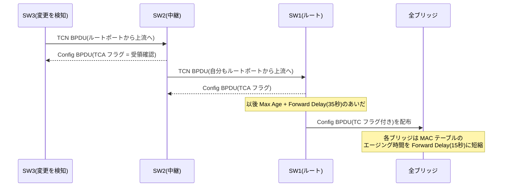

# L2 ループと STP — 冗長化が生むループを、木を張って断つ

## 概要

この章から第6部(冗長化)に入る。第6部は「機器やリンクを二重化したい」という
要求が L2/L3 それぞれで何を壊し、それをどう解決してきたかを扱う。
本章はその起点として、**なぜ L2 のループは致命的なのか**を
[第1部01章](../01_fundamentals/01_l2_l3_recap.md) の透過的ブリッジングの原理から導き、
ループを自動的に断つ最初の標準解である**スパニングツリープロトコル(STP)**の
動作原理を IEEE 802.1D ベースで説明する。
前提知識は第1部01章(透過的ブリッジング、L2/L3 の役割分担)と
[第2部01章](../02_vlan_vxlan_evpn/01_vlan_basics.md)・
[02章](../02_vlan_vxlan_evpn/02_trunking_native_vlan.md)(VLAN、トランク)である。

## 導入 — そもそも何のための技術か

### 冗長化のジレンマ: 2本目のケーブルがネットワークを殺す

ここまでの部では、ネットワークは基本的に「つながっていること」を前提に
話を進めてきた。しかし実際の設計では、スイッチもリンクもいつか必ず壊れる。
壊れたときに全体が止まらないようにするには、機器とリンクを**二重化**する
しかない。1本のリンクが単一障害点(SPOF: Single Point of Failure)なら、
2本張ればよい——これは誰でも思いつく、まったく正しい発想である。

ところが L2 では、この正しい発想がそのまま障害になる。スイッチ2台の間に
ケーブルを2本張る、あるいはスイッチ3台をリング状につなぐ。それだけで、
ネットワーク全体が数秒のうちに無応答になることがある。**物理的な経路が
輪(ループ)を成した瞬間、L2 ネットワークは自壊する**からである。

なぜ L3 のルーティングループは「traceroute で往復が見える」「TTL 切れの
ICMP が返る」といった比較的穏やかな症状で済むのに、L2 のループは全網を
巻き込む即死になるのか。原因は3つあり、いずれも第1部01章で見た
L2 の設計そのものに根ざしている。

**① フレームには TTL がない。**
IPv4 ヘッダの TTL(IPv6 の Hop Limit)は、ループに落ちたパケットを
有限回の転送で自壊させる安全装置だった。一方 Ethernet フレームのヘッダに、
経由回数を数えるフィールドは存在しない。これは手抜きではなく設計である。
L2 は本来「同一リンク上の隣人に届ける」ための層であり、何段も中継されて
遠くへ行くことを想定していない。透過的ブリッジングは「ブリッジの存在を
端末に見せない」ために**フレームを一切書き換えずに**中継する。書き換えないの
だから、回った回数を記録する場所もない。ループに入ったフレームは、
誰かが止めるまで**永遠に回り続ける**。

**② フラッディングが増殖装置になる。**
一方通行の輪をぐるぐる回るだけなら、まだ帯域を少し失うだけで済む。
致命傷にするのはフラッディングである。ブロードキャスト(や宛先未学習の
ユニキャスト)を受け取ったスイッチは、受信ポート以外の**全ポートへ複製**する。
ループ上にスイッチが複数あれば、1つのブロードキャストが複製され、複製が
また複製され、フレームの個体数が転送のたびに増えていく。TTL による自然死が
ないため、増えたフレームは減らない。数秒で リンク帯域と スイッチの CPU
(ブロードキャストは端末側でも受信処理を強制する)を食い尽くす。
この状態を**ブロードキャストストーム**と呼ぶ。

**③ MAC 学習が毒される。**
ループ上では、同一の送信元 MAC アドレスを持つフレームが複数の方向から
届く。スイッチの MAC 学習は「最後に見た受信ポート」を上書きし続けるから、
MAC アドレステーブルのエントリが毎秒何百回も別ポートへ書き換わる
(**MAC フラッピング**)。テーブルが安定しないため、ブロードキャストとは
無関係のユニキャスト通信まで誤った方向へ転送される。

まとめると、透過的ブリッジングの3動作(学習・転送・フラッディング)は、
トポロジがループを含んだ瞬間に**すべて裏目に出る**。学習は毒され、転送は
無限に続き、フラッディングは増殖する。L2 の透過性——フレームに手を加えない
という美点——そのものが、ループへの構造的な脆弱性の源なのである。

### 解決の2つの方向

この問題への解決は、大きく2つの系譜に分かれる。

1. **物理はループを許し、論理でループを断つ** — 冗長リンクは張ったままにし、
   プロトコルが自動的に一部のポートを塞いで「ループのない論理トポロジ」を
   維持する。障害時には塞いでいたポートを開けて経路を切り替える。
   これが本章の主題 STP と、[次章](02_rstp_mstp.md)の RSTP/MSTP である。
2. **そもそもループが問題にならない構造にする** — 複数リンクを論理的に
   1本に束ねる(リンクアグリゲーション)、L2 の到達範囲を絞って冗長部分を
   L3 に持ち上げる、あるいは [VXLAN/EVPN](../02_vlan_vxlan_evpn/05_evpn_vxlan.md)
   のようにオーバーレイで L2 を再構成する。こちらは[04章](04_lag_mlag.md)と、
   すでに第2部で見た世界である。

歴史的には 1 が先であり、2 は 1 の限界(本章の最後で見る)への応答として
発展した。順に見ていこう。

## 理論

### 問題の定式化 — グラフから木を選ぶ

STP の発想は数学的にはシンプルである。スイッチをノード、リンクをエッジと
するグラフを考えたとき、**全域木(spanning tree)**——すべてのノードを含み、
かつループを1つも含まない部分グラフ——を選び出し、**木に含まれない
リンクでの転送を止める**。

木には決定的に良い性質がある。木の上では**任意の2点間の道がちょうど1本**
しかない。道が1本なら、フレームが同じ場所に2回届くことはなく、
フラッディングしても複製が出会って増殖することがない。つまり
透過的ブリッジングの3動作は、木の上でなら安全に成立する。
STP は「ブリッジングの原理には手を触れず、原理が安全に動ける土俵
(木)だけを整える」という解であり、フレームフォーマットも端末の挙動も
一切変えずに済む。802.1Q のタグ(第2部01章)がフレームへの追記で問題を
解いたのとは対照的に、STP は**トポロジの側**で問題を解く。

このアルゴリズムは 1985 年に DEC の Radia Perlman が考案したもので、
IEEE 802.1D として標準化された(その後 RSTP を含む改訂を経て、
802.1D は 2014 年改訂で **IEEE 802.1Q** に統合されている。本章では
オリジナルの STP を扱い、以下 802.1D と呼ぶ)。

### 分散アルゴリズムとしての STP — 誰も全体を知らない

ここで思い出してほしいのが、
[第1部04章](../01_fundamentals/04_distance_vector_link_state.md) の
ディスタンスベクタとリンクステートの対比である。全域木を計算するだけなら、
各ブリッジがトポロジ全体を知っていれば(リンクステート的に)一発で
計算できる。しかし STP が設計された時代のブリッジは安価で単純な箱であり、
トポロジデータベースを持たせる前提は取れなかった。

そこで STP は、**各ブリッジが「自分の知る最良の情報」だけを隣へ教え合う**
方式を採る。ブリッジが交換するメッセージを **BPDU**(Bridge Protocol
Data Unit)と呼ぶ。BPDU に載るのは要するに
「私が root だと思っているブリッジは誰か。そこまでの距離(コスト)はいくつか。
この情報を送っている私は誰か」であり、各ブリッジは受け取った BPDU に
自分のリンクコストを足して比較し、より良い情報だけを採用して下流へ伝える。
これは**単一の宛先(ルートブリッジ)に向けたディスタンスベクタ**に
ほかならない。「距離(計算結果)を教え合い、一次情報は伝えない」という
DV の特徴、そして古い情報をエージング(後述の Max Age)で捨てるという
作法まで、第1部04章で見た構図がそのまま再演される。

### 3つの選出 — 木はこうして決まる

STP の計算は、次の3段階の「選出」として整理できる。

**選出① ルートブリッジ — 木の根を1つ決める。**
全ブリッジの中から、**ブリッジ ID** が最小の1台をルートブリッジとする。
ブリッジ ID は 8 オクテットで、上位2オクテットの**プライオリティ**
(設定可能、既定値 32768)+ 下位6オクテットの **MAC アドレス**から成る。
プライオリティが同じなら MAC アドレスの小さい方が勝つ。つまり
**何も設定しなければ「いちばん古い機器」あたりが偶然ルートになる**。
この事実はトラブルシューティングの節で再訪する。

なお現行仕様では、プライオリティ 2 オクテットのうち実際に設定できるのは
上位 4 ビットだけで(したがって 0〜61440 の 4096 刻み)、残り 12 ビットは
**システム ID 拡張**として VLAN ID を埋めるフィールドに再定義されている
(802.1t での変更。VLAN ごとに木を分ける実装で、MAC アドレスを共有したまま
ブリッジ ID を VLAN ごとに変えるための仕掛けである)。

**選出② ルートポート — 各ブリッジからルートへの登り口を1つ決める。**
ルートブリッジ以外の各ブリッジは、自分のポートのうち
**ルートまでのパスコストが最小のポート**を1つだけ選び、ルートポートとする。
パスコストは経由する各リンクのコストの合計で、リンクコストは帯域から
決まる(下表)。

| リンク速度 | 802.1D-1998(16ビット) | 802.1t 以降(32ビット) |
|---|---|---|
| 10 Mb/s | 100 | 2,000,000 |
| 100 Mb/s | 19 | 200,000 |
| 1 Gb/s | 4 | 20,000 |
| 10 Gb/s | 2 | 2,000 |

16 ビット時代の値は 10 Gb/s 以上で差がつぶれてしまうため、
32 ビット値が定義し直された(RSTP/MSTP では 32 ビットが標準)。
両方式が混在すると意図しない木ができるので、網内では統一する。

**選出③ 指定ポート — 各リンクの世話係を1つ決める。**
それぞれのリンク(セグメント)について、そのリンクに面したポートの中から
「ルートに最も近い側」のポートを1つ選び、**指定ポート**とする。
指定ポートはそのリンクへ BPDU を送り続ける責任を持つ。
ルートブリッジの全ポートは(自分がルートなのだから)常に指定ポートである。

以上の選出で**ルートポートにも指定ポートにもならなかったポート**が、
転送を止められる**ブロッキングポート**(非指定ポート)になる。
ここが木から切り落とされる枝であり、ループはこのポートで断たれる。

### 比較の規則 — 4段のタイブレーク

3つの選出はすべて、BPDU に載る情報の**多段比較**で機械的に決まる。
2つの BPDU はこの順で比較され、先に差がついた時点で勝敗が決まる。

1. **ルートブリッジ ID** が小さい方
2. **ルートパスコスト**が小さい方
3. **送信ブリッジ ID** が小さい方
4. **送信ポート ID** が小さい方

すべてのブリッジが同じ規則で比較する限り、どこから計算を始めても
最終的に全員が同じ木に合意する。「多段の属性比較を仕様で固定し、
分散した判断を一致させる」という設計は、BGP の
[経路選択プロセス](../03_bgp/03_path_attributes.md)と同じ発想である。
違いは、BGP がポリシー(意思)を差し挟む余地を意図的に残すのに対し、
STP の比較は純粋に機械的である点だ。管理者が意思を反映する場所は、
プライオリティとリンクコストという「比較の入力」に限られる。

### コストとしてのブロッキング — 買った帯域が遊ぶ

理論の締めくくりに、STP が支払う代償を明確にしておく。
ブロッキングポートは、故障に備えて張った健全なリンクを**平常時は使わない**
ということである。スイッチ間を 2 本で結べば、平常時に使えるのは 1 本分の
帯域だけ。3 台のリングなら 1 リンクは常に遊ぶ。冗長化のために買った帯域の
かなりの部分が、保険料として眠る。

さらに 802.1Q の標準では、スパニングツリーは基本的に**全 VLAN で共通の
1本**である(CST: Common Spanning Tree)。VLAN ごとに別の木を張って
「VLAN 10 はこっちのリンク、VLAN 20 はあっちのリンク」と負荷を分散する
ことは、素の 802.1D/CST ではできない(ベンダー独自の PVST+ や、標準の
MSTP がこれに答える——[次章](02_rstp_mstp.md)で扱う)。この「遊ぶ帯域」への不満が、
[リンクアグリゲーション](04_lag_mlag.md)や L3 ファブリック、そして第2部で見た
VXLAN/EVPN(スパニングツリーに頼らず ECMP でリンクを使い切る)へと
つながっていく。

## プロトコル動作の詳細

### BPDU はどう運ばれるか

BPDU は、宛先 MAC アドレス **01:80:C2:00:00:00**(ブリッジグループ
アドレス)へ送られる。このアドレスは 802.1D/802.1Q が予約する特別な
グループアドレスで、**ブリッジはこの宛先のフレームを転送(フラッディング)
してはならない**と定められている。つまり BPDU は必ず**リンクの向こう側の
隣人までしか届かない**。各ブリッジは受信した BPDU を右から左へ中継するの
ではなく、その情報を取り込んだうえで**自分の BPDU を自分で生成して**送る。
ホップバイホップの伝搬であり、これも DV 的な性格の現れである。

フレーム上の BPDU は Ethernet II(EtherType)ではなく、IEEE 802.3 の
長さフィールド + **LLC ヘッダ(DSAP=0x42, SSAP=0x42, Control=0x03)**に
続けて載る。また BPDU は**タグなし**で送受信される——
[第2部02章](../02_vlan_vxlan_evpn/02_trunking_native_vlan.md) で
「トランク上にはタグなしの制御フレームも流れている」と述べた伏線が
これである。

### Configuration BPDU のフォーマット

STP のメッセージは実質 2 種類しかない。木の計算に使う
**Configuration BPDU** と、トポロジ変更を知らせる **TCN BPDU** である。
まず前者のフォーマットを示す(全 35 オクテット)。

```text
 0                   1                   2                   3
 0 1 2 3 4 5 6 7 8 9 0 1 2 3 4 5 6 7 8 9 0 1 2 3 4 5 6 7 8 9 0 1
+-+-+-+-+-+-+-+-+-+-+-+-+-+-+-+-+-+-+-+-+-+-+-+-+-+-+-+-+-+-+-+-+
|     Protocol Identifier (=0)  |  Version (=0) | BPDU Type(=0) |
+-+-+-+-+-+-+-+-+-+-+-+-+-+-+-+-+-+-+-+-+-+-+-+-+-+-+-+-+-+-+-+-+
|     Flags     |                                               |
+-+-+-+-+-+-+-+-+                                               +
|                    Root Identifier (8 octets)                 |
+                               +-+-+-+-+-+-+-+-+-+-+-+-+-+-+-+-+
|                               |    Root Path Cost (4 octets)  |
+-+-+-+-+-+-+-+-+-+-+-+-+-+-+-+-+                               +
|                               |                               |
+-+-+-+-+-+-+-+-+-+-+-+-+-+-+-+-+                               +
|                  Bridge Identifier (8 octets)                 |
+                               +-+-+-+-+-+-+-+-+-+-+-+-+-+-+-+-+
|                               |      Port Identifier          |
+-+-+-+-+-+-+-+-+-+-+-+-+-+-+-+-+-+-+-+-+-+-+-+-+-+-+-+-+-+-+-+-+
|         Message Age           |            Max Age            |
+-+-+-+-+-+-+-+-+-+-+-+-+-+-+-+-+-+-+-+-+-+-+-+-+-+-+-+-+-+-+-+-+
|         Hello Time            |         Forward Delay         |
+-+-+-+-+-+-+-+-+-+-+-+-+-+-+-+-+-+-+-+-+-+-+-+-+-+-+-+-+-+-+-+-+
```

- **Flags**: 最下位ビットが TC(Topology Change)、最上位ビットが
  TCA(Topology Change Acknowledgment)。トポロジ変更の節で使う。
- **Root Identifier / Root Path Cost / Bridge Identifier / Port Identifier**:
  前節の4段比較に使う本体。「私が思うルート」「そこまでのコスト」
  「送信者の ID」「送信ポートの ID」。ポート ID は 2 オクテットで、
  ポートプライオリティ(既定 128)+ ポート番号から成る。
- **Message Age**: この情報の「鮮度」。ルートブリッジが生成した時点で 0、
  各ブリッジが下流へ伝えるとき加算される(実装上は 1 秒相当を足すのが通例)。
- **Max Age / Hello Time / Forward Delay**: プロトコルタイマー。
  時刻・時間のフィールドはいずれも 1/256 秒単位で符号化される。

### タイマー — ルートの独裁と、直径7の仮定

802.1D の既定タイマーは次の3つである。

| タイマー | 既定値 | 意味 |
|---|---|---|
| Hello Time | 2 秒 | ルートが Configuration BPDU を生成する間隔 |
| Max Age | 20 秒 | BPDU 情報の賞味期限(切れたら再選出) |
| Forward Delay | 15 秒 | ポート状態遷移の各段階の待ち時間 |

重要なのは、これらの値が**各ブリッジのローカル設定ではなく、ルートブリッジの
設定値が BPDU に載って全網に配られる**という点である。木の全員が同じ
タイマーで動かないと収束の整合が取れないため、ルートが全網のテンポを
独裁する設計になっている。ルート以外のブリッジでタイマーを変えても
(そのブリッジがルートにならない限り)効果はない。

Max Age = 20 秒という値は恣意的な数字ではなく、**ネットワーク直径 7**
(任意の2ブリッジ間が最大7ホップ)を仮定し、BPDU の伝搬遅延と Message Age
の累積を織り込んで逆算された推奨値である。直径がこれを超える L2 網は
そもそも 802.1D の想定外——つまり **STP はプロトコルの設計時点で
「L2 は大きくしないもの」という前提を抱えている**。第2部で見た
「L2 の規模の壁」は、ここにも顔を出す。

各ポートは、受信した最良 BPDU の情報を記憶して選出に使うが、
その情報は Message Age を起点にエージングされ、(Max Age − Message Age)
秒のあいだ更新が来なければ**期限切れ**として破棄される。上流の障害は
このエージングによって間接的に検出される。

### ポート状態 — なぜすぐ転送を始めないのか

STP のポートは次の状態を遷移する。

```text
Disabled ──> Blocking ──> Listening ──> Learning ──> Forwarding
 (無効)      (遮断)     (15秒)       (15秒)       (転送)
              │ BPDU受信のみ │ BPDU送受信  │ +MAC学習   │ 全機能
              │ 学習せず     │ 学習せず    │ 転送せず   │
              └──────────────┴─ データフレームは廃棄 ─┘
```

- **Blocking**: 非指定ポートの定常状態。BPDU を**受信だけ**して沈黙する。
  データフレームは受信しても廃棄し、MAC 学習もしない。
- **Listening**: 選出の結果「このポートは転送に参加すべきだ」と決まった
  ポートが最初に入る状態。BPDU の送受信(選出への参加)は行うが、
  データはまだ廃棄する。Forward Delay(15 秒)とどまる。
- **Learning**: MAC 学習だけを開始し、転送はまだしない。同じく 15 秒。
- **Forwarding**: 通常運転。

なぜ合計 30 秒も待つのか。理由は2つある。第一に、**自分の周囲の合意が
最終であることの保証**。選出はホップバイホップに伝搬する分散計算だから、
自分の手元で「転送してよい」と見えても、まだ古い情報で動いている
ブリッジが網のどこかに残っているかもしれない。全網に新しい情報が行き渡る
時間(Forward Delay はネットワーク直径から逆算されている)を待たずに
転送を始めると、**一時的なループ**ができうる。ループの被害の大きさを考えると、
「疑わしきは転送せず」に倒すのが 802.1D の設計判断である。
第二に、Learning の 15 秒は **MAC テーブルを温める**ための時間である。
テーブルが空のまま転送を始めると、しばらく全ユニキャストが
フラッディングになり、切り替え直後の網に余計な負荷をかける。

この結果、802.1D の収束時間は:

- リンク障害をポートのリンクダウンで直接検知できた場合:
  代替ポートが Listening → Learning を経て **約 30 秒**
- 障害が離れた場所で起き、BPDU のエージング(Max Age)を
  待つしかない場合: **最大 20 + 30 = 約 50 秒**

となる。1990 年前後の LAN では許容されたこの数字が、のちに RSTP を
生む直接の動機になる([次章](02_rstp_mstp.md))。

### トポロジ変更 — なぜ MAC テーブルを消して回るのか

木の形が変わると、もうひとつ後始末が要る。**学習済みの MAC テーブルが
古い木を前提にしている**からである。端末 X へのフレームをポート P1 へ
送ればよい、という学習結果は、木が架け替わった後では間違いになりうる。
放置すると、MAC テーブルの既定エージング(通例 300 秒)が切れるまで、
X 宛てのユニキャストは誤った枝へ送られ続けて**静かに落ち続ける**
(ブラックホールと同じ症状である)。

そこで 802.1D は、トポロジ変更を全網へ知らせてエージングを一時的に
速める仕組みを持つ。登場するのが2種類目のメッセージ **TCN BPDU**
(Topology Change Notification。Protocol ID / Version / Type=0x80 のみの
4 オクテット)である。



1. 変更(ポートの Forwarding への遷移、または Forwarding ポートの喪失)を
   検知したブリッジは、**ルートポートから上流へ** TCN BPDU を送る。
   上流から TCA(確認)付き BPDU が返るまで Hello 間隔で再送する。
2. 上流ブリッジは確認を返しつつ、自分も上流へ TCN を送る。
   こうして通知はルートまで登る。
3. ルートは以後しばらく(Max Age + Forward Delay)、TC フラグを立てた
   Configuration BPDU を配る。木の全員に届く「放送」はルートにしか
   できないので、通知をいったんルートへ集めてから配り直す構造になっている。
4. TC フラグを見た各ブリッジは、MAC テーブルのエージング時間を
   一時的に **Forward Delay(15 秒)**へ短縮する。全消去ではなく
   「使われていないエントリから速やかに死ぬ」ようにするのがポイントで、
   通信が継続しているエントリは学習で維持され、古い木でしか意味の
   なかったエントリだけが掃除される。

この仕組みには副作用もある。端末をつなぐエッジポートのリンクアップ/
ダウンまで馬鹿正直にトポロジ変更として扱うと、端末の抜き差しのたびに
全網で MAC エージングが短縮され、フラッディングが増える。これが
「エッジポートは木の計算から外したい」という要求を生み、
PortFast(ベンダー拡張)や RSTP の edge port([次章](02_rstp_mstp.md))につながる。

### ウォークスルー — 三角形の木を張る

3台のスイッチをリング状(三角形)に接続した最小の冗長構成で、
選出の全過程を追う。全リンクは 1 Gb/s(コスト 20000、32 ビット値)、
プライオリティは全台既定値 32768 とし、MAC アドレスの大小だけで
決まる状況を考える。

```text
              SW1 (BID: 32768 + 00:...:01)  ← 最小 BID = ルート
             /   \
      (a)   /     \   (b)
           /       \
        SW2 ------- SW3
 (BID: ...:02) (c) (BID: ...:03)
```

**① ルート選出**: 起動直後、全員が「自分がルートだ」と主張する BPDU を
全ポートから送る。SW2 は SW1 の BPDU を見て自分より小さい BID を知り、
主張を取り下げて「ルートは SW1、コスト 20000」を伝える側に回る。
SW3 も同様。数 Hello のうちに全員の Root Identifier が SW1 で一致する。

**② ルートポート選出**: SW2 から SW1 への経路は、リンク (a) 直行
(コスト 20000)と、(c)→(b) 経由(コスト 40000)の2つ。最小は (a) なので、
SW2 の (a) 側ポートがルートポートになる。SW3 も対称に (b) 側がルートポート。

**③ 指定ポート選出**: リンク (a) と (b) では、ルートである SW1 側の
ポートが指定ポート。問題はリンク (c) である。SW2 と SW3 はどちらも
「ルートまでコスト 20000」を主張して並ぶため、比較は第3段の
**送信ブリッジ ID** に進み、SW2(...02 < ...03)が勝つ。
よって (c) の SW2 側が指定ポートとなる。

**④ 残りがブロッキング**: (c) の SW3 側ポートは、ルートポートでも
指定ポートでもない。ここがブロッキングとなり、三角形の輪はこの1点で断たれる。

```text
              SW1 (root)
             /   \
      (a) RP↑     ↑RP (b)          RP: ルートポート
           /       \               DP: 指定ポート
        SW2 --DP・×-- SW3          ×: ブロッキング
                (c)
```

以後の定常状態では、SW1 が 2 秒ごとに BPDU を生成し、SW2・SW3 の
指定ポートがそれを下流へ更新して流す。SW3 のブロッキングポートは、
リンク (c) 越しに SW2 の BPDU を**受信し続けることで**「自分は塞がっていて
よい」と確認し続ける。ここで (a) が切れたとすると、SW2 はルートへの道を
失い、(c) から受けている SW3 経由の情報で再計算して (c) 側を新しい
ルートポートに選び直す。SW3 のブロッキングポートは指定ポートに転じ、
Listening → Learning を経て約 30 秒後に転送が再開する。

## 設定例 — Linux bridge で BPDU と選出を観察する

以下は Linux bridge での例である(カーネル標準のブリッジが実装するのは
古典的な 802.1D STP であり、RSTP を使うには mstpd 等のユーザ空間デーモンが
必要になる。原理の観察には古典 STP のほうが都合がよい)。

```bash
# STP を有効にしたブリッジを作成し、物理ポートを参加させる
ip link add br0 type bridge stp_state 1
ip link set eth1 master br0
ip link set eth2 master br0
ip link set br0 up

# ブリッジプライオリティを下げて、意図的にルートにする(既定 32768)
ip link set br0 type bridge priority 4096

# ポートの STP 状態を確認する
bridge link show
#  2: eth1: <BROADCAST,MULTICAST,UP> ... master br0 state forwarding priority 32 cost 4
#  3: eth2: <BROADCAST,MULTICAST,UP> ... master br0 state blocking   priority 32 cost 4
```

`state` の列に本章のポート状態(listening / learning / forwarding /
blocking)がそのまま現れる。リンクを抜き差しして、blocking のポートが
listening → learning を経て 30 秒かけて forwarding に至る様子を
観察してみてほしい。

BPDU そのものは tcpdump で読める。宛先がブリッジグループアドレスで
あることを利用してフィルタする。

```bash
tcpdump -i eth1 -v 'ether dst 01:80:c2:00:00:00'
# STP 802.1d, Config, Flags [none],
#   bridge-id 1000.52:54:00:aa:00:01.8001, length 35
#   message-age 0.00s, max-age 20.00s, hello-time 2.00s, forwarding-delay 15.00s
#   root-id 1000.52:54:00:aa:00:01, root-pathcost 0
```

この 4 行に本章の内容がほぼすべて詰まっている。`root-id` と `bridge-id` が
一致し `root-pathcost 0`、つまりこの BPDU の送信者自身がルートである。
先頭の `1000` は 16 進のプライオリティ(0x1000 = 4096)、`message-age 0.00s`
はルート自身が生成した(中継で歳を取っていない)ことを示し、タイマー3点
セットがルートから配られている様子も読み取れる。

## トラブルシューティング

### 症状1: ネットワーク全体が突然無応答。全スイッチのポート LED が激しく明滅する

ブロードキャストストームの典型的な見え方である。どこかの端末で
tcpdump を取ると、同一のブロードキャストフレーム(ARP 要求など)が
毎秒数千〜数万の単位で観測される。スイッチのログには MAC フラッピング
(同一 MAC が別ポートで再学習され続ける警告)が大量に出る。

原因は「STP の計算に参加しないままループを作った何か」である。
典型は、STP を話さない安価なミニスイッチ(アンマネージドスイッチ)が
床下や島ハブとして持ち込まれ、2箇所で幹線につながれるケース。
あるいは BPDU フィルタ(BPDU を送受信しない設定)が有効なポート同士が
結線されたケース。応急処置は理屈どおり「輪を物理的に切る」——疑わしい
リンクを1本ずつ抜き、症状が消えた箇所がループの環である。
ストーム中はスイッチの管理アクセス自体が CPU 飽和で効かなくなることが
多く、事後の切り分けより**事前の防御**(端末収容ポートで BPDU を受けたら
ポートを落とす「BPDU ガード」系のベンダー機能)が重要になる。

### 症状2: 新しいスイッチを1台つないだだけで、全網が数十秒止まった

新しい機器のブリッジ ID が既存のルートより小さく、**ルートブリッジを
奪ってしまった**ケースである。プライオリティが全台既定値(32768)のままだと、
ルート選出は MAC アドレスの偶然に委ねられ、後から来た1台が全網の木を
作り直させることが起こる。木の再計算中は各所でポートが Listening/Learning
に戻るため、数十秒の断が全域に及ぶ。しかも新ルートが低速リンクの先に
いたりすると、再収束後のトラフィックが不合理な経路を通り続ける。

対策は設計の問題である。**ルートは偶然に選ばせず、意図して決める**。
中核のスイッチのプライオリティを明示的に下げ(例: 4096)、二番手を
その次(8192)に設定しておく。加えて、ルートが交代してはならない方向の
ポートで「より良い BPDU を受けたらポートを塞ぐ」ルートガード系の
ベンダー機能を併用するのが定石である。

### 症状3: ふだんは正常なのに、ときどき数分間だけループが発生して自然に直る

間欠的なループでまず疑うべきは**片方向リンク**である。光ファイバの
片芯断や SFP の不良で「受信だけ死んでいる」リンクができると、
ブロッキングポートに BPDU が届かなくなる。ブロッキングは「上流から
BPDU を受け続けること」を条件に維持されるフェイルオープンな状態なので、
BPDU が Max Age で期限切れになった瞬間、そのポートは「上流が消えた」と
判断して Listening → Forwarding へ進んでしまう。実際にはリンクの
送信方向は生きているから、ここでループが完成する。

「BPDU が来ないこと」が「上流の死」と「片方向障害」の区別をつけられない、
という STP の構造的な弱点であり、802.1D 単体に完全な解はない。
実務では片方向検出(UDLD 等)や「BPDU が来なくなっても Forwarding へ
進めない」ループガード系のベンダー機能で補う。なお
[第1部03章](../01_fundamentals/03_static_vs_dynamic.md) で見た BFD が
L3 の障害検知を担ったように、「プロトコル本体と障害検知の分離」は
ここでも繰り返されるパターンである。

### 症状4: 端末をつなぐたびに、網全体で一瞬フラッディングが増える

エッジポート(端末収容ポート)のリンクアップが**トポロジ変更として
全網に通知されている**ケースである。TCN の節で見たとおり、TC フラグを
受けた全ブリッジは MAC エージングを 15 秒に短縮するため、活動の少ない
エントリがテーブルから落ち、しばらくユニキャストのフラッディングが増える。
端末の抜き差しが頻繁なフロアスイッチでこれが起きると、
「誰かが PC を起動するたびに網がざわつく」状態になる。

本来、端末しかつながらないポートの上下は木の形と無関係であり、
トポロジ変更として扱う必要がない。端末収容ポートを「エッジ」として
宣言し、Listening/Learning の待ちも TCN の発火もスキップさせるのが
解である(ベンダー実装の PortFast。RSTP では edge port として標準化される
——[次章](02_rstp_mstp.md))。エッジ宣言したポートにスイッチがつながれる事故に備え、
BPDU ガード(エッジポートで BPDU を受けたらポートを落とす)を
セットで有効にするのが定石である。

## 演習・確認問題

**問1.** IPv4 のルーティングループとの対比で、L2 のループが短時間で
全網を巻き込む致命傷になる理由を、フレームフォーマットと
透過的ブリッジングの動作の両面から説明せよ。

**問2.** STP の3つの選出(ルートブリッジ/ルートポート/指定ポート)は、
それぞれ「何の中から」「何を基準に」選ぶか。また、どの選出にも
選ばれなかったポートはどうなるか。

**問3.** 802.1D の既定構成で、(a) ルートポートのリンクダウンを直接検知
できた場合と、(b) 離れた場所の障害で BPDU が届かなくなった場合とで、
収束までの時間の内訳を示せ。

**問4.** トポロジ変更の通知を受けたブリッジは MAC テーブルを即座に
全消去するのではなく、エージング時間を Forward Delay に短縮する。
この設計の利点を、全消去した場合に起こることと対比して説明せよ。

**問5.** ブロッキングポートは「BPDU を受け続けること」で維持される。
この設計が片方向リンク障害に対して脆弱なのはなぜか。

---

**解答**

**問1.** Ethernet フレームには TTL に相当するフィールドがなく、ループに
入ったフレームは自壊しない(透過的ブリッジングはフレームを書き換えない
ため、経由回数を記録する場所がない)。さらにブロードキャスト等は
フラッディングでスイッチごとに複製されるため、フレームは回り続ける
だけでなく指数的に増殖する。加えて同一送信元 MAC が複数方向から届いて
MAC 学習が破壊され(MAC フラッピング)、無関係なユニキャストまで
誤配送される。IP のループは TTL により減衰するが、L2 には減衰機構が
一切ない点が本質的な違いである。

**問2.** ルートブリッジは「全ブリッジの中から」ブリッジ ID 最小を、
ルートポートは「各非ルートブリッジのポートの中から」ルートパスコスト
最小(タイブレークは送信ブリッジ ID → 送信ポート ID)を、指定ポートは
「各リンクに面したポートの中から」同じ比較で最良のものを選ぶ。
いずれにも選ばれなかったポートはブロッキング(非指定ポート)となり、
データ転送と MAC 学習を停止して木からループを切り落とす。

**問3.** (a) 直接検知の場合、代替ポートが Listening(Forward Delay 15 秒)
→ Learning(15 秒)を経て Forwarding となるため約 30 秒。
(b) 間接障害の場合、まず保持している BPDU 情報の期限切れ
(最大 Max Age = 20 秒)を待って再選出が始まり、その後同じく
30 秒の状態遷移を経るため、最大約 50 秒となる。

**問4.** 全消去すると、通信中のものを含む全宛先が一斉に未学習となり、
直後の全ユニキャストがフラッディングされて網全体に負荷の山を作る。
エージング短縮(15 秒)であれば、通信が継続しているエントリは
フレーム受信のたびに学習し直されて生き残り、「古い木でしか意味の
なかった(もう使われない)エントリ」だけが速やかに消える。
掃除の対象を、実際に無効になった学習結果へ自然に絞り込める点が利点である。

**問5.** ブロッキングポートは、上流の指定ポートから届く BPDU の存在を
「上流が健在で、自分は塞がっていてよい」ことの根拠にしている。
片方向リンク(受信方向のみの障害)では、リンク自体は上がったままで
BPDU だけが届かなくなるため、ブリッジはこれを「上流の消失」と
区別できない。Max Age の期限切れ後にポートを Forwarding へ進めた結果、
送信方向はまだ生きているリンクの上でループが完成する。
「BPDU の不在」が障害の種類を伝えないことが脆弱性の根源である。

## まとめ

- L2 の冗長リンクはそのままではループになり、TTL を持たないフレームと
  フラッディングの複製が組み合わさって**ブロードキャストストーム**として
  自壊する。透過的ブリッジングの3動作はループ下ですべて裏目に出る。
- STP(IEEE 802.1D)は、物理トポロジから**全域木**を分散計算で選び出し、
  木に含まれないポートを**ブロッキング**して論理的にループを断つ。
  計算の実体は「ルートまでの距離を教え合う」ディスタンスベクタであり、
  ルートブリッジ ID → パスコスト → 送信ブリッジ ID → ポート ID の
  4段比較で全員が同じ木に合意する。
- 収束には 30〜50 秒を要し(Listening/Learning の保守的な待ち)、
  ブロッキングポートの帯域は平常時遊ぶ。タイマー設計は「直径7」を
  仮定しており、STP は設計時点から L2 の大規模化を想定していない。
- ルートは偶然に選ばせず**プライオリティで意図して決める**。この章の
  限界(収束の遅さ・VLAN ごとの木・遊ぶ帯域)への答えが、[次章](02_rstp_mstp.md)の
  RSTP/MSTP と、その先の[リンクアグリゲーション/L3 ファブリック](04_lag_mlag.md)である。
