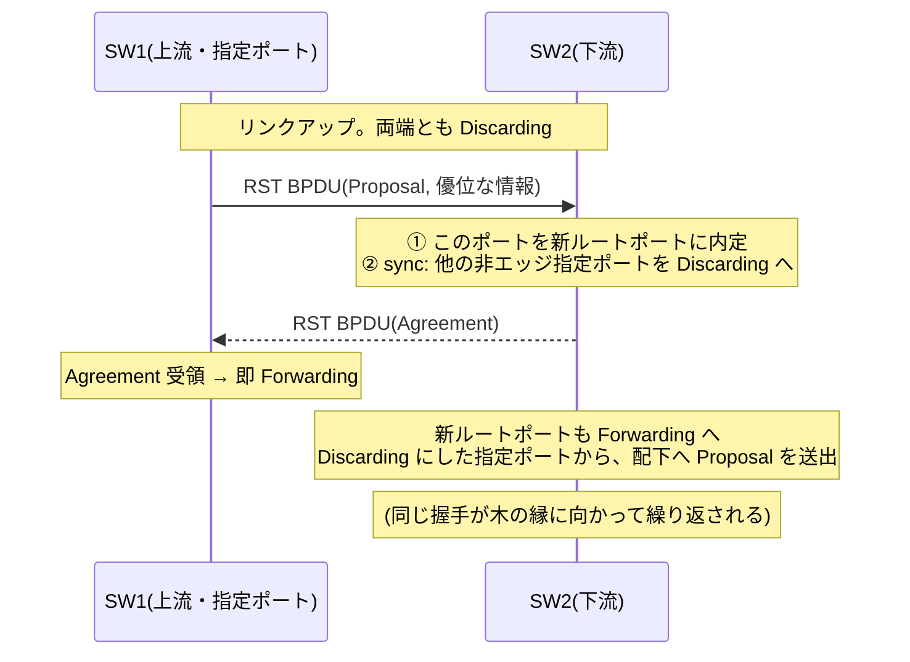

# RSTP / MSTP — 待つ木から、握手する木へ

## 概要

前章([STP の基礎](01_stp_basics.md))で見た 802.1D は、L2 ループを断つという
目的は達成したが、収束 30〜50 秒と「全 VLAN で木が1本」という2つの限界を残した。
本章はその2つへの標準の答え——**RSTP**(Rapid Spanning Tree Protocol)と
**MSTP**(Multiple Spanning Tree Protocol)——の動作原理を扱う。
前提知識は前章(選出の4段比較、タイマー、ポート状態、TCN)と
[第2部01章](../02_vlan_vxlan_evpn/01_vlan_basics.md)・
[02章](../02_vlan_vxlan_evpn/02_trunking_native_vlan.md)(VLAN、トランク)である。

## 導入 — そもそも何のための技術か

### 不満①: 30 秒は「待ち」でできている

802.1D の収束が遅い理由を、前章の内容から棚卸ししてみると、
遅さの正体はすべて**タイマー待ち**であることがわかる。

- 上流の障害を、BPDU が来なくなってから **Max Age(20 秒)** の
  期限切れで間接的に検知する
- 転送を始めてよいと分かったポートも、**Forward Delay × 2(30 秒)** を
  数えてから Forwarding に入る

つまり 802.1D は「**時間の経過**」を安全の根拠にする。古い情報は時間が
経てば死ぬはずだ、全網に情報が行き渡るには最大でこれだけかかるはずだ——
という最悪ケースの見積もりを常に支払う設計である。ネットワーク直径 7 を
仮定した保守的な定数を、実際のトポロジがどんなに小さくても待つ。
1990 年前後の LAN では許容されたこの数字は、電話(VoIP)やストレージが
L2 網に載る時代には許容されなくなった。数十秒の断は、TCP なら再送で
生き延びても、音声なら切断であり、iSCSI ならタイムアウトである。

RSTP の発想は、この根拠を置き換えることにある。**時間の経過ではなく、
明示的な確認応答を安全の根拠にする**。「30 秒待ったからもう大丈夫だろう」
ではなく、「隣人と握手して、ループができないことを確認したから今すぐ進む」。
待ち時間は原理的に不要になり、収束はトポロジのサイズに応じた
メッセージ往復の時間——典型的には 1 秒未満——まで縮む。

### 不満②: 木が1本では、買った帯域が全 VLAN で遊ぶ

前章の最後で見たとおり、素の 802.1D/CST(Common Spanning Tree)では
スパニングツリーは全 VLAN で共通の1本である。ブロッキングされたリンクは
**すべての VLAN にとって**遊休になる。せめて「VLAN 10 はこっちの
リンク、VLAN 20 はあっちのリンク」と木を分けられれば、冗長リンクを
平常時から(VLAN 単位の粗い粒度ではあれ)使い切れるはずである。

これに最初に答えたのはベンダー実装だった。Cisco の **PVST+**
(Per-VLAN Spanning Tree Plus)は、その名のとおり **VLAN ごとに独立した
STP インスタンス**を走らせる(『PVST+』という語は IEEE の仕様には登場しない。
独自の宛先アドレス 01:00:0C:CC:CC:CD を使う Cisco 由来の実装であり、
以下でも固有名として扱う)。素直な解だが、素直すぎる代償がある。
VLAN が 500 あれば、BPDU も 500 本流れ、各スイッチは 500 個の木の
状態機械を回す。**制御負荷が VLAN 数に比例する**のである。しかも、
500 個の木が本当に 500 通りの形をしているかといえば、そんなことはない。
物理トポロジが同じなのだから、管理者が使い分けたい木の形は
実際には 2〜3 パターンしかない。

MSTP はここを突く。**VLAN の数だけ木を作るのではなく、必要な木の形の
数だけインスタンスを作り、4094 個の VLAN をそこへ多対一で写像する**。
「多数の識別子を、転送の扱いが同じもの同士の少数のクラスに束ねる」——
これは [MPLS の FEC](../05_mpls_srv6/01_mpls_basics.md) とまったく同じ
発想である。

以下、理論の前半で RSTP、後半で MSTP を扱う。なお標準の系譜を先に
整理しておくと、RSTP は **IEEE 802.1w**(2001)として登場し、
802.1D-2004 改訂で本体に統合された(このとき古典 STP は仕様から削除され、
標準はRSTP になった)。MSTP は **IEEE 802.1s**(2002)として登場し、
802.1Q-2005 以降 802.1Q 本体に統合されている。つまり現行の 802.1Q が
規定するスパニングツリーとは RSTP/MSTP のことであり、前章の古典 STP は
互換モードとしてだけ生きている。

## 理論

### RSTP① ブロッキングポートに名前を与える — 代替ポート

802.1D の再設計は、まず「ブロッキングポート」の解像度を上げるところから
始まる。前章の選出で「どれにも選ばれなかったポート」と一括りにされて
いたものは、よく見ると2種類ある。

- **代替ポート(alternate port)** — 他のブリッジの指定ポートから
  (自分のルートポート経由より劣る)BPDU を受けているポート。
  つまり**ルートへの別ルートの入り口**である。
- **バックアップポート(backup port)** — 自分自身の指定ポートが面する
  同じセグメントにつながった2本目のポート(同一セグメントへの多重接続。
  ハブを介した場合にしか生じず、現代ではまれ)。

この区別が重要なのは、代替ポートが「**ルートポートが死んだら次に使う
ポート**」として**あらかじめ計算済み**だからである。802.1D でも同じ
ポートは存在したが、プロトコルはそれを「塞ぐべきポート」としか見て
いなかった。RSTP はこれを「昇格待ちのバックアップ」として扱う。
ルートポートの喪失を検知した瞬間、最良の代替ポートを新しいルートポートへ
**即時に昇格**させる。再選出のやり直しも、タイマー待ちも要らない。

「壊れてから代わりを探すのではなく、代わりを事前に計算して持っておく」
——この発想は本書で繰り返し登場した。
[フローティングスタティックルート](../01_fundamentals/03_static_vs_dynamic.md)は
その手動版であり、[TI-LFA](../05_mpls_srv6/04_srv6.md) は IGP における
洗練版である。RSTP の代替ポートは、同じ原理の L2 版と言ってよい。

あわせて RSTP は**ポートの役割(role)と状態(state)を分離**した。
役割は選出の結果(ルート/指定/代替/バックアップ)、状態はデータプレーンの
挙動である。状態は 802.1D の5つから3つに整理された。

| RSTP の状態 | 802.1D 対応 | 挙動 |
|---|---|---|
| Discarding | Disabled / Blocking / Listening | データ廃棄・学習せず |
| Learning | Learning | 学習のみ、転送せず |
| Forwarding | Forwarding | 通常運転 |

802.1D の Blocking と Listening の区別は「選出に参加しているか」という
役割の話であって、データプレーンの挙動はどちらも「廃棄」で同じ——
役割と状態を分けたことで、この冗長さが消える。

### RSTP② 提案と合意 — 待たずに進むための握手

RSTP の心臓部が **Proposal/Agreement(提案/合意)** の握手である。
802.1D が Forward Delay × 2 の「待ち」で保証していたこと——
今このポートを開けてもループにならない——を、明示的な2者間の
メッセージ交換で保証する。

新しいリンクがアップした場面を考える。両端はまず自分が指定ポートだと
主張し、状態は Discarding のまま **Proposal ビットを立てた BPDU** を
送り合う。優位な BPDU を受けた側(下流側)は、次の3つを**不可分に**行う。

1. このポートを新しいルートポートに内定する
2. **sync**: 自分の他の非エッジ指定ポートをすべて Discarding に落とす
3. 上流へ **Agreement ビットを立てた BPDU** を返す

Agreement を受けた上流は、指定ポートを**即座に** Forwarding へ進める。
待ち時間はゼロである。なぜこれが安全なのか。ポイントは手順 2 にある。
上流側のポートを開ける時点で、下流ブリッジの「その先」はすべて
塞がっている。つまり、開けたリンクを通ったフレームが下流ブリッジより
先へ進んで一周してくる経路は、**物理的にありえない**状態を作ってから
開けている。

もちろん、下流で塞いだポートの先には、さらに下流のブリッジがいる。
そこで今度は塞いだ各ポートが(新しい情報とともに)Proposal を送り、
その先で同じ握手が繰り返される。すなわち Proposal/Agreement は、
**「Discarding の壁」を木の根元から縁へ向かって1ホップずつ押し出していく波**
である。各ホップの所要は BPDU の往復1回。網全体でも、収束時間は
直径ぶんのメッセージ往復——ミリ秒のオーダー——で済む。
802.1D が「最悪ケースの時間を全員が待つ」ことで達成した安全を、
RSTP は「実際のトポロジ上の因果を1ホップずつ確認する」ことで達成する。

この握手には前提が1つある。リンクの向こうに相手が**1台だけ**いること
(ポイントツーポイントリンク)である。ハブで3台以上がぶら下がる共有
セグメントでは、誰と握手すれば安全なのか決められないため、RSTP は
802.1D と同じ Forward Delay 待ちに退行する。リンクタイプは通常、
**全二重ならポイントツーポイント**と推定される(設定で明示もできる)。
半二重リンクが残っていると、そこだけ収束が遅い——という形で
この前提は後で顔を出す(トラブルシューティング参照)。

また、端末しかつながらないポートには握手も sync も不要である。RSTP は
前章の宿題だったエッジポートを **edge port** として標準化した。
エッジ宣言されたポートは即座に Forwarding となり、sync の対象からも
外れ、トポロジ変更も発火しない。ただし BPDU を受信した瞬間に
エッジ資格を失い、通常ポートとして振る舞い直す(スイッチが誤って
つながれた場合の安全装置)。

### RSTP③ 心拍の分散化 — 3回の欠落で死を宣告する

802.1D では、BPDU の発生源はルートブリッジただ1台であり、他のブリッジは
それを中継(再生成)するだけだった。だから「BPDU が来ない」ことの意味が
曖昧になる——隣が死んだのか、その先のどこかが死んだのか、区別できない。
死の宣告も、情報の賞味期限である Max Age(20 秒)を待つしかなかった。

RSTP では、**すべてのブリッジが自分の Hello Time ごとに自分の BPDU を
生成して送る**。BPDU は「ルートの鼓動の中継」から「**隣人自身の心拍**」に
変わる。これで隣接ブリッジの生死を直接監視できるようになり、
**Hello Time × 3(既定 6 秒)** BPDU が欠けたら、そのポートの情報は
即座に破棄される。「keepalive の3倍をホールドタイムとする」という
この作法は、[BGP のホールドタイム](../03_bgp/01_bgp_basics.md)
(推奨 90 秒 = KEEPALIVE 30 秒 × 3)とまったく同じパターンである。
プロトコル本体から障害検知を分離して高速化するという意味では、
L3 における [BFD](../01_fundamentals/03_static_vs_dynamic.md) と
同じ問題意識でもある。

さらに、劣位の情報への態度も変わった。802.1D のポートは、記憶している
BPDU より劣る BPDU を受け取っても無視した(良い情報は Max Age まで
生きる)。RSTP は、**そのセグメントの指定ブリッジ自身が劣位の BPDU を
送ってきた**場合、それを「上流が道を失った」という新情報として即座に
受け入れ、再計算する。障害の報せが、タイマーではなくメッセージで届く
ようになったのである。

なお、Cisco が 802.1D 時代に提供していた高速化拡張はこうして標準に
吸収された。UplinkFast は代替ポートの即時昇格として、BackboneFast は
劣位 BPDU の即時受理として、PortFast は edge port として、それぞれ
RSTP の標準機構に対応する。

### RSTP④ トポロジ変更 — ルート経由をやめる

前章で見た TCN の仕組み(変更をルートへ登らせ、ルートが TC フラグを
全網に配り、MAC エージングを短縮する)は、RSTP で全面的に置き換えられた。

- **TCN BPDU は廃止**(802.1D ブリッジとの互換のためにだけ残る)。
  変更を検知したブリッジは、**自分で** TC フラグ付き BPDU を
  ルートポートと全指定ポートから送る。受け取ったブリッジも同様に
  自分の先へ伝える。ルートへの集約を経ない分だけ速い。
- トポロジ変更の定義も絞られた。TC を発火させるのは**非エッジポートが
  Forwarding に遷移したとき**だけである。リンクダウンは TC にならない
  (道が減っただけなら、誤学習の恐れはなく、掃除は不要という理屈である。
  新しい道が開いたときだけ、古い学習が間違いになりうる)。
- MAC テーブルの掃除は、エージング短縮ではなく**即時フラッシュ**になった。
  TC を受けたブリッジは、受信ポートとエッジポートを除く全ポートの
  学習エントリを直ちに消す。RSTP の切り替えはミリ秒オーダーなので、
  「15 秒かけて自然に入れ替わる」のを待つ猶予はなく、即座に
  学習し直させる方が全体の断は短い、という割り切りである。
  そのぶんフラッディングの瞬間的な増加は 802.1D 方式より大きく、
  これはエッジポートを正しく宣言する運用の重要性につながる
  (トラブルシューティング参照)。

### MSTP① リージョン — 写像の一致が前提

MSTP に話を移す。導入で述べたとおり、MSTP の核心は
**VLAN → インスタンス(MSTI: Multiple Spanning Tree Instance)の
多対一写像**である。たとえば VLAN 10, 30, 50 を MSTI 1 に、
VLAN 20, 40, 60 を MSTI 2 に割り当て、MSTI 1 のルートを SW1、
MSTI 2 のルートを SW2 に置けば、2本の木が別の形になり、
冗長リンクの両方が(VLAN 群単位で)平常時から使われる。

ただし、この写像には厳しい前提がある。**全スイッチで写像が完全に
一致していなければならない**。もし SW1 が「VLAN 10 は MSTI 1」、
SW2 が「VLAN 10 は MSTI 2」と考えていたら、VLAN 10 のフレームは
2つの違う木の混合物の上を流れ、ループのない保証が崩れる。

そこで MSTP は、写像の一致する範囲を **MST リージョン**として明示的に
管理する。各ブリッジは次の3点セット(MST Configuration Identifier)を
BPDU に載せて広告する。

1. リージョン名(32 オクテット)
2. リビジョン番号(2 オクテット)
3. **VLAN→インスタンス対応表のダイジェスト**(16 オクテット。
   4096 エントリの対応表全体から HMAC-MD5 で計算される)

隣接ブリッジとこの3点が**完全一致したときだけ**同一リージョンとみなす。
対応表そのもの(数 KB)を BPDU で運ぶ代わりにハッシュで照合する設計で、
1 VLAN でも写像がずれればダイジェストが変わり、そのブリッジは
**別リージョン**——つまり「木を共有できない他人」——として扱われる。
設定ミスがループではなく分断(安全側)に倒れる仕組みだが、
「1台だけ VLAN を追加し忘れた」がリージョン分裂として現れるのは
MSTP の典型的な事故である(トラブルシューティング参照)。

### MSTP② CIST — リージョンの外から見れば1台のブリッジ

MSTI はリージョンの中でだけ意味を持つ。ではリージョンの外側——
他のリージョンや、MSTP を話さない古い 802.1D/RSTP ブリッジ——との
間はどうつなぐか。

MSTP の答えは階層化である。全体で1本だけ、**CIST**(Common and
Internal Spanning Tree)と呼ばれる木を張る。CIST は、リージョンの
**外側**では従来の RSTP と同じ計算(全ブリッジで1本の木)として振る舞い、
リージョンの**内側**ではインスタンス 0(IST: Internal Spanning Tree)として
計算される。外から見ると、**1つのリージョンは1台の巨大な仮想ブリッジ**の
ように振る舞い、リージョン内部の構造は外に漏れない。

この構図はどこかで見たはずである——[OSPF のエリア](../01_fundamentals/05_igp_overview.md)
(エリア内はリンクステート、エリア間は距離の要約だけを渡す)と同じ、
「詳細は内側に閉じ込め、外へは要約だけを見せる」という階層化である。
MSTP はこのために経路コストも内外で分けて管理する(リージョン外の
コスト External Root Path Cost と、リージョン内のコスト Internal Root
Path Cost は別のフィールドで運ばれ、外のコストはリージョン通過で
変化しない)。

またリージョン内では、情報の鮮度管理が Message Age の加算ではなく
**残りホップ数(Remaining Hops、既定 20)** のデクリメントに置き換わる。
直径 7 を暗黙に仮定した 802.1D のタイマー連動から、TTL 型の明示的な
上限へ——ここにも設計の世代差が現れている。

### MSTP③ BPDU は1本のまま

PVST+ との決定的な違いとして、MSTP の制御負荷は VLAN 数に比例しない。
MSTP ブリッジが送る BPDU は**リンクごとに1本だけ**で、その1本の中に
CIST の情報と、リージョン内の全 MSTI の情報(インスタンスごとに
16 オクテットの MSTI Configuration Message)が相乗りする。
500 VLAN を 2 インスタンスに写像した網なら、BPDU の中身は
「CIST + MSTI 2つ分」であり、PVST+ の 500 本と比べるまでもない。
状態機械もインスタンスの数(+CIST)だけで済む。

「識別子(VLAN)の数と、制御プレーンの状態の数を切り離す」——
[第2部](../02_vlan_vxlan_evpn/03_vxlan_fundamentals.md)で見た
「識別子の数そのものではなく、動作原理が壁になる」という教訓の、
これはスパニングツリー版の解答である。

## プロトコル動作の詳細

### RST BPDU のフォーマット

RSTP の BPDU(RST BPDU)は、前章の Configuration BPDU と同じ骨格を保ち、
Protocol Version = 2、BPDU Type = 0x02 となる。TCN BPDU は(互換用途を
除き)使われない。末尾に Version 1 Length(= 0)が付いて全 36 オクテット。
最大の変化は、802.1D で 2 ビットしか使っていなかった **Flags の
8 ビットがすべて使われる**ことである。

```text
  bit:   7        6        5        4        3        2        1        0
      +--------+--------+--------+--------+--------+--------+--------+--------+
      |  TCA   | Agree- | Forwa- | Learn- |   Port Role     | Propo- |   TC   |
      | (互換) |  ment  | rding  |  ing   |   (2ビット)     |  sal   |        |
      +--------+--------+--------+--------+--------+--------+--------+--------+
                                            00: 不明
                                            01: 代替/バックアップ
                                            10: ルート
                                            11: 指定
```

Proposal / Agreement が前述の握手を運ぶ。注目すべきは Port Role・
Learning・Forwarding で、送信者が「このポートをどの役割・状態のつもりで
使っているか」を BPDU に載せて申告する。これにより受信側は、相手の
認識と自分の認識の**食い違い**を検出できる。たとえば指定ポートが、
劣位の情報を Learning/Forwarding フラグ付きで主張する BPDU を受けたら、
どちらかの認識が壊れている(片方向リンク等)とみなして自ポートを
Discarding へ戻す(dispute と呼ばれる防御機構。前章の症状3で見た
片方向リンク問題への、部分的な標準解である)。

### MST BPDU のフォーマット

MSTP の BPDU は Protocol Version = 3 で、RST BPDU の後ろに
MSTP 固有部が続く。

```text
+-----------------------------------------------+
| RST BPDU と同一の 36 オクテット(CIST の外部情報)|
+-----------------------------------------------+
| Version 3 Length (2)                          |
+-----------------------------------------------+
| MST Configuration Identifier (51)             |
|   Format Selector(1) / リージョン名(32)        |
|   リビジョン(2) / 対応表ダイジェスト(16)        |
+-----------------------------------------------+
| CIST Internal Root Path Cost (4)              |
| CIST Bridge Identifier (8)                    |
| CIST Remaining Hops (1)                       |
+-----------------------------------------------+
| MSTI Configuration Message × インスタンス数   |
|   (各 16: Flags / Regional Root / Path Cost / |
|    プライオリティ / Remaining Hops など)       |
+-----------------------------------------------+
```

先頭 36 オクテットが RST BPDU と同型であることには意味がある。
RSTP しか解さないブリッジは MST BPDU を「少し長い RST BPDU」として
読め、CIST の計算にはそのまま参加できる。MSTI 部は理解できる者
(同一リージョンの隣人)だけが読む。
[パスアトリビュートの4分類](../03_bgp/03_path_attributes.md)で見た
「未知の拡張を壊さず運ぶ/読める者だけが読む」後方互換の作法と同じである。

### Proposal/Agreement の握手 — シーケンスで追う

上流ブリッジ SW1(ルート側)と下流ブリッジ SW2 の間のリンクが
新しくアップした場面。SW2 の配下にはさらにブリッジがつながっている。



sync で Discarding に落とされた SW2 配下の各リンクでは、SW2 が
Proposal を送る側(上流)になって同じ握手が起きる。握手の波が
エッジポートに到達したところで(エッジは sync 対象外なので)伝搬は
止まり、収束が完了する。**各ホップの所要は BPDU 往復1回**であり、
Forward Delay はどこにも登場しない。

### 障害時の即時切替 — 前章の三角形、再び

前章のウォークスルーと同じ三角形(SW1 がルート、SW2-SW3 間リンク (c) の
SW3 側がブロッキング)を RSTP で動かす。RSTP では SW3 の (c) ポートは
**代替ポート**という役割名を持ち、Discarding 状態にある。

```text
              SW1 (root)
             /   \
      (a) RP↑     ↑RP (b)          RP: ルートポート
           /       \               DP: 指定ポート
        SW2 --DP・A-- SW3          A: 代替ポート(Discarding)
                (c)
```

**ケース1: SW3 のルートポート側リンク (b) が切れた。**
SW3 はリンクダウンを検知した瞬間、事前計算済みの代替ポート (c) を
新ルートポートへ昇格させ、**直ちに Forwarding** へ遷移させる
(代替ポートは「そのセグメントの指定ブリッジ SW2 が健在で、SW2 経由で
ルートに届く」ことを BPDU の受信によって確認し続けていた。つまり
ループ安全性の確認は済んでいる)。切替は検知からミリ秒のオーダーで、
802.1D の 50 秒(Max Age 20 + Forwarding まで 30)と比べるまでもない。

**ケース2: SW2 のルートポート側リンク (a) が切れた。**
SW2 に代替ポートはない(もう1本のポート (c) は指定ポートである)。
SW2 はルートへの道を失い、自分をルートと信じる劣位の BPDU を (c) へ送る。
これを受けた SW3 は、802.1D なら Max Age まで無視するところを、
「(c) の指定ブリッジ自身が道を失った」という新情報として即座に受理する。
SW3 は (c) を指定ポートに転じ、優位な情報(ルートは SW1)を Proposal
付きで返す。SW2 が (c) をルートポートにして Agreement を返し、握手完了。
数往復の BPDU 交換——やはり 1 秒未満——で木が架け替わる。

### TC の伝搬とフラッシュ

非エッジポートが Forwarding へ遷移したブリッジは、TC フラグを立てた
BPDU をルートポートと全指定ポートからしばらく(数 Hello)送り続ける。
TC を受けた各ブリッジは、**受信ポートとエッジポートを除く**全ポートの
MAC 学習を即時フラッシュし、自分も同様に TC を伝える。802.1D のように
ルートを経由しないため、掃除は切替とほぼ同時に全網へ波及する。

## 設定例 — Linux(mstpd)でポート役割と握手を観察する

カーネル標準ブリッジの STP は古典 802.1D なので(前章参照)、RSTP を
動かすにはユーザ空間デーモン **mstpd** を使う。以下は Debian 系での例
(表示の細部はバージョンにより異なりうる)。

```bash
apt install mstpd

# stp_state 2 = ユーザ空間 STP(BPDU 処理を mstpd に委ねる)
ip link add br0 type bridge stp_state 2
ip link set eth1 master br0
ip link set eth2 master br0
ip link set br0 up

mstpctl setforcevers br0 rstp        # RSTP モード
mstpctl setportadminedge br0 eth3 yes # 端末収容ポートはエッジ宣言する

mstpctl showport br0
# eth1  1.001  forw  1000.52:54:00:AA:00:01  1000.52:54:00:AA:00:01  8.001  Root
# eth2  1.002  disc  1000.52:54:00:AA:00:01  1000.52:54:00:AA:00:02  8.002  Altn
```

`Root` / `Desg` / `Altn` / `Back` の列が本章の**役割**、`forw` / `disc` /
`lern` の列が**状態**であり、役割と状態が別の軸として表示されるところに
RSTP の設計がそのまま現れている。eth2 が `Altn / disc`——つまり
「Discarding だが、昇格待ちの代替ポート」である。ここで eth1 を抜くと、
eth2 が一瞬で `Root / forw` に変わる様子が観察できる(802.1D のときの
ような 30 秒の `lern` 経由がない)。

BPDU 上の握手は tcpdump で読める。

```bash
tcpdump -i eth1 -v 'ether dst 01:80:c2:00:00:00'
# STP 802.1w, Rapid STP, Flags [Proposal, Learn, Forward], port-role Designated,
#   bridge-id 1000.52:54:00:aa:00:01.8001, length 36
```

前章の `STP 802.1d, Config` と見比べると、`802.1w` / `Rapid STP`、
そして Flags に Proposal や port-role(送信者の役割の申告)が
載っていることが確認できる。

## トラブルシューティング

### 症状1: 網の切替はおおむね速いのに、特定のリンクだけ毎回 30 秒かかる

RSTP 網の中に**握手できないリンク**が混ざっているケースである。
原因は2系統ある。第一に、**リンクタイプが共有(shared)と判定されている**
場合。RSTP はリンクタイプを二重通信モードから推定するため、
半二重で上がったリンク(古い機器、オートネゴシエーション不調、
間に挟まったハブ)では Proposal/Agreement を使わず、802.1D と同じ
Forward Delay 待ちに退行する。`mstpctl showportdetail` などでリンクタイプ
(point-to-point か shared か)と二重通信モードを確認する。
第二に、**対向が 802.1D しか話せない**場合。RSTP ポートは 802.1D の
Configuration BPDU/TCN を受けると、そのポートだけ互換モードに落ちて
802.1D として振る舞う。網の一部にレガシーブリッジが残っている限り、
その周辺の収束は 802.1D の速度に律速される。

### 症状2: レガシー機を撤去したのに、そのポートが RSTP に戻らない

症状1の続きである。互換モードへの移行は BPDU の受信で自動的に起きるが、
**復帰は自動ではない**。802.1D BPDU が来なくなっても、ポートは互換モードに
留まり続ける(いつ古い隣人が戻ってくるか分からない以上、勝手に戻るのは
危険という判断である)。プロトコルの再検出を明示的に指示する必要がある
(mstpd では `mstpctl portmcheck`、Cisco では
`clear spanning-tree detected-protocols` に相当)。
「機器を替えたのに遅いまま」はこの片道性を知らないと気づきにくい。

### 症状3: VLAN を1つ追加したら、MSTP の負荷分散が崩れ、一部 VLAN が想定外のリンクを通る

**MST リージョンの分裂**である。VLAN→インスタンス対応表を全台に
反映するはずが1台だけ漏れた、あるいは作業順の途中経過として一時的に
不一致になった——どちらでも、対応表のダイジェストが変わった瞬間に
そのブリッジは**別リージョン**になる。リージョン境界では MSTI は
一切共有されず CIST 1本だけで接続されるため、せっかく設計した
インスタンスごとの負荷分散が境界をまたいだ途端に無効になり、
全 VLAN が CIST の1本の木に押し込まれる。
切り分けは、隣接する2台で3点セット(リージョン名・リビジョン・
ダイジェスト)を突き合わせることに尽きる。対策は運用側にある:
対応表は「将来使う VLAN も含めて最初に全部書き切る」か、設定管理ツールで
全台一括配布し、**リビジョン番号を変更の版数として規律をもって**運用する。

### 症状4: リンクがフラップするたびに、網全体でユニキャストのフラッディングが激増する

RSTP の TC 処理(即時フラッシュ)の裏面である。802.1D の
「エージング短縮」なら通信中のエントリは生き残ったが、RSTP の TC は
該当ポート以外の学習を**即座に全部消す**。どこかのポートが Forwarding への
遷移を繰り返す(フラップする)と、そのたびに全網の MAC テーブルが
まっさらになり、再学習が済むまでの全ユニキャストがフラッディングになる。
まず疑うべきは **TC の発生源**であり、多くの場合それは
**エッジ宣言されていない端末収容ポート**である(PC の起動・スリープ復帰の
たびに TC が出る)。端末収容ポートを漏れなくエッジ宣言し(あわせて
BPDU ガード相当の防御を併用し)、それでも続くならフラップしている
基幹リンク(SFP 不良、対向の再起動ループ)を特定して隔離する。
なお「TC が出続けている」ことは、多くの実装でトポロジ変更カウンタと
最終変更ポートの表示から追跡できる。

## 演習・確認問題

**問1.** 802.1D の収束を遅くしていた2つの「タイマー待ち」を挙げ、
RSTP がそれぞれを何に置き換えたかを述べよ。

**問2.** Proposal/Agreement の握手で、下流ブリッジが Agreement を返す
**前に**自分の他の非エッジ指定ポートを Discarding に落とす(sync)のは
なぜか。この手順を省くと何が起こりうるか。

**問3.** 代替ポートとバックアップポートの違いを、「どこから来る BPDU を
受けているか」の観点から説明せよ。

**問4.** MSTP で、リージョン名とリビジョンが一致していても VLAN→
インスタンス対応表が1エントリだけ異なる2台のブリッジは、なぜ・どのように
「別リージョン」と判定されるか。またそのとき2台の間で共有される木は何か。

**問5.** トポロジ変更時の MAC テーブルの扱いは、802.1D が「エージング
時間の短縮」、RSTP が「即時フラッシュ」である。それぞれの設計が
合理的である理由を、両者の収束時間の違いから説明せよ。

---

**解答**

**問1.** (a) 上流障害の検知を BPDU 情報の期限切れ(Max Age 20 秒)に
頼っていた点——RSTP は全ブリッジが自分の BPDU を Hello ごとに生成する
「心拍」に変え、3 回の欠落(6 秒)での即時破棄と、劣位 BPDU の即時受理に
置き換えた。(b) Forwarding までの Listening/Learning 各 15 秒の待ち——
ポイントツーポイントリンクでは Proposal/Agreement の明示的握手に、
また事前計算済みの代替ポートの即時昇格に置き換えた(エッジポートは
そもそも待ちの対象外)。

**問2.** 上流が指定ポートを開けた時点で、下流ブリッジの先に転送可能な
別経路が残っていると、開けたリンク→下流の先→網のどこか→上流という
一時的ループが成立しうるからである。sync によって「下流の先はすべて
塞がっている」状態を作ってから Agreement を返せば、開けた瞬間に
フレームが一周してくる経路は物理的に存在しない。省略すると、
802.1D が Forward Delay の待ちで防いでいた一時的ループが、
待ちなしで発生しうる。

**問3.** 代替ポートは**他のブリッジ**の指定ポートが送る(自分のルート
ポート経由より劣位の)BPDU を受けているポートで、ルートへの別経路の
入り口である。バックアップポートは**自分自身**の指定ポートが面する
同一セグメントから、自分の BPDU(に相当する情報)を受けている
2本目のポートで、同一セグメントへの多重接続にすぎない。前者は
ルートポート喪失時の昇格候補になるが、後者は自ブリッジの指定ポートの
予備にしかならない。

**問4.** リージョンの同一性は、リージョン名・リビジョン・**対応表全体から
計算した HMAC-MD5 ダイジェスト**の3点完全一致で判定される。対応表が
1エントリでも違えばダイジェストが一致せず、BPDU 上の MST Configuration
Identifier が異なるため互いを別リージョンとみなす。このとき2台の間で
共有されるのは CIST(全体で1本の木)だけであり、MSTI ごとの
負荷分散は両者の間では機能しない。

**問5.** 802.1D の収束は 30〜50 秒かかるため、その間に通信中のエントリまで
全消去すると、切替完了までフラッディングの負荷が長時間続く。エージング
短縮(15 秒)なら、生きている通信の学習は維持され、無効なエントリだけが
自然に淘汰される。一方 RSTP の切替はミリ秒〜秒のオーダーで完了するため、
古い学習が「間違い」になる時間も掃除に使える時間も短い。即時フラッシュで
一瞬フラッディングが増えても、直ちに新しい木の上で再学習される方が
全体の断は短くて済む。掃除の丁寧さと切替の速さのバランスが、
両者で逆になっているのである。

## まとめ

- RSTP(802.1w、現行 802.1Q に統合)は、802.1D の「時間の経過」による
  安全を「明示的な確認」に置き換えた。事前計算済みの**代替ポート**の
  即時昇格、ポイントツーポイントリンク上の **Proposal/Agreement** の握手、
  全ブリッジが BPDU を生成する心拍化(3 × Hello での障害検知)により、
  収束は 30〜50 秒からミリ秒〜秒のオーダーになった。
- Proposal/Agreement は「下流の先を塞いでから開ける」sync とセットの
  1ホップずつの握手であり、Discarding の壁を根元から縁へ押し出す波として
  網全体に伝搬する。エッジポートは握手・sync・TC のすべてから除外される。
- MSTP(802.1s、同じく 802.1Q に統合)は、VLAN の数だけ木を作るのではなく
  少数の **MSTI** へ VLAN を多対一に写像し、BPDU 1本に相乗りさせる。
  写像の一致範囲は **MST リージョン**(名前・リビジョン・対応表ダイジェスト
  の3点一致)として管理され、リージョンは外から見れば1台の仮想ブリッジ、
  リージョン間は **CIST** 1本で接続される。
- それでもなお「ブロッキングされたリンクは(そのインスタンスでは)遊ぶ」
  「木である限り2点間の道は1本」という全域木の原理的な制約は残る。
  これを正面から外す——リンクを束ねて木の計算から消し、あるいは L2 の
  マルチパスを ECMP に置き換える——のが、次章以降([FHRP](03_fhrp_vrrp.md)、LAG/MLAG)と
  [EVPN ファブリック](../02_vlan_vxlan_evpn/05_evpn_vxlan.md)の世界である。
