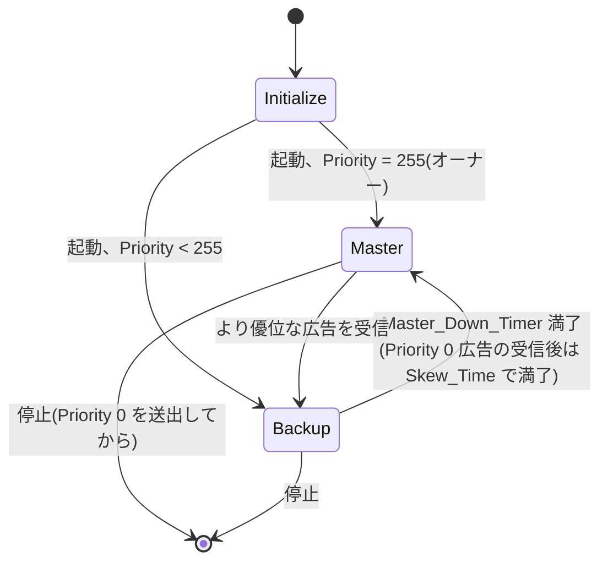
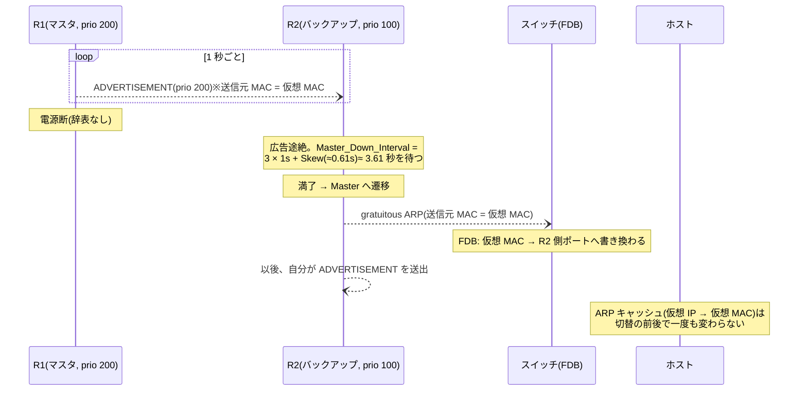

# FHRP(VRRP / HSRP)— ゲートウェイの「名」を引き継ぐ

## 概要

前2章でスイッチ網の中の冗長化(STP/RSTP/MSTP)を扱ったが、ホストから見た
**最初の L3 ホップ = デフォルトゲートウェイ**は依然として1台のままである。
本章はこれを冗長化する **FHRP**(First Hop Redundancy Protocol)の考え方と、
その IETF 標準である **VRRP**(現行仕様は **RFC 9568**)、先行したベンダー実装で
ある HSRP の動作原理を扱う。前提知識は
[第1部01章](../01_fundamentals/01_l2_l3_recap.md)(デフォルトゲートウェイ、ARP、
透過的ブリッジング)と、IPv6 の部分については
[第4部03章](../04_ipv6/03_ndp_slaac.md)(RA、NDP)である。

## 導入 — そもそも何のための技術か

### 冗長化の最後の穴 — ホストは1人の相手しか知らない

前2章の努力を思い出そう。スイッチを2重化し、リンクを2重化し、
RSTP がミリ秒で木を架け替えるところまで来た。ところが、その網の出口で
すべての努力が1点に収斂する。**ホストのデフォルトゲートウェイは
1つの IP アドレスであり、その IP を持つルータは1台**である。

```text
            インターネット
             |         |
           [R1]      [R2]      ← ルータは2台買った。しかし——
        .251 |         | .252
             |         |
             +---SW----+
                  |
              ホスト群
       (GW 設定 = 192.0.2.251 ただ1つ)
```

R1 が死んだときに何が起こるかを、
[第1部01章](../01_fundamentals/01_l2_l3_recap.md)の道具立てで正確に追うと、
この穴の深さがわかる。

1. ホストの経路テーブルには「デフォルト → 192.0.2.251」とだけある。
   R2 の存在をホストは知らない。
2. ホストの ARP キャッシュには「192.0.2.251 → R1 の MAC」が残っている。
   キャッシュが生きている数分間、ホストは死んだ R1 の MAC へ
   フレームを送り続ける。スイッチは学習どおりに R1 のポートへ届け、
   フレームはそこで静かに消える。
3. キャッシュが切れて再 ARP しても、答える者はいない。

つまり、サブネットの外へ出る通信は**全滅**する。そしてホスト側には、
これを検知して回復する仕組みが(IPv4 では)事実上ない。

### ホストを賢くする道は、すべて塞がっている

素直な発想は「ホストに R2 のことも教える」ことだが、この方向の答えは
歴史的にどれも失敗している。

- **ゲートウェイを2つ設定する** — 多くの OS は2つ目を持てるが、
  1つ目の死活を監視しない(dead gateway detection の類は実装依存で、
  挙動もばらばらである)。
- **ICMP Router Discovery(IRDP、RFC 1256)** — ルータが ICMP で自分を
  広告し、ホストが lifetime つきで学ぶ仕組み。標準はあるが、広告間隔が
  分オーダーで切替が遅く、ホスト側の実装も普及しなかった。
- **ホストにルーティングプロトコルを走らせる** — 技術的には可能だが、
  [第1部05章](../01_fundamentals/05_igp_overview.md)で見たとおり IGP は
  「全ルータを信頼できる範囲」で動かすものである。その信頼境界を
  無数の端末まで広げるのは、規模の点でも管理の点でも成立しない。

なお IPv6 には、RA のルータ有効期限と NUD による**組み込みの**ルータ
切替がある([第4部03章](../04_ipv6/03_ndp_slaac.md))。これは後で
比較するとして、IPv4 のホストには本当に何もない。

### 転回 — ホストを直さず、ルータが「役」を演じる

FHRP の発想はここで反転する。**ホストには一切手を入れない。
その代わり、ホストが知っている「1つのゲートウェイ」を実在のルータから
切り離し、複数のルータが交代で演じられる「役」にする**。

具体的には、どのルータの実アドレスでもない**仮想 IP アドレス**と
**仮想 MAC アドレス**の組(仮想ルータ)を定義し、ホストにはこの仮想 IP を
ゲートウェイとして配る。平常時は1台がこの役を演じ(ARP に答え、
パケットを転送し)、そのルータが死ねば別の1台が同じ役を引き継ぐ。
ホストから見れば、ゲートウェイの IP も MAC も何ひとつ変わらない。
**フェイルオーバーで動くのは機械ではなく、名前**である。

これが成立するのは、IP の転送が
[ホップバイホップの無状態な動作](../01_fundamentals/01_l2_l3_recap.md)
だからである。ルータは個々のフローについて何も覚えていないから、
引き継ぐべきものは「名前」以外にない。逆に言えば、NAT やステートフル
ファイアウォールのように**状態を持つ**装置では名前の引き継ぎだけでは
足りず、状態の同期という別の(はるかに重い)仕組みが必要になる —
[エンドツーエンド原則](../04_ipv6/01_why_ipv6.md)が説いた「網の中間を
無状態に保つ」ことの利得が、冗長化の軽さとしてここに現れている。

### 系譜 — HSRP が先行し、VRRP が標準化した

この仕組みの総称が **FHRP**(First Hop Redundancy Protocol)である。
ただし『FHRP』という総称自体は IETF/IEEE の仕様には登場しない。
Cisco の文書に由来する業界慣用名であり、本書でも総称として使う。

実装が先行した。Cisco の **HSRP**(Hot Standby Router Protocol)は
1990 年代半ばから使われ、1998 年に **RFC 2281**(Informational —
標準ではなく既存実装の文書化)として公開された。IETF はこれと同じ
問題への標準プロトコルとして **VRRP**(Virtual Router Redundancy
Protocol)を策定した。RFC 2338(1998)に始まり、RFC 3768(2004、
VRRPv2 = IPv4 のみ)、RFC 5798(2010、VRRPv3 = IPv4/IPv6 対応)を経て、
現行仕様は **RFC 9568**(2024)である。ほかに負荷分散機能を持つ
Cisco 独自の GLBP もあるが、本書では標準である VRRP を主に扱い、
HSRP は対比として触れる。

なお用語について先に断っておく。RFC 9568 は従来の Master という呼称を
**Active Router** に改めた(包摂的な用語への置き換え)。ただし実装・
コマンド体系・過去の文献では Master/Backup が圧倒的に広く使われている
ため(後述の keepalived も `state MASTER` と表記する)、本書は
**マスタ(Master)/バックアップ(Backup)** を標準表記とし、
RFC 9568 の現行呼称を初出のここで併記しておく。

## 理論

### 仮想ルータ — 2冊の台帳と、仮想 MAC の必然

仮想ルータの実体は3つ組である: **VRID**(Virtual Router Identifier、
1〜255)、**仮想 IP アドレス**(1つ以上)、そして VRID から機械的に決まる
**仮想 MAC アドレス**。仮想 MAC は IANA 管理の OUI 00-00-5E を使い、

- IPv4: `00:00:5E:00:01:{VRID}`
- IPv6: `00:00:5E:00:02:{VRID}`

と定義される(RFC 9568)。たとえば VRID 10 なら `00:00:5E:00:01:0A` である。

IP だけでなく **MAC まで仮想化する**のはなぜか。切替のとき直さなければ
ならない「台帳」が2冊あることを思い出すと、この設計の意味がわかる。

| 台帳 | 持ち主 | 内容 |
|---|---|---|
| ARP キャッシュ / 近隣キャッシュ | **全ホスト** | 仮想 IP → MAC |
| MAC アドレステーブル(FDB) | スイッチ | MAC → ポート |

もし仮想 IP を各ルータの**実 MAC** で運用すると、切替のたびに台帳1 —
つまり**サブネット上の全ホストのキャッシュ** — を書き換えなければ
ならない。gratuitous ARP(GARP)を流して上書きを促すことはできるが、
受け取るかどうかはホスト任せであり、無視する実装(セキュリティ上の
理由で未要請の ARP を受け付けない設定など)が1台あれば、そのホスト
だけ復旧しない。

仮想 MAC ならこうなる。**台帳1は切替後も1文字も変わらない**(仮想 IP →
仮想 MAC の対応は永続的に正しい)。直すべきは台帳2 — スイッチの FDB が
仮想 MAC をどのポートで学習しているか — だけであり、これは新マスタが
仮想 MAC を送信元にしたフレームを**1枚**流せば、透過的ブリッジングの
通常の学習で直る。実際 VRRP は、マスタが送る広告パケット自体の
送信元 MAC を仮想 MAC にすることで、この台帳を毎秒塗り直し続ける。
不特定多数(全ホスト)への働きかけを、少数(スイッチの学習)への
働きかけに変換する — これが MAC まで仮想化する理由である。

### マスタと沈黙するバックアップ — 心拍の経済学

役を演じるのは常に1台である。VRRP はこれを優先度(Priority、1〜254。
255 は後述のオーナー専用、0 も特別な意味を持つ)による選出で決め、
選ばれた**マスタだけ**が仕事をする — 仮想 IP への ARP に(仮想 MAC で)
答え、仮想 IP 宛てを含む転送を担い、そして**広告(ADVERTISEMENT)を
定期送信する**(既定 1 秒間隔)。バックアップは何台いても**完全に
沈黙して聞いているだけ**である。

この非対称は [RSTP の心拍](02_rstp_mstp.md)(全ブリッジが自分の BPDU を
生成する)と対照的で、比べると設計の必然が見える。RSTP は**リンクごとに
隣人の生死**を知る必要があったから全員が鼓動した。VRRP が監視すべきは
「役が演じられているか」の**1点だけ**であり、演者が声を出し続ければ足りる。
グループに何台いても、流れる制御パケットは毎秒1個 — 監視対象の構造が
プロトコルの通信量を決めるのである。

死の判定は、もはやおなじみの作法である。バックアップは

**Master_Down_Interval = 3 × 広告間隔 + Skew_Time**

の間、広告が途絶えたらマスタが死んだとみなす。「keepalive の3倍を
ホールドタイムに」は [BGP](../03_bgp/01_bgp_basics.md)(Hold = KEEPALIVE × 3)、
[RSTP](02_rstp_mstp.md)(3 × Hello)と同じパターンだが、VRRP には
独自の妙味が1つ加わる。**Skew_Time** である。

```text
Skew_Time = ((256 − 自分の Priority) / 256) × 広告間隔
```

優先度が高いバックアップほど Skew_Time が短い — つまり**タイマーが
早く切れて、先に目を覚ます**。広告間隔 1 秒なら、Priority 200 の
バックアップは約 3.22 秒後に、Priority 100 のバックアップは約 3.61 秒後に
動き出す。先に起きた最優先のバックアップがマスタに遷移して広告を
始めれば、あとから起きるはずだった者はその広告を聞いてタイマーを
リセットし、何も起こらない。**選挙のためのメッセージ交換が存在せず、
タイマーの長さそのものが選挙になっている**。それでも同時に名乗りが
衝突したら(優先度が同じ場合など)、優位な広告 — 優先度が高い、
同点なら送信元 IP アドレスが大きい — を聞いた側が引き下がる。

もう1つの特別な値が **Priority 0** である。マスタが計画的に退役する
とき(シャットダウンや設定変更)、Priority 0 の広告を送ってから消える。
これは「私は死んだ」という明示の辞表であり、受け取ったバックアップは
3 × 広告間隔を待たず **Skew_Time だけで**引き継ぐ。障害(3.6 秒)と
計画停止(0.6 秒)で切替時間が変わる理由がここにある。

### オーナーとプリエンプション

仮想 IP アドレスには2つの流儀がある。VRRP の原設計では、仮想 IP は
**どれか1台のルータの実インタフェースアドレスそのもの**でもよい。
この場合そのルータを**アドレスオーナー**と呼び、優先度は予約値 **255** で
固定される — 自分の実アドレスが他人に演じられている状態を許さないため、
オーナーは復帰すれば必ず役を取り返す。今日の実務では、仮想 IP には
どのルータの実アドレスでもない第3のアドレスを使う(オーナー不在)構成が
一般的である。

「より優先度の高い者が現れたとき、現職から役を奪うか」を決めるのが
**プリエンプション(preemption)**である。VRRP の既定は**有効**
(RFC 9568。かつ前述のとおりオーナーは常に奪還する)、HSRP の既定は
**無効**という違いがあり、設計思想の差が出ている — VRRP は「構成どおりの
状態に常に戻る」ことを、HSRP は「余計な切替をしない」ことを既定に選んだ。
プリエンプション有効の網では、不安定なルータが再起動を繰り返すたびに
役の奪還と喪失が反復される(切替の分だけ断が出る)ため、復帰後しばらく
奪還を遅らせる preempt delay と組み合わせるのが定石である
(トラブルシューティング参照)。

### 守りの設計 — TTL 255 と「認証の不在」

VRRP の広告は IP プロトコル番号 **112**、宛先はリンクローカルスコープの
マルチキャスト **224.0.0.18**(IPv4)/ **ff02::12**(IPv6)で送られ、
**TTL(Hop Limit)は 255** でなければならない。受信側は 255 でない
広告を破棄する。これは [GTSM](../03_bgp/02_ibgp_ebgp.md)(RFC 5082)と
同じ原理である — TTL は転送で減ることはあっても増えることはないから、
「255 のまま届いた」ことは「同一リンクから発された」ことの証明になる。
ゲートウェイの座を奪う偽広告を、リンクの外から注入することは原理的に
できない。

一方、VRRPv2 にあった認証フィールドは **VRRPv3 で削除された**。
逆行に見えるが、これは運用経験に基づく判断である — 同一リンク上に
攻撃者がいる状況では、VRRP の認証を破るまでもなく ARP 偽装など
より簡単な攻撃が成立するため、弱い認証は防御にならず「認証している
から安全」という錯覚だけを生む。リンク内の攻撃者への防御は、
スイッチ側の機能(ポートセキュリティや、特定ポート以外からの
VRRP/ARP を落とすフィルタ)に委ねる、という整理である。

### IPv6 と VRRP — RA があるのに、なぜ要るのか

[第4部03章](../04_ipv6/03_ndp_slaac.md)で見たとおり、IPv6 のホストは
RA からデフォルトルータの**リスト**を有効期限つきで学び、NUD が
「教わった対応がまだ有効か」を確かめる。つまり IPv6 には FHRP 相当の
機能が最初から組み込まれている — ではなぜ VRRPv3 は IPv6 を扱うのか。

答えは**決定性**である。RA の有効期限切れによる切替は分オーダー、
NUD による検出はトラフィックがあれば十秒前後まで縮むが、いずれも
**ホストごとに**独立に起こる確率的な動作であり、切替時間は端末の実装と
通信パターン次第でばらつく。VRRP はルータ側の1回の切替(サブ秒〜数秒)で
**全ホストを同時に**救い、しかもゲートウェイのアドレスが常に一定に保たれる。
「端末任せの回復」と「網側での決定論的な回復」の違いであり、
運用者が保証を語れるのは後者である。

動作の道具立ては IPv4 版と対をなす。仮想 MAC は `00:00:5E:00:02:{VRID}`、
広告は ff02::12 へ。仮想 IP には**仮想ルータのリンクローカルアドレス**を
使い(RA で配られるデフォルト経路のネクストホップはリンクローカルで
ある、という第4部03章の話がここで効く)、マスタはそのアドレスを
送信元にした RA を送る。切替時に台帳を直すメッセージは、GARP の代わりに
**未要請の NA**(Override フラグつき、[第4部03章](../04_ipv6/03_ndp_slaac.md)
の O フラグ)である。

### HSRP — 同じ問題への、少し古い答え

HSRP(RFC 2281)は、仮想 IP+仮想 MAC を1台が演じるという骨格は VRRP と
完全に同じで、細部の選択だけが異なる。対比表で見るのが早い。

| | VRRP(RFC 9568) | HSRP(RFC 2281、Cisco 独自) |
|---|---|---|
| 位置づけ | IETF 標準(Standards Track) | 既存実装の文書化(Informational) |
| 役の呼称 | マスタ / バックアップ(RFC 9568 では Active / Backup) | Active / Standby |
| トランスポート | IP プロトコル 112 | UDP 1985 |
| 宛先 | 224.0.0.18 / ff02::12(TTL 255 検査) | 224.0.0.2(v2 は 224.0.0.102) |
| 仮想 MAC | 00:00:5E:00:01:{VRID} | 00:00:0C:07:AC:{グループ} |
| 既定タイマー | 広告 1 秒 / 約 3.6 秒で切替 | Hello 3 秒 / Hold 10 秒 |
| プリエンプション既定 | 有効 | 無効 |
| 仮想 IP | 実アドレスと兼用可(オーナー、優先度 255) | 実アドレスとは別に必須 |
| メッセージ種別 | ADVERTISEMENT の1種類 | Hello / Coup / Resign の3種類 |

最後の行は設計の美学の差として面白い。HSRP は「定期連絡(Hello)」
「奪還の宣言(Coup)」「辞任(Resign)」を別メッセージにしたが、
VRRP は**すべてを ADVERTISEMENT 1種類で表現する** — 定期連絡は
そのまま、奪還は「より優位な広告」、辞任は「Priority 0 の広告」。
状態機械への入力を1種類に絞ったぶん、プロトコルの規則は短くなる。

もう1点、HSRP には Standby(次期 Active として予約された1台。残りは
Listen に控える)という明示の役割があるが、VRRP のバックアップは
全員対等で、序列は Skew_Time が暗黙に表現する — ここにもメッセージや
状態を増やさない VRRP の設計方針が現れている。

### 負荷分散の定石と、FHRP の限界

1つの仮想ルータについて、転送するのは常にマスタ1台である。つまり
**バックアップの帯域は平常時ずっと遊ぶ** — [STP のブロッキング
ポート](01_stp_basics.md)とまったく同じ構図が、L3 ゲートウェイにも
現れる。

古典的な緩和策も STP のとき([MSTP](02_rstp_mstp.md))と同型である。
VLAN(サブネット)ごとに別の VRRP グループを作り、**マスタを交互に
配置する** — VLAN 10 の仮想ルータは R1 を、VLAN 20 は R2 をマスタに
すれば、2台とも平常時から働く。このとき重要なのが **L2 の木との整合**
である。VLAN 10 のトラフィックがスイッチ網を抜けてゲートウェイへ
向かう経路は STP/MSTP が決めるのだから、**MSTI のルートブリッジ配置と
VRRP のマスタ配置は同じ側に揃える**。揃っていないと、フレームは
いったん R2 側のスイッチへ運ばれてからスイッチ間リンクを渡って R1 へ
戻る、という遠回り(トロンボーン)が常態化し、スイッチ間リンクに
無用な負荷が集中する(トラブルシューティング参照)。

ただし、これは「グループ単位の粗い分散」であって、1つのサブネットの
中では依然として1台しか働かない。この「役は常に1人」という FHRP の
前提そのものを外したのが、[第2部05章](../02_vlan_vxlan_evpn/05_evpn_vxlan.md)で
見た**エニーキャストゲートウェイ**である — 全リーフが同一の
ゲートウェイ IP/MAC を**同時に**持ち、端末は常に手元のリーフに
ルーティングしてもらう。選出も切替も存在せず、したがって切替時間も
存在しない。FHRP は「1つの役を誰が演じるか」を高速に決める仕組み、
エニーキャストゲートウェイは「全員が同じ役を演じてよい」ように
土台(EVPN)の側を作り替えた仕組みであり、[次章](04_lag_mlag.md)の MLAG とともに
「選出をなくす」方向の現代的な答えである。

## プロトコル動作の詳細

### VRRPv3 パケットフォーマット

VRRP のメッセージは ADVERTISEMENT の1種類だけである(RFC 9568 Section 5)。

```text
 0                   1                   2                   3
 0 1 2 3 4 5 6 7 8 9 0 1 2 3 4 5 6 7 8 9 0 1 2 3 4 5 6 7 8 9 0 1
+-+-+-+-+-+-+-+-+-+-+-+-+-+-+-+-+-+-+-+-+-+-+-+-+-+-+-+-+-+-+-+-+
|                     IPv4 / IPv6 ヘッダ                        |
|   (送信元 = 実アドレス(IPv6 はリンクローカル)、              |
|    宛先 = 224.0.0.18 / ff02::12、プロトコル番号 = 112、       |
|    TTL / Hop Limit = 255)                                     |
+-+-+-+-+-+-+-+-+-+-+-+-+-+-+-+-+-+-+-+-+-+-+-+-+-+-+-+-+-+-+-+-+
|Version| Type  | Virtual Rtr ID|    Priority   |Count IPvX Addr|
+-+-+-+-+-+-+-+-+-+-+-+-+-+-+-+-+-+-+-+-+-+-+-+-+-+-+-+-+-+-+-+-+
|(rsvd) |     Max Adver Int     |           Checksum            |
+-+-+-+-+-+-+-+-+-+-+-+-+-+-+-+-+-+-+-+-+-+-+-+-+-+-+-+-+-+-+-+-+
|                       IPvX Address(es)                        |
|                              ...                              |
+-+-+-+-+-+-+-+-+-+-+-+-+-+-+-+-+-+-+-+-+-+-+-+-+-+-+-+-+-+-+-+-+
```

- **Version = 3、Type = 1**(ADVERTISEMENT のみ)。
- **Priority** — 送信者の優先度。0 は「マスタの辞任」の特別値。
- **Count IPvX Addr / IPvX Address(es)** — この仮想ルータに属する
  仮想 IP アドレスの数と一覧。受信側は自分の設定と突き合わせ、
  不一致なら記録する(設定ミスの検出点)。
- **Max Adver Int** — 送信者の広告間隔。**12 ビット、単位はセンチ秒**
  (1/100 秒)で、既定は 100(= 1 秒)、最大 4095(約 41 秒)。
  VRRPv2 の単位は秒だったから、v3 は既定のままでも計算がセンチ秒に
  なり、間隔を 100 センチ秒未満に設定すればサブ秒の障害切替が素直に
  構成できる。バックアップはこのフィールドで**マスタの実際の間隔を
  学習し**、自分の Master_Down_Interval の計算に使う(v2 では間隔の
  不一致は広告の破棄事由だった。この変更の意味はトラブルシューティング
  参照)。
- **Checksum** — 擬似ヘッダを含めて計算する(v3 の変更点。v2 の IPv4 では
  擬似ヘッダを含めなかった)。

### 状態機械 — 3状態、入力は実質2つ



各状態の規則は短い。

- **Backup** — 広告を受けるたびに動作が分かれる。(a) Priority 0 なら
  タイマーを Skew_Time にセット(まもなく引き継ぐ)。(b) 自分より
  優先度が高い、またはプリエンプション無効なら、タイマーをリセット
  (現職を承認)。(c) プリエンプション有効で自分の方が優先度が高いなら
  **無視** — タイマーは走り続け、満了すれば奪還になる。
  バックアップは仮想 IP 宛てのパケットも ARP も一切処理しない。
- **Master** — 広告間隔ごとに ADVERTISEMENT を送り、仮想 IP への
  ARP/NS に仮想 MAC で答え、転送を担う。自分より優位な広告を受けたら
  Backup へ退く。停止するときは Priority 0 を送ってから消える。

なお、マスタが仮想 IP **宛て**のパケット(仮想 IP への ping など)を
自分で受け取って処理するかは **Accept_Mode** で制御され、既定は
**無効**である(オーナーを除く)。「仮想 IP に ping が通らないのに
ゲートウェイとしては完全に機能している」のは正常でありうる — 監視設計で
踏みやすい点なので覚えておきたい。

### フェイルオーバーのウォークスルー

R1(Priority 200、マスタ)と R2(Priority 100、バックアップ)、
VRID 10、広告間隔は既定の 1 秒とする。R1 が電源断で急死した場合:



時間軸を整理すると:

| 契機 | 切替までの時間(広告間隔 1 秒、prio 100 の場合) |
|---|---|
| マスタの急死 | 約 3.61 秒(3 × 1s + Skew 0.61s) |
| マスタの計画停止(Priority 0) | 約 0.61 秒(Skew_Time のみ) |
| 広告間隔 10 センチ秒に短縮した場合の急死 | 約 0.36 秒 |

R2 がマスタに遷移して最初にすることが、**仮想 MAC を送信元にした
GARP の送出**(IPv6 なら Override つき未要請 NA)である。理論の節で
見た「2冊の台帳」のうち、直すべきは台帳2(スイッチの FDB)だけであり、
この1枚のフレームがそれを果たす。以後の広告も仮想 MAC を送信元に
流れ続けるから、FDB が古い学習に戻ることもない。

### VRRP が守らないもの — アップリンクと戻りの経路

VRRP の広告は **LAN 側インタフェースの生死**しか伝えない。ここから
2つの重要な帰結が出る。

第一に、**マスタの WAN 側(アップリンク)が死んでも、VRRP は何も
起こさない**。マスタは元気に広告を送り続け、ホストのパケットを
受け取り続け、そして行き先のない荷物として捨て続ける —
[ブラックホール](../01_fundamentals/03_static_vs_dynamic.md)の成立である。
これを救う「アップリンクの状態や到達性を監視して優先度を下げる」
機能(トラッキング)は、ほぼすべての実装が持つが **RFC の規定では
ない**(管理距離や Weight と同じ、RFC 外の実装慣例である)。原理は
[フローティングスタティックルート](../01_fundamentals/03_static_vs_dynamic.md)と
同じで、「別の場所の障害を、自分の優先度に翻訳する」ことに相当する。

第二に、FHRP が冗長化するのは**ホスト → 外の向きだけ**である。
外 → ホストの戻りトラフィックがどちらのルータから入ってくるかは、
上流のルーティング(2台がそれぞれ広告する経路)が決めることであり、
VRRP のマスタが誰かとは無関係である。ルータが無状態である限り
この非対称は無害だが(だからこそ FHRP は軽い)、経路上にステートフルな
装置(ファイアウォール)が挟まる設計では、行きと帰りが別の箱を通った
瞬間に破綻する。FHRP を張る場所と状態を持つ箱の場所は、切り離して
考える必要がある。

## 設定例 — Linux(keepalived)で切替を観察する

Linux での VRRP 実装の定番は **keepalived** である(表示・挙動の細部は
バージョンにより異なりうる)。R1/R2 の 2 台で VRID 10、仮想 IP
192.0.2.254 を構成する。

```text
# R1 の /etc/keepalived/keepalived.conf
vrrp_instance VI_10 {
    state MASTER            # 起動直後の初期状態(選出は優先度で決まる)
    interface eth0
    virtual_router_id 10
    priority 200
    advert_int 1
    virtual_ipaddress {
        192.0.2.254/24
    }
}
# R2 は state BACKUP / priority 100、他は同一
```

keepalived の既定は VRRPv2 なので、本章の v3 を動かすには
`vrrp_version 3` をグローバル設定に加える。マスタ側では仮想 IP が
インタフェースに付与されているのが見える。

```bash
ip -br addr show eth0
# eth0  UP  192.0.2.251/24  192.0.2.254/24
```

広告は tcpdump でそのまま読める(IP プロトコル 112 で絞る)。

```bash
tcpdump -i eth0 -v proto 112
# IP (tos 0xc0, ttl 255, id 0, offset 0, proto VRRP (112), length 32)
#     192.0.2.251 > 224.0.0.18: VRRPv3, Advertisement, vrid 10, prio 200,
#     intvl 100cs, length 12, addrs: 192.0.2.254
```

本章で見たフィールドが一列に並んでいる — `ttl 255`(GTSM 型検査)、
`vrid 10`、`prio 200`、`intvl 100cs`(センチ秒)、仮想アドレスの一覧。
ここで R1 の keepalived を止めると(graceful stop なので Priority 0 の
辞表が出る)、R2 が約 0.6 秒でマスタになり、GARP を送るのが見える。

```bash
tcpdump -i eth0 -e arp
# 52:54:00:bb:00:02 > ff:ff:ff:ff:ff:ff, ARP, Reply 192.0.2.254 is-at
#     52:54:00:bb:00:02, length 46
```

ここで理論との食い違いに気づいてほしい — GARP に載っている MAC が
**R2 の実 MAC** である。実は keepalived の既定は仮想 MAC を使わず、
「実 MAC + GARP で全ホストのキャッシュを書き換える」方式で動く
(NIC に2つ目の MAC を持たせる手間を避けた実装上の割り切りである)。
`use_vmac` を有効にすると macvlan デバイス経由で仮想 MAC
`00:00:5e:00:01:0a` を使う、本章の理屈どおりの動作になる。
2つの方式の違い — 台帳1を書き換えて回るのか、台帳1を不変に保つのか —
は、まさに理論の節の「2冊の台帳」の選択そのものであり、
GARP を無視するホストの有無が方式選択の分かれ目になる。

## トラブルシューティング

### 症状1: 2台とも自分がマスタだと言っている(スプリットブレイン)

両方のルータで状態を確認すると、どちらも MASTER になっている。
原因は1つしかない — **お互いの広告が届いていない**。ルータ間の
経路上で 224.0.0.18(ff02::12)またはプロトコル 112 が落ちている:
中間スイッチの ACL・ストームコントロールの誤設定、ファイアウォール
機能つき L2 装置、あるいは L2 到達性そのものの分断である
(224.0.0.18 はリンクローカルスコープであり、IGMP スヌーピングの
対象外としてフラッディングされるのが原則だが、これを誤って絞る
実装・設定も存在する)。症状は独特で、**同じ仮想 MAC を2台が
別ポートから送る**ため、スイッチでは
[MAC フラッピング](01_stp_basics.md)が観測され、ホストの通信は
「概ね通じるが時々おかしい」という中途半端な壊れ方をする。切り分けは
両ルータで `tcpdump proto 112` を取り、**自分の広告しか見えない**ことを
確認すれば確定する。

### 症状2: 切替は起きたのに、一部(または全部)のホストが数分間戻らない

切替そのものは成功している(新マスタは仮想 IP を持ち、状態も MASTER)
のに、通信が数分間 — 多くの場合きっかり FDB や ARP のエージング時間 —
死ぬケース。犯人は「2冊の台帳」の直し損ねである。

- **仮想 MAC 方式**なら、疑うのは台帳2(FDB)。新マスタからの
  GARP/広告がスイッチに届いていない、あるいはポートセキュリティが
  「別ポートに現れた既知の MAC」を違反として落としている。
- **実 MAC + GARP 方式**(keepalived 既定)なら、疑うのは台帳1。
  GARP を無視するホスト・機器が古い実 MAC 宛てに送り続けている。
  該当ホストの ARP キャッシュを見れば、死んだルータの MAC が
  残っているのが直接確認できる。

どちらの方式のどちらの台帳が古いのかを最初に切り分けるのが近道である。

### 症状3: マスタは健在なのに、外に出られない

ホストからゲートウェイ(仮想 IP)への到達は正常、VRRP の状態も正常、
しかしその先が全滅 — **マスタのアップリンク断**である。理論の節で
見たとおり、VRRP は LAN 側しか監視していないので、これは VRRP に
とって「異常なし」である。トラッキング(アップリンクのインタフェース
状態や上流への到達性を監視し、喪失時に優先度を下げて役を譲る)を
構成していなければ、この障害モードは丸ごと無防備になる。逆に、
仮想 IP への ping 監視だけでゲートウェイの健全性を判定している
監視系は、この状態を「正常」と報告し続ける(さらに Accept_Mode
既定では仮想 IP への ping 自体に答えないことも思い出したい)。
「ゲートウェイの監視」は LAN 側の生存ではなく、**ゲートウェイ越しの
外部への到達性**で行うべきである。

### 症状4: マスタが頻繁に入れ替わる/たまに2台マスタになる

まず疑うのは**プリエンプションの揺り戻し**である。優先度の高い
ルータが不安定(再起動ループ、リンクフラップ)だと、復帰のたびに
役を奪還してはまた失う。preempt delay を入れる、あるいは安定するまで
優先度を下げるのが対処になる。次に疑うのが**バージョンと設定の
不一致**である。v2 と v3 は別バージョンとして互いの広告を破棄するので、
混在は「お互いが見えない」= 症状1と同じ2台マスタに至る。v2 どうしでも
広告間隔の不一致は破棄事由であり、同じことが起こる(v3 がマスタの
間隔を学習する方式に変えたのは、まさにこの事故を仕様から消すため
である)。最後に、広告は届いているのに破棄されるケースとして
**TTL ≠ 255**(2台のルータの間に L3 ホップが挟まる誤設計 — VRRP の
メンバは同一リンクにいなければならない)がある。tcpdump で広告の
`ttl` と `intvl`、バージョンを読み比べれば、どの破棄事由かは
その場で確定する。

## 演習・確認問題

**問1.** FHRP が仮想 IP アドレスだけでなく仮想 MAC アドレスまで定義する
理由を、フェイルオーバー時に修正が必要になる2つの「台帳」(ホストの
ARP キャッシュ、スイッチの FDB)の観点から説明せよ。

**問2.** 広告間隔 1 秒のとき、Priority 200 のバックアップと Priority 100 の
バックアップの Master_Down_Interval をそれぞれ計算せよ。また、この
Skew_Time の仕組みが「メッセージ交換なしの選挙」として機能する理由を
述べよ。

**問3.** マスタの「急死」と「計画停止」で切替時間が大きく異なる。
それぞれの切替の契機と所要時間(広告間隔 1 秒、バックアップの
Priority 100 とする)を述べよ。

**問4.** VRRP では広告を送るのはマスタ1台だけだが、RSTP では全ブリッジが
自分の BPDU を生成する。両者の設計が異なる理由を、それぞれのプロトコルが
「何の生死を監視する必要があるか」から説明せよ。

**問5.** マスタのアップリンク(WAN 側)だけが切れたとき、VRRP は
切替を起こさない。その理由と、このときネットワークに起こること、
および一般的な対策を述べよ。

---

**解答**

**問1.** 切替後も通信を継続するには、ホストの ARP キャッシュ(仮想 IP →
MAC)とスイッチの FDB(MAC → ポート)の両方が正しくなければならない。
実 MAC を使うと、切替のたびに仮想 IP に対応する MAC が変わるため、
サブネット上の**全ホスト**のキャッシュを GARP で書き換えて回る必要が
あり、GARP を無視するホストは取り残される。仮想 MAC なら仮想 IP →
仮想 MAC の対応は永続的に正しく、ホスト側の台帳は一切修正不要になる。
修正が必要なのはスイッチの FDB(仮想 MAC の学習ポート)だけで、
これは新マスタが仮想 MAC を送信元にフレームを1枚送れば通常の
MAC 学習で直る。全ホストへの働きかけを、スイッチの学習1点への
働きかけに縮約するのが仮想 MAC の役割である。

**問2.** Skew_Time = ((256 − Priority) / 256) × 1 秒より、Priority 200 では
56/256 ≈ 0.22 秒、Priority 100 では 156/256 ≈ 0.61 秒。Master_Down_Interval
= 3 × 1 秒 + Skew_Time なので、それぞれ**約 3.22 秒**と**約 3.61 秒**。
優先度が高いバックアップほどタイマーが先に満了して先にマスタへ遷移し、
広告を送り始める。優先度の低い者は自分のタイマーが切れる前にその広告を
受けてタイマーをリセットするため、名乗りを上げることなく現状を承認する。
「誰が最優先か」の合意が、投票メッセージではなくタイマー長の差として
実装されている。

**問3.** 急死(電源断など)では辞表が出ないため、バックアップは広告の
途絶を Master_Down_Interval(3 × 1 秒 + 0.61 秒 ≈ **3.61 秒**)の満了で
検知して引き継ぐ。計画停止では、マスタが停止前に Priority 0 の広告
(辞任の明示)を送るため、バックアップは 3 秒の途絶検知を省略して
Skew_Time(≈ **0.61 秒**)だけで引き継ぐ。

**問4.** RSTP が監視するのは**リンクごとの隣接ブリッジの生死**であり、
どのブリッジの障害もトポロジ再計算の契機になりうるため、全員が
心拍(BPDU)を発する必要がある。VRRP が監視するのは「仮想ルータの
役が演じられているか」という**1点だけ**であり、役を演じるマスタが
声を出し続ければ十分で、バックアップどうしが互いの生死を知る必要は
ない(バックアップの死は網の動作に影響しない)。監視すべき対象の
構造(N 本のリンク vs 1つの役)が、心拍の設計(全員 vs 1台)を
決めている。

**問5.** VRRP の広告と障害検知は LAN 側インタフェース上で完結しており、
プロトコルの仕様上、他のインタフェースの状態は選出に反映されない
からである。マスタは広告を送り続けて役を保持したまま、ホストから
受けたパケットを行き先のないまま廃棄し続ける(ブラックホール)。
対策は、アップリンクのインタフェース状態や上流への到達性を監視して
VRRP の優先度を動的に下げる**トラッキング**(RFC の規定ではなく
実装拡張)であり、優先度の低下とプリエンプションによって健全な側へ
役が移る。

## まとめ

- デフォルトゲートウェイはホストが知る唯一の出口であり、L2 をどれだけ
  冗長化しても残る単一障害点である。FHRP はホストに手を入れず、
  **仮想 IP + 仮想 MAC という「役」**を複数ルータで引き継ぐことで
  これを解決する。IP 転送が無状態だから、名前の引き継ぎだけで済む。
- 標準は **VRRP**(現行 RFC 9568。Master は Active に改称された)。
  メッセージは ADVERTISEMENT 1種類、マスタだけが送り(既定 1 秒)、
  バックアップは 3 × 広告間隔 + Skew_Time の沈黙で交代する。
  Skew_Time の差がメッセージなしの選挙として働き、Priority 0 が
  辞任を、TTL 255 検査(GTSM と同原理)がリンク外からの偽広告を防ぐ。
- 仮想 MAC は「全ホストの ARP キャッシュ」を不変に保ち、切替時の修正を
  「スイッチの FDB」1点に縮約する。HSRP(RFC 2281)は同じ骨格の
  ベンダー先行実装であり、タイマー・宛先・プリエンプション既定などの
  細部が異なる。
- VRRP が守るのは LAN 側の役の生死だけである。アップリンク障害は
  トラッキング(実装拡張)で優先度に翻訳し、戻りトラフィックの経路は
  ルーティングが決めることを忘れない。マスタ配置は L2 の木
  (STP/MSTI ルート)と揃える。
- 「役は常に1人」という FHRP の前提を外し、全装置が同じゲートウェイを
  同時に演じるのが [EVPN のエニーキャストゲートウェイ](../02_vlan_vxlan_evpn/05_evpn_vxlan.md)
  であり、L2 側から同じ発想で選出をなくすのが[次章](04_lag_mlag.md)の
  LAG/MLAG である。
