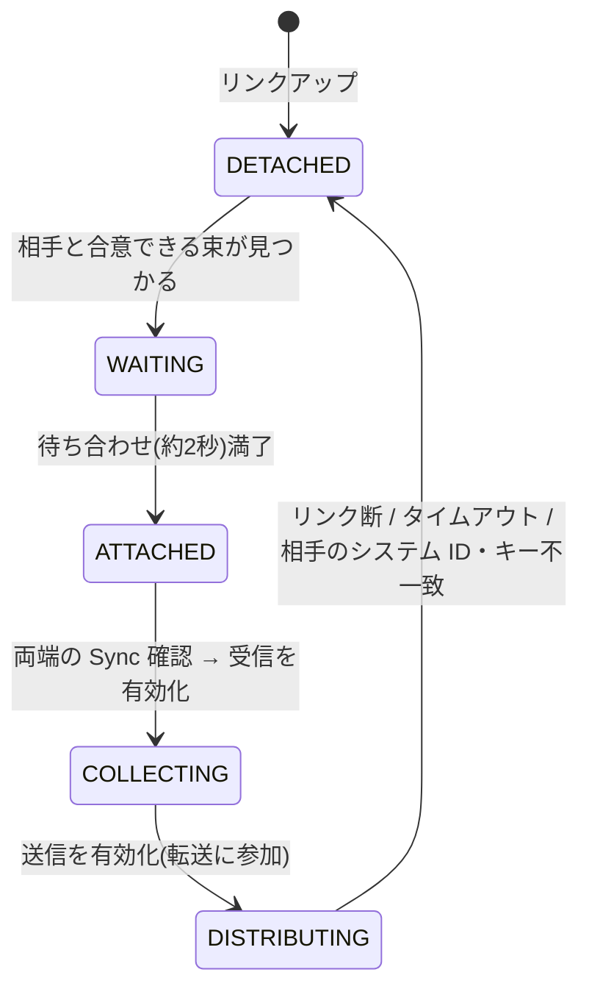

# リンクアグリゲーションと MLAG — ループを「定義から」消す

## 概要

前3章は「ループを塞ぐ」(STP/RSTP/MSTP)、「役を引き継ぐ」(FHRP)という
冗長化を見てきた。本章は第3の道 — 複数の物理リンクを**1本の論理リンク**に
束ねることでループそのものを定義から消す**リンクアグリゲーション**
(**IEEE 802.1AX**、制御プロトコルは **LACP**)と、それを2台のスイッチに
またがらせる **MLAG** を扱い、第6部の締めくくりとして「スパニングツリーに
頼らない冗長化」への道筋を示す。前提知識は
[本部01章](01_stp_basics.md)(STP、フェイルオープンの問題)と
[第1部02章](../01_fundamentals/02_routing_table_basics.md)(ECMP)、
最後の節では[第2部05章](../02_vlan_vxlan_evpn/05_evpn_vxlan.md)
(EVPN マルチホーミング)を参照する。

## 導入 — そもそも何のための技術か

### 「2本」と数えるからループになる

スイッチ A と B の間にケーブルを2本張ると何が起こるか、
[本部01章](01_stp_basics.md)の読者はもう知っている。ブロードキャストが
2本のリンクを渡って増殖し、MAC 学習が
[フラッピング](01_stp_basics.md)で毒され、網が死ぬ。だから STP が
片方をブロッキングし、冗長化のために買った帯域の半分が保険料として眠る。
[前々章](02_rstp_mstp.md)の RSTP がどれだけ速く木を架け替えても、
「木である限り2点間の道は1本」という原理的制約は残った。

ここで問題を一段深く見直してみる。2本のリンクがループを作るのは、
透過的ブリッジングの3動作(学習・転送・フラッディング)が
それを**2本の別々のリンク**として扱うからである。フラッディングは
「受信ポート以外の全ポート」へ複製するから2本目にも流れ、学習は
「同じ MAC が別ポートから見えた」と混乱する。

では、2本のケーブルを学習・転送・フラッディングから見て
**1つのポート**に見せたらどうなるか。フラッディングの複製先として
数えられるのは1回だけ、学習されるポートも1つ、STP が見るグラフの
エッジも1本。**ループは、塞ぐまでもなく存在しなくなる**。物理の冗長性を
論理の単純さで包む — これがリンクアグリゲーション(link aggregation)で
あり、束ねられたリンクの集まりを **LAG**(Link Aggregation Group)と呼ぶ。

```text
   STP の答え                     LAG の答え
                                  
   [A]======[B]                   [A]======[B]
       ↑↑                             ↑
    2本のリンク                   1本の論理リンク
    (1本をブロッキング、          (2本とも転送、
     帯域は半分眠る)               STP からは1ポート)
```

### 束が買ってくれる3つのもの

1. **帯域** — 2本とも転送に使えるから、帯域はおおむね加算される
   (「おおむね」の限定条件が本章の理論の主題の一つである)。
2. **高速な障害切替** — 1本が切れても、残りのメンバーへの振り直しは
   束の**内部**で完結する。STP の再計算も、トポロジ変更の通知も、
   MAC テーブルのフラッシュも起こらない。上位から見ればリンクは
   一度も切れていない。切替はミリ秒オーダーで済む。
3. **STP からの独立** — 冗長性が STP の管轄外(束の内部)に移るため、
   スパニングツリーの設計・収束と絡み合わない。

つまり LAG は、**リンク障害という最も頻度の高い故障モード**を、
最も安い方法(木の再計算なし・プロトコルイベントなし)で吸収する。

### 系譜 — 802.3ad から 802.1AX へ

リンクアグリゲーションの標準は **IEEE 802.3ad**(2000 年)として
Ethernet 側(802.3)で生まれ、2008 年にブリッジング側の
**IEEE 802.1AX** へ移管された(リンクの束ね方は特定の媒体の話ではなく
リンク層の論理の話だ、という整理である)。現行版は
**IEEE 802.1AX-2020**。実装・現場では「LAG」のほか、Cisco の
「EtherChannel / ポートチャネル」、Linux の「ボンディング(bonding)」、
Windows の「チーミング(teaming)」など呼称が乱立しているが、
これらは慣用名であり、仕様上の概念は Link Aggregation Group で
統一されている。本書は「LAG」「リンクアグリゲーション」を標準表記とする。

## 理論

### なぜフロー単位で分配するのか — 順序という制約

2本のリンクに負荷を分けると聞いて最初に思いつくのは、パケットを
1個ずつ交互に載せるラウンドロビンだろう。802.1AX はこれを事実上
禁じている。仕様が分配アルゴリズムに課す要求はただ一つ —
**同一の会話(conversation)に属するフレームの順序を乱さず、
複製もしないこと**である(その条件を満たす限り、分配の方法自体は
実装に委ねられている)。

順序がそれほど重要なのは、上位プロトコルが「同一フロー内の順序は
おおむね保たれる」前提で最適化されているからである。TCP は歯抜けの
到着を重複 ACK として通知し、一定数を超えると損失と誤認して再送・
輻輳制御を発動する。ラウンドロビンで2本のリンクのわずかな遅延差を
踏むだけで、損失ゼロの網で再送が起こり続ける。

そこで実装は、フレームのヘッダ(送信元/宛先 MAC、IP アドレス、
L4 ポート番号など)を**ハッシュして送信メンバーを決める**。同じ
フローのフレームは常に同じハッシュ値 → 同じメンバーリンクを通るから、
順序は物理リンク自身が保証してくれる。これは
[第1部02章](../01_fundamentals/02_routing_table_basics.md)で見た
**ECMP のフロー単位ハッシュとまったく同じ原理**であり、L3 で経路を
分散するときの答えと L2 でリンクを分散するときの答えが同型なのは
偶然ではない — 制約(フロー内順序)が同じだからである。

同じ原理は、同じ限界も連れてくる。

- **1本のフローは1メンバーの帯域を超えられない**。10G × 4 の LAG は
  「40G のパイプ」ではなく「10G のパイプが4本」であり、単一の巨大
  フロー(ストレージのレプリケーションなど)には 10G しか出ない。
- **分散はハッシュの当たり方次第**である。フロー数が少ない、または
  ヘッダの多様性がない(後述のトラブルシューティング症状1)場合、
  特定のメンバーに負荷が偏る。

「束ねれば太くなる」は統計的多数のフローに対してのみ成り立つ —
LAG を帯域設計に使うときの大前提である。

### 静的な束の危うさ — 合意なき束は凶器になる

LAG の設定には2つの流儀がある。**静的 LAG**(両端でそれぞれ
「このポート群は束だ」と宣言するだけ)と、制御プロトコル **LACP**
(Link Aggregation Control Protocol)による**動的 LAG** である。

静的 LAG の何が危ういのかは、束の本質を考えるとわかる。
リンクを束ねるとは、**両端が同じリンク集合について「これは1本だ」と
合意している**状態である。片端だけが束ねている、あるいはケーブルが
意図と違うポートに挿さっていると、この合意が壊れる。

- 自分は「1本の論理リンク」としてフラッディングを1本にしか流さないが、
  相手は2本の独立リンクとして両方で学習・転送する — MAC テーブルの
  不整合、最悪は**ループ**。
- 4本束ねたつもりの1本が実は別のスイッチに挿さっている — ハッシュが
  その1本を選んだフローだけが**別の場所へ配送される/消える**。

しかも LAG は STP に対して「1ポート」を装っているから、STP はこの
誤配線を検出できない — 冗長性を STP の管轄外に移したことが、
そのまま裏目に出る。静的 LAG は「設定と配線が完璧である」ことを
無言で仮定する構成であり、その仮定を破る事故は L2 で最も破壊的な
故障(ループ)に直結する。

### LACP — 束は「明示的な合意」で作る

LACP はこの問題を、本書で繰り返し見てきた作法で解決する —
**暗黙の仮定を、明示的な確認に置き換える**([RSTP](02_rstp_mstp.md)が
タイマーを Proposal/Agreement に置き換え、
[BGP](../03_bgp/01_bgp_basics.md) がピアの自動発見を明示設定に
置き換えたのと同じ縦糸である)。

各物理リンク上で、両端が **LACPDU** というフレームを交換し続ける。
LACPDU には送信者(Actor)の身元 — **システム ID**(システム優先度+
MAC アドレス)、ポート番号、そして「どの束に属したいか」を表す
**キー(key)** — と、そのリンクで**相手(Partner)がどう見えているか**
の写しが載る。束ねる条件は明快である:

1. **全メンバーリンクで、同じシステム ID・同じキーの相手が見えている**
   こと。1本だけ別のスイッチに挿さっていれば、そのリンクだけ相手の
   システム ID が異なるから、束から自動的に除外される(誤配線の検出)。
2. 相手も自分をパートナーとして正しく認識している(LACPDU に載って
   返ってくる自分の情報が正しい)こと — 双方向性の確認。
3. リンクの速度・全二重性が揃っていること。

合意が成立したリンクだけが束に入り、成立しないリンクは**束に入らず
ただの個別リンクとして扱われる**(そして STP がループを防ぐ)。
設定・配線の誤りが「ループ」ではなく「束にならない」という
安全側の症状に変換されるのが、LACP の最大の価値である。

動作モードは **Active**(自分から LACPDU を送る)と **Passive**
(相手から来たら応える)の2つで、少なくとも片端が Active であれば
束は成立する(Passive どうしは永遠に沈黙する — トラブルシューティング
症状2)。

### 心拍と、フェイルクローズという美点

LACPDU は確立後も定期送信され続ける心拍でもある。周期は2択で、

- **slow**: 30 秒ごと、90 秒の途絶でタイムアウト
- **fast**: 1 秒ごと、3 秒の途絶でタイムアウト

いずれも「keepalive の3倍をタイムアウトに」という、
[BGP](../03_bgp/01_bgp_basics.md)(Hold = KEEPALIVE × 3)、
[RSTP](02_rstp_mstp.md)(3 × Hello)、[VRRP](03_fhrp_vrrp.md)
(3 × 広告間隔 + Skew)で見てきたのと同じ作法である。

ここで、[本部01章の症状3](01_stp_basics.md)(片方向リンク)を
思い出してほしい。STP では「BPDU が来ない」ことは「そこにブリッジは
いない」と解釈され、ポートは**開く**方向に倒れた — ループに至る
フェイルオープンであった。LACP は逆である。**LACPDU が来ない
リンクは束から外れる**(転送に使われない)。障害・誤配線・片方向
リンクのすべてが「そのリンクを使わない」という安全側に倒れる —
**フェイルクローズ**の設計である。「正常の証明が続く間だけ転送に使う」
という規律が、束という強力な(それゆえ誤ると危険な)機構を
安全にしている。

なお、物理的なリンク断(信号喪失)は LACP のタイムアウトを待つ
までもなく即時に検出され、そのメンバーは瞬時に分配から外れる。
LACP タイムアウトが効くのは「リンクは光っているのに相手が
死んでいる」ケース — メディアコンバータや光スイッチを挟んだ構成、
相手 OS のフリーズなど — であり、fast(3 秒)を選ぶ理由の多くは
この検出を縮めることにある。

### LAG の限界 — 束は2台の間にしか張れない

LAG は L2 冗長化の答えとして美しいが、802.1AX の LAG は**厳密に
1対1**である — 束の両端はそれぞれ1つのシステム(1つのシステム ID)で
なければならない。スイッチ A–B 間のリンクは何本でも束ねられるが、
「スイッチ B が死んだら」には何の答えもない。**リンクの冗長化は
できたが、装置は依然として単一障害点**である。

サーバをスイッチ2台に1本ずつ接続すれば装置冗長にはなるが、
LAG は組めない(相手が2システムだから)。すると2本は独立リンクに
戻り、L2 なら STP がどちらかを塞ぎ、サーバ側では Active/Standby の
ボンディングになる — 帯域は再び半分眠る。

リンクの冗長化(LAG)と装置の冗長化(2台)を**同時に**成立させたい。
これが次の主題である。

### MLAG — 2台で1つのシステム ID を演じる

答えの構図は、[前章](03_fhrp_vrrp.md)の FHRP と驚くほど似ている。
FHRP は「ホストに手を入れず、複数のルータが1つの仮想ルータを演じる」
ものだった。**MLAG**(Multi-Chassis Link Aggregation)は
「**サーバ(や対向スイッチ)に手を入れず、2台のスイッチが LACP 上で
1つのシステムを演じる**」ものである。

```text
                 [SW1]==========[SW2]
                   |  ピアリンク   |
                   |  (+同期)     |
              eth0 |               | eth1
                   +-----[サーバ]--+
                     bond0(通常の LACP)

  サーバの視点: 「システム ID X のスイッチと 2 本の LAG を組んでいる」
  実際:         SW1 と SW2 が同じシステム ID X を名乗っている
```

2台のスイッチは専用の**ピアリンク**(peer link)で結ばれ、お互いの
状態を同期しながら、MLAG 対象のポートでは**共通のシステム ID** で
LACPDU を送る。サーバ側は標準の LACP がそのまま動くだけで、
2台に接続していることを知る必要がない — FHRP が仮想 MAC で
ホストの ARP キャッシュを騙したのと同じ「名前の仮想化」が、
ここではシステム ID に対して行われている。

これで、平常時は2本とも転送(Active/Active、帯域は加算)、
リンク障害は LAG の仕組みで即時切替、**スイッチ1台の丸ごと障害も
「メンバーリンク断」としてサーバの LACP が瞬時に処理する**。
STP はこの構成のどこにも登場しない — サーバ収容の冗長化から
ブロッキングポートが消える。

ただし正直に言わなければならないことが2つある。

第一に、**MLAG は標準ではない**。『MLAG』という呼び名も含めて
IEEE/IETF の仕様には存在せず(慣用名ルールに従い明記しておく)、
Cisco vPC、Arista MLAG、Juniper MC-LAG など各ベンダーが独自に
実装している。同期チャネルの部分的な標準化(ICCP、**RFC 7275**)や、
802.1AX-2014 が試みた標準化(DRNI: Distributed Resilient Network
Interconnect)はあるが、DRNI の実装は普及しなかった。**異なる
ベンダー(しばしば同一ベンダーの異なる機種)の間で MLAG ペアは
組めない**と考えてよい。

第二に、**2台のスイッチは互いの状態を同期し続けなければならない**。
サーバの MAC を SW1 が学習したら SW2 も知らなければならないし
(戻りのフレームが SW2 側に着くかもしれない)、どのポートが
MLAG のメンバーかの合意、ARP テーブル、IGMP スヌーピングの状態…。
FHRP が「IP 転送は無状態だから名前の引き継ぎだけで済む」
軽さを誇ったのに対し([前章](03_fhrp_vrrp.md))、L2 スイッチング
は**学習という状態そのもの**の上に成り立っているから、MLAG は
本質的に重い。ベンダー独自になるのも、この同期プロトコルの
複雑さが標準化の網をすり抜け続けたからである。

### MLAG の転送規則 — スプリットホライズンの再演

2台が1台を演じるとき、フレームをどう運ぶかには規律が要る。
基本は2つである。

1. **ローカル優先** — SW1 に入ったフレームの宛先が MLAG ポートなら、
   SW1 自身のメンバーリンクから出す。ピアリンクを渡って SW2 の
   メンバーから出すのは、自分のメンバーが全滅しているときだけ。
   ピアリンクを平常時のデータパスにしない(帯域設計上も重要)。
2. **ピアリンク越しのフレームは、MLAG メンバーへ出さない** —
   SW2 がピアリンクから受け取ったフレーム(= SW1 に入った
   フラッディングなど)を、SW2 側の MLAG メンバーポートへ転送する
   ことは禁止される(自分のメンバーが全滅している MLAG を救う場合を
   除く)。サーバは SW1 側のリンクで既に同じフレームを受けている
   からであり、これを破ると**複製**(サーバに同じフレームが2枚届く)
   や、対向も MLAG の場合の**ループ**になる。

規則2は「ある方向から学んだ/受けたものを、その方向へ返さない」
という形をしており、これは本書で3度目の**スプリットホライズン**である
— [ディスタンスベクタ](../01_fundamentals/04_distance_vector_link_state.md)の
広告規則、[iBGP](../03_bgp/02_ibgp_ebgp.md) の再広告禁止に続いて、
MLAG はフレーム転送の水平線でループを断つ。

### スプリットブレイン — ペアの宿命

2台が状態を共有して1つを演じる以上、**ピアリンクの断**は MLAG の
急所である。同期が止まった2台は、それぞれ「相方が死んだ」と
判断しうるが、実際には**両方生きていて、両方が同じシステム ID で
LACPDU を送り続けている** — サーバは何も気づかず両方へフレームを
撒き続けるのに、スイッチ間の学習の同期は止まっている。
[前章の症状1](03_fhrp_vrrp.md)(VRRP の2台マスタ)と同型の
**スプリットブレイン**であり、状態を持つ分だけ VRRP より質が悪い。

このため実装は必ず、ピアリンクとは**別経路のキープアライブ**
(管理ネットワーク経由など)を持つ。ピアリンクが切れても
キープアライブが通れば「相方は生きている(切れたのはリンクだけ)」と
判定でき、あらかじめ決めた**セカンダリ側が自分の MLAG メンバー
ポートを落とす** — 片肺にはなるが、一貫性は保たれる。
「どちらが降りるか」を事前に合意しておくのは、
[VRRP の Skew_Time](03_fhrp_vrrp.md) と同じ「衝突したときの序列を
仕様に折り込む」発想である。

### 役の数え方 — FHRP から MLAG、そして「全員」へ

第6部の3つの答えを、「役を何人で演じるか」で並べ直すと
本部の全体像が見える。

| | 冗長化の対象 | 役を演じる者 | 切替の仕組み |
|---|---|---|---|
| STP/RSTP | L2 トポロジ | —(リンクを塞ぐ) | 木の再計算(P/A の握手) |
| FHRP | ゲートウェイ(L3 の役) | 常に1台(選出) | 心拍途絶 → 次点が昇格 |
| MLAG | スイッチ(L2 の役) | 2台が同時に | LAG の内部で即時 |
| エニーキャストGW + EVPN | ゲートウェイ+L2 | **全員が同時に** | 切替という概念がない |

MLAG は「役は常に1人」という FHRP の前提を L2 側で外した最初の
形だが、ペア(2台限定)・ベンダー独自・重い同期という制約を抱える。
これを**標準の道具で、台数の制限なく**やり直したのが、
[第2部05章](../02_vlan_vxlan_evpn/05_evpn_vxlan.md)で概観した
**EVPN マルチホーミング**である — 同じリンク束を **ESI** で識別して
RT-4 で冗長グループを自動発見し、DF 選出・エイリアシング・
マスウィズドローを **MP-BGP という既製のコントロールプレーン**に
載せる(サーバへ共通のシステム ID で LACP を張る点は MLAG と同じで、
「ESI-LAG」とも呼ばれる)。専用のピアリンクも独自同期プロトコルも
不要で、2台という制限もない。MLAG が独自実装で先行して埋めた穴を、
EVPN が標準で塗り直した — [VXLAN のコントロールプレーン](../02_vlan_vxlan_evpn/04_vxlan_control_plane.md)が
静的設定から BGP へ進んだのと同じ物語である。

### 「スパニングツリーに頼らない設計」の全体像

第6部の冒頭([01章](01_stp_basics.md))で予告した「解決の2つ目の
方向 — そもそもループが問題にならない構造にする」が、これで
出揃った。現代のネットワークは、およそ次の組み合わせで
ブロッキングポートを設計から消している。

- **2点間の冗長リンクは LAG に束ねる** — ループは定義から消え、
  帯域は(フロー単位で)加算される。
- **装置ペアへの接続は MLAG / ESI-LAG にする** — サーバ・対向
  スイッチの収容から Active/Standby をなくす。
- **3台以上のスイッチ間の冗長は L2 で組まず、L3(ECMP)に
  持ち上げる** — [リーフ・スパイン](../02_vlan_vxlan_evpn/05_evpn_vxlan.md)+
  [VXLAN/EVPN](../02_vlan_vxlan_evpn/03_vxlan_fundamentals.md) が
  その完成形で、L2 の連続性はオーバーレイが提供し、物理網の
  マルチパスは ECMP が使い切る。

では STP は用済みかというと、そうではない。この設計における STP は
**平常時は仕事のない保険**として動かし続ける — 誤配線・アンマネージド
スイッチの混入・MLAG の不具合など、「起こらないはずのループ」が
起こったときの最後の防波堤である(エッジポートには BPDU ガードを、
という [02章](02_rstp_mstp.md)の運用と対になる)。主役から降ろし、
保険に格下げする — それが STP の現代的な居場所である。

## プロトコル動作の詳細

### LACPDU のフォーマット

LACPDU は、IEEE が低頻度の制御プロトコル用に予約した
**Slow Protocols** の枠組み(EtherType **0x8809**)で運ばれる。
宛先は予約グループアドレス **01:80:C2:00:00:02** — BPDU の
01:80:C2:00:00:00 と同じく、**ブリッジが転送しないアドレス**であり、
LACPDU は必ずそのリンクの対向で消費される(束の合意は隣接間の
ものだから、これで正しい)。フレームは固定長で、TLV 構造を持つ。

```text
+----------------------------+
| 宛先 MAC 01:80:C2:00:00:02 |
| EtherType 0x8809           |
| Subtype = 0x01 (LACP)      |
| Version = 0x01             |
+----------------------------+
| Actor Information TLV      |  自分の申告:
|  (Type 1, Length 20)       |   System Priority (2) + System MAC (6)
|                            |   Key (2)
|                            |   Port Priority (2) + Port Number (2)
|                            |   State (1) + 予約 (3)
+----------------------------+
| Partner Information TLV    |  「相手はこう見えている」の写し
|  (Type 2, Length 20)       |   (フィールド構成は Actor と同じ)
+----------------------------+
| Collector Information TLV  |  受信側の最大遅延
|  (Type 3, Length 16)       |
+----------------------------+
| Terminator (Type 0) + 予約 |  (LACPDU 全体で 110 オクテット固定)
+----------------------------+
```

要点は Partner Information TLV である。自分が送る LACPDU に
「あなたはこう見えている」を載せ、相手も同じことをする —
**受け取った LACPDU の Partner 欄に自分の正しい姿が写っていれば、
双方向の合意が成立している**ことがフレーム2枚で確認できる。

### State ビット — 8ビットで束の健康状態を語る

Actor/Partner の State フィールド(1 オクテット)は、LACP の
状態機械の出力がそのまま並んだ、読解価値の高い8ビットである。

| ビット | 名前 | 意味 |
|---|---|---|
| 0 | LACP_Activity | 1 = Active モード(自分から送る) |
| 1 | LACP_Timeout | 1 = short timeout(fast、相手に1秒間隔を要求) |
| 2 | Aggregation | 1 = 束ねられる(0 = 個別リンクとしてのみ動作) |
| 3 | Synchronization | 1 = このリンクは正しい束に所属済み |
| 4 | Collecting | 1 = このリンクでの**受信**を有効化した |
| 5 | Distributing | 1 = このリンクでの**送信**を有効化した |
| 6 | Defaulted | 1 = 相手の情報を受信できず、既定値で動作中 |
| 7 | Expired | 1 = 相手の情報が期限切れ(途絶の過渡状態) |

転送への参加は Synchronization → Collecting → Distributing の順に
進む。**受信(Collecting)を先に開けてから送信(Distributing)を
開ける**規律に注意してほしい — 両端がこの順序を守れば、「自分は
送ったのに相手はまだそのリンクで受ける気がない」という取りこぼしが
構造的に起こらない。逆にビット 6/7 は診断の言葉である:
**Defaulted が立ったままなら「相手から LACPDU が一度も来ていない」**
(静的 LAG やただのスイッチが対向にいる)、Expired は「来ていたのに
途絶えた」(タイムアウト進行中)を意味する
(トラブルシューティング症状2で使う)。

### 束への参加 — 状態機械の要点

各物理ポートは、おおよそ次の段階を進む(802.1AX の MUX ステート
マシンの要旨)。



WAITING の約2秒の待ち合わせは、複数のメンバーリンクがほぼ同時に
アップしたとき(装置の起動直後など)に、1本ずつ束に追加しては
ハッシュの再割り当てを繰り返すのを避け、まとめて束に入れるための
猶予である。

もう一つ、束のメンバー構成が変わるとき(リンク追加・削除)には、
移動するフローの順序保証が問題になる — 古いリンクにまだ滞留している
フレームより先に、新しいリンクへ載せた後続フレームが届くかも
しれない。802.1AX はこのために **Marker プロトコル**(Slow Protocols
のサブタイプ 0x02)を定義している。旧リンクへ「栞(マーカー)」を
流し、相手がそれを送り返してきたら「栞より前のフレームはすべて
届いた」ことが確定するので、それからフローを新リンクへ移す。
実装は単純に「少し待つ」ことで代用することも多いが、
「順序保証は分配側の責務」という仕様の思想がよく表れた機構である。

### 障害切替のウォークスルー

10G × 2 の LACP(fast)で、メンバー eth0 が障害を起こす2つの
ケースを追う。

**ケース1: 物理断(光断・ケーブル抜け)**

1. t=0: eth0 のキャリア喪失。ドライバが即時(ミリ秒)に検出。
2. eth0 は即座に束から外れ、ハッシュ表が再構成される。eth0 に
   割り当てられていたフローは以後 eth1 へ送られる。
3. 対向も同様に自分側の物理断を検出して同じことをする。
4. **STP・MAC テーブル・上位プロトコルには何のイベントも起こらない**。
   失われるのは切替の瞬間に eth0 上を飛行中だったフレームだけで、
   TCP の再送が黙って吸収する。

**ケース2: リンクは光っているが相手が死んでいる(片方向・中継装置)**

1. t=0: 対向の故障。しかしこちらの eth0 のキャリアは(メディア
   コンバータ等が維持していて)落ちない。
2. LACPDU が途絶える。fast なら **3 秒**(3 × 1 秒)で Current →
   Expired → Defaulted と進み、eth0 は束から外れる。
3. その3秒間、ハッシュが eth0 を選んだフローは損失し続ける。
   slow(90 秒)ならこの穴が 90 秒続く — fast を選ぶ理由、そして
   LAG でも [BFD](../01_fundamentals/03_static_vs_dynamic.md) 級の
   検出(サブ秒)は得られないという限界の両方がここにある。

30〜50 秒(STP)→ 秒オーダー(RSTP)と比べれば、ケース1の
「事実上ゼロ」は別次元である。**障害を「プロトコルの収束」ではなく
「束の内部の振り直し」に格下げした**ことが LAG の切替の速さの正体で
ある。

### MLAG の動作 — 同期と、シャーシ丸ごとの喪失

MLAG での LACP は、SW1・SW2 が**共通のシステム ID**(MLAG ドメインで
合意した仮想の MAC/優先度)を Actor 欄に載せる、という一点を除けば
標準そのものである。サーバの bond0 からは、2本のリンクの対向に
同じシステム ID・同じキーが見えるから、通常の規則どおり束が成立する。

内部では、ピアリンク上の同期プロトコル(ベンダー独自。Juniper 系は
ICCP、RFC 7275)が最低限次を運び続ける。

- **MAC 学習の同期** — SW1 が MLAG ポートで学習した MAC は SW2 にも
  「同じ MLAG ポートで学習したもの」として教える(SW2 に着いた
  戻りフレームが、ピアリンク経由ではなく自分のメンバーから直接
  出せるように)。
- **メンバー状態の合意** — どの MLAG のどちらのメンバーが生きて
  いるか。片系のメンバーが全滅した MLAG についてだけ、
  ピアリンク越しの救済転送(転送規則2の例外)が許可される。
- **設定の整合性検査** — VLAN・MTU 等の不一致の検出。

シャーシ丸ごとの喪失はこう流れる:

1. SW2 が電源断。サーバの eth1 はキャリア喪失を即時検出し、
   bond0 は eth0 だけで運転を続ける(ケース1と同じ、事実上無停止)。
2. SW1 はピアリンク断+キープアライブ途絶で「相方は本当に死んだ」と
   判定し、単独で MLAG を維持する(スプリットブレイン時とは逆に、
   メンバーポートは落とさない)。
3. 上流側も同様 — SW1/SW2 が上流へも MLAG で接続されていれば、
   上流から見てもメンバー断にすぎない。

FHRP なら3秒強(既定)を要した「装置の死」が、キャリア喪失と同じ
速度で処理される。**装置障害をリンク障害に翻訳する** — これが
MLAG の切替の速さの正体である。

## 設定例 — Linux bonding で LACP を観察する

Linux でのリンクアグリゲーションは **bonding** ドライバ
(`mode 802.3ad` が LACP)が定番である(表示・既定値はカーネルの
バージョンにより微差がありうる)。スイッチ側で LACP を構成した
2ポートに eth0/eth1 が接続されているとする。

```bash
ip link add bond0 type bond mode 802.3ad miimon 100 \
    lacp_rate fast xmit_hash_policy layer3+4
ip link set eth0 down; ip link set eth0 master bond0
ip link set eth1 down; ip link set eth1 master bond0
ip link set bond0 up
```

- `lacp_rate fast` — 相手に1秒間隔を要求(State ビット1)。既定は slow。
- `xmit_hash_policy layer3+4` — 分配ハッシュに IP+L4 ポートを使う。
  **既定は layer2(MAC のみ)**であり、これがトラブルシューティング
  症状1の伏線になる。

状態は `/proc/net/bonding/bond0` にすべて出る(抜粋)。

```text
802.3ad info
LACP active: on
LACP rate: fast
Aggregator selection policy (ad_select): stable
System MAC address: 52:54:00:aa:00:01

Slave Interface: eth0
MII Status: up
details actor lacp pdu:
    system: 52:54:00:aa:00:01
    port key: 15
    port state: 63
details partner lacp pdu:
    system: 2c:dd:e9:11:22:33
    oper key: 5
    port state: 63
```

読みどころは **port state 63** である。63 = 0b00111111、つまり
ビット 0〜5(Activity, Timeout, Aggregation, Synchronization,
Collecting, Distributing)がすべて 1 — 「Active・fast・束ねられ・
所属確定・送受信とも転送参加中」の健康な状態を1つの数字が語っている。
値にビット 6(Defaulted、+64)が含まれていたら、相手から LACPDU が
届いていない。
2枚の NIC で **partner の system が一致していること**も必ず見る —
ここが食い違っていたら誤配線である(症状2)。

LACPDU 自体も tcpdump でそのまま読める。

```bash
tcpdump -i eth0 -e ether proto 0x8809
# 52:54:00:aa:00:01 > 01:80:c2:00:00:02, ethertype Slow Protocols (0x8809),
#   LACPv1, length 110
#     Actor ... system 52:54:00:aa:00:01, key 15, port 1,
#       state 63 <Activity,Timeout,Aggregation,Synchronization,Collecting,Distributing>
#     Partner ... system 2c:dd:e9:11:22:33, key 5, port 261, state 63 <...>
```

本章の理屈が1行に並ぶ — 予約グループアドレス宛て、Slow Protocols、
110 オクテット、Actor/Partner の対、State ビットの内訳。ここで
スイッチ側のポートを LACP から静的 LAG に変えてみると、LACPDU が
途絶えて Expired → Defaulted と進み、port state から
Synchronization/Collecting/Distributing が落ちていく様子が観察できる。

## トラブルシューティング

### 症状1: 束ねたのに速くならない/1本だけ混んでいる

4 × 10G の LAG なのにスループットが 10G で頭打ちになる、あるいは
メンバーごとのカウンタ(`ip -s link` や スイッチの
インタフェース統計)を見ると1本に負荷が集中している。原因は
ほぼ常に**ハッシュ分散の原理**そのものである。

- **単一の巨大フロー**は、原理的に1メンバーの帯域を超えられない
  (フロー内順序の保証と引き換えの制約)。これは故障ではない。
- **ハッシュ入力の多様性がない**。典型は Linux bonding の既定
  `xmit_hash_policy layer2`(MAC のみ)で**ルータ越しのトラフィック**を
  運ぶケース — 宛先 MAC が常にルータの MAC になるため
  ([第1部01章](../01_fundamentals/01_l2_l3_recap.md)の「L2 は毎ホップ
  書き換え」の帰結)、ハッシュがほとんど散らない。スイッチ間
  トランクでルーティング済みトラフィックを運ぶ場合は、両端の
  MAC が固定ペアになり**全フレームが同じメンバー**に載る。
  ハッシュ方式を layer3+4 系に変えるのが対処。
- 経路の各段(LAG、ECMP)が**同じハッシュ関数**を使い、特定の
  組み合わせだけが選ばれ続ける偏極(polarization)も、規模が
  大きくなると現れる。

切り分けはメンバーごとのカウンタを見るだけでよい。「束の合計」
ではなく**分布**を監視項目にすること — LAG の帯域は統計の産物で
あり、統計は監視しなければ裏切る。

### 症状2: 束が上がらない/一部のメンバーだけ外れている

bond0 がスレーブを転送に参加させない、またはスイッチ側で
ポートチャネルが suspended になる。LACP は誤りを「束にならない」に
変換する設計だから、これは**検出が働いている**姿である。読む場所は
決まっている — State ビットと Partner 欄。

- **Defaulted が立ったまま** — 相手から LACPDU が来ていない。
  対向が静的 LAG(LACP を話さない)、LACP 無効、あるいは
  Passive どうし(両方が相手の第一声を待って永遠に沈黙)の
  組み合わせ。少なくとも片側を Active にする。
- **Partner のシステム ID がメンバー間で不一致** — 誤配線。
  1本だけ別のスイッチ(または MLAG を構成していない別ユニット)に
  挿さっている。LACP はそのリンクだけを束から外して守ってくれて
  いるが、配線を直すまで冗長性は失われている。
- **速度・デュプレックスの混在** — 10G と 1G は同じ束に入れない
  (入れてしまうとハッシュが「太さの違うパイプ」に等分に割り
  振ってしまうため、仕様が禁じている)。
- 対向が**静的 LAG、こちらが LACP** の場合、こちらは Defaulted で
  束を作らない一方、**相手は合意なしに束ねて転送してくる**。
  理論の節で見たとおり、静的 LAG 側の設定・配線ミスは検出機構が
  ないままループ・誤配送に直結するので、静的 LAG は「両端とも
  LACP が話せない」場合の最後の手段にとどめるのが定石である。

### 症状3: MLAG ペアの片方を見失った後、網全体がおかしい(スプリットブレイン)

MLAG 構成で、サーバへの疎通が「概ね通じるが宛先によって
落ちる/重複する」という中途半端な壊れ方をする。両スイッチの
MLAG 状態を見ると、**両方ともプライマリを名乗っている** —
ピアリンク断によるスプリットブレインである。

2台は同じシステム ID で LACPDU を出し続けるから、サーバの LACP は
異常を検出できず、両方のリンクへフローを撒き続ける。しかし MAC
学習の同期は止まっているので、SW1 だけが知る MAC 宛てのフレームが
SW2 に着けばフラッディングになり、上流側では
[MAC フラッピング](01_stp_basics.md)や重複配送が観測される。

確認と対処の順序は: (1) ピアリンクの物理状態、(2) キープアライブが
生きているか(生きていれば「リンク断・相方生存」と判定され、
セカンダリが自動でメンバーポートを落として片肺運転に収束するはず —
それが働いていないなら、キープアライブを**ピアリンクと同じ経路**に
載せてしまっている設計ミスを疑う。別経路であることに意味がある)、
(3) 復旧はピアリンク → 同期完了 → メンバー復帰の順。
FHRP のスプリットブレイン([前章症状1](03_fhrp_vrrp.md))との違い —
届かないのが「広告」ではなく「状態の同期」であること、したがって
壊れ方が確率的で気づきにくいこと — を押さえておくと、症状から
逆算しやすい。

### 症状4: MLAG の片系を再起動したら、復帰の瞬間に断が出た

計画作業でセカンダリを再起動。落ちるときは無停止だったのに、
**戻ってきた瞬間**に数秒〜数十秒の断が出る。これは MLAG 固有の
起動順序の問題である。

再起動した側のメンバーポートがリンクアップし LACP が束に戻ると、
サーバのハッシュは即座にそのリンクへフローを割り振り始める。しかし
その時点でスイッチの中身 — ピアリンク越しの MAC/ARP 同期、
アップリンク(上流への経路)の復旧 — がまだ終わっていなければ、
着いたフレームは行き場がない。**LACP の合意は「L2 の束としての
準備」の合意であって、「転送の準備ができた」ことの証明ではない**。

このため各実装は、起動後しばらく MLAG メンバーポートを意図的に
落としておく遅延復帰(delay-restore 系の名前を持つことが多い)を
備えている。既定値が自環境の同期・収束時間(EVPN や IGP の収束を
待つ必要があれば、その分)に足りているかは設計時に確認する項目で
ある。切り分けとしては、断の時間帯に「LACP は Distributing なのに
上流へ出ていけない」ログ・カウンタが残っていれば、この症状で確定する。

## 演習・確認問題

**問1.** リンクアグリゲーションが「STP でブロッキングする」方式と
異なり、2本のリンクを両方とも転送に使えてしまうのはなぜか。
透過的ブリッジングの3動作(学習・転送・フラッディング)から見て、
束ねられたリンクがどう扱われるかで説明せよ。

**問2.** 10G × 4 の LAG に対し、(a) 1本の 25G 級の巨大フロー、
(b) 数千本の小さなフロー、のそれぞれで期待できるスループットと
その理由を述べよ。また、802.1AX が分配アルゴリズムに課している
唯一の要求は何か。

**問3.** 「BPDU が届かないとき」と「LACPDU が届かないとき」で、
STP と LACP のポートの扱いは逆方向に倒れる。それぞれどちらに倒れ、
なぜ LACP の方向が安全と言えるのかを説明せよ。

**問4.** MLAG において、ピアリンク経由で受け取ったフレームを
MLAG メンバーポートへ転送しない規則があるのはなぜか。また、
この規則に例外が認められるのはどのような場合か。

**問5.** MLAG と EVPN マルチホーミング(ESI-LAG)は、どちらも
「2台(以上)のスイッチが共通のシステム ID で LACP を張る」点では
同じである。両者の違いを、(a) 標準化、(b) 台数の制約、
(c) 状態同期の仕組み、の3点から述べよ。

---

**解答**

**問1.** 束ねられた物理リンク群は、MAC 学習・転送・フラッディングの
すべてから単一の論理ポートとして扱われるからである。フラッディングの
複製先として束は1回しか数えられないため複製がもう1本を渡って
戻ることがなく、学習も束(論理ポート)単位で行われるため
フラッピングしない。ループは「2本の別々のリンク」として扱われる
ことで生じていたのだから、1本と数えた時点で塞ぐべきループが
存在しなくなる。STP から見てもエッジは1本であり、ブロッキングの
対象にならない。

**問2.** (a) 約 10G。分配はフロー単位であり、1本のフローは常に同じ
メンバーリンクに載るため、単一フローは1メンバーの帯域を超えられない。
(b) 合計で 40G に近づく。多数のフローがあればハッシュが統計的に
4本へ分散するため。802.1AX が分配に課す要求は「同一会話内の
フレームの順序を乱さず、複製しないこと」だけであり、フロー単位の
ハッシュ分配はこの要求を物理リンクの順序保証に委ねる形で満たす
実装慣行である。

**問3.** STP では BPDU の不在は「対向にブリッジがいない」と解釈され、
ポートは指定ポートとして**転送側に**倒れる(フェイルオープン)。
片方向リンク等で BPDU だけが失われると、塞がれているべきポートが
開いてループに至る。LACP では LACPDU の不在(タイムアウト、
Defaulted)はそのリンクを**束から外す=転送に使わない**方向に倒れる
(フェイルクローズ)。障害・誤配線・片方向のいずれでも結果が
「使わない」に収束するため、最悪の結果が「帯域の減少」であり、
ループという破滅的な故障モードに至らない点で安全である。

**問4.** ピアリンクを渡ってきたフレームは、相方のスイッチに入った
時点で、相方自身のメンバーリンクから同じ MLAG(サーバ)へ既に
配送されている(ローカル優先)からである。自分のメンバーからも
出すと、サーバは同じフレームを2枚受け取り(重複)、対向も MLAG の
場合は 2 台のスイッチを周回するループになる。例外は、その MLAG の
相方側メンバーが全滅している場合 — このときだけ、ピアリンク越しの
フレームを自分のメンバーから出して救済する(相方から直接届ける
経路が存在しないため、重複は起こらない)。

**問5.** (a) MLAG はベンダー独自実装であり(『MLAG』という総称も
仕様に存在しない)、同期チャネルの ICCP(RFC 7275)や 802.1AX-2014 の
DRNI など部分的・不発の標準化があるのみ。ESI-LAG は RFC 7432
(EVPN)に基づく標準である。(b) MLAG は原則2台のペアに限られるが、
EVPN マルチホーミングは同じ ESI を広告する VTEP の数に原理的な
制限がない。(c) MLAG は専用ピアリンク上の独自プロトコルで MAC・
メンバー状態を同期するのに対し、ESI-LAG は MP-BGP の経路広告
(RT-1/RT-4 による冗長グループの自動発見と DF 選出、RT-2 による
MAC の配布)という既製の標準コントロールプレーンに同期を載せる。
専用ピアリンクも独自同期も不要になる。

## まとめ

- リンクアグリゲーション(**IEEE 802.1AX**)は複数の物理リンクを
  1本の論理リンクに束ね、ループを「塞ぐ」のではなく**定義から消す**。
  分配はフロー単位のハッシュ(ECMP と同原理)であり、単一フローは
  1メンバーの帯域を超えられない — 束の帯域は統計の産物である。
- **LACP** は束を「明示的な合意」で作る。System ID とキーの一致、
  Partner 欄による双方向確認、3 × 間隔のタイムアウト(fast 1s/3s、
  slow 30s/90s)。LACPDU の不在は「束から外す」= **フェイルクローズ**に
  倒れ、静的 LAG に潜む誤配線→ループの危険を「束にならない」という
  安全な症状に変換する。
- **MLAG** は2台のスイッチが共通のシステム ID を演じ、リンク冗長と
  装置冗長を両立させる(装置障害をリンク障害に翻訳する)。代償は
  ベンダー独自の状態同期とピアリンクであり、その急所が
  スプリットブレイン(別経路キープアライブ+セカンダリ抑止で守る)。
  ピアリンク越しフレームをメンバーへ出さない規則は、本書3度目の
  スプリットホライズンである。
- MLAG を標準の道具でやり直したのが
  [EVPN マルチホーミング(ESI-LAG)](../02_vlan_vxlan_evpn/05_evpn_vxlan.md)で
  あり、LAG/MLAG + L3(ECMP)+ オーバーレイという組み合わせが
  「スパニングツリーに頼らない設計」の現在形である。STP は主役から
  降り、想定外のループに備える保険として動き続ける。
- 第6部を通した縦糸 — 塞ぐ(STP)、速く直す(RSTP)、役を引き継ぐ
  (FHRP)、役を増やす(MLAG)、選出をなくす(エニーキャスト GW・
  ESI)— は、冗長化の進化が「障害時に何かをする」から「障害が
  イベントにならない構造を作る」へ向かう一本道である。
