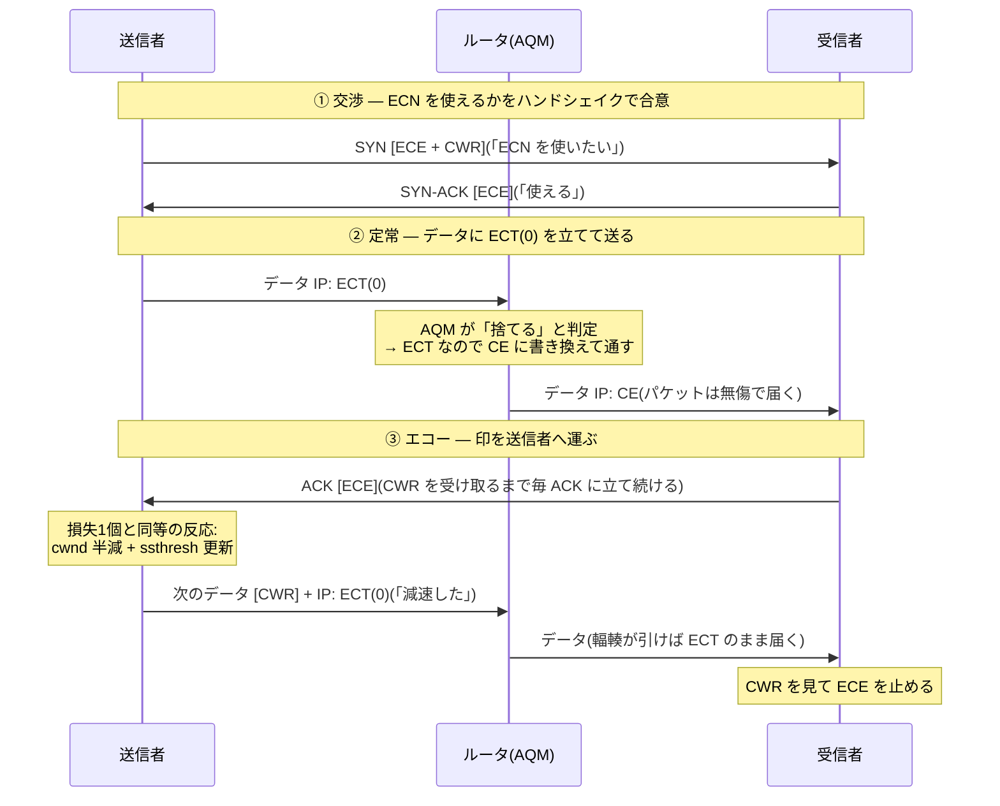

# シェーピングとポリシング — レートの契約と2つの執行

## 概要

この章では、QoS パイプラインに残った2つの部品 — ③ポリシングと⑥シェーピング — を
扱う。レートという概念を機械にできる形で定義するトークンバケット、契約超過を
白黒でなく階級に写す三色マーカー(RFC 2697/2698)、そして「捨てずに輻輳を伝える」
ECN(RFC 3168)までを見る。前提は[第7部の01章](01_qos_basics.md)(輻輳・
パイプライン)、[02章](02_classification_marking.md)(DSCP/AF の廃棄優先度)、
[03章](03_queuing_scheduling.md)(スケジューラ・AQM)である。本章で第7部は完結する。

## 導入 — そもそも何のための機構か

### スケジューラが答えられない問い

[03章](03_queuing_scheduling.md)のスケジューラは、突き詰めれば**比率**を配る
道具だった。DRR の quantum は比、PQ は「無限大の比」であり、しかも
work-conserving — 空いていれば誰でも 100% 使ってよい。ところが実務には、
比率では答えられない「**絶対量**」の問いが3つ残っている。

1. **特等席の定員**。[03章](03_queuing_scheduling.md)は「厳密優先は必ず
   ポリシングとセットで」と繰り返したが、その定員 — 「EF は合計 2Mbps まで」—
   は比率ではない。リンクが空いていようと、2Mbps を超えた EF は入れては
   ならない(超えた瞬間に PQ は飢餓の凶器になる)。
2. **契約**。物理 1Gbps のリンクで「200Mbps 分」を売る、というサブレート契約は
   ごく普通である。このとき 200Mbps という数字は物理のどこにも存在しない —
   ワイヤは 1Gbps でしか送れない。**輻輳点は物理だけでなく契約からも生まれる**
   のであり、契約を数字として執行する機構が要る。
3. **輻輳点の引き取り**。[03章の症状3](03_queuing_scheduling.md)で予告した —
   本当の輻輳点が自分の管理外(ISP のモデム内の深い FIFO)にあるとき、
   その手前の自分の機器に「回線速度の少し下」という上限を**自分に課して**
   ボトルネックを自機へ移す。これも絶対量の上限である。

3つに共通するのは「あるトラフィックの流量を、**リンク速度とは独立に定義された
値**以下に保つ」という操作である。ところが、この「流量」という言葉は
見かけより難しい。

### 「10Mbps のフロー」はワイヤ上に存在しない

1Gbps のリンクを流れる「10Mbps のフロー」をオシロスコープで観察しても、
10Mbps で流れるビットはどこにもない。ワイヤ上のビットは**常にリンク速度
(1Gbps)で**流れており、あるのは 1Gbps のバーストと沈黙の交互だけである。
「10Mbps」とは、**ある時間窓で平均した値**でしかない。

そして窓の選び方は恣意的である。1500 バイトのパケットを 1.2ms ごとに送る
フローは、1秒窓では 10Mbps だが、パケット1個分(12µs)の窓では 1Gbps である。
逆に、10 秒に一度だけ 12.5MB をラインレートで吐くフローも、10 秒窓では
同じ 10Mbps になる。[01章](01_qos_basics.md)で「マイクロバーストは5分平均に
写らない」と述べたのと同じ問題が、今度は**契約の定義**に跳ね返ってくる —
「10Mbps まで」という契約は、窓を決めなければ判定できない。

だからレートの契約には、実は2つの数字が要る。

- **平均レート** — 長期的に許す流量。
- **バースト許容** — 瞬間的にはラインレートで届くことを前提に、
  「一度にまとめて」をどこまで許すか。

この2つを、窓の恣意性なしに1つの単純な機構で同時に定義するのが
**トークンバケット**である(理論の節で見る)。

### 執行の2つの流儀 — 捨てるか、待たせるか

契約を定義できたとして、破られた瞬間に何をするか。答えは2流儀ある。

- **ポリシング(policing)** — その場で**捨てる**(または格下げの印を付けて
  通す)。バッファを持たず、遅延を一切加えない。パケットの運命が
  到着の瞬間に決まる。
- **シェーピング(shaping)** — 送ってよくなるまで**待たせる**。
  キューに置いて送出をならすため、超過は遅延に両替される。

実はこの一式は DiffServ の設計に最初から織り込まれている。**RFC 2475** は
ドメインの縁で行う処理 — **メータ**(流量を測る)・**マーカ**(結果を DSCP に
書く)・**シェーパ/ドロッパ**(ならす/捨てる)— を**トラフィック条件付け
(traffic conditioning)**と総称し、エッジの責務と定めた。
[02章](02_classification_marking.md)の分類・マーキング、
[03章](03_queuing_scheduling.md)のキューとスケジューラ、そして本章のメータと
2つの執行で、[01章のパイプライン](01_qos_basics.md)の①〜⑦の部品が
すべて出そろうことになる。

## 理論

### トークンバケット — 2つの数字でレートを定義する

**トークンバケット(token bucket)**の機構は数行で書ける。

```text
                  補充: CIR [バイト/秒] で一定供給
                        │
                        ▼
                ┌───────────────┐
                │   ░░░░░░░░    │  バケット(深さ CBS バイト)
                │   ░トークン░   │  満杯を超えた補充はあふれて捨てられる
                └───────┬───────┘
                        │
   パケット(B バイト)→ 残高 ≥ B ?
                        ├── はい → B を引いて通す(適合 = conform)
                        └── いいえ → 契約超過(exceed)→ 執行へ
```

- **CIR(Committed Information Rate)** — トークンの補充レート。
  長期平均の上限そのものである。
- **CBS(Committed Burst Size)** — バケットの深さ。沈黙の間に貯められる
  トークンの上限であり、「ラインレートで一気に送ってよい量」の上限になる。

この機構が定義する契約は、数学的にはこう書ける — **任意の長さ T の窓について、
適合と判定されるバイト数は CIR × T + CBS を超えない**。どんな窓で測っても
成り立つ不等式なので、「どの窓で平均するか」という恣意性が消える。
2つの数字(CIR, CBS)だけで、平均とバーストの両方が一度に決まる —
これがトークンバケットが QoS のみならず、およそ「レート」を扱うあらゆる場所
(カーネルのレートリミッタ、API のスロットリング)に現れる理由である。

気づいた読者もいるだろう — これは [03章の DRR](03_queuing_scheduling.md) と
同じ「**バイトの帳簿**」である。DRR の deficit counter は**巡回**が来るたびに
quantum だけ貯まり、トークンバケットは**時間**が経つだけ貯まる。
貯まる契機が違うだけで、「送った分を引き、足りなければ送れず、
使い残しは(上限まで)繰り越す」という帳簿の規律は同一である。

なお文献には**リーキーバケット(leaky bucket)**という双子の概念が登場する
(ATM 時代の由来)。バケットに水(パケット)を注ぎ、底の穴から一定レートで
漏らす、という逆向きの比喩で、「一定レートに平滑化して出す」観点の
モデルである。トークンバケットと等価な形に定式化でき、本書では
トークンバケットの語に統一する。

### ポリシング — 遅延ゼロの執行と、TCP との不和

**ポリシング**はトークンバケットの判定に「超過 → 廃棄(または降格)」を
直結したものである。キューを持たないから遅延もジッタも一切加えない。
判定は到着の瞬間に O(1) で終わり、状態はバケットの残高1個 —
極めて安価で、入力側([01章のパイプライン](01_qos_basics.md)の③)に
置ける理由でもある。

用途は「入口の検認」に集中している。

- **契約の執行** — 顧客から受け取るトラフィックを契約レートに切りそろえる。
  [02章の信頼境界](02_classification_marking.md)が「荷札(質)の検認」
  だったのに対し、ポリシングは「流量(量)の検認」である。
  2つは同じ場所 — ドメインの縁 — で対になって働く。
- **EF の定員** — [03章](03_queuing_scheduling.md)からの宿題。**RFC 3246** が
  EF PHB に前提として課すポリシングとは、まさに「EF マークのトラフィックを
  トークンバケットで測り、超過を廃棄する」ことである。定員があれば、
  誤設定や悪意で EF が溢れても、被害は EF クラス内に封じ込められる。

ただしポリシングには TCP との**相性問題**がある。TCP はウィンドウ分の
パケットを**ラインレートで背中合わせに**吐き出す(ワイヤ上の実態は
バーストと沈黙の交互 — 導入の議論のとおり)。CBS が小さいポリサに
このバーストが当たると、**先頭数個で残高が尽き、バーストの後半が丸ごと
死ぬ**。同一ウィンドウ内の多重損失は高速再送で回復しきれず
タイムアウト(RTO)に落ちやすく、スループットは CIR を大きく割り込む —
「100Mbps の契約なのに 20Mbps しか出ない」の古典的な正体である
(トラブルシューティングで再訪する)。このため CBS には
**CIR × RTT 程度以上**という慣行の目安がある(RFC の規定ではなく、
TCP が1ウィンドウで送る量を一度は受け止められるように、という経験則である)。

### シェーピング — あえてリンクを遊ばせる

**シェーピング**は同じトークンバケットに「超過 → 待たせる」を接続する。
トークンが足りなければパケットはキューに置かれ、補充で残高が届いた瞬間に
送出される。出力は CIR にならされた滑らかな流れになる。

[03章](03_queuing_scheduling.md)の対比を回収しよう。シェーパは本書に登場する
唯一の **non-work-conserving** な部品である — 送るべきパケットがあり、
ワイヤが空いていても、**契約を守るためにあえて送らない**。
スケジューラの重みが「輻輳時の最低保証(上限ではない)」だったのに対し、
シェーパのレートは正真正銘の**上限**である。

代償は遅延である。バックログが Q バイトあれば、新着パケットの待ちは
おおよそ **Q ÷ CIR** — 超過が続けばキューは伸び続け、遅延は際限なく育つ。
だからシェーパのキューには必ず上限(と、あふれたときの廃棄)があり、
結局のところシェーピングとは「**短期の超過は遅延に、長期の超過は結局損失に**
両替する装置」である。ポリシングとの違いは超過の扱いが即決か猶予付きかで
あって、長期的に CIR を超え続ける送信者を救う魔法はどちらにもない。

もう1つ重要な帰結がある。シェーパのキューは、それ自体が**新たな輻輳点**である —
到着(ラインレート)が送出(CIR)を上回る場所なのだから。ということは、
[03章](03_queuing_scheduling.md)の道具箱がそのまま適用できる。シェーパの
配下に fq_codel を張れば「ならすが、ブロートしない」シェーパになり、
クラス別キュー+スケジューラを張れば「契約の内側で QoS する」構成になる。
[03章の症状3](03_queuing_scheduling.md)の宿題 — **輻輳点の引き取り** — は
こうして完成する: 回線速度の少し下(実効速度の 90〜95% が相場)に
シェーピングして輻輳点を自機に移し、その配下に AQM を張る。
管理外の深い FIFO は空のまま素通りになり、遅延は自機の AQM が
target(5ms)級に抑え込む。

### ポリシング vs シェーピング — 使い分けの定石

| | ポリシング | シェーピング |
|---|---|---|
| バッファ | 持たない | 持つ(キュー) |
| 超過の扱い | 即時に廃棄または降格 | 待たせる(あふれたら廃棄) |
| 加える遅延 | ゼロ | バックログ ÷ CIR |
| 出力の形 | バーストのまま(歯抜けになる) | CIR に平滑化 |
| work-conserving? | (キューがないので概念の外) | non-work-conserving |
| TCP との相性 | 悪い(バースト多重損失 → RTO) | 良い(損失の前に遅延で減速圧) |
| 典型的な置き場所 | **入力側**(受け取る量の検認) | **出力側**(渡す量の整形) |

定石は表の最終行に尽きる — **受け取る側は絞り(ポリス)、送る側はならす
(シェープ)**。他人から受け取る量の執行は相手の問題であり、自分が遅延を
負担する筋合いはないからポリシング。逆に自分が送る側なら、相手のポリサに
当てて捨てられる(そして TCP が RTO で沈む)より、自分のキューで待たせて
綺麗に渡すほうが総合的に速い — 相手の入口ポリサと自分の出口シェーパは、
同じ契約の両側で対になる。

### 三色マーカー — 超過に階級を与える

ここまでの執行は白黒だった — 適合は通す、超過は捨てる(待たせる)。
しかし[02章の AF](02_classification_marking.md) で予告したとおり、
DiffServ にはもう1つ賢い答えがある。**網が空いているなら、契約超過分でも
運んでやればよい。ただし、混んだら真っ先に捨てる階級として。**

これを実装するのが**三色マーカー**である。メータ(トークンバケット)の
判定結果を3値 — **green(契約内)/ yellow(超過だが条件付きで通す)/
red(廃棄)** — に拡張し、色を DSCP に書き込む。標準は2つあり、
「何をもって yellow とするか」が違う。

- **srTCM(single rate Three Color Marker、RFC 2697)** — レートは CIR
  1本、バケットを2つ(CBS と **EBS** = Excess Burst Size)持つ。
  CBS で足りる分は green、CBS は超えたが EBS で足りる分は yellow、
  どちらも超えたら red。**「どれだけ深くバーストしたか」**で色が決まる。
- **trTCM(two rate Three Color Marker、RFC 2698)** — レートを2本
  (CIR と **PIR** = Peak Information Rate)持ち、それぞれにバケット
  (CBS/PBS)が付く。CIR 以内は green、CIR 超過だが PIR 以内は yellow、
  PIR 超過は red。**「どの持続レートで送っているか」**で色が決まる。
  「保証 100Mbps・ピーク 300Mbps」のような2段契約はこちらの型である。

色の使い途が、第7部の伏線の集大成になる。色は AF の廃棄優先度
([02章](02_classification_marking.md))に写像される — green は AFx1、
yellow は AFx2(または AFx3)へ**降格マーキング**、red は廃棄。
そして輻輳点の WRED([03章](03_queuing_scheduling.md))が、
廃棄優先度ごとのプロファイルで「yellow から先に捨てる」を執行する。

```text
   ドメインの縁(入口)                       網の中の輻輳点
  ┌─────────────────────────┐             ┌──────────────────────┐
  │ メータ(トークンバケット)│             │  AF クラスのキュー     │
  │   ↓ green / yellow / red │   ──────→  │  + WRED 3面           │
  │ マーカ(AFx1 / AFx2 /廃棄)│             │  (AFx3→x2→x1 の順に  │
  └─────────────────────────┘             │   浅いほうから発火)   │
     測って、階級を荷札に書く                └──────────────────────┘
                                              荷札を読んで、執行する
```

**入口が階級を付け、輻輳点が執行する** — 状態はパケット自身が荷札として
運ぶ、という DiffServ の原則([01章](01_qos_basics.md))が、廃棄という
一番シビアな判断にまで貫かれている。[02章](02_classification_marking.md)で
「802.1Q の DEI と同じ思想」と述べたのはこの分業のことである(DEI は
この three-color の縮約版 — 2値の drop eligibility — を L2 の荷札で
やっている)。キャリアイーサネットの帯域プロファイル(MEF の
CIR/EIR)も同じ型で定義されており、「測って色を付け、混んだら
黄色から捨てる」は事業者間契約の共通言語になっている。

なお三色マーカーには **color-blind / color-aware** の2モードがある。
前段(たとえば顧客側)がすでに付けた色を無視して測り直すのが
color-blind、尊重する — 具体的には**入力が yellow のパケットを green に
昇格させることはしない** — のが color-aware である。ドメインを
多段に重ねるとき(顧客 → アクセス事業者 → 中継事業者)、
後段が color-aware でないと前段の降格が握りつぶされる。

### ECN — 捨てずに伝える

第7部の最後の部品は、廃棄そのものを見直す。

[03章の AQM](03_queuing_scheduling.md) の結論を思い出してほしい —
早期廃棄とは「送信者への輻輳信号の意図的な生成」だった。だがそうなら、
当然の問いが立つ。**信号を送るのが目的なら、荷物を壊す必要はあるのか?**
パケットを捨てなくても、「混み始めている」という1ビットをどこかに
書いて通せば、信号は届くはずである。

これが **ECN(Explicit Congestion Notification、明示的輻輳通知)** —
**RFC 3168**(2001)である。使う場所は
[02章](02_classification_marking.md)で温存しておいた
**DS フィールドの下位2ビット**:

| ビット | 名前 | 意味 |
|---|---|---|
| 00 | Not-ECT | ECN 非対応のトラフィック |
| 01 | ECT(0) | ECN 対応(ECN-Capable Transport) |
| 10 | ECT(1) | ECN 対応(同上。※L4S での再利用は後述) |
| 11 | CE | Congestion Experienced — 経路上で輻輳に遭った印 |

2ビットが「対応の宣言(ECT)」と「輻輳の印(CE)」に分かれているのが
設計の核心である。**読み手のいない印は無意味** — 送信者が損失以外の
輻輳信号を理解しないフローに CE を付けて通しても、誰も減速せず、
輻輳信号としては消失する。だから輻輳点(AQM)の規則はこうなる:
**ECT が立っているパケットは(捨てる代わりに)CE に書き換えて通す。
Not-ECT のパケットは従来どおり捨てる。**
宣言があって初めて、捨てずに済むのである。

IP 層の印は、トランスポート層のフィードバックループに接続されて完結する。
TCP では2つのフラグ — **ECE(ECN-Echo)** と **CWR(Congestion Window
Reduced)** — がこれを担う(動作の詳細の節で追う)。重要な規律は
RFC 3168 が明記している: **CE 1個への反応は、損失1個への反応と同等で
なければならない**(ウィンドウ半減級)。ECN は「弱い信号」ではなく、
「**壊さない同じ強さの信号**」である。得られるものは大きい —
再送がないからデータは失われず、順序も乱れず、RTO の崖もない。
実時間系(捨てられたら純劣化)にとっても、輻輳を教えてもらいながら
パケットは届くという理想の形になる。

3つの規律を確認しておく。

1. **CE を打てるのは AQM だけ**である。キューが物理的に満杯なら
   捨てる以外の選択肢はない(積めないものに印は押せない)。ECN は
   「満杯前に確率的に信号を作る」AQM([03章](03_queuing_scheduling.md))が
   あって初めて機能する — AQM なしの ECN は存在できない。
2. **マークは廃棄判定の置き換え**である。RED/CoDel が「捨てる」と
   判定したその瞬間に、ECT なら「マークする」に差し替える —
   判定のアルゴリズム自体は変わらない([03章](03_queuing_scheduling.md)の
   fq_codel の統計にあった `ecn_mark` がまさにこのカウンタである)。
3. **ECN ビットは荷札の一部**である。トンネルでの外側ヘッダへの
   写像は RFC 6040 が定める([02章](02_classification_marking.md)の
   トンネルモデルの ECN 版)。そして信頼境界で DSCP を洗い流すとき、
   **下位2ビットまで洗ってはならない** — ECT を 0 に潰すと、
   そのフローは経路上で ECN の恩恵を失う(bleaching。
   トラブルシューティングで再訪する)。[02章](02_classification_marking.md)や
   [03章](03_queuing_scheduling.md)で `0xfc` のマスクにこだわった理由が、
   ここで完全に回収される。

最後に現在地を一言。ECN の枠組みを土台に、「輻輳の一歩手前で・
浅い閾値から・確率でなく即時にマークし、送信者は半減でなく比例で
穏やかに減速する」方向へ進めたのが **L4S**(Low Latency, Low Loss,
Scalable throughput、RFC 9330〜9332)である。データセンターで実績を
作った DCTCP(RFC 8257)の系譜で、ECT(1) を L4S トラフィックの
識別子として再利用する。本書では存在の言及にとどめるが、
「損失ゼロ・ミリ秒級キューを常態にする」という到達点が、
テールドロップから始まった本章までの一本道の延長線上にあることは
見て取れるだろう。

## プロトコル動作の詳細

### トークンバケットのウォークスルー — 同じ到着、2つの運命

CIR = 1.2Mbps(150 バイト/ms)、CBS = 3000 バイト、パケットはすべて
1500 バイトとする。同じ到着列に対する**ポリサ**と**シェーパ**の挙動を
並べて追う(残高は補充を反映した到着時点の値。満杯 3000 を超えては
貯まらない)。

| 時刻 | 事象 | 残高(判定前) | ポリサの挙動 | シェーパの挙動 |
|---|---|---|---|---|
| 0ms | P1 到着 | 3000 | 適合 → 送出(残 1500) | 同左 |
| 0ms | P2 到着 | 1500 | 適合 → 送出(残 0) | 同左 |
| 5ms | P3 到着 | 750 | **超過 → 廃棄**(残 750) | **待たせる** → 10ms に送出(残 0) |
| 10ms | P4 到着 | ポリサ: 1500 / シェーパ: 0 | 適合 → 送出(残 0) | 待たせる → 20ms に送出 |
| 10〜40ms | 沈黙 | 貯蓄 30ms × 150 = 4500 → **上限 3000** | — | — |
| 40ms | P5, P6 到着 | 3000(ポリサ) | 2個とも適合 → **背中合わせで送出** | 同左 |

読み取れることが3つある。

- **CBS = バースト許容の実体**。t=0 と t=40ms では、沈黙の貯金により
  1500B × 2 がラインレートで連続して通る。CBS 3000 とは
  「2パケットまでの背中合わせ」の契約である。
- **ポリサとシェーパの分岐点は超過の瞬間**(t=5ms)。ポリサは P3 を
  即座に捨てて遅延ゼロを守り、シェーパは 5ms の遅延に両替して救う。
  その後シェーパでは待ち行列の分だけ後続(P4)も遅れていく —
  超過が続けば、この遅れが際限なく積み上がる。
- **長期平均はどちらも CIR に収束する**。40ms 間に通ったのは
  ポリサ 6000B(P3 が欠け、= 1.2Mbps)、シェーパ 7500B(全部通るが
  以後の送出間隔が 10ms に開く)。契約の不等式
  「≤ CIR × T + CBS」はどちらの流儀でも守られている。

### srTCM のアルゴリズム — 1つの蛇口、2段のバケット

**RFC 2697** の srTCM は、CIR 1本の補充を2つのバケットに**カスケード**で
注ぐ。

```text
      補充: CIR で一定供給
            │
            ▼
   ┌─ Tc(深さ CBS)─┐   まず Tc に注ぐ
   │  ░░░░░░░░░░░░  │
   └────────┬────────┘
            │ Tc が満杯のときだけ、あふれた分が
            ▼
   ┌─ Te(深さ EBS)─┐   Te に注がれる
   │  ░░░░░░        │
   └─────────────────┘

  パケット(B バイト)の判定(color-blind):
    Tc ≥ B  →  green   (Tc から B を引く)
    Te ≥ B  →  yellow  (Te から B を引く)
    どちらも不足 → red  (どちらからも引かない)
```

Te に貯金ができるのは「Tc が満杯 = トラフィックが CIR を下回っている
時間」だけである。つまり yellow とは「**過去の沈黙を担保にした、
CBS を超える深さのバースト**」であり、srTCM の色は持続レートではなく
バーストの深さを測っている。

### trTCM のアルゴリズム — 2つの蛇口、独立のバケット

**RFC 2698** の trTCM は補充が2系統で、判定の順序が特徴的である。

```text
   ┌─ Tp(深さ PBS)─┐ ← PIR で補充     ┌─ Tc(深さ CBS)─┐ ← CIR で補充
   │  ░░░░░░░░░░░░  │                  │  ░░░░░░        │
   └─────────────────┘                  └─────────────────┘

  パケット(B バイト)の判定(color-blind)— red から先に判定する:
    Tp < B              →  red    (どちらからも引かない)
    Tp ≥ B かつ Tc < B  →  yellow (Tp からだけ引く)
    Tp ≥ B かつ Tc ≥ B  →  green  (Tp と Tc の両方から引く)
```

green が**両方のバケットから引く**ことに注意 — green のトラフィックは
PIR の枠も消費している(PIR は「green + yellow の合計」の上限だからである)。
srTCM との違いは一行に要約できる:
**srTCM の yellow は「深すぎるバースト」、trTCM の yellow は
「CIR と PIR の間の持続レート」**。契約が「保証レート+ピークレート」の
2段で書かれているなら trTCM、1段+バースト条項なら srTCM が対応する。

色から荷札への写像は AF([02章](02_classification_marking.md))の
標準的な使い方では次のとおり:

| 色 | 処置 | AF での荷札 |
|---|---|---|
| green | そのまま通す | AFx1(契約内) |
| yellow | **降格マーキング**して通す | AFx2 / AFx3(超過・空いていれば運ぶ) |
| red | 廃棄(または AFx3 で通す設計もある) | — |

color-aware モードでは判定に入力の色が加味される — 入力が yellow の
パケットは Tc を見ずに yellow 以下として扱い、**昇格を禁止**する。

### ECN の交渉とエコー — 2層のリレー

ECN は IP 層(経路上のどのルータでも印を押せる)と TCP 層(印を端の
輻輳制御へ運ぶ)の2層リレーで動く。RFC 3168 の TCP での動作を追う。



読みどころは3つ。

- **交渉は SYN の2フラグ**で行う。SYN に ECE+CWR の両方を立てるのが
  「ECN 希望」、SYN-ACK に ECE だけを立てるのが「受諾」である
  (両方立った SYN-ACK は不正 — 古い実装がフラグを反射しただけ、
  と区別するための非対称である)。合意が成立しなければ全パケット
  Not-ECT で流れ、経路の AQM は従来どおり廃棄で信号する。
- **エコーは確実に届くまで繰り返す**。ACK 自体は再送されないため、
  受信者は CWR(送信者が反応した証拠)を見るまで、以後のすべての
  ACK に ECE を立て続ける。信号の輸送を「1回のフラグ」でなく
  「状態の持続」で保証する設計である。
- **反応は 1 RTT に1回**。ウィンドウ内で何個 CE を受けても、
  減速は1回分(損失イベントと同じ勘定)。信号の強さは損失と
  等価だが、**データも ACK も1個も失われていない** —
  再送も RTO も順序回復も発生しない。これが「同じ強さで、壊さない」
  の意味である。

### シェーパの遅延の算数と、パイプラインの完成

シェーパの遅延は帳簿から直接計算できる。90Mbps にシェープした
出力ポートにバックログが 100kB 溜まっていれば、新着の待ちは
100,000 × 8 ÷ 90,000,000 ≈ **8.9ms** — キュー上限(`limit`)を決める
ことは、シェーパが加えうる最大遅延を決めることに等しい。
上限を深くすればあふれにくいが、[03章](03_queuing_scheduling.md)で見た
ブロートを自分の手で作ることになる(トラブルシューティングで再訪する)。

これで [01章のパイプライン](01_qos_basics.md)の全段に部品名が埋まった。
第7部の地図の完成形を掲げておく。

```text
 受信 → ①分類 ──→ ②マーキング ──→ ③ポリシング ────→ FIB → ④キュー投入 ──→ ⑤スケジューラ ──→ ⑥シェーピング → ⑦直列化
        BA/MF 分類器   DSCP/PCP、       トークンバケット、        クラス別キュー、      厳密優先+DRR/WFQ、  トークンバケット
        (02章)      信頼境界の検認     三色マーカー(green/    テールドロップ /      work-conserving      +キュー、
                     ・再マーキング     yellow/red → AF 降格、  WRED(AF 3面)/      (03章)             non-work-conserving、
                     (02章)          EF の定員)(本章)      CoDel・fq_codel、                          配下に AQM
                                                              ECT なら CE マーク                         (本章)
                                                              (03章+本章)
```

## 設定例 — Linux で契約と執行を観察する

以下は Linux の tc / sysctl での例である。

**シェーピングの最小形 — tbf**。`tbf`(Token Bucket Filter)は
トークンバケット+キューそのものであり、パラメータが本章の語彙に
1:1 で対応する:

```bash
# rate = CIR、burst = CBS、limit = シェーパのキュー上限(バイト)
tc qdisc add dev eth0 root tbf rate 90mbit burst 32k limit 100k
```

`limit 100k` は前節の算数のとおり「最大 8.9ms の遅延」の宣言である。
なお `burst` を小さくしすぎるとトークンの補充粒度に足りず
指定レートまで出なくなる(カーネルのタイマ粒度に由来する実装上の下限が
ある)ので、まず MTU の数倍〜数十倍から始めるのが無難である。

**輻輳点の引き取りの完成形 — tbf + fq_codel**。tbf の内側の
キュー(既定は FIFO)を fq_codel に差し替える:

```bash
tc qdisc add dev eth0 root handle 1: tbf rate 90mbit burst 32k limit 300k
tc qdisc add dev eth0 parent 1:1 handle 10: fq_codel
```

これが [03章の症状3](03_queuing_scheduling.md)への完全な処方箋である —
ISP 回線(実効 100Mbps とする)の 90% にシェープして輻輳点を自機に移し、
その輻輳点を fq_codel が管理する。アップロード中の RTT 増分が
数百 ms から target(5ms)級に落ちるのを、負荷中 ping で確認できる。
なお家庭・小規模境界向けには、このシェーパ+AQM+優先制御を1個に
まとめた `cake` という qdisc もある(存在の言及のみ)。

**PQ の定員 — police**。[03章の prio の例](03_queuing_scheduling.md)は
「band 0 に定員がない」ままだった。EF を band 0 へ導くフィルタに
ポリサを重ねて、宿題を回収する:

```bash
# EF(DSCP 46)を band 0 へ。ただし 2Mbps / burst 20kB を超えた分は廃棄
tc filter add dev eth0 parent 1: protocol ip prio 1 u32 \
    match ip dsfield 0xb8 0xfc \
    police rate 2mbit burst 20k conform-exceed drop \
    flowid 1:1
```

これで band 0 は「定員 2Mbps の特等席」になり、EF の洪水が起きても
下位バンド(CS6 を含む)は飢餓しない。`tc -s filter show dev eth0` で
ポリサの通過/超過カウンタを観察できる。

**ECN を観察する**。Linux の TCP は既定で「相手が求めれば応じる」
(`net.ipv4.tcp_ecn = 2`)。自分から交渉を仕掛けるには 1 にする:

```bash
sysctl -w net.ipv4.tcp_ecn=1
```

tcpdump では交渉とマークの両方が読める:

```bash
$ tcpdump -n -v tcp port 80
# 交渉: SYN の E(ECE)と W(CWR)、SYN-ACK の E
IP ... Flags [SEW], ...          ← ECN を希望する SYN
IP ... Flags [S.E], ...          ← 受諾した SYN-ACK
# 定常: IP ヘッダの下位2ビット(-v の tos 表示に出る)
IP (tos 0x2,ECT(0), ...)         ← ECN 対応の宣言付きデータ
IP (tos 0x3,CE, ...)             ← 経路のどこかの AQM が押した輻輳の印
IP ... Flags [.E], ...           ← 受信者が ECE でエコーしている ACK
```

そして [03章](03_queuing_scheduling.md)で予告した fq_codel の統計 —
`ecn_mark 12` — の意味が確定する: CoDel が「捨てる」と判定した 12 回を、
相手が ECT だったので「CE を押して通す」に置き換えた、という記録である。

## トラブルシューティング

### 症状1: 契約 100Mbps の回線で、TCP 1本だと 20Mbps しか出ない

事業者側の入口ポリサと TCP のバーストの不和である。並列ダウンロード
(あるいは iperf3 の `-P 8`)では合計がほぼ契約値まで出るのに、
単一ストリームだと大きく割る — これが指紋である(単一フローの
ウィンドウ不足なら並列でも伸び方が違う)。キャプチャを取ると、
ウィンドウが育つたびにバーストの後半が数個まとめて消え、
高速再送/RTO で崖から落ちる鋸歯が見える。ポリサは平均では
まだ余裕のある流量でも、**ラインレートの背中合わせバースト**の
瞬間だけ残高切れを起こして刈るのである。自分の側でできる対策は、
**相手のポリサに当てる前に、自分の出口で契約レートへシェーピングする**
こと(送る側はならす、の定石)。契約側と話せるなら、CBS を
CIR × RTT 級へ広げる交渉が根治になる。

### 症状2: シェーパを入れたら、今度は常時 RTT が数百 ms になった

自作のバッファブロートである。シェーパのキュー(`tbf` なら `limit`)を
「あふれないように」と深く取りすぎ、その中身が既定の FIFO のままだと、
TCP がそのキューを満たしきって恒常遅延に変える —
[03章の症状3](03_queuing_scheduling.md)と同じ病気を、今度は自分の
機器の中で再現してしまった形である。輻輳点を引き取るとは
**ブロートごと引き取る**ことなのだ、という点が抜けている。
処方箋は設定例のとおり、シェーパの配下に fq_codel(または
クラス設計が要るなら 03章の合成)を張ること。`limit` は
「最大遅延 = limit ÷ rate」で逆算して意図をもって決める。

### 症状3: EF にポリサを付けたら、通話数が増えた日から音声が途切れ始めた

定員の見積もりと現実の乖離である。ポリサは輻輳と無関係に、
残高が切れた瞬間のパケットを機械的に捨てる — 実時間系は再送しないから、
超過廃棄はそのまま音切れになる。ありがちな原因は3つ。
(a) **定員が理論値ぴったり** — 同時通話数 × コーデック帯域で CIR を
決めたが、通話数が1本増えた/保留音・FAX 等の帯域違いを踏んだ。
(b) **burst が小さすぎる** — 複数通話のパケットが偶然同時に届くと、
平均は定員内でも瞬間の背中合わせが残高を割る。数パケット分では
足りないことがある。(c) **分類の緩み** — EF を自称する別トラフィック
([03章の症状1](03_queuing_scheduling.md))が定員を食い潰している。
切り分けはポリサの超過カウンタと、EF クラスの実流量 vs 設計値の比較。
定員は「設計同時数+余裕」で引き、超えたら**新しい通話を受け付けない**
(アドミッション制御)側で守るのが本筋である — 進行中の通話を
ランダムに削るのは最悪の配分である。

### 症状4: ECN を有効にしたのに、`ecn_mark` が増えず効果も見えない

信号のリレーのどこかが切れている。確認は上流から順に3点。
(a) **交渉が成立していない** — 両端の `tcp_ecn` 設定(片側 0 なら
全フロー Not-ECT)。tcpdump で SYN/SYN-ACK のフラグ([SEW]/[S.E])を
見るのが確実である。(b) **経路で洗い流されている(bleaching)** —
途中の信頼境界が DSCP を洗うときに ToS バイト全体を 0 に書いて、
ECT ごと消している([02章の症状](02_classification_marking.md)の裏返しで、
マスクを `0xfc` にせず 8 ビット全部を上書きした事故)。両端で
キャプチャして ECT の生死を突き合わせれば区間を特定できる。
(c) **輻輳点の AQM が ECN を使う設定になっていない** — マークするのは
AQM だけであり、そもそも輻輳点がテールドロップの FIFO なら
ECN は永遠に発火しない(fq_codel の `ecn` オプションは既定で有効だが、
機器によっては明示が要る)。なお ECT は立っているのに CE も損失も
ないなら、それは単に輻輳していないだけである —
[01章](01_qos_basics.md)の原則のとおり、ECN もまた輻輳の瞬間にしか
何もしない。

## 演習・確認問題

**問1.** 「10Mbps に制限する」という契約が、それだけでは定義として
不完全なのはなぜか。トークンバケットの CIR と CBS がこの問題を
どう解決するか、「任意の窓 T」の不等式を使って説明せよ。

**問2.** ポリシングとシェーピングの違いを、(a) バッファの有無、
(b) 超過分の運命、(c) 加える遅延、(d) TCP との相性、の4点で対比せよ。
また「受け取る側はポリス、送る側はシェープ」という定石の理由を述べよ。

**問3.** CBS の小さいポリサが単一 TCP ストリームのスループットを
CIR よりはるかに低くしてしまう機序を、TCP の送信パターン
(ワイヤ上の実態)から説明せよ。

**問4.** srTCM(RFC 2697)と trTCM(RFC 2698)は、どちらも green /
yellow / red の3色を出すが、「何をもって yellow とするか」が違う。
それぞれの yellow の意味と、対応する契約の型を述べよ。
また、三色の結果が AF(02章)と WRED(03章)とどう分業して
「空いていれば超過も運ぶ」を実現するかを説明せよ。

**問5.** ECN の2ビットが「ECT」と「CE」に分かれている理由を、
「Not-ECT のパケットには CE を打たず捨てる」という AQM の規則と
あわせて説明せよ。また、CE 1個を受けた TCP 送信者に要求される反応の
強さは何と同等と定められているか。

**問6.** [03章の症状3](03_queuing_scheduling.md)(管理外のモデムでの
バッファブロート)への完全な処方箋を、本章の部品(シェーピング、
non-work-conserving、tbf + fq_codel)を使って構成し、
「なぜ回線速度の少し下に絞る必要があるのか」を含めて説明せよ。

---

**解答**

**問1.** ワイヤ上のビットは常にリンク速度で流れるため、「フローの
レート」は時間窓で平均して初めて定義でき、窓の選び方(1ms か 1s か)で
同じトラフィックが契約内にも違反にもなる — 窓を決めない「10Mbps」は
判定不能である。トークンバケットは、補充レート CIR と深さ CBS の
2数により「**任意の**長さ T の窓で、適合バイト数 ≤ CIR × T + CBS」
という、どの窓でも成り立つ不等式の形で契約を定義する。長期平均の
上限(CIR)と瞬間バーストの上限(CBS)が同時に、窓の恣意性なしに決まる。

**問2.** (a) ポリシングはバッファを持たず、シェーピングはキューを持つ。
(b) ポリシングは超過を即時に廃棄または降格マーキングし、シェーピングは
トークンが貯まるまで待たせる(キューあふれ時は廃棄)。(c) ポリシングは
遅延ゼロ、シェーピングはバックログ ÷ CIR の遅延を加える。(d) ポリシングは
TCP のバーストを多重損失で刈って RTO に落としやすく相性が悪い。
シェーピングは損失の前に遅延として減速圧が伝わるため相性が良い。
定石の理由: 他人から受け取る量の執行のために自分がバッファと遅延を
負担する理由はない(ポリス)。逆に自分が送る側は、相手の入口ポリサに
当てて捨てられるより、自分のキューで整形して渡すほうが失うものがない
(シェープ)。同じ契約の両側で入口ポリサと出口シェーパが対になる。

**問3.** TCP は輻輳ウィンドウ分のパケットをラインレートで背中合わせに
送出する(ワイヤ上は常にラインレートのバーストと沈黙の交互)。CBS の
小さいポリサでは、バーストの先頭数パケットで残高が尽き、後半が
まとめて捨てられる。同一ウィンドウ内の多重損失は高速再送で回復し
きれずタイムアウト(RTO)に落ち、cwnd は 1 から再出発する。この崖を
ウィンドウが育つたびに繰り返すため、平均スループットは CIR を
大きく割り込む。慣行として CBS ≥ CIR × RTT 級(1ウィンドウ分を
一度は受け止められる深さ)が目安とされる。

**問4.** srTCM はレート1本(CIR)と2段のバケット(CBS/EBS)を持ち、
CBS を超え EBS 以内のバースト — 「**過去の沈黙を担保にした深すぎる
バースト**」— を yellow とする。1段契約+バースト条項の型に対応する。
trTCM はレート2本(CIR/PIR)を独立に持ち、CIR は超えるが PIR 以内の
「**中間の持続レート**」を yellow とする。保証+ピークの2段契約に
対応する。分業: 入口のメータ/マーカが色を測って green → AFx1、
yellow → AFx2/x3 の降格マーキングで荷札に書き(red は廃棄)、
網の中の輻輳点では WRED が廃棄優先度ごとのプロファイルで
「輻輳したら yellow(AFx2/x3)から先に捨てる」を執行する。
空いていれば yellow も無傷で届く — 「超過は捨てる」でも「無制限に
通す」でもない中間が、荷札と輻輳点の分業で実現される。

**問5.** CE という印は、それを輻輳信号として理解し減速する送信者が
いて初めて意味を持つ。非対応のフローに CE を付けて通すと、パケットは
届くが誰も減速せず、輻輳信号が網から消失してしまう(捨てていれば
損失として伝わったのに)。だから送信者はまず ECT で「読み手であること」
を宣言し、AQM は ECT のパケットだけをマークに切り替え、Not-ECT は
従来どおり廃棄で信号する — 宣言(ECT)と印(CE)の2段が必要なのは
このためである。CE 1個への反応は**損失1個への反応と同等**
(ウィンドウ半減級、1 RTT に1回)と RFC 3168 が定める。ECN は弱い
信号ではなく、データを壊さない同じ強さの信号である。

**問6.** 輻輳点が管理外(モデム内の深い FIFO + テールドロップ)に
ある限り、そこにどんな QoS を設定することもできない。そこで自分の
機器の出口に、回線の実効速度の少し下(90〜95% が相場)の CIR で
シェーピングを課す(tbf rate 90mbit など)。シェーパは
non-work-conserving なので、リンクに空きがあっても CIR を超えては
送らない — その結果、モデムのキューには到着レート > 送出レートの
瞬間がなくなり、管理外の FIFO は常に空のまま素通りになる。輻輳点は
自機のシェーパのキューへ移る(引き取り)。ただしそのキューを既定の
FIFO のままにすると同じブロートを自機で再現するだけなので、配下に
fq_codel を張り、定在キューを CoDel が target(5ms)級に抑え込む。
「少し下」に絞るのは、実効速度ちょうどでは推定誤差や L2 オーバーヘッドの
分だけモデム側に再びキューが育ち、引き取りが失敗するからである。

## まとめ

- レートは時間窓なしには定義できない。**トークンバケット**(CIR/CBS)は
  「任意の窓 T で送出 ≤ CIR × T + CBS」という形で、平均とバーストの
  契約を窓の恣意性なしに定義する — DRR の deficit と同じバイトの帳簿である。
- 執行は2流儀。**ポリシング**は遅延ゼロで捨てる/降格する入口の検認
  (EF の定員 = RFC 3246 の前提もこれ)。**シェーピング**は本書唯一の
  non-work-conserving な部品で、超過を遅延に両替して出口をならす。
  定石は「受け取る側はポリス、送る側はシェープ」。
- **三色マーカー**(srTCM = RFC 2697 / trTCM = RFC 2698)は超過を
  白黒でなく green/yellow/red の階級にし、AF への降格マーキング(02章)と
  輻輳点の WRED(03章)との分業で「空いていれば超過も運び、混んだら
  超過から捨てる」を完成させる。
- **ECN**(RFC 3168)は AQM の廃棄判定を「ECT のパケットには CE を押して
  通す」に置き換え、損失1個と同じ強さの輻輳信号を、データを壊さずに
  届ける。AQM なしの ECN は存在せず、信頼境界の洗い流しは下位2ビットに
  触れてはならない(0xfc の理由の完結)。L4S はこの延長線上にある。
- 第7部の縦糸 — 輻輳は超過を遅延と損失に両替する瞬間であり(01章)、
  QoS はその両替を偶然から意図に変える営みだった。意図は荷札に書かれ
  (02章)、輻輳点の待たせ方・捨て方として執行され(03章)、契約として
  定義・整形され、ついには「捨てない信号」に至る(本章)。帯域は
  1bps も増えていない — 変わったのは、痛みの配り方だけである。
